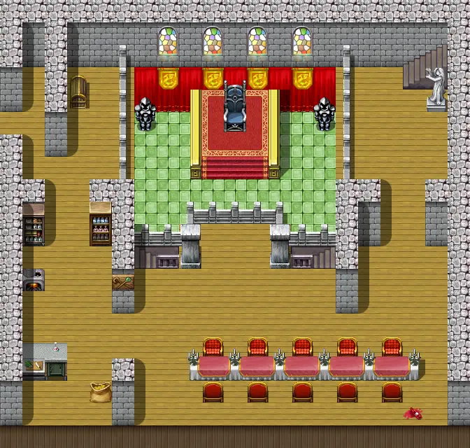
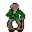

# Guynmart main 2

| | |
|---|---|
| **Map ID** | `guynmart_main_2` |
| **Region** | In Guynmart Castle (other) |
| **Type** | Indoors / underground |
| **Size** | 21×20 tiles |
| **Introduced** | [v0.7.2](../versions/0.7.2.md) |
| **NPCs** | 7 |
| **Enemy types** | 1 |
| **Quests** | 1 |
| **Containers** | 1 |

**Guynmart main 2** is an indoor map, in Guynmart Castle (other). It has 7 NPCs and 1 kind of enemy. Exits lead to Guynmart main 3, Guynmart, Guynmart main 1.

## Map

<label class="lg"><input type="checkbox" data-t="spawn" checked><b>Red</b>&nbsp;Monsters / NPCs</label><label class="lg"><input type="checkbox" data-t="mapchange" checked><b>Blue</b>&nbsp;Exit to another map</label><label class="lg"><input type="checkbox" data-t="container" checked><b>Yellow</b>&nbsp;Container (click to see contents)</label><label class="lg"><input type="checkbox" data-t="sign" checked><b>Purple</b>&nbsp;Sign</label><label class="lg"><input type="checkbox" data-t="rest" checked><b>Green</b>&nbsp;Resting place</label><label class="lg"><input type="checkbox" data-t="key" checked><b>Orange dashed</b>&nbsp;Blocked until a quest step / item</label><label class="lg"><input type="checkbox" data-t="script"><b>Grey dotted</b>&nbsp;Scripted event</label><label class="lg"><input type="checkbox" data-t="replace"><b>White dotted</b>&nbsp;Changes during a quest</label><label class="lg"><input type="checkbox" data-t="pin" checked><b>Numbers</b>&nbsp;Numbered key points (see the key below the map)</label>

<a class="pin pin-exit" href="#key-1" style="left:92.857%;top:12.500%" title="Exit (east): to [Guynmart main 3](guynmart_main_3.md)">1</a><a class="pin pin-exit" href="#key-2" style="left:2.381%;top:27.500%" title="Exit (west): to [Guynmart](guynmart.md)">2</a><a class="pin pin-exit" href="#key-3" style="left:30.952%;top:57.500%" title="Exit (stairs / passage): to [Guynmart main 1](guynmart_main_1.md)">3</a><a class="pin pin-exit" href="#key-3" style="left:69.048%;top:57.500%" title="Exit (stairs / passage): to [Guynmart main 1](guynmart_main_1.md)">3</a><a id="pin-npc-guynmart_drunkard5" class="pin pin-npc" href="#key-4" style="left:69.048%;top:82.500%" title="[Fjoerkard](../../monsters/guynmart_drunkard1.md#v-guynmart_drunkard5): NPC">4</a><a id="pin-npc-guynmart_drunkard1" class="pin pin-npc" href="#key-5" style="left:73.810%;top:77.500%" title="[Fjoerkard](../../monsters/guynmart_drunkard1.md): NPC">5</a><a id="pin-npc-guynmart_mguard" class="pin pin-npc" href="#key-6" style="left:7.143%;top:27.500%" title="[Guynmart guard](../../monsters/guynmart_gguard.md#v-guynmart_mguard): NPC">6</a><a id="pin-npc-guynmart_hannah2" class="pin pin-npc" href="#key-7" style="left:45.238%;top:32.500%" title="[Hannah](../../monsters/guynmart_hannah.md#v-guynmart_hannah2): 1 quest">7</a><a id="pin-npc-guynmart_cook" class="pin pin-npc" href="#key-8" style="left:11.905%;top:57.500%" title="[Hofala](../../monsters/guynmart_cook.md): shopkeeper, 1 quest">8</a><a id="pin-npc-guynmart_lovis2" class="pin pin-npc" href="#key-9" style="left:54.762%;top:32.500%" title="[Lovis](../../monsters/guynmart_lovis.md#v-guynmart_lovis2): 1 quest">9</a><a id="pin-npc-guynmart_steward2" class="pin pin-npc" href="#key-10" style="left:55.075%;top:28.750%" title="[Unkorh](../../monsters/guynmart_steward.md#v-guynmart_steward2): 1 quest">10</a><a class="pin pin-script" href="#key-11" style="left:85.714%;top:32.500%" title="Quest trigger: Scripted event: advances the quest: Roses to stage 60 (“I overheard Unkorh the steward talking to himself. He plans for Guynmart to die in the castle dungeon, and after ursuping the throne he would marry Lady Hannah.”)">11</a><a class="pin pin-container" href="#key-12" style="left:7.143%;top:87.500%" title="Container 1: Green apple, Red apple, Strawberry, Eggs">12</a><a class="pin pin-script" href="#key-13" style="left:64.286%;top:82.500%" title="Quest trigger: Scripted event: advances the quest: hidden story flag “guynmart_nondisplay” to stage 5 (“5=Seated next to Fjoerkard”)">13</a><a class="pin pin-script" href="#key-13" style="left:73.810%;top:82.500%" title="Quest trigger: Scripted event: advances the quest: hidden story flag “guynmart_nondisplay” to stage 5 (“5=Seated next to Fjoerkard”)">13</a><a class="pin pin-script" href="#key-13" style="left:83.333%;top:82.500%" title="Quest trigger: Scripted event: advances the quest: hidden story flag “guynmart_nondisplay” to stage 5 (“5=Seated next to Fjoerkard”)">13</a><a class="pin pin-key" href="#key-14" style="left:14.286%;top:52.500%" title="Blocked passage: Unlocked during the quest: hidden story flag “guynmart_quest_cook_lunch” (stage 1: “1=got”)">14</a>

??? abstract "Key to the numbers on the map"

    | # | What | Details |
    |---|---|---|
    | 1 | Exit (east) | to [Guynmart main 3](guynmart_main_3.md) |
    | 2 | Exit (west) | to [Guynmart](guynmart.md) |
    | 3 | Exit (stairs / passage) | to [Guynmart main 1](guynmart_main_1.md) |
    | 4 | [Fjoerkard](../monsters/guynmart_drunkard1.md#v-guynmart_drunkard5) | NPC |
    | 5 | [Fjoerkard](../monsters/guynmart_drunkard1.md) | NPC |
    | 6 | [Guynmart guard](../monsters/guynmart_gguard.md#v-guynmart_mguard) | NPC |
    | 7 | [Hannah](../monsters/guynmart_hannah.md#v-guynmart_hannah2) | 1 quest |
    | 8 | [Hofala](../monsters/guynmart_cook.md) | shopkeeper, 1 quest |
    | 9 | [Lovis](../monsters/guynmart_lovis.md#v-guynmart_lovis2) | 1 quest |
    | 10 | [Unkorh](../monsters/guynmart_steward.md#v-guynmart_steward2) | 1 quest |
    | 11 | Quest trigger | Scripted event: advances the quest: Roses to stage 60 (“I overheard Unkorh the steward talking to himself. He plans for Guynmart to die in the castle dungeon, and after ursuping the throne he would marry Lady Hannah.”) |
    | 12 | Container 1 | Green apple, Red apple, Strawberry, Eggs |
    | 13 | Quest trigger | Scripted event: advances the quest: hidden story flag “guynmart_nondisplay” to stage 5 (“5=Seated next to Fjoerkard”) |
    | 14 | Blocked passage | Unlocked during the quest: hidden story flag “guynmart_quest_cook_lunch” (stage 1: “1=got”) |

Verified against v0.8.18 map data.

## Connections

| Direction | Leads to | Region there | Map # |
|---|---|---|---|
| East | [Guynmart main 3](guynmart_main_3.md) | Guynmart Castle | 1 |
| West | [Guynmart](guynmart.md) | Guynmart Castle | 2 |
| Stairs / passage | [Guynmart main 1](guynmart_main_1.md) | Guynmart Castle | 3 |

## NPCs

- [Fjoerkard](../monsters/guynmart_drunkard1.md#v-guynmart_drunkard5) (#4)
- [Fjoerkard](../monsters/guynmart_drunkard1.md) (#5)
- [Guynmart guard](../monsters/guynmart_gguard.md#v-guynmart_mguard) (#6)
- [Hannah](../monsters/guynmart_hannah.md#v-guynmart_hannah2) — quests: [Roses](../quests/guynmart.md) (#7)
- [Hofala](../monsters/guynmart_cook.md) — shopkeeper — quests: [Roses](../quests/guynmart.md) (#8)
- [Lovis](../monsters/guynmart_lovis.md#v-guynmart_lovis2) — quests: [Roses](../quests/guynmart.md) (#9)
- [Unkorh](../monsters/guynmart_steward.md#v-guynmart_steward2) — quests: [Roses](../quests/guynmart.md) (#10)

## Enemies

| Enemy | HP | Damage | Up to | Notes |
|---|---|---|---|---|
| [Guynmart guard](../monsters/guynmart_gguard.md#v-guynmart_wguard9a) | 120 | 5–20 | 1 | appears later, during a quest |

<small>“Up to” is the most that can be alive at once from the spawn areas on this map.</small>

## Items & containers

**Shops:** [Hofala](../monsters/guynmart_cook.md)

<b>Container 1</b><ul><li><a href="../../items/apple_green/">Green apple</a> <small>100%</small></li><li><a href="../../items/apple_red/">Red apple</a> <small>33%</small></li><li><a href="../../items/strawberry/">Strawberry</a> <small>33% · ×2 to 5</small></li><li><a href="../../items/eggs/">Eggs</a> <small>20% · ×1 to 2</small></li></ul>

## Quests

- [Roses](../quests/guynmart.md): [Hannah](../monsters/guynmart_hannah.md#v-guynmart_hannah2) is involved; [Hofala](../monsters/guynmart_cook.md) is involved; [Lovis](../monsters/guynmart_lovis.md#v-guynmart_lovis2) is involved; [Unkorh](../monsters/guynmart_steward.md#v-guynmart_steward2) is involved; something on this map advances it; stepping on a trigger here sets stage 60
- [guynmart nondisplay (hidden flag)](../quests/guynmart_nondisplay.md): [Fjoerkard](../monsters/guynmart_drunkard1.md) is involved; [Hannah](../monsters/guynmart_hannah.md#v-guynmart_hannah2) is involved; [Lovis](../monsters/guynmart_lovis.md#v-guynmart_lovis2) is involved; something on this map advances it; stepping on a trigger here sets stage 5
- [guynmart_quest_cook_bread (hidden flag)](../quests/guynmart_quest_cook_bread.md): [Hofala](../monsters/guynmart_cook.md) is involved
- [guynmart_quest_cook_lunch (hidden flag)](../quests/guynmart_quest_cook_lunch.md): [Hofala](../monsters/guynmart_cook.md) is involved; blocked passage opens at stage 1

## Points of interest

- **Quest trigger** (#11): Scripted event: advances the quest: Roses to stage 60 (“I overheard Unkorh the steward talking to himself. He plans for Guynmart to die in the castle dungeon, and after ursuping the throne he would marry Lady Hannah.”)
- **Quest trigger** (#13): Scripted event: advances the quest: hidden story flag “guynmart_nondisplay” to stage 5 (“5=Seated next to Fjoerkard”)
- **Blocked passage** (#14): Unlocked during the quest: hidden story flag “guynmart_quest_cook_lunch” (stage 1: “1=got”)

## Version history

| Version | Change |
|---|---|
| [v0.7.2](../versions/0.7.2.md) | Added |
| [v0.7.13](../versions/0.7.13.md) | Map layout or objects changed |
| [v0.8.6](../versions/0.8.6.md) | Map layout or objects changed |

Verified against v0.8.18 and every earlier release back to v0.7.0 (game data compared release by release).

## Community notes

<small>Written by players, not generated from game data. **Observations**: what players notice in-game · **Lore**: the in-world story · **Trivia**: real-world facts, references, development history · **Theory / speculation**: unconfirmed ideas; may just be unfinished content</small>

### Observations

*No notes yet. Contributions are welcome: [add a note](https://github.com/asdfghjkl628/Andor-s-Trail-Wikiiii/new/main/notes/maps?filename=guynmart_main_2.md&value=%23%23%20Observations%0A%0A%3C%21--%20what%20players%20notice%20in-game%20--%3E%0A%0A%23%23%20Lore%0A%0A%3C%21--%20the%20in-world%20story%20--%3E%0A%0A%23%23%20Trivia%0A%0A%3C%21--%20real-world%20facts%2C%20references%2C%20development%20history%20--%3E%0A%0A%23%23%20Theory%20/%20speculation%0A%0A%3C%21--%20unconfirmed%20ideas%3B%20may%20just%20be%20unfinished%20content%20--%3E%0A).*

### Lore

*No notes yet. Contributions are welcome: [add a note](https://github.com/asdfghjkl628/Andor-s-Trail-Wikiiii/new/main/notes/maps?filename=guynmart_main_2.md&value=%23%23%20Observations%0A%0A%3C%21--%20what%20players%20notice%20in-game%20--%3E%0A%0A%23%23%20Lore%0A%0A%3C%21--%20the%20in-world%20story%20--%3E%0A%0A%23%23%20Trivia%0A%0A%3C%21--%20real-world%20facts%2C%20references%2C%20development%20history%20--%3E%0A%0A%23%23%20Theory%20/%20speculation%0A%0A%3C%21--%20unconfirmed%20ideas%3B%20may%20just%20be%20unfinished%20content%20--%3E%0A).*

### Trivia

*No notes yet. Contributions are welcome: [add a note](https://github.com/asdfghjkl628/Andor-s-Trail-Wikiiii/new/main/notes/maps?filename=guynmart_main_2.md&value=%23%23%20Observations%0A%0A%3C%21--%20what%20players%20notice%20in-game%20--%3E%0A%0A%23%23%20Lore%0A%0A%3C%21--%20the%20in-world%20story%20--%3E%0A%0A%23%23%20Trivia%0A%0A%3C%21--%20real-world%20facts%2C%20references%2C%20development%20history%20--%3E%0A%0A%23%23%20Theory%20/%20speculation%0A%0A%3C%21--%20unconfirmed%20ideas%3B%20may%20just%20be%20unfinished%20content%20--%3E%0A).*

### Theory / speculation

*No notes yet. Contributions are welcome: [add a note](https://github.com/asdfghjkl628/Andor-s-Trail-Wikiiii/new/main/notes/maps?filename=guynmart_main_2.md&value=%23%23%20Observations%0A%0A%3C%21--%20what%20players%20notice%20in-game%20--%3E%0A%0A%23%23%20Lore%0A%0A%3C%21--%20the%20in-world%20story%20--%3E%0A%0A%23%23%20Trivia%0A%0A%3C%21--%20real-world%20facts%2C%20references%2C%20development%20history%20--%3E%0A%0A%23%23%20Theory%20/%20speculation%0A%0A%3C%21--%20unconfirmed%20ideas%3B%20may%20just%20be%20unfinished%20content%20--%3E%0A).*

??? info "Technical information"

    | | |
    |---|---|
    | Map ID | `guynmart_main_2` |
    | File | `res/xml/guynmart_main_2.tmx` |
    | Size | 21×20 tiles (672×640 px) |
    | outdoors property | – |
    | Layers drawn | base, ground, objects, above |
    | Tilesets | map_bed_1, map_border_1, map_bridge_1, map_bridge_2, map_broken_1, map_cavewall_1, map_cavewall_2, map_cavewall_3, map_cavewall_4, map_chair_table_1, map_chair_table_2, map_crate_1, map_cupboard_1, map_curtain_1, map_entrance_1, map_entrance_2, map_fence_1, map_fence_2, map_fence_3, map_fence_4, map_ground_1, map_ground_2, map_ground_3, map_ground_4, map_ground_5, map_ground_6, map_ground_7, map_ground_8, map_guynmart, map_house_1, map_house_2, map_indoor_1, map_indoor_2, map_kitchen_1, map_outdoor_1, map_pillar_1, map_pillar_2, map_plant_1, map_plant_2, map_rock_1, map_rock_2, map_roof_1, map_roof_2, map_roof_3, map_shop_1, map_sign_ladder_1, map_table_1, map_trail_1, map_transition_1, map_transition_2, map_transition_3, map_transition_4, map_tree_1, map_tree_2, map_wall_1, map_wall_2, map_wall_3, map_wall_4, map_window_1, map_window_2 |
    | Map objects | spawn: 8, script: 6, mapchange: 4, container: 1, key: 1 |
    | World map position | – |

<small>Data from v0.8.18</small>
