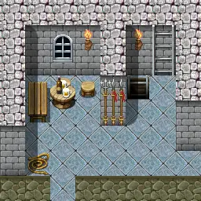

# Guynmart tower 2

| | |
|---|---|
| **Map ID** | `guynmart_tower_2` |
| **Region** | In Guynmart Castle (other) |
| **Type** | Indoors / underground |
| **Size** | 8×8 tiles |
| **Introduced** | [v0.7.2](../versions/0.7.2.md) |
| **NPCs** | 2 |
| **Quests** | 1 |

**Guynmart tower 2** is an indoor map, in Guynmart Castle (other). It has 2 NPCs, and no enemies. Exits lead to Guynmart tower 3, Guynmart, Guynmart tower 1.

## Map

<label class="lg"><input type="checkbox" data-t="spawn" checked><b>Red</b>&nbsp;Monsters / NPCs</label><label class="lg"><input type="checkbox" data-t="mapchange" checked><b>Blue</b>&nbsp;Exit to another map</label><label class="lg"><input type="checkbox" data-t="container" checked><b>Yellow</b>&nbsp;Container (click to see contents)</label><label class="lg"><input type="checkbox" data-t="sign" checked><b>Purple</b>&nbsp;Sign</label><label class="lg"><input type="checkbox" data-t="rest" checked><b>Green</b>&nbsp;Resting place</label><label class="lg"><input type="checkbox" data-t="key" checked><b>Orange dashed</b>&nbsp;Blocked until a quest step / item</label><label class="lg"><input type="checkbox" data-t="script"><b>Grey dotted</b>&nbsp;Scripted event</label><label class="lg"><input type="checkbox" data-t="replace"><b>White dotted</b>&nbsp;Changes during a quest</label><label class="lg"><input type="checkbox" data-t="pin" checked><b>Numbers</b>&nbsp;Numbered key points (see the key below the map)</label>

<a class="pin pin-exit" href="#key-1" style="left:81.250%;top:18.750%" title="Exit (northeast): to [Guynmart tower 3](../guynmart_tower_3.md)">1</a><a class="pin pin-exit" href="#key-2" style="left:93.750%;top:81.250%" title="Exit (southeast): to [Guynmart](../guynmart.md)">2</a><a class="pin pin-exit" href="#key-3" style="left:31.250%;top:93.750%" title="Exit (south): to [Guynmart](../guynmart.md)">3</a><a class="pin pin-exit" href="#key-4" style="left:68.750%;top:43.750%" title="Exit (stairs / passage): to [Guynmart tower 1](../guynmart_tower_1.md)">4</a><a class="pin pin-npc" href="#key-5" style="left:31.250%;top:68.750%" title="[Guynmart guard](../../monsters/guynmart_wguard.md): NPC">5</a><a class="pin pin-npc" href="#key-6" style="left:56.250%;top:68.750%" title="[Rob](../../monsters/guynmart_rob4.md): NPC">6</a><a class="pin pin-key" href="#key-7" style="left:69.573%;top:34.376%" title="Blocked passage: Unlocked during the quest: Roses (stage 110: “I met Rob in a room above the watch chamber. Rob promised to distract the guards so that I could pass by.”)">7</a><a class="pin pin-key" href="#key-8" style="left:32.073%;top:84.376%" title="Blocked passage: Unlocked during the quest: Roses (stage 163: “The guards let me through to the wall.”)">8</a>

??? abstract "Key to the numbers on the map"

    | # | What | Details |
    |---|---|---|
    | 1 | Exit (northeast) | to [Guynmart tower 3](../guynmart_tower_3.md) |
    | 2 | Exit (southeast) | to [Guynmart](../guynmart.md) |
    | 3 | Exit (south) | to [Guynmart](../guynmart.md) |
    | 4 | Exit (stairs / passage) | to [Guynmart tower 1](../guynmart_tower_1.md) |
    | 5 | [Guynmart guard](../monsters/guynmart_wguard.md) | NPC |
    | 6 | [Rob](../monsters/guynmart_rob4.md) | NPC |
    | 7 | Blocked passage | Unlocked during the quest: Roses (stage 110: “I met Rob in a room above the watch chamber. Rob promised to distract the guards so that I could pass by.”) |
    | 8 | Blocked passage | Unlocked during the quest: Roses (stage 163: “The guards let me through to the wall.”) |

Verified against v0.8.18 map data.

## Connections

| Direction | Leads to | Region there | Map # |
|---|---|---|---|
| Northeast | [Guynmart tower 3](guynmart_tower_3.md) | Guynmart Castle | 1 |
| Southeast | [Guynmart](guynmart.md) | Guynmart Castle | 2 |
| South | [Guynmart](guynmart.md) | Guynmart Castle | 3 |
| Stairs / passage | [Guynmart tower 1](guynmart_tower_1.md) | Guynmart Castle | 4 |

## NPCs

- [Guynmart guard](../monsters/guynmart_wguard.md) (#5)
- [Rob](../monsters/guynmart_rob4.md) (#6)

## Quests

- [Roses](../quests/guynmart.md): blocked passage opens at stage 110; blocked passage opens at stage 163; something on this map advances it

## Points of interest

- **Blocked passage** (#7): Unlocked during the quest: Roses (stage 110: “I met Rob in a room above the watch chamber. Rob promised to distract the guards so that I could pass by.”)
- **Blocked passage** (#8): Unlocked during the quest: Roses (stage 163: “The guards let me through to the wall.”)

## Version history

| Version | Change |
|---|---|
| [v0.7.2](../versions/0.7.2.md) | Added |

Verified against v0.8.18 and every earlier release back to v0.7.0 (game data compared release by release).

## Community notes

<small>Written by players, not generated from game data. **Observations**: what players notice in-game · **Lore**: the in-world story · **Trivia**: real-world facts, references, development history · **Theory / speculation**: unconfirmed ideas; may just be unfinished content</small>

### Observations

*Nothing here yet. Know something? [Add it](https://github.com/asdfghjkl628/Andor-s-Trail-Wikiiii/new/main/notes/maps?filename=guynmart_tower_2.md&value=%23%23%20Observations%0A%0A%3C%21--%20what%20players%20notice%20in-game%20--%3E%0A%0A%23%23%20Lore%0A%0A%3C%21--%20the%20in-world%20story%20--%3E%0A%0A%23%23%20Trivia%0A%0A%3C%21--%20real-world%20facts%2C%20references%2C%20development%20history%20--%3E%0A%0A%23%23%20Theory%20/%20speculation%0A%0A%3C%21--%20unconfirmed%20ideas%3B%20may%20just%20be%20unfinished%20content%20--%3E%0A).*

### Lore

*Nothing here yet. Know something? [Add it](https://github.com/asdfghjkl628/Andor-s-Trail-Wikiiii/new/main/notes/maps?filename=guynmart_tower_2.md&value=%23%23%20Observations%0A%0A%3C%21--%20what%20players%20notice%20in-game%20--%3E%0A%0A%23%23%20Lore%0A%0A%3C%21--%20the%20in-world%20story%20--%3E%0A%0A%23%23%20Trivia%0A%0A%3C%21--%20real-world%20facts%2C%20references%2C%20development%20history%20--%3E%0A%0A%23%23%20Theory%20/%20speculation%0A%0A%3C%21--%20unconfirmed%20ideas%3B%20may%20just%20be%20unfinished%20content%20--%3E%0A).*

### Trivia

*Nothing here yet. Know something? [Add it](https://github.com/asdfghjkl628/Andor-s-Trail-Wikiiii/new/main/notes/maps?filename=guynmart_tower_2.md&value=%23%23%20Observations%0A%0A%3C%21--%20what%20players%20notice%20in-game%20--%3E%0A%0A%23%23%20Lore%0A%0A%3C%21--%20the%20in-world%20story%20--%3E%0A%0A%23%23%20Trivia%0A%0A%3C%21--%20real-world%20facts%2C%20references%2C%20development%20history%20--%3E%0A%0A%23%23%20Theory%20/%20speculation%0A%0A%3C%21--%20unconfirmed%20ideas%3B%20may%20just%20be%20unfinished%20content%20--%3E%0A).*

### Theory / speculation

*Nothing here yet. Know something? [Add it](https://github.com/asdfghjkl628/Andor-s-Trail-Wikiiii/new/main/notes/maps?filename=guynmart_tower_2.md&value=%23%23%20Observations%0A%0A%3C%21--%20what%20players%20notice%20in-game%20--%3E%0A%0A%23%23%20Lore%0A%0A%3C%21--%20the%20in-world%20story%20--%3E%0A%0A%23%23%20Trivia%0A%0A%3C%21--%20real-world%20facts%2C%20references%2C%20development%20history%20--%3E%0A%0A%23%23%20Theory%20/%20speculation%0A%0A%3C%21--%20unconfirmed%20ideas%3B%20may%20just%20be%20unfinished%20content%20--%3E%0A).*

??? info "Technical information"

    | | |
    |---|---|
    | Map ID | `guynmart_tower_2` |
    | File | `res/xml/guynmart_tower_2.tmx` |
    | Size | 8×8 tiles (256×256 px) |
    | outdoors property | – |
    | Layers drawn | ground, objects, above |
    | Tilesets | map_bed_1, map_border_1, map_bridge_1, map_bridge_2, map_broken_1, map_cavewall_1, map_cavewall_2, map_cavewall_3, map_cavewall_4, map_chair_table_1, map_chair_table_2, map_crate_1, map_cupboard_1, map_curtain_1, map_entrance_1, map_entrance_2, map_fence_1, map_fence_2, map_fence_3, map_fence_4, map_ground_1, map_ground_2, map_ground_3, map_ground_4, map_ground_5, map_ground_6, map_ground_7, map_ground_8, map_guynmart, map_house_1, map_house_2, map_indoor_1, map_indoor_2, map_kitchen_1, map_outdoor_1, map_pillar_1, map_pillar_2, map_plant_1, map_plant_2, map_rock_1, map_rock_2, map_roof_1, map_roof_2, map_roof_3, map_shop_1, map_sign_ladder_1, map_table_1, map_trail_1, map_transition_1, map_transition_2, map_transition_3, map_transition_4, map_tree_1, map_tree_2, map_wall_1, map_wall_2, map_wall_3, map_wall_4, map_window_1, map_window_2 |
    | Map objects | mapchange: 4, spawn: 2, key: 2 |
    | World map position | – |

<small>Data from v0.8.18</small>
