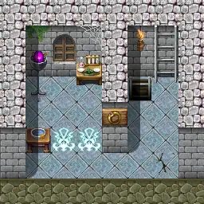

# Guynmart tower 4

| | |
|---|---|
| **Map ID** | `guynmart_tower_4` |
| **Region** | In Guynmart Castle (other) |
| **Type** | Indoors / underground |
| **Size** | 8×8 tiles |
| **Introduced** | [v0.7.2](../versions/0.7.2.md) |
| **NPCs** | 1 |
| **Quests** | 0 |
| **Containers** | 1 |

**Guynmart tower 4** is an indoor map, in Guynmart Castle (other). It has 1 NPC, and no enemies. Exits lead to Guynmart, Guynmart tower 3.

## Map

<label class="lg"><input type="checkbox" data-t="spawn" checked><b>Red</b>&nbsp;Monsters / NPCs</label><label class="lg"><input type="checkbox" data-t="mapchange" checked><b>Blue</b>&nbsp;Exit to another map</label><label class="lg"><input type="checkbox" data-t="container" checked><b>Yellow</b>&nbsp;Container (click to see contents)</label><label class="lg"><input type="checkbox" data-t="sign" checked><b>Purple</b>&nbsp;Sign</label><label class="lg"><input type="checkbox" data-t="rest" checked><b>Green</b>&nbsp;Resting place</label><label class="lg"><input type="checkbox" data-t="key" checked><b>Orange dashed</b>&nbsp;Blocked until a quest step / item</label><label class="lg"><input type="checkbox" data-t="script"><b>Grey dotted</b>&nbsp;Scripted event</label><label class="lg"><input type="checkbox" data-t="replace"><b>White dotted</b>&nbsp;Changes during a quest</label><label class="lg"><input type="checkbox" data-t="pin" checked><b>Numbers</b>&nbsp;Numbered key points (see the key below the map)</label>

<a class="pin pin-exit" href="#key-1" style="left:81.250%;top:18.750%" title="Exit (northeast): to [Guynmart](guynmart.md)">1</a><a class="pin pin-exit" href="#key-2" style="left:68.750%;top:43.750%" title="Exit (stairs / passage): to [Guynmart tower 3](guynmart_tower_3.md)">2</a><a id="pin-npc-guynmart_wizard" class="pin pin-npc" href="#key-3" style="left:43.750%;top:56.250%" title="[Rorthron](../../monsters/guynmart_wizard.md): shopkeeper">3</a><a class="pin pin-script" href="#key-4" style="left:31.250%;top:68.750%" title="Quest trigger: Scripted event: advances the quest: hidden story flag “guynmart_quest_wizard” to stage 11 (“11=inside”)">4</a><a class="pin pin-script" href="#key-5" style="left:37.500%;top:81.250%" title="Quest trigger: Scripted event: advances the quest: hidden story flag “guynmart_quest_wizard” to stage 12 (“12=outside”)">5</a><a class="pin pin-container" href="#key-6" style="left:43.750%;top:43.750%" title="Container 1: Mundane ring, Jinxed ring of damage resistance, Gold coins">6</a><a class="pin pin-script" href="#key-7" style="left:62.500%;top:81.250%" title="Quest trigger: Scripted event: advances the quest: hidden story flag “guynmart_quest_wizard” to stage 2 (“2=Shutter down”)">7</a>

??? abstract "Key to the numbers on the map"

    | # | What | Details |
    |---|---|---|
    | 1 | Exit (northeast) | to [Guynmart](guynmart.md) |
    | 2 | Exit (stairs / passage) | to [Guynmart tower 3](guynmart_tower_3.md) |
    | 3 | [Rorthron](../monsters/guynmart_wizard.md) | shopkeeper |
    | 4 | Quest trigger | Scripted event: advances the quest: hidden story flag “guynmart_quest_wizard” to stage 11 (“11=inside”) |
    | 5 | Quest trigger | Scripted event: advances the quest: hidden story flag “guynmart_quest_wizard” to stage 12 (“12=outside”) |
    | 6 | Container 1 | Mundane ring, Jinxed ring of damage resistance, Gold coins |
    | 7 | Quest trigger | Scripted event: advances the quest: hidden story flag “guynmart_quest_wizard” to stage 2 (“2=Shutter down”) |

Verified against v0.8.18 map data.

## Connections

| Direction | Leads to | Region there | Map # |
|---|---|---|---|
| Northeast | [Guynmart](guynmart.md) | Guynmart Castle | 1 |
| Stairs / passage | [Guynmart tower 3](guynmart_tower_3.md) | Guynmart Castle | 2 |

## NPCs

- [Rorthron](../monsters/guynmart_wizard.md) — shopkeeper (#3)

## Items & containers

**Shops:** [Rorthron](../monsters/guynmart_wizard.md)

<b>Container 1</b><ul><li><a href="../../items/ring1/">Mundane ring</a> <small>33%</small></li><li><a href="../../items/ring_jinxed1/">Jinxed ring of damage resistance</a> <small>100%</small></li><li><a href="../../items/gold/">Gold coins</a> <small>50% · ×5 to 15</small></li></ul>

## Quests

- [Ringmaker (hidden flag)](../quests/guynmart_quest_wizard.md): [Rorthron](../monsters/guynmart_wizard.md) is involved; something on this map advances it; stepping on a trigger here sets stage 11; stepping on a trigger here sets stage 12; stepping on a trigger here sets stage 2

## Points of interest

- **Quest trigger** (#4): Scripted event: advances the quest: hidden story flag “guynmart_quest_wizard” to stage 11 (“11=inside”)
- **Quest trigger** (#5): Scripted event: advances the quest: hidden story flag “guynmart_quest_wizard” to stage 12 (“12=outside”)
- **Quest trigger** (#7): Scripted event: advances the quest: hidden story flag “guynmart_quest_wizard” to stage 2 (“2=Shutter down”)

## Version history

| Version | Change |
|---|---|
| [v0.7.2](../versions/0.7.2.md) | Added |

Verified against v0.8.18 and every earlier release back to v0.7.0 (game data compared release by release).

## Community notes

<small>Written by players, not generated from game data. **Observations**: what players notice in-game · **Lore**: the in-world story · **Trivia**: real-world facts, references, development history · **Theory / speculation**: unconfirmed ideas; may just be unfinished content</small>

### Observations

*No notes yet. Contributions are welcome: [add a note](https://github.com/asdfghjkl628/Andor-s-Trail-Wikiiii/new/main/notes/maps?filename=guynmart_tower_4.md&value=%23%23%20Observations%0A%0A%3C%21--%20what%20players%20notice%20in-game%20--%3E%0A%0A%23%23%20Lore%0A%0A%3C%21--%20the%20in-world%20story%20--%3E%0A%0A%23%23%20Trivia%0A%0A%3C%21--%20real-world%20facts%2C%20references%2C%20development%20history%20--%3E%0A%0A%23%23%20Theory%20/%20speculation%0A%0A%3C%21--%20unconfirmed%20ideas%3B%20may%20just%20be%20unfinished%20content%20--%3E%0A).*

### Lore

*No notes yet. Contributions are welcome: [add a note](https://github.com/asdfghjkl628/Andor-s-Trail-Wikiiii/new/main/notes/maps?filename=guynmart_tower_4.md&value=%23%23%20Observations%0A%0A%3C%21--%20what%20players%20notice%20in-game%20--%3E%0A%0A%23%23%20Lore%0A%0A%3C%21--%20the%20in-world%20story%20--%3E%0A%0A%23%23%20Trivia%0A%0A%3C%21--%20real-world%20facts%2C%20references%2C%20development%20history%20--%3E%0A%0A%23%23%20Theory%20/%20speculation%0A%0A%3C%21--%20unconfirmed%20ideas%3B%20may%20just%20be%20unfinished%20content%20--%3E%0A).*

### Trivia

*No notes yet. Contributions are welcome: [add a note](https://github.com/asdfghjkl628/Andor-s-Trail-Wikiiii/new/main/notes/maps?filename=guynmart_tower_4.md&value=%23%23%20Observations%0A%0A%3C%21--%20what%20players%20notice%20in-game%20--%3E%0A%0A%23%23%20Lore%0A%0A%3C%21--%20the%20in-world%20story%20--%3E%0A%0A%23%23%20Trivia%0A%0A%3C%21--%20real-world%20facts%2C%20references%2C%20development%20history%20--%3E%0A%0A%23%23%20Theory%20/%20speculation%0A%0A%3C%21--%20unconfirmed%20ideas%3B%20may%20just%20be%20unfinished%20content%20--%3E%0A).*

### Theory / speculation

*No notes yet. Contributions are welcome: [add a note](https://github.com/asdfghjkl628/Andor-s-Trail-Wikiiii/new/main/notes/maps?filename=guynmart_tower_4.md&value=%23%23%20Observations%0A%0A%3C%21--%20what%20players%20notice%20in-game%20--%3E%0A%0A%23%23%20Lore%0A%0A%3C%21--%20the%20in-world%20story%20--%3E%0A%0A%23%23%20Trivia%0A%0A%3C%21--%20real-world%20facts%2C%20references%2C%20development%20history%20--%3E%0A%0A%23%23%20Theory%20/%20speculation%0A%0A%3C%21--%20unconfirmed%20ideas%3B%20may%20just%20be%20unfinished%20content%20--%3E%0A).*

??? info "Technical information"

    | | |
    |---|---|
    | Map ID | `guynmart_tower_4` |
    | File | `res/xml/guynmart_tower_4.tmx` |
    | Size | 8×8 tiles (256×256 px) |
    | outdoors property | – |
    | Layers drawn | ground, objects, above |
    | Tilesets | map_bed_1, map_border_1, map_bridge_1, map_bridge_2, map_broken_1, map_cavewall_1, map_cavewall_2, map_cavewall_3, map_cavewall_4, map_chair_table_1, map_chair_table_2, map_crate_1, map_cupboard_1, map_curtain_1, map_entrance_1, map_entrance_2, map_fence_1, map_fence_2, map_fence_3, map_fence_4, map_ground_1, map_ground_2, map_ground_3, map_ground_4, map_ground_5, map_ground_6, map_ground_7, map_ground_8, map_guynmart, map_house_1, map_house_2, map_indoor_1, map_indoor_2, map_kitchen_1, map_outdoor_1, map_pillar_1, map_pillar_2, map_plant_1, map_plant_2, map_rock_1, map_rock_2, map_roof_1, map_roof_2, map_roof_3, map_shop_1, map_sign_ladder_1, map_table_1, map_trail_1, map_transition_1, map_transition_2, map_transition_3, map_transition_4, map_tree_1, map_tree_2, map_wall_1, map_wall_2, map_wall_3, map_wall_4, map_window_1, map_window_2 |
    | Map objects | script: 3, mapchange: 2, replace: 2, container: 1, spawn: 1 |
    | World map position | – |

<small>Data from v0.8.18</small>
