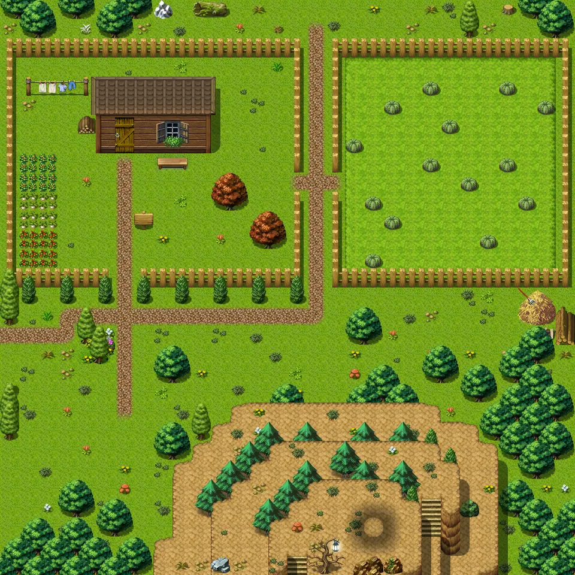
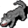
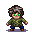

# Guynmart wood 10

30×30 tiles · outdoors · part of [World1](index.md)

<label class="lg"><input type="checkbox" data-t="spawn" checked><b>Red</b>&nbsp;Monsters / NPCs</label><label class="lg"><input type="checkbox" data-t="mapchange" checked><b>Blue</b>&nbsp;Exit to another map</label><label class="lg"><input type="checkbox" data-t="container" checked><b>Yellow</b>&nbsp;Container (click to see contents)</label><label class="lg"><input type="checkbox" data-t="sign" checked><b>Purple</b>&nbsp;Sign</label><label class="lg"><input type="checkbox" data-t="rest" checked><b>Green</b>&nbsp;Resting place</label><label class="lg"><input type="checkbox" data-t="key" checked><b>Orange dashed</b>&nbsp;Blocked until a quest step / item</label><label class="lg"><input type="checkbox" data-t="script"><b>Grey dotted</b>&nbsp;Scripted event</label><label class="lg"><input type="checkbox" data-t="replace"><b>White dotted</b>&nbsp;Changes during a quest</label>

## Exits

- [Guynmart wood 1](guynmart_wood_1.md)
- [Guynmart wood 11](guynmart_wood_11.md)
- [Guynmart wood 9](guynmart_wood_9.md)

## Monsters & NPCs here

| Name | HP |
|---|---|
| [Golden marble](../monsters/guynmart_marble4.md) | 0 |
| [Dog](../monsters/guynmart_dog10.md) | 0 |
| [Wild berries](../monsters/wild_berry.md) | 0 |
| [Red marble](../monsters/guynmart_marble2.md) | 0 |
| [Old man](../monsters/guynmart_wise.md) | 0 |
| [Pink marble](../monsters/guynmart_marble3.md) | 0 |
| [Pearl white marble](../monsters/guynmart_marble5.md) | 0 |
| [Stuephant](../monsters/guynmart_child.md) | 0 |
| [Green marble](../monsters/guynmart_marble1.md) | 0 |
| [Forest beetle](../monsters/forest_beetle.md) | 14 |
| [Vicious hound](../monsters/vicious_hound.md) | 31 |

<small>Map ID: `guynmart_wood_10` · Data from v0.8.18</small>
