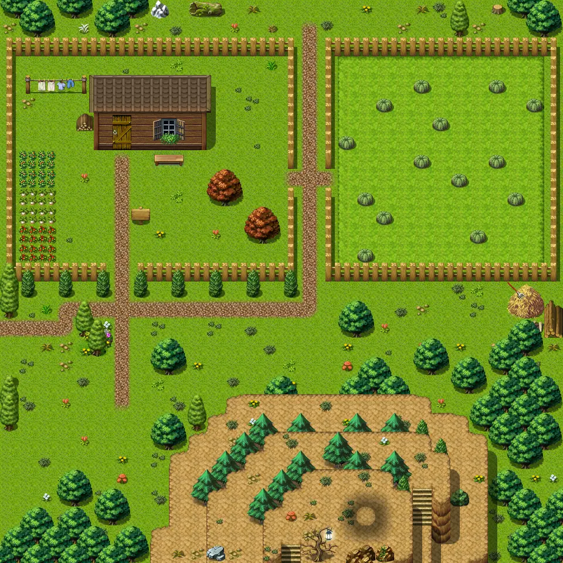

# Guynmart wood 10

| | |
|---|---|
| **Map ID** | `guynmart_wood_10` |
| **Region** | Near Guynmart Castle (other) |
| **Type** | Outdoors |
| **Size** | 30×30 tiles |
| **World map** | [World1](index.md) |
| **Introduced** | [v0.7.2](../versions/0.7.2.md) |
| **NPCs** | 9 |
| **Enemy types** | 2 |
| **Quests** | 3 |

**Guynmart wood 10** is an outdoor map, near Guynmart Castle (other). It has 9 NPCs and 2 kinds of enemy. Exits lead to Guynmart wood 9, Guynmart wood 11, Guynmart wood 1.

## Map

<label class="lg"><input type="checkbox" data-t="spawn" checked><b>Red</b>&nbsp;Monsters / NPCs</label><label class="lg"><input type="checkbox" data-t="mapchange" checked><b>Blue</b>&nbsp;Exit to another map</label><label class="lg"><input type="checkbox" data-t="container" checked><b>Yellow</b>&nbsp;Container (click to see contents)</label><label class="lg"><input type="checkbox" data-t="sign" checked><b>Purple</b>&nbsp;Sign</label><label class="lg"><input type="checkbox" data-t="rest" checked><b>Green</b>&nbsp;Resting place</label><label class="lg"><input type="checkbox" data-t="key" checked><b>Orange dashed</b>&nbsp;Blocked until a quest step / item</label><label class="lg"><input type="checkbox" data-t="script"><b>Grey dotted</b>&nbsp;Scripted event</label><label class="lg"><input type="checkbox" data-t="replace"><b>White dotted</b>&nbsp;Changes during a quest</label><label class="lg"><input type="checkbox" data-t="pin" checked><b>Numbers</b>&nbsp;Numbered key points (see the key below the map)</label>

<a class="pin pin-exit" href="#key-1" style="left:58.333%;top:1.667%" title="Exit (north): to [Guynmart wood 9](../guynmart_wood_9.md)">1</a><a class="pin pin-exit" href="#key-2" style="left:55.000%;top:98.333%" title="Exit (south): to [Guynmart wood 11](../guynmart_wood_11.md)">2</a><a class="pin pin-exit" href="#key-3" style="left:1.667%;top:75.000%" title="Exit (west): to [Guynmart wood 1](../guynmart_wood_1.md)">3</a><a class="pin pin-npc" href="#key-4" style="left:21.667%;top:31.667%" title="[Dog](../../monsters/guynmart_dog10.md): NPC">4</a><a class="pin pin-npc" href="#key-5" style="left:75.000%;top:41.667%" title="[Golden marble](../../monsters/guynmart_marble4.md): 1 quest">5</a><a class="pin pin-npc" href="#key-6" style="left:75.000%;top:11.667%" title="[Green marble](../../monsters/guynmart_marble1.md): 1 quest">6</a><a class="pin pin-npc" href="#key-7" style="left:65.000%;top:91.667%" title="[Old man](../../monsters/guynmart_wise.md): 1 quest">7</a><a class="pin pin-npc" href="#key-8" style="left:11.667%;top:35.000%" title="[Pearl white marble](../../monsters/guynmart_marble5.md): 1 quest">8</a><a class="pin pin-npc" href="#key-9" style="left:88.333%;top:11.667%" title="[Pink marble](../../monsters/guynmart_marble3.md): 1 quest">9</a><a class="pin pin-npc" href="#key-10" style="left:45.000%;top:28.333%" title="[Red marble](../../monsters/guynmart_marble2.md): 1 quest">10</a><a class="pin pin-npc" href="#key-11" style="left:5.000%;top:11.667%" title="[Stuephant](../../monsters/guynmart_child.md): 1 quest">11</a><a class="pin pin-npc" href="#key-12" style="left:88.333%;top:55.000%" title="[Wild berries](../../monsters/wild_berry.md): NPC">12</a><a class="pin pin-script" href="#key-13" style="left:25.000%;top:81.667%" title="Quest trigger: Scripted event: advances the quest: hidden story flag “guynmart_nondisplay” to stage 41 (“41=Hill1”)">13</a><a class="pin pin-script" href="#key-13" style="left:55.000%;top:65.000%" title="Quest trigger: Scripted event: advances the quest: hidden story flag “guynmart_nondisplay” to stage 41 (“41=Hill1”)">13</a><a class="pin pin-script" href="#key-14" style="left:81.667%;top:95.000%" title="Quest trigger: Scripted event: advances the quest: hidden story flag “guynmart_nondisplay” to stage 42 (“42=Hill1”)">14</a><a class="pin pin-script" href="#key-15" style="left:75.000%;top:91.667%" title="Quest trigger: Scripted event: advances the quest: hidden story flag “guynmart_nondisplay” to stage 44 (“44=Hill1”)">15</a><a class="pin pin-script" href="#key-16" style="left:60.000%;top:95.000%" title="Quest trigger: Scripted event: advances the quest: hidden story flag “guynmart_nondisplay” to stage 45 (“45=Hill1”)">16</a><a class="pin pin-key" href="#key-17" style="left:21.886%;top:27.500%" title="Blocked passage: Closed off once you reach this point in the quest: Search for Andor (stage 1: “My father Mikhail says that Andor has not been home since yesterday. I should go look for him in the village.”)">17</a><a class="pin pin-replace" href="#key-18" style="left:56.667%;top:83.333%" title="Changes during a quest: This area changes during the quest: hidden story flag “guynmart_nondisplay” (stage 41: “41=Hill1”)">18</a><a class="pin pin-replace" href="#key-19" style="left:56.886%;top:80.834%" title="Changes during a quest: This area changes during the quest: hidden story flag “guynmart_nondisplay” (stage 42: “42=Hill1”)">19</a><a class="pin pin-replace" href="#key-20" style="left:58.349%;top:85.527%" title="Changes during a quest: This area changes during the quest: hidden story flag “guynmart_nondisplay” (stage 43: “43=Hill1”)">20</a><a class="pin pin-replace" href="#key-21" style="left:53.733%;top:82.814%" title="Changes during a quest: This area changes during the quest: hidden story flag “guynmart_nondisplay” (stage 44: “44=Hill1”)">21</a><a class="pin pin-replace" href="#key-22" style="left:59.340%;top:81.633%" title="Changes during a quest: This area changes during the quest: hidden story flag “guynmart_nondisplay” (stage 45: “45=Hill1”)">22</a>

??? abstract "Key to the numbers on the map"

    | # | What | Details |
    |---|---|---|
    | 1 | Exit (north) | to [Guynmart wood 9](../guynmart_wood_9.md) |
    | 2 | Exit (south) | to [Guynmart wood 11](../guynmart_wood_11.md) |
    | 3 | Exit (west) | to [Guynmart wood 1](../guynmart_wood_1.md) |
    | 4 | [Dog](../monsters/guynmart_dog10.md) | NPC |
    | 5 | [Golden marble](../monsters/guynmart_marble4.md) | 1 quest |
    | 6 | [Green marble](../monsters/guynmart_marble1.md) | 1 quest |
    | 7 | [Old man](../monsters/guynmart_wise.md) | 1 quest |
    | 8 | [Pearl white marble](../monsters/guynmart_marble5.md) | 1 quest |
    | 9 | [Pink marble](../monsters/guynmart_marble3.md) | 1 quest |
    | 10 | [Red marble](../monsters/guynmart_marble2.md) | 1 quest |
    | 11 | [Stuephant](../monsters/guynmart_child.md) | 1 quest |
    | 12 | [Wild berries](../monsters/wild_berry.md) | NPC |
    | 13 | Quest trigger | Scripted event: advances the quest: hidden story flag “guynmart_nondisplay” to stage 41 (“41=Hill1”) |
    | 14 | Quest trigger | Scripted event: advances the quest: hidden story flag “guynmart_nondisplay” to stage 42 (“42=Hill1”) |
    | 15 | Quest trigger | Scripted event: advances the quest: hidden story flag “guynmart_nondisplay” to stage 44 (“44=Hill1”) |
    | 16 | Quest trigger | Scripted event: advances the quest: hidden story flag “guynmart_nondisplay” to stage 45 (“45=Hill1”) |
    | 17 | Blocked passage | Closed off once you reach this point in the quest: Search for Andor (stage 1: “My father Mikhail says that Andor has not been home since yesterday. I should go look for him in the village.”) |
    | 18 | Changes during a quest | This area changes during the quest: hidden story flag “guynmart_nondisplay” (stage 41: “41=Hill1”) |
    | 19 | Changes during a quest | This area changes during the quest: hidden story flag “guynmart_nondisplay” (stage 42: “42=Hill1”) |
    | 20 | Changes during a quest | This area changes during the quest: hidden story flag “guynmart_nondisplay” (stage 43: “43=Hill1”) |
    | 21 | Changes during a quest | This area changes during the quest: hidden story flag “guynmart_nondisplay” (stage 44: “44=Hill1”) |
    | 22 | Changes during a quest | This area changes during the quest: hidden story flag “guynmart_nondisplay” (stage 45: “45=Hill1”) |

Verified against v0.8.18 map data.

## Connections

| Direction | Leads to | Region there | Map # |
|---|---|---|---|
| North | [Guynmart wood 9](guynmart_wood_9.md) | Guynmart Castle | 1 |
| South | [Guynmart wood 11](guynmart_wood_11.md) | Guynmart Castle | 2 |
| West | [Guynmart wood 1](guynmart_wood_1.md) | Guynmart Castle | 3 |

## NPCs

- [Dog](../monsters/guynmart_dog10.md) (#4)
- [Golden marble](../monsters/guynmart_marble4.md) — quests: [Marble hunting](../quests/guynmart_marbles.md) (#5)
- [Green marble](../monsters/guynmart_marble1.md) — quests: [Marble hunting](../quests/guynmart_marbles.md) (#6)
- [Old man](../monsters/guynmart_wise.md) — quests: [Rare delicacies](../quests/guynmart_wise.md) (#7)
- [Pearl white marble](../monsters/guynmart_marble5.md) — quests: [Marble hunting](../quests/guynmart_marbles.md) (#8)
- [Pink marble](../monsters/guynmart_marble3.md) — quests: [Marble hunting](../quests/guynmart_marbles.md) (#9)
- [Red marble](../monsters/guynmart_marble2.md) — quests: [Marble hunting](../quests/guynmart_marbles.md) (#10)
- [Stuephant](../monsters/guynmart_child.md) — quests: [Marble hunting](../quests/guynmart_marbles.md) (#11)
- [Wild berries](../monsters/wild_berry.md) (#12)

## Enemies

| Enemy | HP | Damage | Up to | Notes |
|---|---|---|---|---|
| [Forest beetle](../monsters/forest_beetle.md) | 14 | 2–4 | 1 | – |
| [Vicious hound](../monsters/vicious_hound.md) | 31 | 3–9 | 1 | – |

<small>“Up to” is the most that can be alive at once from the spawn areas on this map.</small>

## Quests

- [Marble hunting](../quests/guynmart_marbles.md): [Golden marble](../monsters/guynmart_marble4.md) is involved; [Green marble](../monsters/guynmart_marble1.md) is involved; [Pearl white marble](../monsters/guynmart_marble5.md) is involved; [Pink marble](../monsters/guynmart_marble3.md) is involved; [Red marble](../monsters/guynmart_marble2.md) is involved; [Stuephant](../monsters/guynmart_child.md) is involved
- [Rare delicacies](../quests/guynmart_wise.md): [Old man](../monsters/guynmart_wise.md) is involved
- [Search for Andor](../quests/andor.md): blocked passage closes at stage 1
- [guynmart nondisplay (hidden flag)](../quests/guynmart_nondisplay.md): [Old man](../monsters/guynmart_wise.md) is involved; part of the map changes at stage 41; part of the map changes at stage 42; part of the map changes at stage 43; part of the map changes at stage 44; part of the map changes at stage 45; something on this map advances it; stepping on a trigger here sets stage 41; stepping on a trigger here sets stage 42; stepping on a trigger here sets stage 44; stepping on a trigger here sets stage 45

## Points of interest

- **Quest trigger** (#13): Scripted event: advances the quest: hidden story flag “guynmart_nondisplay” to stage 41 (“41=Hill1”)
- **Quest trigger** (#14): Scripted event: advances the quest: hidden story flag “guynmart_nondisplay” to stage 42 (“42=Hill1”)
- **Quest trigger** (#15): Scripted event: advances the quest: hidden story flag “guynmart_nondisplay” to stage 44 (“44=Hill1”)
- **Quest trigger** (#16): Scripted event: advances the quest: hidden story flag “guynmart_nondisplay” to stage 45 (“45=Hill1”)
- **Blocked passage** (#17): Closed off once you reach this point in the quest: Search for Andor (stage 1: “My father Mikhail says that Andor has not been home since yesterday. I should go look for him in the village.”)
- **Changes during a quest** (#18): This area changes during the quest: hidden story flag “guynmart_nondisplay” (stage 41: “41=Hill1”)
- **Changes during a quest** (#19): This area changes during the quest: hidden story flag “guynmart_nondisplay” (stage 42: “42=Hill1”)
- **Changes during a quest** (#20): This area changes during the quest: hidden story flag “guynmart_nondisplay” (stage 43: “43=Hill1”)
- **Changes during a quest** (#21): This area changes during the quest: hidden story flag “guynmart_nondisplay” (stage 44: “44=Hill1”)
- **Changes during a quest** (#22): This area changes during the quest: hidden story flag “guynmart_nondisplay” (stage 45: “45=Hill1”)

## Version history

| Version | Change |
|---|---|
| [v0.7.2](../versions/0.7.2.md) | Added |
| [v0.7.8](../versions/0.7.8.md) | map layout or objects changed |
| [v0.7.12](../versions/0.7.12.md) | map layout or objects changed |
| [v0.7.13](../versions/0.7.13.md) | map layout or objects changed |
| [v0.8.4](../versions/0.8.4.md) | map layout or objects changed |
| [v0.8.12.1](../versions/0.8.12.1.md) | map layout or objects changed |
| [v0.8.18](../versions/0.8.18.md) | map layout or objects changed |

Verified against v0.8.18 and every earlier release back to v0.7.0 (game data compared release by release).

## Community notes

<small>Written by players, not generated from game data. **Observations**: what players notice in-game · **Lore**: the in-world story · **Trivia**: real-world facts, references, development history · **Theory / speculation**: unconfirmed ideas; may just be unfinished content</small>

### Observations

*Nothing here yet. Know something? [Add it](https://github.com/asdfghjkl628/Andor-s-Trail-Wikiiii/new/main/notes/maps?filename=guynmart_wood_10.md&value=%23%23%20Observations%0A%0A%3C%21--%20what%20players%20notice%20in-game%20--%3E%0A%0A%23%23%20Lore%0A%0A%3C%21--%20the%20in-world%20story%20--%3E%0A%0A%23%23%20Trivia%0A%0A%3C%21--%20real-world%20facts%2C%20references%2C%20development%20history%20--%3E%0A%0A%23%23%20Theory%20/%20speculation%0A%0A%3C%21--%20unconfirmed%20ideas%3B%20may%20just%20be%20unfinished%20content%20--%3E%0A).*

### Lore

*Nothing here yet. Know something? [Add it](https://github.com/asdfghjkl628/Andor-s-Trail-Wikiiii/new/main/notes/maps?filename=guynmart_wood_10.md&value=%23%23%20Observations%0A%0A%3C%21--%20what%20players%20notice%20in-game%20--%3E%0A%0A%23%23%20Lore%0A%0A%3C%21--%20the%20in-world%20story%20--%3E%0A%0A%23%23%20Trivia%0A%0A%3C%21--%20real-world%20facts%2C%20references%2C%20development%20history%20--%3E%0A%0A%23%23%20Theory%20/%20speculation%0A%0A%3C%21--%20unconfirmed%20ideas%3B%20may%20just%20be%20unfinished%20content%20--%3E%0A).*

### Trivia

*Nothing here yet. Know something? [Add it](https://github.com/asdfghjkl628/Andor-s-Trail-Wikiiii/new/main/notes/maps?filename=guynmart_wood_10.md&value=%23%23%20Observations%0A%0A%3C%21--%20what%20players%20notice%20in-game%20--%3E%0A%0A%23%23%20Lore%0A%0A%3C%21--%20the%20in-world%20story%20--%3E%0A%0A%23%23%20Trivia%0A%0A%3C%21--%20real-world%20facts%2C%20references%2C%20development%20history%20--%3E%0A%0A%23%23%20Theory%20/%20speculation%0A%0A%3C%21--%20unconfirmed%20ideas%3B%20may%20just%20be%20unfinished%20content%20--%3E%0A).*

### Theory / speculation

*Nothing here yet. Know something? [Add it](https://github.com/asdfghjkl628/Andor-s-Trail-Wikiiii/new/main/notes/maps?filename=guynmart_wood_10.md&value=%23%23%20Observations%0A%0A%3C%21--%20what%20players%20notice%20in-game%20--%3E%0A%0A%23%23%20Lore%0A%0A%3C%21--%20the%20in-world%20story%20--%3E%0A%0A%23%23%20Trivia%0A%0A%3C%21--%20real-world%20facts%2C%20references%2C%20development%20history%20--%3E%0A%0A%23%23%20Theory%20/%20speculation%0A%0A%3C%21--%20unconfirmed%20ideas%3B%20may%20just%20be%20unfinished%20content%20--%3E%0A).*

??? info "Technical information"

    | | |
    |---|---|
    | Map ID | `guynmart_wood_10` |
    | File | `res/xml/guynmart_wood_10.tmx` |
    | Size | 30×30 tiles (960×960 px) |
    | outdoors property | 1 |
    | Layers drawn | base, ground, objects, above, top |
    | Tilesets | map_bed_1, map_border_1, map_bridge_1, map_bridge_2, map_broken_1, map_cavewall_1, map_cavewall_2, map_cavewall_3, map_cavewall_4, map_chair_table_1, map_chair_table_2, map_crate_1, map_cupboard_1, map_curtain_1, map_entrance_1, map_entrance_2, map_fence_1, map_fence_2, map_fence_3, map_fence_4, map_ground_1, map_ground_2, map_ground_3, map_ground_4, map_ground_5, map_ground_6, map_ground_7, map_ground_8, map_guynmart, map_house_1, map_house_2, map_indoor_1, map_indoor_2, map_kitchen_1, map_outdoor_1, map_pillar_1, map_pillar_2, map_plant_1, map_plant_2, map_rock_1, map_rock_2, map_roof_1, map_roof_2, map_roof_3, map_shop_1, map_sign_ladder_1, map_table_1, map_trail_1, map_transition_1, map_transition_2, map_transition_3, map_transition_4, map_transition_5, map_tree_1, map_tree_2, map_wall_1, map_wall_2, map_wall_3, map_wall_4, map_window_1, map_window_2 |
    | Map objects | spawn: 12, script: 6, replace: 5, mapchange: 3, key: 1 |
    | World map position | segment `world1`, x 117, y 191 |

<small>Data from v0.8.18</small>
