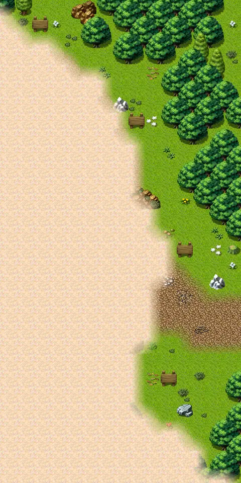

# Guynmart wood 13

| | |
|---|---|
| **Map ID** | `guynmart_wood_13` |
| **Region** | Near Guynmart Castle (other) |
| **Type** | Outdoors |
| **Size** | 15×30 tiles |
| **World map** | [World 1](index.md) |
| **Introduced** | [v0.7.2](../versions/0.7.2.md) |
| **NPCs** | 1 |
| **Enemy types** | 6 |
| **Quests** | 2 |

**Guynmart wood 13** is an outdoor map, near Guynmart Castle (other). It has 1 NPC and 6 kinds of enemy. Exits lead to Guynmart wood 8, Guynmart wood 12, Guynmart wood 13, Swamp 3 and 1 more.

## Map

<label class="lg"><input type="checkbox" data-t="spawn" checked><b>Red</b>&nbsp;Monsters / NPCs</label><label class="lg"><input type="checkbox" data-t="mapchange" checked><b>Blue</b>&nbsp;Exit to another map</label><label class="lg"><input type="checkbox" data-t="container" checked><b>Yellow</b>&nbsp;Container (click to see contents)</label><label class="lg"><input type="checkbox" data-t="sign" checked><b>Purple</b>&nbsp;Sign</label><label class="lg"><input type="checkbox" data-t="rest" checked><b>Green</b>&nbsp;Resting place</label><label class="lg"><input type="checkbox" data-t="key" checked><b>Orange dashed</b>&nbsp;Blocked until a quest step / item</label><label class="lg"><input type="checkbox" data-t="script"><b>Grey dotted</b>&nbsp;Scripted event</label><label class="lg"><input type="checkbox" data-t="replace"><b>White dotted</b>&nbsp;Changes during a quest</label><label class="lg"><input type="checkbox" data-t="pin" checked><b>Numbers</b>&nbsp;Numbered key points (see the key below the map)</label>

<a class="pin pin-exit" href="#key-1" style="left:20.000%;top:1.667%" title="Exit (north): to [Guynmart wood 8](guynmart_wood_8.md)">1</a><a class="pin pin-exit" href="#key-2" style="left:96.667%;top:65.000%" title="Exit (east): to [Guynmart wood 12](guynmart_wood_12.md)">2</a><a class="pin pin-exit" href="#key-3" style="left:70.000%;top:95.000%" title="Exit (south): to [Guynmart wood 13](guynmart_wood_13.md)">3</a><a class="pin pin-exit" href="#key-3" style="left:16.667%;top:95.000%" title="Exit (south): to [Guynmart wood 13](guynmart_wood_13.md)">3</a><a class="pin pin-exit" href="#key-4" style="left:30.000%;top:98.333%" title="Exit (south): to [Swamp 3](swamp3.md)">4</a><a class="pin pin-exit" href="#key-5" style="left:3.333%;top:93.333%" title="Exit (southwest): to [Guynmart wood 14](guynmart_wood_14.md)">5</a><a class="pin pin-exit" href="#key-6" style="left:3.333%;top:36.667%" title="Exit (west): to [Guynmart wood 14](guynmart_wood_14.md)">6</a><a id="pin-npc-guynmart_roadguard" class="pin pin-npc" href="#key-7" style="left:70.000%;top:61.667%" title="[Feygard road guard](../../monsters/guynmart_roadguard.md): NPC">7</a><a class="pin pin-script" href="#key-8" style="left:23.333%;top:30.000%" title="Quest trigger: Scripted event: advances the quest: Fog in the woods to stage 5 (“You had entered a very unnatural looking fog and decided to find the source of it. Maybe you could lift the fog?”)">8</a><a class="pin pin-script" href="#key-8" style="left:40.000%;top:53.333%" title="Quest trigger: Scripted event: advances the quest: Fog in the woods to stage 5 (“You had entered a very unnatural looking fog and decided to find the source of it. Maybe you could lift the fog?”)">8</a><a class="pin pin-script" href="#key-8" style="left:53.333%;top:95.000%" title="Quest trigger: Scripted event: advances the quest: Fog in the woods to stage 5 (“You had entered a very unnatural looking fog and decided to find the source of it. Maybe you could lift the fog?”)">8</a><a class="pin pin-script" href="#key-8" style="left:36.667%;top:78.333%" title="Quest trigger: Scripted event: advances the quest: Fog in the woods to stage 5 (“You had entered a very unnatural looking fog and decided to find the source of it. Maybe you could lift the fog?”)">8</a><a class="pin pin-key" href="#key-9" style="left:70.000%;top:78.333%" title="Blocked passage: Closed off once you reach this point in the quest: Search for Andor (stage 1: “My father Mikhail says that Andor has not been home since yesterday. I should go look for him in the village.”)">9</a><a class="pin pin-key" href="#key-9" style="left:76.667%;top:51.667%" title="Blocked passage: Closed off once you reach this point in the quest: Search for Andor (stage 1: “My father Mikhail says that Andor has not been home since yesterday. I should go look for him in the village.”)">9</a><a class="pin pin-key" href="#key-9" style="left:56.667%;top:25.000%" title="Blocked passage: Closed off once you reach this point in the quest: Search for Andor (stage 1: “My father Mikhail says that Andor has not been home since yesterday. I should go look for him in the village.”)">9</a><a class="pin pin-key" href="#key-9" style="left:16.667%;top:5.000%" title="Blocked passage: Closed off once you reach this point in the quest: Search for Andor (stage 1: “My father Mikhail says that Andor has not been home since yesterday. I should go look for him in the village.”)">9</a><a class="pin pin-key" href="#key-10" style="left:3.333%;top:20.000%" title="Blocked passage: Unlocked during the quest: hidden story flag “feygard_fog” (stage 1: “1=Fog 1 has lifted”)">10</a><a class="pin pin-replace" href="#key-11" style="left:50.000%;top:50.000%" title="Changes during a quest: This area changes during the quest: hidden story flag “feygard_fog” (stage 7: “7=Fog 1 short”)">11</a><a class="pin pin-replace" href="#key-12" style="left:50.439%;top:47.500%" title="Changes during a quest: This area changes during the quest: hidden story flag “feygard_fog” (stage 6: “6=Fog 1 normal”)">12</a><a class="pin pin-replace" href="#key-13" style="left:53.364%;top:52.194%" title="Changes during a quest: This area changes during the quest: hidden story flag “feygard_fog” (stage 1: “1=Fog 1 has lifted”)">13</a>

??? abstract "Key to the numbers on the map"

    | # | What | Details |
    |---|---|---|
    | 1 | Exit (north) | to [Guynmart wood 8](guynmart_wood_8.md) |
    | 2 | Exit (east) | to [Guynmart wood 12](guynmart_wood_12.md) |
    | 3 | Exit (south) | to [Guynmart wood 13](guynmart_wood_13.md) |
    | 4 | Exit (south) | to [Swamp 3](swamp3.md) |
    | 5 | Exit (southwest) | to [Guynmart wood 14](guynmart_wood_14.md) |
    | 6 | Exit (west) | to [Guynmart wood 14](guynmart_wood_14.md) |
    | 7 | [Feygard road guard](../monsters/guynmart_roadguard.md) | NPC |
    | 8 | Quest trigger | Scripted event: advances the quest: Fog in the woods to stage 5 (“You had entered a very unnatural looking fog and decided to find the source of it. Maybe you could lift the fog?”) |
    | 9 | Blocked passage | Closed off once you reach this point in the quest: Search for Andor (stage 1: “My father Mikhail says that Andor has not been home since yesterday. I should go look for him in the village.”) |
    | 10 | Blocked passage | Unlocked during the quest: hidden story flag “feygard_fog” (stage 1: “1=Fog 1 has lifted”) |
    | 11 | Changes during a quest | This area changes during the quest: hidden story flag “feygard_fog” (stage 7: “7=Fog 1 short”) |
    | 12 | Changes during a quest | This area changes during the quest: hidden story flag “feygard_fog” (stage 6: “6=Fog 1 normal”) |
    | 13 | Changes during a quest | This area changes during the quest: hidden story flag “feygard_fog” (stage 1: “1=Fog 1 has lifted”) |

Verified against v0.8.18 map data.

## Connections

| Direction | Leads to | Region there | Map # |
|---|---|---|---|
| North | [Guynmart wood 8](guynmart_wood_8.md) | Guynmart Castle | 1 |
| East | [Guynmart wood 12](guynmart_wood_12.md) | Guynmart Castle | 2 |
| South | [Guynmart wood 13](guynmart_wood_13.md) | Guynmart Castle | 3 |
| South | [Swamp 3](swamp3.md) | Guynmart Castle | 4 |
| Southwest | [Guynmart wood 14](guynmart_wood_14.md) | Guynmart Castle | 5 |
| West | [Guynmart wood 14](guynmart_wood_14.md) | Guynmart Castle | 6 |

## NPCs

- [Feygard road guard](../monsters/guynmart_roadguard.md) (#7)

## Enemies

| Enemy | HP | Damage | Up to | Notes |
|---|---|---|---|---|
| [Forest beetle](../monsters/forest_beetle.md) | 14 | 2–4 | 3 | – |
| [Vicious forest serpent](../monsters/vicious_forest_serpent.md) | 27 | 3–4 | 2 | – |
| [Wolf](../monsters/wolf.md) | 30 | 3–6 | 2 | – |
| [Vicious hound](../monsters/vicious_hound.md) | 31 | 3–9 | 4 | – |
| [Anklebiter](../monsters/anklebiter.md) | 31 | 3–9 | 2 | – |
| [Rabid hound](../monsters/rabid_hound.md) | 40 | 3–9 | 2 | – |

<small>“Up to” is the most that can be alive at once from the spawn areas on this map.</small>

## Quests

- [Fog in the woods](../quests/fogmonster.md): something on this map advances it; stepping on a trigger here sets stage 5
- [Search for Andor](../quests/andor.md): blocked passage closes at stage 1
- [Feygard fog (hidden flag)](../quests/feygard_fog.md): blocked passage opens at stage 1; part of the map changes at stage 1; part of the map changes at stage 6; part of the map changes at stage 7

## Points of interest

- **Quest trigger** (#8): Scripted event: advances the quest: Fog in the woods to stage 5 (“You had entered a very unnatural looking fog and decided to find the source of it. Maybe you could lift the fog?”)
- **Blocked passage** (#9): Closed off once you reach this point in the quest: Search for Andor (stage 1: “My father Mikhail says that Andor has not been home since yesterday. I should go look for him in the village.”)
- **Blocked passage** (#10): Unlocked during the quest: hidden story flag “feygard_fog” (stage 1: “1=Fog 1 has lifted”)
- **Changes during a quest** (#11): This area changes during the quest: hidden story flag “feygard_fog” (stage 7: “7=Fog 1 short”)
- **Changes during a quest** (#12): This area changes during the quest: hidden story flag “feygard_fog” (stage 6: “6=Fog 1 normal”)
- **Changes during a quest** (#13): This area changes during the quest: hidden story flag “feygard_fog” (stage 1: “1=Fog 1 has lifted”)

## Version history

| Version | Change |
|---|---|
| [v0.7.2](../versions/0.7.2.md) | Added |
| [v0.7.4](../versions/0.7.4.md) | Map layout or objects changed |
| [v0.8.12.1](../versions/0.8.12.1.md) | Map layout or objects changed |

Verified against v0.8.18 and every earlier release back to v0.7.0 (game data compared release by release).

## Community notes

<small>Written by players, not generated from game data. **Observations**: what players notice in-game · **Lore**: the in-world story · **Trivia**: real-world facts, references, development history · **Theory / speculation**: unconfirmed ideas; may just be unfinished content</small>

### Observations

*No notes yet. Contributions are welcome: [add a note](https://github.com/asdfghjkl628/Andor-s-Trail-Wikiiii/new/main/notes/maps?filename=guynmart_wood_13.md&value=%23%23%20Observations%0A%0A%3C%21--%20what%20players%20notice%20in-game%20--%3E%0A%0A%23%23%20Lore%0A%0A%3C%21--%20the%20in-world%20story%20--%3E%0A%0A%23%23%20Trivia%0A%0A%3C%21--%20real-world%20facts%2C%20references%2C%20development%20history%20--%3E%0A%0A%23%23%20Theory%20/%20speculation%0A%0A%3C%21--%20unconfirmed%20ideas%3B%20may%20just%20be%20unfinished%20content%20--%3E%0A).*

### Lore

*No notes yet. Contributions are welcome: [add a note](https://github.com/asdfghjkl628/Andor-s-Trail-Wikiiii/new/main/notes/maps?filename=guynmart_wood_13.md&value=%23%23%20Observations%0A%0A%3C%21--%20what%20players%20notice%20in-game%20--%3E%0A%0A%23%23%20Lore%0A%0A%3C%21--%20the%20in-world%20story%20--%3E%0A%0A%23%23%20Trivia%0A%0A%3C%21--%20real-world%20facts%2C%20references%2C%20development%20history%20--%3E%0A%0A%23%23%20Theory%20/%20speculation%0A%0A%3C%21--%20unconfirmed%20ideas%3B%20may%20just%20be%20unfinished%20content%20--%3E%0A).*

### Trivia

*No notes yet. Contributions are welcome: [add a note](https://github.com/asdfghjkl628/Andor-s-Trail-Wikiiii/new/main/notes/maps?filename=guynmart_wood_13.md&value=%23%23%20Observations%0A%0A%3C%21--%20what%20players%20notice%20in-game%20--%3E%0A%0A%23%23%20Lore%0A%0A%3C%21--%20the%20in-world%20story%20--%3E%0A%0A%23%23%20Trivia%0A%0A%3C%21--%20real-world%20facts%2C%20references%2C%20development%20history%20--%3E%0A%0A%23%23%20Theory%20/%20speculation%0A%0A%3C%21--%20unconfirmed%20ideas%3B%20may%20just%20be%20unfinished%20content%20--%3E%0A).*

### Theory / speculation

*No notes yet. Contributions are welcome: [add a note](https://github.com/asdfghjkl628/Andor-s-Trail-Wikiiii/new/main/notes/maps?filename=guynmart_wood_13.md&value=%23%23%20Observations%0A%0A%3C%21--%20what%20players%20notice%20in-game%20--%3E%0A%0A%23%23%20Lore%0A%0A%3C%21--%20the%20in-world%20story%20--%3E%0A%0A%23%23%20Trivia%0A%0A%3C%21--%20real-world%20facts%2C%20references%2C%20development%20history%20--%3E%0A%0A%23%23%20Theory%20/%20speculation%0A%0A%3C%21--%20unconfirmed%20ideas%3B%20may%20just%20be%20unfinished%20content%20--%3E%0A).*

??? info "Technical information"

    | | |
    |---|---|
    | Map ID | `guynmart_wood_13` |
    | File | `res/xml/guynmart_wood_13.tmx` |
    | Size | 15×30 tiles (480×960 px) |
    | outdoors property | 1 |
    | Layers drawn | ground, objects, above, top |
    | Tilesets | map_bed_1, map_border_1, map_bridge_1, map_bridge_2, map_broken_1, map_cavewall_1, map_cavewall_2, map_cavewall_3, map_cavewall_4, map_chair_table_1, map_chair_table_2, map_crate_1, map_cupboard_1, map_curtain_1, map_entrance_1, map_entrance_2, map_fence_1, map_fence_2, map_fence_3, map_fence_4, map_ground_1, map_ground_2, map_ground_3, map_ground_4, map_ground_5, map_ground_6, map_ground_7, map_ground_8, map_guynmart, map_house_1, map_house_2, map_indoor_1, map_indoor_2, map_kitchen_1, map_outdoor_1, map_pillar_1, map_pillar_2, map_plant_1, map_plant_2, map_rock_1, map_rock_2, map_roof_1, map_roof_2, map_roof_3, map_shop_1, map_sign_ladder_1, map_table_1, map_trail_1, map_transition_1, map_transition_2, map_transition_3, map_transition_4, map_transition_5, map_tree_1, map_tree_2, map_wall_1, map_wall_2, map_wall_3, map_wall_4, map_window_1, map_window_2 |
    | Map objects | mapchange: 9, spawn: 9, key: 5, script: 4, replace: 3 |
    | World map position | segment `world1`, x 70, y 222 |

<small>Data from v0.8.18</small>
