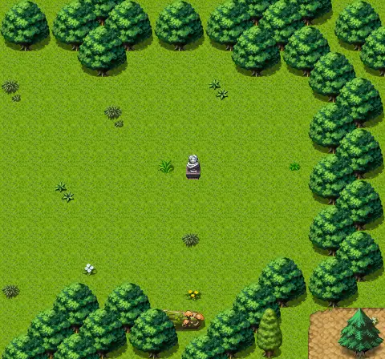

# Guynmart wood 16

15×14 tiles · outdoors · part of [World1](index.md)

<label class="lg lg-spawn"><input type="checkbox" data-t="spawn" checked> Monsters / NPCs</label><label class="lg lg-mapchange"><input type="checkbox" data-t="mapchange" checked> Exit to another map</label><label class="lg lg-container"><input type="checkbox" data-t="container" checked> Container</label><label class="lg lg-sign"><input type="checkbox" data-t="sign" checked> Sign</label><label class="lg lg-rest"><input type="checkbox" data-t="rest" checked> Resting place</label><label class="lg lg-key"><input type="checkbox" data-t="key" checked> Blocked / needs key or quest</label><label class="lg lg-script"><input type="checkbox" data-t="script"> Scripted event</label><label class="lg lg-replace"><input type="checkbox" data-t="replace"> Changes after a quest</label>

## Exits

- [Guynmart wood 17](guynmart_wood_17.md)

## Monsters & NPCs here

| Name | HP |
|---|---|
| [Vicious forest serpent](../monsters/vicious_forest_serpent.md) | 27 |
| [Honor Guard](../monsters/feygard_offering_guard.md) | 220 |

<small>Map ID: `guynmart_wood_16` · Data from v0.8.18</small>
