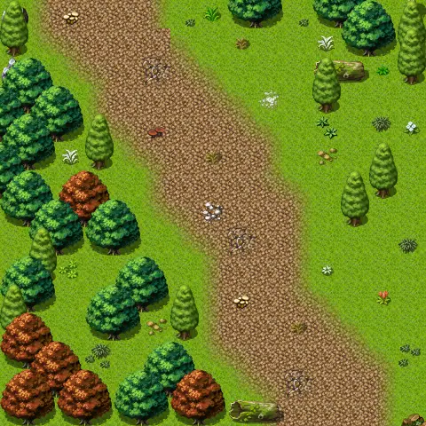

# Guynmart wood 17

15×15 tiles · outdoors · part of [World1](index.md)

<label class="lg lg-spawn"><input type="checkbox" data-t="spawn" checked> Monsters / NPCs</label><label class="lg lg-mapchange"><input type="checkbox" data-t="mapchange" checked> Exit to another map</label><label class="lg lg-container"><input type="checkbox" data-t="container" checked> Container</label><label class="lg lg-sign"><input type="checkbox" data-t="sign" checked> Sign</label><label class="lg lg-rest"><input type="checkbox" data-t="rest" checked> Resting place</label><label class="lg lg-key"><input type="checkbox" data-t="key" checked> Blocked / needs key or quest</label><label class="lg lg-script"><input type="checkbox" data-t="script"> Scripted event</label><label class="lg lg-replace"><input type="checkbox" data-t="replace"> Changes after a quest</label>

## Exits

- [Guynmart wood 15](guynmart_wood_15.md)
- [Guynmart wood 16](guynmart_wood_16.md)
- [Guynmart wood 17b](guynmart_wood_17b.md)

## Monsters & NPCs here

| Name | HP |
|---|---|
| [Tobby](../monsters/tobby5.md) | 0 |
| [Vicious forest serpent](../monsters/vicious_forest_serpent.md) | 27 |
| [Vicious hound](../monsters/vicious_hound.md) | 31 |

<small>Map ID: `guynmart_wood_17` · Data from v0.8.18</small>
