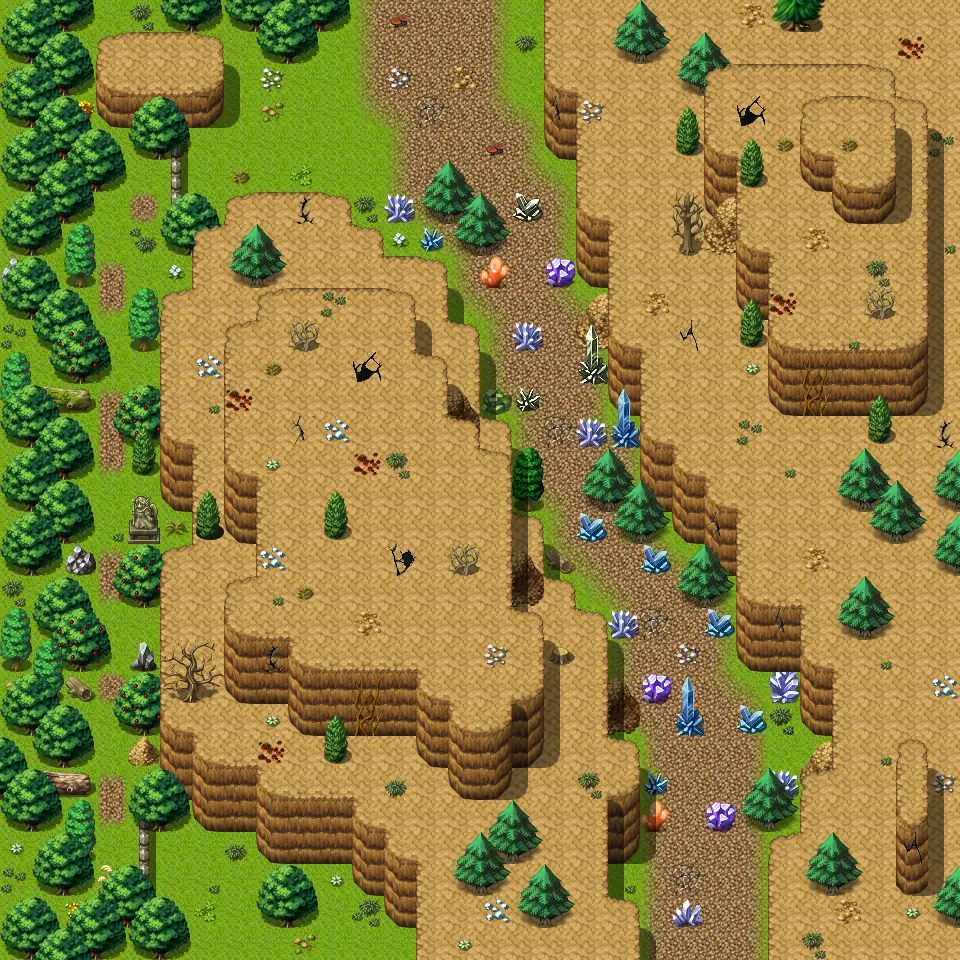
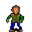

# Guynmart wood 18

30×30 tiles · outdoors · part of [World1](index.md)

<label class="lg"><input type="checkbox" data-t="spawn" checked><b>Red</b>&nbsp;Monsters / NPCs</label><label class="lg"><input type="checkbox" data-t="mapchange" checked><b>Blue</b>&nbsp;Exit to another map</label><label class="lg"><input type="checkbox" data-t="container" checked><b>Yellow</b>&nbsp;Container (click to see contents)</label><label class="lg"><input type="checkbox" data-t="sign" checked><b>Purple</b>&nbsp;Sign</label><label class="lg"><input type="checkbox" data-t="rest" checked><b>Green</b>&nbsp;Resting place</label><label class="lg"><input type="checkbox" data-t="key" checked><b>Orange dashed</b>&nbsp;Blocked until a quest step / item</label><label class="lg"><input type="checkbox" data-t="script"><b>Grey dotted</b>&nbsp;Scripted event</label><label class="lg"><input type="checkbox" data-t="replace"><b>White dotted</b>&nbsp;Changes during a quest</label>

## Containers

<b>Container 1</b><ul><li><a href="../../items/gem2/">Ruby gem</a> <small>100% · ×5 to 15</small></li><li><a href="../../items/gold/">Gold coins</a> <small>100% · ×100 to 200</small></li></ul>

<b>Container 2</b><ul><li><a href="../../items/gem2/">Ruby gem</a> <small>100% · ×20 to 30</small></li><li><a href="../../items/gold/">Gold coins</a> <small>100% · ×300 to 600</small></li></ul>

## Exits

- [Guynmart wood 17b](guynmart_wood_17b.md)
- [Guynmart wood 18b](guynmart_wood_18b.md)
- [Guynmart wood 19](guynmart_wood_19.md)

## Monsters & NPCs here

| Name | HP |
|---|---|
| [Godoe](../monsters/godoe1.md) | 0 |
| [Godoe](../monsters/godoe2.md) | 0 |
| [Tobby](../monsters/tobby3.md) | 0 |
| [Wolf](../monsters/wolf.md) | 30 |
| [Ancient kobold](../monsters/kobold3.md) | 70 |
| [Quick kobold](../monsters/kobold1.md) | 70 |
| [Kobold](../monsters/kobold2.md) | 70 |
| [Tough kobold](../monsters/kobold4.md) | 300 |

<small>Map ID: `guynmart_wood_18` · Data from v0.8.18</small>
