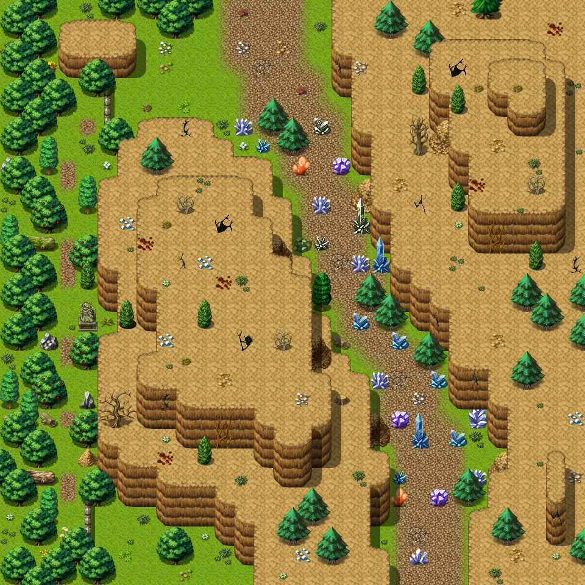

# Guynmart wood 18

| | |
|---|---|
| **Map ID** | `guynmart_wood_18` |
| **Type** | Outdoors |
| **Size** | 30×30 tiles |
| **World map** | [World 1](index.md) |
| **Introduced** | [v0.8.12.1](../versions/0.8.12.1.md) |
| **NPCs** | 3 |
| **Enemy types** | 5 |
| **Quests** | 2 |
| **Containers** | 2 |

**Guynmart wood 18** is an outdoor map. It has 3 NPCs and 5 kinds of enemy. Exits lead to Guynmart wood 19, Guynmart wood 17b, Guynmart wood 18b.

## Map

<label class="lg"><input type="checkbox" data-t="spawn" checked><b>Red</b>&nbsp;Monsters / NPCs</label><label class="lg"><input type="checkbox" data-t="mapchange" checked><b>Blue</b>&nbsp;Exit to another map</label><label class="lg"><input type="checkbox" data-t="container" checked><b>Yellow</b>&nbsp;Container (click to see contents)</label><label class="lg"><input type="checkbox" data-t="sign" checked><b>Purple</b>&nbsp;Sign</label><label class="lg"><input type="checkbox" data-t="rest" checked><b>Green</b>&nbsp;Resting place</label><label class="lg"><input type="checkbox" data-t="key" checked><b>Orange dashed</b>&nbsp;Blocked until a quest step / item</label><label class="lg"><input type="checkbox" data-t="script"><b>Grey dotted</b>&nbsp;Scripted event</label><label class="lg"><input type="checkbox" data-t="replace"><b>White dotted</b>&nbsp;Changes during a quest</label><label class="lg"><input type="checkbox" data-t="pin" checked><b>Numbers</b>&nbsp;Numbered key points (see the key below the map)</label>

<a class="pin pin-exit" href="#key-1" style="left:38.333%;top:1.667%" title="Exit (north): to [Guynmart wood 19](guynmart_wood_19.md)">1</a><a class="pin pin-exit" href="#key-2" style="left:50.000%;top:98.333%" title="Exit (south): to [Guynmart wood 17b](guynmart_wood_17b.md)">2</a><a class="pin pin-exit" href="#key-3" style="left:21.667%;top:55.000%" title="Exit (path): to [Guynmart wood 18b](guynmart_wood_18b.md)">3</a><a id="pin-npc-godoe1" class="pin pin-npc" href="#key-4" style="left:25.000%;top:88.333%" title="[Godoe](../../monsters/godoe1.md): NPC">4</a><a id="pin-npc-godoe2" class="pin pin-npc" href="#key-5" style="left:28.333%;top:15.000%" title="[Godoe](../../monsters/godoe1.md#v-godoe2): NPC">5</a><a id="pin-npc-tobby3" class="pin pin-npc" href="#key-6" style="left:45.000%;top:1.667%" title="[Tobby](../../monsters/tobby.md#v-tobby3): 1 quest">6</a><a class="pin pin-script" href="#key-7" style="left:30.000%;top:93.333%" title="Quest trigger: Scripted event: advances the quest: hidden story flag “feygard_nondisplayed” to stage 81 (“81=Godoe in the south”)">7</a><a class="pin pin-container" href="#key-8" style="left:8.333%;top:11.667%" title="Container 1: Ruby gem, Gold coins">8</a><a class="pin pin-container" href="#key-9" style="left:8.333%;top:95.000%" title="Container 2: Ruby gem, Gold coins">9</a><a class="pin pin-script" href="#key-10" style="left:73.333%;top:95.000%" title="Quest trigger: Scripted event: advances the quest: hidden story flag “feygard_nondisplayed” to stage 91 (“91=Ravine outlets blocked”)">10</a><a class="pin pin-script" href="#key-10" style="left:46.667%;top:18.333%" title="Quest trigger: Scripted event: advances the quest: hidden story flag “feygard_nondisplayed” to stage 91 (“91=Ravine outlets blocked”)">10</a><a class="pin pin-script" href="#key-11" style="left:58.333%;top:55.000%" title="Quest trigger: Scripted event: advances the quest: hidden story flag “feygard_nondisplayed” to stage 92 (“92=Ravine free”)">11</a><a class="pin pin-script" href="#key-12" style="left:45.000%;top:5.000%" title="Quest trigger: Scripted event: advances the quest: Sobby&#x27;s Trail to stage 23 (“Tobby has followed me to the beginning of the ravine with the kobolds.”)">12</a><a class="pin pin-key" href="#key-13" style="left:15.000%;top:90.000%" title="Blocked passage: Unlocked during the quest: hidden story flag “feygard_nondisplayed” (stage 80: “80=Path open”)">13</a><a class="pin pin-key" href="#key-13" style="left:18.333%;top:20.000%" title="Blocked passage: Unlocked during the quest: hidden story flag “feygard_nondisplayed” (stage 80: “80=Path open”)">13</a><a class="pin pin-key" href="#key-14" style="left:63.333%;top:73.333%" title="Blocked passage: Closed off once you reach this point in the quest: Search for Andor (stage 1: “My father Mikhail says that Andor has not been home since yesterday. I should go look for him in the village.”)">14</a><a class="pin pin-key" href="#key-14" style="left:85.000%;top:78.333%" title="Blocked passage: Closed off once you reach this point in the quest: Search for Andor (stage 1: “My father Mikhail says that Andor has not been home since yesterday. I should go look for him in the village.”)">14</a><a class="pin pin-key" href="#key-14" style="left:56.667%;top:58.333%" title="Blocked passage: Closed off once you reach this point in the quest: Search for Andor (stage 1: “My father Mikhail says that Andor has not been home since yesterday. I should go look for him in the village.”)">14</a><a class="pin pin-key" href="#key-14" style="left:50.000%;top:41.667%" title="Blocked passage: Closed off once you reach this point in the quest: Search for Andor (stage 1: “My father Mikhail says that Andor has not been home since yesterday. I should go look for him in the village.”)">14</a><a class="pin pin-key" href="#key-14" style="left:61.667%;top:31.667%" title="Blocked passage: Closed off once you reach this point in the quest: Search for Andor (stage 1: “My father Mikhail says that Andor has not been home since yesterday. I should go look for him in the village.”)">14</a><a class="pin pin-replace" href="#key-15" style="left:15.000%;top:55.000%" title="Changes during a quest: This area changes during the quest: hidden story flag “feygard_nondisplayed” (stage 80: “80=Path open”)">15</a><a class="pin pin-replace" href="#key-16" style="left:15.219%;top:52.500%" title="Changes during a quest: This area changes back during the quest: hidden story flag “feygard_nondisplayed” (stage 80: “80=Path open”)">16</a><a class="pin pin-replace" href="#key-17" style="left:61.667%;top:53.333%" title="Changes during a quest: This area changes during the quest: hidden story flag “feygard_nondisplayed” (stage 90: “90=Ravine blocked”)">17</a><a class="pin pin-replace" href="#key-18" style="left:61.886%;top:50.834%" title="Changes during a quest: This area changes during the quest: hidden story flag “feygard_nondisplayed” (stage 91: “91=Ravine outlets blocked”)">18</a><a class="pin pin-replace" href="#key-19" style="left:63.349%;top:55.527%" title="Changes during a quest: This area changes during the quest: hidden story flag “feygard_nondisplayed” (stage 92: “92=Ravine free”)">19</a>

??? abstract "Key to the numbers on the map"

    | # | What | Details |
    |---|---|---|
    | 1 | Exit (north) | to [Guynmart wood 19](guynmart_wood_19.md) |
    | 2 | Exit (south) | to [Guynmart wood 17b](guynmart_wood_17b.md) |
    | 3 | Exit (path) | to [Guynmart wood 18b](guynmart_wood_18b.md) |
    | 4 | [Godoe](../monsters/godoe1.md) | NPC |
    | 5 | [Godoe](../monsters/godoe1.md#v-godoe2) | NPC |
    | 6 | [Tobby](../monsters/tobby.md#v-tobby3) | 1 quest |
    | 7 | Quest trigger | Scripted event: advances the quest: hidden story flag “feygard_nondisplayed” to stage 81 (“81=Godoe in the south”) |
    | 8 | Container 1 | Ruby gem, Gold coins |
    | 9 | Container 2 | Ruby gem, Gold coins |
    | 10 | Quest trigger | Scripted event: advances the quest: hidden story flag “feygard_nondisplayed” to stage 91 (“91=Ravine outlets blocked”) |
    | 11 | Quest trigger | Scripted event: advances the quest: hidden story flag “feygard_nondisplayed” to stage 92 (“92=Ravine free”) |
    | 12 | Quest trigger | Scripted event: advances the quest: Sobby's Trail to stage 23 (“Tobby has followed me to the beginning of the ravine with the kobolds.”) |
    | 13 | Blocked passage | Unlocked during the quest: hidden story flag “feygard_nondisplayed” (stage 80: “80=Path open”) |
    | 14 | Blocked passage | Closed off once you reach this point in the quest: Search for Andor (stage 1: “My father Mikhail says that Andor has not been home since yesterday. I should go look for him in the village.”) |
    | 15 | Changes during a quest | This area changes during the quest: hidden story flag “feygard_nondisplayed” (stage 80: “80=Path open”) |
    | 16 | Changes during a quest | This area changes back during the quest: hidden story flag “feygard_nondisplayed” (stage 80: “80=Path open”) |
    | 17 | Changes during a quest | This area changes during the quest: hidden story flag “feygard_nondisplayed” (stage 90: “90=Ravine blocked”) |
    | 18 | Changes during a quest | This area changes during the quest: hidden story flag “feygard_nondisplayed” (stage 91: “91=Ravine outlets blocked”) |
    | 19 | Changes during a quest | This area changes during the quest: hidden story flag “feygard_nondisplayed” (stage 92: “92=Ravine free”) |

Verified against v0.8.18 map data.

## Connections

| Direction | Leads to | Region there | Map # |
|---|---|---|---|
| North | [Guynmart wood 19](guynmart_wood_19.md) | – | 1 |
| South | [Guynmart wood 17b](guynmart_wood_17b.md) | – | 2 |
| Path | [Guynmart wood 18b](guynmart_wood_18b.md) | – | 3 |

## NPCs

- [Godoe](../monsters/godoe1.md) (#4)
- [Godoe](../monsters/godoe1.md#v-godoe2) (#5)
- [Tobby](../monsters/tobby.md#v-tobby3) — quests: [Sobby's Trail](../quests/tobby.md) (#6)

## Enemies

| Enemy | HP | Damage | Up to | Notes |
|---|---|---|---|---|
| [Wolf](../monsters/wolf.md) | 30 | 3–6 | 2 | – |
| [Kobold](../monsters/kobold2.md) | 70 | 1–10 | 8 | – |
| [Quick kobold](../monsters/kobold1.md) | 70 | 1–10 | 4 | – |
| [Ancient kobold](../monsters/kobold3.md) | 70 | 1–10 | 3 | – |
| [Tough kobold](../monsters/kobold4.md) | 300 | 1–10 | 2 | appears later, during a quest |

<small>“Up to” is the most that can be alive at once from the spawn areas on this map.</small>

## Items & containers

<b>Container 1</b><ul><li><a href="../../items/gem2/">Ruby gem</a> <small>100% · ×5 to 15</small></li><li><a href="../../items/gold/">Gold coins</a> <small>100% · ×100 to 200</small></li></ul>

<b>Container 2</b><ul><li><a href="../../items/gem2/">Ruby gem</a> <small>100% · ×20 to 30</small></li><li><a href="../../items/gold/">Gold coins</a> <small>100% · ×300 to 600</small></li></ul>

## Quests

- [Search for Andor](../quests/andor.md): blocked passage closes at stage 1
- [Sobby's Trail](../quests/tobby.md): [Tobby](../monsters/tobby.md#v-tobby3) is involved; something on this map advances it; stepping on a trigger here sets stage 23
- [Feygard story flags (hidden flag)](../quests/feygard_nondisplayed.md): [Godoe](../monsters/godoe1.md) is involved; [Godoe](../monsters/godoe1.md#v-godoe2) is involved; a scripted event can trigger here from stage 80; a scripted event can trigger here from stage 81; blocked passage opens at stage 80; part of the map changes at stage 80; part of the map changes at stage 90; part of the map changes at stage 91; part of the map changes at stage 92; something on this map advances it; stepping on a trigger here sets stage 81; stepping on a trigger here sets stage 91; stepping on a trigger here sets stage 92

## Points of interest

- **Quest trigger** (#7): Scripted event: advances the quest: hidden story flag “feygard_nondisplayed” to stage 81 (“81=Godoe in the south”)
- **Quest trigger** (#10): Scripted event: advances the quest: hidden story flag “feygard_nondisplayed” to stage 91 (“91=Ravine outlets blocked”)
- **Quest trigger** (#11): Scripted event: advances the quest: hidden story flag “feygard_nondisplayed” to stage 92 (“92=Ravine free”)
- **Quest trigger** (#12): Scripted event: advances the quest: Sobby's Trail to stage 23 (“Tobby has followed me to the beginning of the ravine with the kobolds.”)
- **Blocked passage** (#13): Unlocked during the quest: hidden story flag “feygard_nondisplayed” (stage 80: “80=Path open”)
- **Blocked passage** (#14): Closed off once you reach this point in the quest: Search for Andor (stage 1: “My father Mikhail says that Andor has not been home since yesterday. I should go look for him in the village.”)
- **Changes during a quest** (#15): This area changes during the quest: hidden story flag “feygard_nondisplayed” (stage 80: “80=Path open”)
- **Changes during a quest** (#16): This area changes back during the quest: hidden story flag “feygard_nondisplayed” (stage 80: “80=Path open”)
- **Changes during a quest** (#17): This area changes during the quest: hidden story flag “feygard_nondisplayed” (stage 90: “90=Ravine blocked”)
- **Changes during a quest** (#18): This area changes during the quest: hidden story flag “feygard_nondisplayed” (stage 91: “91=Ravine outlets blocked”)
- **Changes during a quest** (#19): This area changes during the quest: hidden story flag “feygard_nondisplayed” (stage 92: “92=Ravine free”)

## Version history

| Version | Change |
|---|---|
| [v0.8.12.1](../versions/0.8.12.1.md) | Added |
| [v0.8.18](../versions/0.8.18.md) | Map layout or objects changed |

Verified against v0.8.18 and every earlier release back to v0.7.0 (game data compared release by release).

## Community notes

<small>Written by players, not generated from game data. **Observations**: what players notice in-game · **Lore**: the in-world story · **Trivia**: real-world facts, references, development history · **Theory / speculation**: unconfirmed ideas; may just be unfinished content</small>

### Observations

*No notes yet. Contributions are welcome: [add a note](https://github.com/asdfghjkl628/Andor-s-Trail-Wikiiii/new/main/notes/maps?filename=guynmart_wood_18.md&value=%23%23%20Observations%0A%0A%3C%21--%20what%20players%20notice%20in-game%20--%3E%0A%0A%23%23%20Lore%0A%0A%3C%21--%20the%20in-world%20story%20--%3E%0A%0A%23%23%20Trivia%0A%0A%3C%21--%20real-world%20facts%2C%20references%2C%20development%20history%20--%3E%0A%0A%23%23%20Theory%20/%20speculation%0A%0A%3C%21--%20unconfirmed%20ideas%3B%20may%20just%20be%20unfinished%20content%20--%3E%0A).*

### Lore

*No notes yet. Contributions are welcome: [add a note](https://github.com/asdfghjkl628/Andor-s-Trail-Wikiiii/new/main/notes/maps?filename=guynmart_wood_18.md&value=%23%23%20Observations%0A%0A%3C%21--%20what%20players%20notice%20in-game%20--%3E%0A%0A%23%23%20Lore%0A%0A%3C%21--%20the%20in-world%20story%20--%3E%0A%0A%23%23%20Trivia%0A%0A%3C%21--%20real-world%20facts%2C%20references%2C%20development%20history%20--%3E%0A%0A%23%23%20Theory%20/%20speculation%0A%0A%3C%21--%20unconfirmed%20ideas%3B%20may%20just%20be%20unfinished%20content%20--%3E%0A).*

### Trivia

*No notes yet. Contributions are welcome: [add a note](https://github.com/asdfghjkl628/Andor-s-Trail-Wikiiii/new/main/notes/maps?filename=guynmart_wood_18.md&value=%23%23%20Observations%0A%0A%3C%21--%20what%20players%20notice%20in-game%20--%3E%0A%0A%23%23%20Lore%0A%0A%3C%21--%20the%20in-world%20story%20--%3E%0A%0A%23%23%20Trivia%0A%0A%3C%21--%20real-world%20facts%2C%20references%2C%20development%20history%20--%3E%0A%0A%23%23%20Theory%20/%20speculation%0A%0A%3C%21--%20unconfirmed%20ideas%3B%20may%20just%20be%20unfinished%20content%20--%3E%0A).*

### Theory / speculation

*No notes yet. Contributions are welcome: [add a note](https://github.com/asdfghjkl628/Andor-s-Trail-Wikiiii/new/main/notes/maps?filename=guynmart_wood_18.md&value=%23%23%20Observations%0A%0A%3C%21--%20what%20players%20notice%20in-game%20--%3E%0A%0A%23%23%20Lore%0A%0A%3C%21--%20the%20in-world%20story%20--%3E%0A%0A%23%23%20Trivia%0A%0A%3C%21--%20real-world%20facts%2C%20references%2C%20development%20history%20--%3E%0A%0A%23%23%20Theory%20/%20speculation%0A%0A%3C%21--%20unconfirmed%20ideas%3B%20may%20just%20be%20unfinished%20content%20--%3E%0A).*

??? info "Technical information"

    | | |
    |---|---|
    | Map ID | `guynmart_wood_18` |
    | File | `res/xml/guynmart_wood_18.tmx` |
    | Size | 30×30 tiles (960×960 px) |
    | outdoors property | 1 |
    | Layers drawn | base, ground, objects, above, top |
    | Tilesets | map_bed_1, map_border_1, map_bridge_1, map_bridge_2, map_broken_1, map_cavewall_1, map_cavewall_2, map_cavewall_3, map_cavewall_4, map_chair_table_1, map_chair_table_2, map_crate_1, map_cupboard_1, map_curtain_1, map_entrance_1, map_entrance_2, map_fence_1, map_fence_2, map_fence_3, map_fence_4, map_ground_1, map_ground_2, map_ground_3, map_ground_4, map_ground_5, map_ground_6, map_ground_7, map_ground_8, map_house_1, map_house_2, map_indoor_1, map_indoor_2, map_kitchen_1, map_outdoor_1, map_pillar_1, map_pillar_2, map_plant_1, map_plant_2, map_rock_1, map_rock_2, map_roof_1, map_roof_2, map_roof_3, map_shop_1, map_sign_ladder_1, map_table_1, map_trail_1, map_transition_1, map_transition_2, map_transition_3, map_transition_4, map_transition_5, map_tree_1, map_tree_2, map_tree_3, map_tree_4, map_wall_1, map_wall_2, map_wall_3, map_wall_4, map_window_1, map_window_2 |
    | Map objects | spawn: 9, script: 7, key: 7, mapchange: 6, replace: 5, container: 2 |
    | World map position | segment `world1`, x 8, y 144 |

<small>Data from v0.8.18</small>
