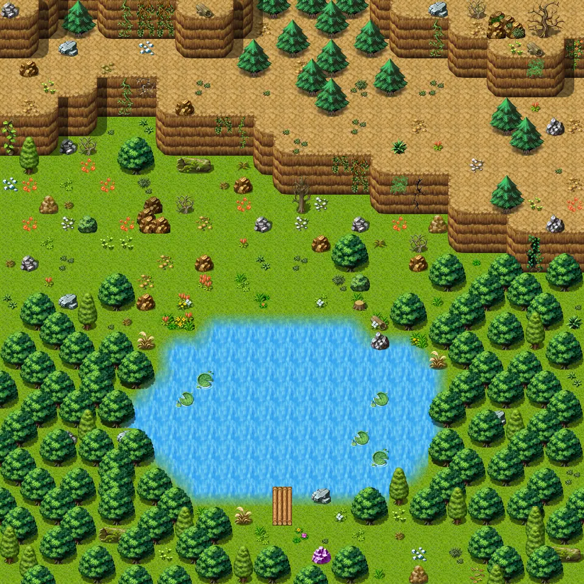

# Guynmart wood 2

30×30 tiles · outdoors · part of [World1](index.md)

<label class="lg lg-spawn"><input type="checkbox" data-t="spawn" checked> Monsters / NPCs</label><label class="lg lg-mapchange"><input type="checkbox" data-t="mapchange" checked> Exit to another map</label><label class="lg lg-container"><input type="checkbox" data-t="container" checked> Container</label><label class="lg lg-sign"><input type="checkbox" data-t="sign" checked> Sign</label><label class="lg lg-rest"><input type="checkbox" data-t="rest" checked> Resting place</label><label class="lg lg-key"><input type="checkbox" data-t="key" checked> Blocked / needs key or quest</label><label class="lg lg-script"><input type="checkbox" data-t="script"> Scripted event</label><label class="lg lg-replace"><input type="checkbox" data-t="replace"> Changes after a quest</label>

## Exits

- [Guynmart](guynmart.md)
- [Guynmart wood 3](guynmart_wood_3.md)
- [Guynmart wood 7](guynmart_wood_7.md)

## Monsters & NPCs here

| Name | HP |
|---|---|
| [Fish](../monsters/guynmart_fish1.md) | 0 |
| [Fish](../monsters/guynmart_fish2.md) | 0 |
| [Cute dog puppy](../monsters/guynmart_dog_puppy.md) | 6 |
| [Wolf](../monsters/wolf.md) | 30 |
| [Vicious hound](../monsters/vicious_hound.md) | 31 |
| [Wild dog](../monsters/guynmart_dog3a.md) | 40 |
| [Rabid hound](../monsters/rabid_hound.md) | 40 |
| [Wild dog](../monsters/guynmart_dog2a.md) | 40 |

<small>Map ID: `guynmart_wood_2` · Data from v0.8.18</small>
