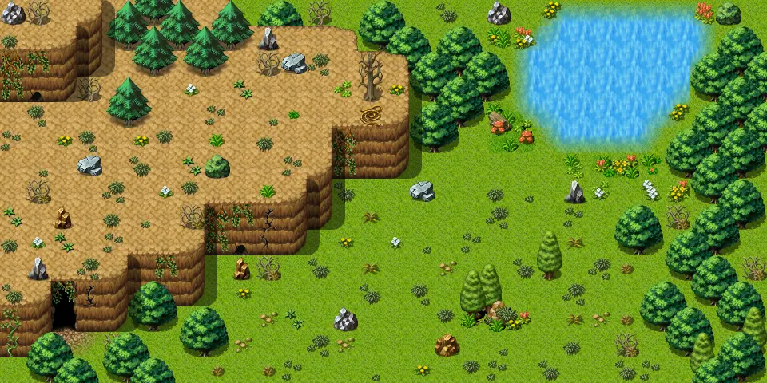

# Guynmart wood 7

| | |
|---|---|
| **Map ID** | `guynmart_wood_7` |
| **Region** | Near Guynmart Castle (other) |
| **Type** | Outdoors |
| **Size** | 30×15 tiles |
| **World map** | [World1](index.md) |
| **Introduced** | [v0.7.2](../versions/0.7.2.md) |
| **NPCs** | 1 |
| **Quests** | 1 |

**Guynmart wood 7** is an outdoor map, near Guynmart Castle (other). It has 1 NPC, and no enemies. Exits lead to Guynmart wood 9, Guynmart wood 2, Gamjee well exit a.

## Map

<label class="lg"><input type="checkbox" data-t="spawn" checked><b>Red</b>&nbsp;Monsters / NPCs</label><label class="lg"><input type="checkbox" data-t="mapchange" checked><b>Blue</b>&nbsp;Exit to another map</label><label class="lg"><input type="checkbox" data-t="container" checked><b>Yellow</b>&nbsp;Container (click to see contents)</label><label class="lg"><input type="checkbox" data-t="sign" checked><b>Purple</b>&nbsp;Sign</label><label class="lg"><input type="checkbox" data-t="rest" checked><b>Green</b>&nbsp;Resting place</label><label class="lg"><input type="checkbox" data-t="key" checked><b>Orange dashed</b>&nbsp;Blocked until a quest step / item</label><label class="lg"><input type="checkbox" data-t="script"><b>Grey dotted</b>&nbsp;Scripted event</label><label class="lg"><input type="checkbox" data-t="replace"><b>White dotted</b>&nbsp;Changes during a quest</label><label class="lg"><input type="checkbox" data-t="pin" checked><b>Numbers</b>&nbsp;Numbered key points (see the key below the map)</label>

<a class="pin pin-exit" href="#key-1" style="left:50.000%;top:96.667%" title="Exit (south): to [Guynmart wood 9](../guynmart_wood_9.md)">1</a><a class="pin pin-exit" href="#key-2" style="left:1.667%;top:53.333%" title="Exit (west): to [Guynmart wood 2](../guynmart_wood_2.md)">2</a><a class="pin pin-exit" href="#key-3" style="left:8.333%;top:83.333%" title="Exit (cave entrance): to [Gamjee well exit a](../gamjee_well_exit_a.md)">3</a><a class="pin pin-npc" href="#key-4" style="left:45.000%;top:30.000%" title="[Rob](../../monsters/guynmart_rob6.md): NPC">4</a><a class="pin pin-script" href="#key-5" style="left:48.333%;top:30.000%" title="Quest trigger: Scripted event: advances the quest: hidden story flag “guynmart_r_rope” to stage 11 (“11=rope2 set”)">5</a><a class="pin pin-script" href="#key-5" style="left:48.333%;top:50.000%" title="Quest trigger: Scripted event: advances the quest: hidden story flag “guynmart_r_rope” to stage 11 (“11=rope2 set”)">5</a><a class="pin pin-replace" href="#key-6" style="left:48.333%;top:36.667%" title="Changes during a quest: This area changes during the quest: hidden story flag “guynmart_r_rope” (stage 11: “11=rope2 set”)">6</a><a class="pin pin-replace" href="#key-7" style="left:15.000%;top:90.000%" title="Changes during a quest: This area changes during the quest: Echoes of enchantment (stage 10: “The villagers have been freed. I should visit them back in their village of Wexlow.”)">7</a><a class="pin pin-key" href="#key-8" style="left:15.219%;top:85.001%" title="Blocked passage: Unlocked during the quest: Echoes of enchantment (stage 10: “The villagers have been freed. I should visit them back in their village of Wexlow.”)">8</a>

??? abstract "Key to the numbers on the map"

    | # | What | Details |
    |---|---|---|
    | 1 | Exit (south) | to [Guynmart wood 9](../guynmart_wood_9.md) |
    | 2 | Exit (west) | to [Guynmart wood 2](../guynmart_wood_2.md) |
    | 3 | Exit (cave entrance) | to [Gamjee well exit a](../gamjee_well_exit_a.md) |
    | 4 | [Rob](../monsters/guynmart_rob6.md) | NPC |
    | 5 | Quest trigger | Scripted event: advances the quest: hidden story flag “guynmart_r_rope” to stage 11 (“11=rope2 set”) |
    | 6 | Changes during a quest | This area changes during the quest: hidden story flag “guynmart_r_rope” (stage 11: “11=rope2 set”) |
    | 7 | Changes during a quest | This area changes during the quest: Echoes of enchantment (stage 10: “The villagers have been freed. I should visit them back in their village of Wexlow.”) |
    | 8 | Blocked passage | Unlocked during the quest: Echoes of enchantment (stage 10: “The villagers have been freed. I should visit them back in their village of Wexlow.”) |

Verified against v0.8.18 map data.

## Connections

| Direction | Leads to | Region there | Map # |
|---|---|---|---|
| South | [Guynmart wood 9](guynmart_wood_9.md) | Guynmart Castle | 1 |
| West | [Guynmart wood 2](guynmart_wood_2.md) | Guynmart Castle | 2 |
| Cave entrance | [Gamjee well exit a](gamjee_well_exit_a.md) | Guynmart Castle | 3 |

## NPCs

- [Rob](../monsters/guynmart_rob6.md) (#4)

## Quests

- [Echoes of enchantment](../quests/echoes_of_enchantment.md): blocked passage opens at stage 10; part of the map changes at stage 10
- [guynmart rope (hidden flag)](../quests/guynmart_r_rope.md): [Rob](../monsters/guynmart_rob6.md) is involved; part of the map changes at stage 11; something on this map advances it; stepping on a trigger here sets stage 11

## Points of interest

- **Quest trigger** (#5): Scripted event: advances the quest: hidden story flag “guynmart_r_rope” to stage 11 (“11=rope2 set”)
- **Changes during a quest** (#6): This area changes during the quest: hidden story flag “guynmart_r_rope” (stage 11: “11=rope2 set”)
- **Changes during a quest** (#7): This area changes during the quest: Echoes of enchantment (stage 10: “The villagers have been freed. I should visit them back in their village of Wexlow.”)
- **Blocked passage** (#8): Unlocked during the quest: Echoes of enchantment (stage 10: “The villagers have been freed. I should visit them back in their village of Wexlow.”)

## Version history

| Version | Change |
|---|---|
| [v0.7.2](../versions/0.7.2.md) | Added |
| [v0.8.12.1](../versions/0.8.12.1.md) | map layout or objects changed |

Verified against v0.8.18 and every earlier release back to v0.7.0 (game data compared release by release).

## Community notes

<small>Written by players, not generated from game data. **Observations**: what players notice in-game · **Lore**: the in-world story · **Trivia**: real-world facts, references, development history · **Theory / speculation**: unconfirmed ideas; may just be unfinished content</small>

### Observations

*Nothing here yet. Know something? [Add it](https://github.com/asdfghjkl628/Andor-s-Trail-Wikiiii/new/main/notes/maps?filename=guynmart_wood_7.md&value=%23%23%20Observations%0A%0A%3C%21--%20what%20players%20notice%20in-game%20--%3E%0A%0A%23%23%20Lore%0A%0A%3C%21--%20the%20in-world%20story%20--%3E%0A%0A%23%23%20Trivia%0A%0A%3C%21--%20real-world%20facts%2C%20references%2C%20development%20history%20--%3E%0A%0A%23%23%20Theory%20/%20speculation%0A%0A%3C%21--%20unconfirmed%20ideas%3B%20may%20just%20be%20unfinished%20content%20--%3E%0A).*

### Lore

*Nothing here yet. Know something? [Add it](https://github.com/asdfghjkl628/Andor-s-Trail-Wikiiii/new/main/notes/maps?filename=guynmart_wood_7.md&value=%23%23%20Observations%0A%0A%3C%21--%20what%20players%20notice%20in-game%20--%3E%0A%0A%23%23%20Lore%0A%0A%3C%21--%20the%20in-world%20story%20--%3E%0A%0A%23%23%20Trivia%0A%0A%3C%21--%20real-world%20facts%2C%20references%2C%20development%20history%20--%3E%0A%0A%23%23%20Theory%20/%20speculation%0A%0A%3C%21--%20unconfirmed%20ideas%3B%20may%20just%20be%20unfinished%20content%20--%3E%0A).*

### Trivia

*Nothing here yet. Know something? [Add it](https://github.com/asdfghjkl628/Andor-s-Trail-Wikiiii/new/main/notes/maps?filename=guynmart_wood_7.md&value=%23%23%20Observations%0A%0A%3C%21--%20what%20players%20notice%20in-game%20--%3E%0A%0A%23%23%20Lore%0A%0A%3C%21--%20the%20in-world%20story%20--%3E%0A%0A%23%23%20Trivia%0A%0A%3C%21--%20real-world%20facts%2C%20references%2C%20development%20history%20--%3E%0A%0A%23%23%20Theory%20/%20speculation%0A%0A%3C%21--%20unconfirmed%20ideas%3B%20may%20just%20be%20unfinished%20content%20--%3E%0A).*

### Theory / speculation

*Nothing here yet. Know something? [Add it](https://github.com/asdfghjkl628/Andor-s-Trail-Wikiiii/new/main/notes/maps?filename=guynmart_wood_7.md&value=%23%23%20Observations%0A%0A%3C%21--%20what%20players%20notice%20in-game%20--%3E%0A%0A%23%23%20Lore%0A%0A%3C%21--%20the%20in-world%20story%20--%3E%0A%0A%23%23%20Trivia%0A%0A%3C%21--%20real-world%20facts%2C%20references%2C%20development%20history%20--%3E%0A%0A%23%23%20Theory%20/%20speculation%0A%0A%3C%21--%20unconfirmed%20ideas%3B%20may%20just%20be%20unfinished%20content%20--%3E%0A).*

??? info "Technical information"

    | | |
    |---|---|
    | Map ID | `guynmart_wood_7` |
    | File | `res/xml/guynmart_wood_7.tmx` |
    | Size | 30×15 tiles (960×480 px) |
    | outdoors property | 1 |
    | Layers drawn | ground, objects, above |
    | Tilesets | map_bed_1, map_border_1, map_bridge_1, map_bridge_2, map_broken_1, map_cavewall_1, map_cavewall_2, map_cavewall_3, map_cavewall_4, map_chair_table_1, map_chair_table_2, map_crate_1, map_cupboard_1, map_curtain_1, map_entrance_1, map_entrance_2, map_fence_1, map_fence_2, map_fence_3, map_fence_4, map_ground_1, map_ground_2, map_ground_3, map_ground_4, map_ground_5, map_ground_6, map_ground_7, map_ground_8, map_house_1, map_house_2, map_indoor_1, map_indoor_2, map_kitchen_1, map_outdoor_1, map_pillar_1, map_pillar_2, map_plant_1, map_plant_2, map_rock_1, map_rock_2, map_roof_1, map_roof_2, map_roof_3, map_shop_1, map_sign_ladder_1, map_table_1, map_trail_1, map_transition_1, map_transition_2, map_transition_3, map_transition_4, map_transition_5, map_tree_1, map_tree_2, map_wall_1, map_wall_2, map_wall_3, map_wall_4, map_window_1, map_window_2 |
    | Map objects | mapchange: 3, script: 2, replace: 2, spawn: 1, key: 1 |
    | World map position | segment `world1`, x 117, y 144 |

<small>Data from v0.8.18</small>
