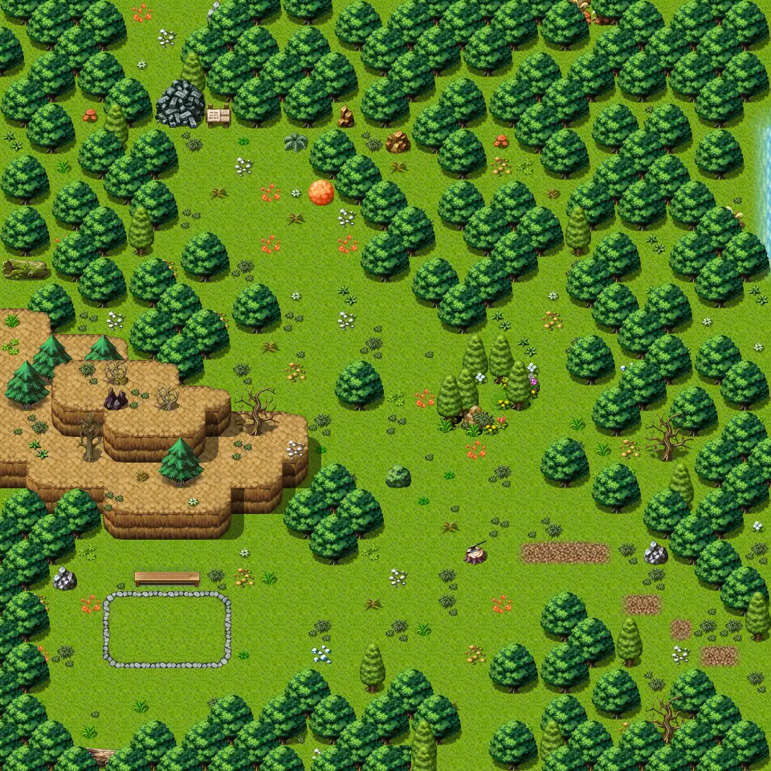
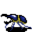

# Guynmart wood 8

| | |
|---|---|
| **Map ID** | `guynmart_wood_8` |
| **Region** | Near Guynmart Castle (other) |
| **Type** | Outdoors |
| **Size** | 30×30 tiles |
| **World map** | [World1](index.md) |
| **Introduced** | [v0.7.2](../versions/0.7.2.md) |
| **NPCs** | 4 |
| **Enemy types** | 4 |
| **Quests** | 2 |

**Guynmart wood 8** is an outdoor map, near Guynmart Castle (other). It has 4 NPCs and 4 kinds of enemy. Exits lead to Guynmart wood 5, Guynmart, Guynmart wood 1, Guynmart wood 13.

## Map

<label class="lg"><input type="checkbox" data-t="spawn" checked><b>Red</b>&nbsp;Monsters / NPCs</label><label class="lg"><input type="checkbox" data-t="mapchange" checked><b>Blue</b>&nbsp;Exit to another map</label><label class="lg"><input type="checkbox" data-t="container" checked><b>Yellow</b>&nbsp;Container (click to see contents)</label><label class="lg"><input type="checkbox" data-t="sign" checked><b>Purple</b>&nbsp;Sign</label><label class="lg"><input type="checkbox" data-t="rest" checked><b>Green</b>&nbsp;Resting place</label><label class="lg"><input type="checkbox" data-t="key" checked><b>Orange dashed</b>&nbsp;Blocked until a quest step / item</label><label class="lg"><input type="checkbox" data-t="script"><b>Grey dotted</b>&nbsp;Scripted event</label><label class="lg"><input type="checkbox" data-t="replace"><b>White dotted</b>&nbsp;Changes during a quest</label><label class="lg"><input type="checkbox" data-t="pin" checked><b>Numbers</b>&nbsp;Numbered key points (see the key below the map)</label>

<a class="pin pin-exit" href="#key-1" style="left:20.000%;top:1.667%" title="Exit (north): to [Guynmart wood 5](guynmart_wood_5.md)">1</a><a class="pin pin-exit" href="#key-2" style="left:98.333%;top:15.000%" title="Exit (east): to [Guynmart](guynmart.md)">2</a><a class="pin pin-exit" href="#key-2" style="left:98.333%;top:41.667%" title="Exit (east): to [Guynmart](guynmart.md)">2</a><a class="pin pin-exit" href="#key-3" style="left:98.333%;top:75.000%" title="Exit (east): to [Guynmart wood 1](guynmart_wood_1.md)">3</a><a class="pin pin-exit" href="#key-4" style="left:60.000%;top:98.333%" title="Exit (south): to [Guynmart wood 13](guynmart_wood_13.md)">4</a><a id="pin-npc-guynmart_spectator1a" class="pin pin-npc" href="#key-5" style="left:18.333%;top:75.000%" title="[Spectator](../../monsters/guynmart_spectator2.md#v-guynmart_spectator1a): NPC">5</a><a id="pin-npc-guynmart_spectator2" class="pin pin-npc" href="#key-6" style="left:31.667%;top:81.667%" title="[Spectator](../../monsters/guynmart_spectator2.md): NPC">6</a><a id="pin-npc-guynmart_spectator1b" class="pin pin-npc" href="#key-7" style="left:21.667%;top:75.000%" title="[Spectator](../../monsters/guynmart_spectator2.md#v-guynmart_spectator1b): NPC">7</a><a id="pin-npc-wild_berry" class="pin pin-npc" href="#key-8" style="left:51.667%;top:21.667%" title="[Wild berries](../../monsters/wild_berry.md): NPC">8</a><a class="pin pin-script" href="#key-9" style="left:95.000%;top:43.333%" title="Quest trigger: Scripted event: advances the quest: Roses to stage 180 (“When I got to the castle on the next day, I saw Hannah and Lovis in the throne room. The castle was decorated for a wedding and there had been a merry feast.”) (+1 more quest(s))">9</a><a class="pin pin-script" href="#key-10" style="left:45.000%;top:83.333%" title="Quest trigger: Scripted event: advances the quest: Unusual experiences and achievements to stage 50 (“Lazy day: I spent a while watching a beetle fight.”)">10</a>

??? abstract "Key to the numbers on the map"

    | # | What | Details |
    |---|---|---|
    | 1 | Exit (north) | to [Guynmart wood 5](guynmart_wood_5.md) |
    | 2 | Exit (east) | to [Guynmart](guynmart.md) |
    | 3 | Exit (east) | to [Guynmart wood 1](guynmart_wood_1.md) |
    | 4 | Exit (south) | to [Guynmart wood 13](guynmart_wood_13.md) |
    | 5 | [Spectator](../monsters/guynmart_spectator2.md#v-guynmart_spectator1a) | NPC |
    | 6 | [Spectator](../monsters/guynmart_spectator2.md) | NPC |
    | 7 | [Spectator](../monsters/guynmart_spectator2.md#v-guynmart_spectator1b) | NPC |
    | 8 | [Wild berries](../monsters/wild_berry.md) | NPC |
    | 9 | Quest trigger | Scripted event: advances the quest: Roses to stage 180 (“When I got to the castle on the next day, I saw Hannah and Lovis in the throne room. The castle was decorated for a wedding and there had been a merry feast.”) (+1 more quest(s)) |
    | 10 | Quest trigger | Scripted event: advances the quest: Unusual experiences and achievements to stage 50 (“Lazy day: I spent a while watching a beetle fight.”) |

Verified against v0.8.18 map data.

## Connections

| Direction | Leads to | Region there | Map # |
|---|---|---|---|
| North | [Guynmart wood 5](guynmart_wood_5.md) | Guynmart Castle | 1 |
| East | [Guynmart](guynmart.md) | Guynmart Castle | 2 |
| East | [Guynmart wood 1](guynmart_wood_1.md) | Guynmart Castle | 3 |
| South | [Guynmart wood 13](guynmart_wood_13.md) | Guynmart Castle | 4 |

## NPCs

- [Spectator](../monsters/guynmart_spectator2.md#v-guynmart_spectator1a) (#5)
- [Spectator](../monsters/guynmart_spectator2.md) (#6)
- [Spectator](../monsters/guynmart_spectator2.md#v-guynmart_spectator1b) (#7)
- [Wild berries](../monsters/wild_berry.md) (#8)

## Enemies

| Enemy | HP | Damage | Up to | Notes |
|---|---|---|---|---|
| [Beetle](../monsters/beetle.md#v-guynmart_fighter2) | 0 | 0–0 | 1 | – |
| [Beetle](../monsters/beetle.md#v-guynmart_fighter1) | 0 | 0–0 | 1 | – |
| [Vicious forest serpent](../monsters/vicious_forest_serpent.md) | 27 | 3–4 | 5 | – |
| [Vicious hound](../monsters/vicious_hound.md) | 31 | 3–9 | 5 | – |

<small>“Up to” is the most that can be alive at once from the spawn areas on this map.</small>

## Quests

- [Roses](../quests/guynmart.md): a scripted event can trigger here from stage 170; something on this map advances it; stepping on a trigger here sets stage 180; stepping on a trigger here sets stage 181
- [Unusual experiences and achievements](../quests/achievements.md): something on this map advances it; stepping on a trigger here sets stage 50
- [guynmart nondisplay (hidden flag)](../quests/guynmart_nondisplay.md): something on this map advances it; stepping on a trigger here sets stage 60

## Points of interest

- **Quest trigger** (#9): Scripted event: advances the quest: Roses to stage 180 (“When I got to the castle on the next day, I saw Hannah and Lovis in the throne room. The castle was decorated for a wedding and there had been a merry feast.”) (+1 more quest(s))
- **Quest trigger** (#10): Scripted event: advances the quest: Unusual experiences and achievements to stage 50 (“Lazy day: I spent a while watching a beetle fight.”)

## Version history

| Version | Change |
|---|---|
| [v0.7.2](../versions/0.7.2.md) | Added |
| [v0.7.4](../versions/0.7.4.md) | map layout or objects changed |
| [v0.7.13](../versions/0.7.13.md) | map layout or objects changed |
| [v0.8.14](../versions/0.8.14.md) | map layout or objects changed |
| [v0.8.18](../versions/0.8.18.md) | map layout or objects changed |

Verified against v0.8.18 and every earlier release back to v0.7.0 (game data compared release by release).

## Community notes

<small>Written by players, not generated from game data. **Observations**: what players notice in-game · **Lore**: the in-world story · **Trivia**: real-world facts, references, development history · **Theory / speculation**: unconfirmed ideas; may just be unfinished content</small>

### Observations

*No notes yet. Contributions are welcome: [add a note](https://github.com/asdfghjkl628/Andor-s-Trail-Wikiiii/new/main/notes/maps?filename=guynmart_wood_8.md&value=%23%23%20Observations%0A%0A%3C%21--%20what%20players%20notice%20in-game%20--%3E%0A%0A%23%23%20Lore%0A%0A%3C%21--%20the%20in-world%20story%20--%3E%0A%0A%23%23%20Trivia%0A%0A%3C%21--%20real-world%20facts%2C%20references%2C%20development%20history%20--%3E%0A%0A%23%23%20Theory%20/%20speculation%0A%0A%3C%21--%20unconfirmed%20ideas%3B%20may%20just%20be%20unfinished%20content%20--%3E%0A).*

### Lore

*No notes yet. Contributions are welcome: [add a note](https://github.com/asdfghjkl628/Andor-s-Trail-Wikiiii/new/main/notes/maps?filename=guynmart_wood_8.md&value=%23%23%20Observations%0A%0A%3C%21--%20what%20players%20notice%20in-game%20--%3E%0A%0A%23%23%20Lore%0A%0A%3C%21--%20the%20in-world%20story%20--%3E%0A%0A%23%23%20Trivia%0A%0A%3C%21--%20real-world%20facts%2C%20references%2C%20development%20history%20--%3E%0A%0A%23%23%20Theory%20/%20speculation%0A%0A%3C%21--%20unconfirmed%20ideas%3B%20may%20just%20be%20unfinished%20content%20--%3E%0A).*

### Trivia

*No notes yet. Contributions are welcome: [add a note](https://github.com/asdfghjkl628/Andor-s-Trail-Wikiiii/new/main/notes/maps?filename=guynmart_wood_8.md&value=%23%23%20Observations%0A%0A%3C%21--%20what%20players%20notice%20in-game%20--%3E%0A%0A%23%23%20Lore%0A%0A%3C%21--%20the%20in-world%20story%20--%3E%0A%0A%23%23%20Trivia%0A%0A%3C%21--%20real-world%20facts%2C%20references%2C%20development%20history%20--%3E%0A%0A%23%23%20Theory%20/%20speculation%0A%0A%3C%21--%20unconfirmed%20ideas%3B%20may%20just%20be%20unfinished%20content%20--%3E%0A).*

### Theory / speculation

*No notes yet. Contributions are welcome: [add a note](https://github.com/asdfghjkl628/Andor-s-Trail-Wikiiii/new/main/notes/maps?filename=guynmart_wood_8.md&value=%23%23%20Observations%0A%0A%3C%21--%20what%20players%20notice%20in-game%20--%3E%0A%0A%23%23%20Lore%0A%0A%3C%21--%20the%20in-world%20story%20--%3E%0A%0A%23%23%20Trivia%0A%0A%3C%21--%20real-world%20facts%2C%20references%2C%20development%20history%20--%3E%0A%0A%23%23%20Theory%20/%20speculation%0A%0A%3C%21--%20unconfirmed%20ideas%3B%20may%20just%20be%20unfinished%20content%20--%3E%0A).*

??? info "Technical information"

    | | |
    |---|---|
    | Map ID | `guynmart_wood_8` |
    | File | `res/xml/guynmart_wood_8.tmx` |
    | Size | 30×30 tiles (960×960 px) |
    | outdoors property | 1 |
    | Layers drawn | base, ground, objects, above |
    | Tilesets | map_bed_1, map_border_1, map_bridge_1, map_bridge_2, map_broken_1, map_cavewall_1, map_cavewall_2, map_cavewall_3, map_cavewall_4, map_chair_table_1, map_chair_table_2, map_crate_1, map_cupboard_1, map_curtain_1, map_entrance_1, map_entrance_2, map_fence_1, map_fence_2, map_fence_3, map_fence_4, map_ground_1, map_ground_2, map_ground_3, map_ground_4, map_ground_5, map_ground_6, map_ground_7, map_ground_8, map_guynmart, map_house_1, map_house_2, map_indoor_1, map_indoor_2, map_kitchen_1, map_outdoor_1, map_pillar_1, map_pillar_2, map_plant_1, map_plant_2, map_rock_1, map_rock_2, map_roof_1, map_roof_2, map_roof_3, map_shop_1, map_sign_ladder_1, map_table_1, map_trail_1, map_transition_1, map_transition_2, map_transition_3, map_transition_4, map_transition_5, map_tree_1, map_tree_2, map_wall_1, map_wall_2, map_wall_3, map_wall_4, map_window_1, map_window_2 |
    | Map objects | spawn: 10, mapchange: 5, script: 3, replace: 1 |
    | World map position | segment `world1`, x 55, y 191 |

<small>Data from v0.8.18</small>
