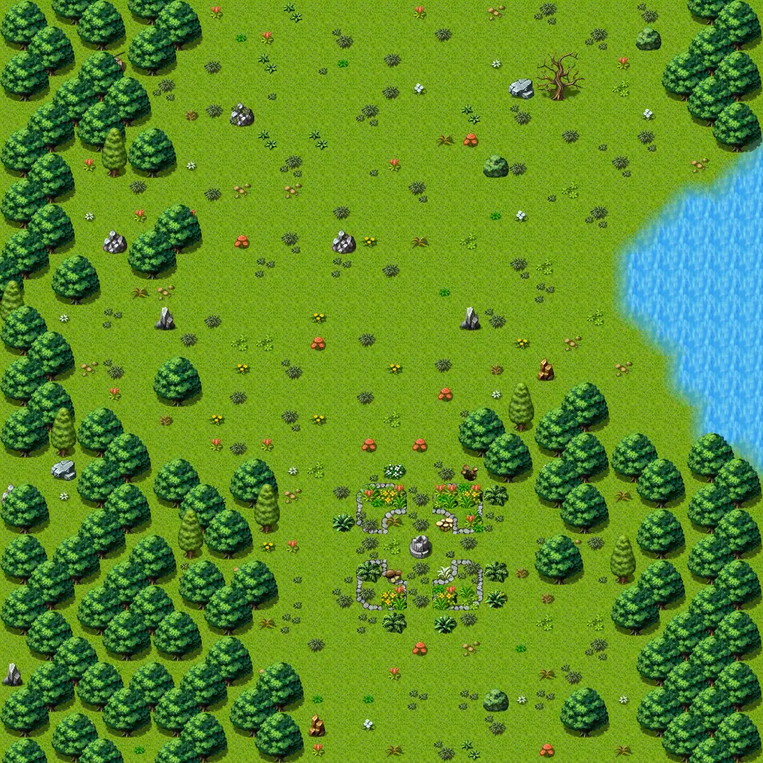

# Guynmart wood 9

30×30 tiles · outdoors · part of [World1](index.md)

<label class="lg lg-spawn"><input type="checkbox" data-t="spawn" checked> Monsters / NPCs</label><label class="lg lg-mapchange"><input type="checkbox" data-t="mapchange" checked> Exit to another map</label><label class="lg lg-container"><input type="checkbox" data-t="container" checked> Container</label><label class="lg lg-sign"><input type="checkbox" data-t="sign" checked> Sign</label><label class="lg lg-rest"><input type="checkbox" data-t="rest" checked> Resting place</label><label class="lg lg-key"><input type="checkbox" data-t="key" checked> Blocked / needs key or quest</label><label class="lg lg-script"><input type="checkbox" data-t="script"> Scripted event</label><label class="lg lg-replace"><input type="checkbox" data-t="replace"> Changes after a quest</label>

## Exits

- [Guynmart](guynmart.md)
- [Guynmart wood 10](guynmart_wood_10.md)
- [Guynmart wood 7](guynmart_wood_7.md)

## Monsters & NPCs here

| Name | HP |
|---|---|
|  | 0 |
| [Shepherd's dog](../monsters/guynmart_dog1.md) | 0 |
| [Shepherd's dog](../monsters/guynmart_dog2.md) | 0 |
| [Shepherd](../monsters/guynmart_shephard.md) | 0 |
| [Sheep](../monsters/guynmart_sheep.md) | 5 |
| [Forest beetle](../monsters/forest_beetle.md) | 14 |
| [Rabid hound](../monsters/rabid_hound.md) | 40 |

<small>Map ID: `guynmart_wood_9` · Data from v0.8.18</small>
