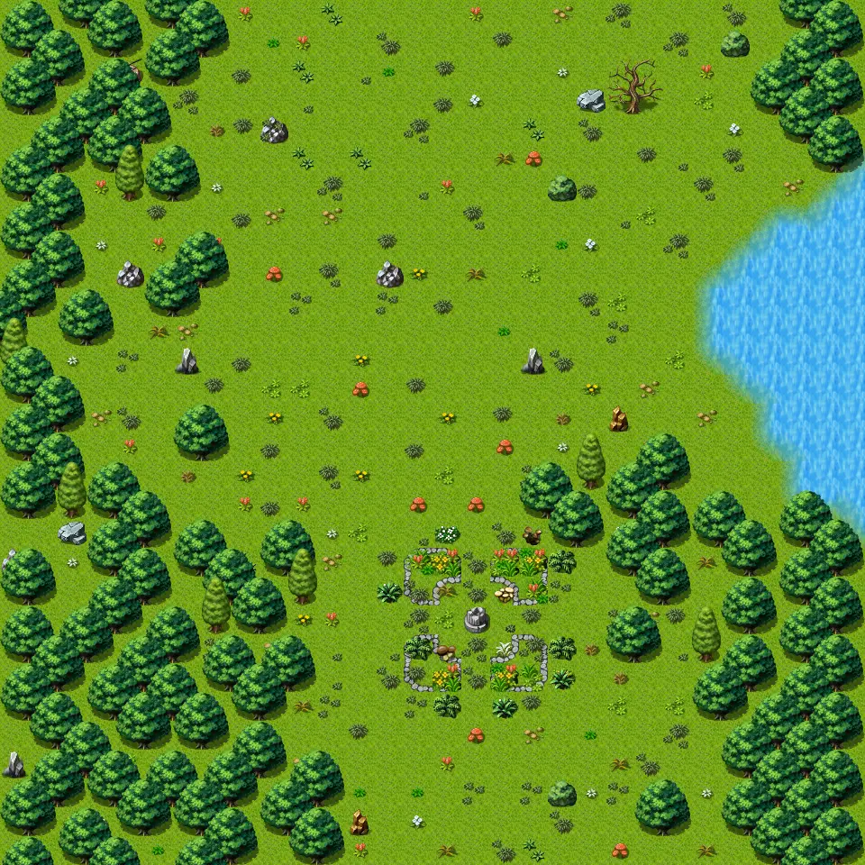

# Guynmart wood 9

| | |
|---|---|
| **Map ID** | `guynmart_wood_9` |
| **Region** | Near Guynmart Castle (other) |
| **Type** | Outdoors |
| **Size** | 30×30 tiles |
| **World map** | [World1](index.md) |
| **Introduced** | [v0.7.2](../versions/0.7.2.md) |
| **NPCs** | 5 |
| **Enemy types** | 2 |
| **Quests** | 1 |

**Guynmart wood 9** is an outdoor map, near Guynmart Castle (other). It has 5 NPCs and 2 kinds of enemy. Exits lead to Guynmart wood 7, Guynmart wood 10, Guynmart.

## Map

<label class="lg"><input type="checkbox" data-t="spawn" checked><b>Red</b>&nbsp;Monsters / NPCs</label><label class="lg"><input type="checkbox" data-t="mapchange" checked><b>Blue</b>&nbsp;Exit to another map</label><label class="lg"><input type="checkbox" data-t="container" checked><b>Yellow</b>&nbsp;Container (click to see contents)</label><label class="lg"><input type="checkbox" data-t="sign" checked><b>Purple</b>&nbsp;Sign</label><label class="lg"><input type="checkbox" data-t="rest" checked><b>Green</b>&nbsp;Resting place</label><label class="lg"><input type="checkbox" data-t="key" checked><b>Orange dashed</b>&nbsp;Blocked until a quest step / item</label><label class="lg"><input type="checkbox" data-t="script"><b>Grey dotted</b>&nbsp;Scripted event</label><label class="lg"><input type="checkbox" data-t="replace"><b>White dotted</b>&nbsp;Changes during a quest</label><label class="lg"><input type="checkbox" data-t="pin" checked><b>Numbers</b>&nbsp;Numbered key points (see the key below the map)</label>

<a class="pin pin-exit" href="#key-1" style="left:50.000%;top:1.667%" title="Exit (north): to [Guynmart wood 7](guynmart_wood_7.md)">1</a><a class="pin pin-exit" href="#key-2" style="left:58.333%;top:98.333%" title="Exit (south): to [Guynmart wood 10](guynmart_wood_10.md)">2</a><a class="pin pin-exit" href="#key-3" style="left:1.667%;top:63.333%" title="Exit (west): to [Guynmart](guynmart.md)">3</a><a id="pin-npc-guynmart_hero" class="pin pin-npc" href="#key-4" style="left:55.000%;top:68.333%" title="(../../monsters/guynmart_hero.md): NPC">4</a><a id="pin-npc-guynmart_sheep" class="pin pin-npc" href="#key-5" style="left:65.000%;top:28.333%" title="[Sheep](../../monsters/sheep1.md#v-guynmart_sheep): NPC">5</a><a id="pin-npc-guynmart_shephard" class="pin pin-npc" href="#key-6" style="left:48.333%;top:25.000%" title="[Shepherd](../../monsters/guynmart_shephard.md): NPC">6</a><a id="pin-npc-guynmart_dog2" class="pin pin-npc" href="#key-7" style="left:75.000%;top:41.667%" title="[Shepherd&#x27;s dog](../../monsters/guynmart_dog1.md#v-guynmart_dog2): NPC">7</a><a id="pin-npc-guynmart_dog1" class="pin pin-npc" href="#key-8" style="left:28.333%;top:35.000%" title="[Shepherd&#x27;s dog](../../monsters/guynmart_dog1.md): NPC">8</a>

??? abstract "Key to the numbers on the map"

    | # | What | Details |
    |---|---|---|
    | 1 | Exit (north) | to [Guynmart wood 7](guynmart_wood_7.md) |
    | 2 | Exit (south) | to [Guynmart wood 10](guynmart_wood_10.md) |
    | 3 | Exit (west) | to [Guynmart](guynmart.md) |
    | 4 |  | NPC |
    | 5 | [Sheep](../monsters/sheep1.md#v-guynmart_sheep) | NPC |
    | 6 | [Shepherd](../monsters/guynmart_shephard.md) | NPC |
    | 7 | [Shepherd's dog](../monsters/guynmart_dog1.md#v-guynmart_dog2) | NPC |
    | 8 | [Shepherd's dog](../monsters/guynmart_dog1.md) | NPC |

Verified against v0.8.18 map data.

## Connections

| Direction | Leads to | Region there | Map # |
|---|---|---|---|
| North | [Guynmart wood 7](guynmart_wood_7.md) | Guynmart Castle | 1 |
| South | [Guynmart wood 10](guynmart_wood_10.md) | Guynmart Castle | 2 |
| West | [Guynmart](guynmart.md) | Guynmart Castle | 3 |

## NPCs

-  (#4)
- [Sheep](../monsters/sheep1.md#v-guynmart_sheep) — can be fought (#5)
- [Shepherd](../monsters/guynmart_shephard.md) (#6)
- [Shepherd's dog](../monsters/guynmart_dog1.md#v-guynmart_dog2) (#7)
- [Shepherd's dog](../monsters/guynmart_dog1.md) (#8)

## Enemies

| Enemy | HP | Damage | Up to | Notes |
|---|---|---|---|---|
| [Forest beetle](../monsters/forest_beetle.md) | 14 | 2–4 | 1 | – |
| [Rabid hound](../monsters/rabid_hound.md) | 40 | 3–9 | 2 | – |

<small>“Up to” is the most that can be alive at once from the spawn areas on this map.</small>

## Quests

- [Roses](../quests/guynmart.md): a scripted event can trigger here from stage 210; a scripted event can trigger here from stage 80

## Version history

| Version | Change |
|---|---|
| [v0.7.2](../versions/0.7.2.md) | Added |
| [v0.8.12.1](../versions/0.8.12.1.md) | Map layout or objects changed |

Verified against v0.8.18 and every earlier release back to v0.7.0 (game data compared release by release).

## Community notes

<small>Written by players, not generated from game data. **Observations**: what players notice in-game · **Lore**: the in-world story · **Trivia**: real-world facts, references, development history · **Theory / speculation**: unconfirmed ideas; may just be unfinished content</small>

### Observations

*No notes yet. Contributions are welcome: [add a note](https://github.com/asdfghjkl628/Andor-s-Trail-Wikiiii/new/main/notes/maps?filename=guynmart_wood_9.md&value=%23%23%20Observations%0A%0A%3C%21--%20what%20players%20notice%20in-game%20--%3E%0A%0A%23%23%20Lore%0A%0A%3C%21--%20the%20in-world%20story%20--%3E%0A%0A%23%23%20Trivia%0A%0A%3C%21--%20real-world%20facts%2C%20references%2C%20development%20history%20--%3E%0A%0A%23%23%20Theory%20/%20speculation%0A%0A%3C%21--%20unconfirmed%20ideas%3B%20may%20just%20be%20unfinished%20content%20--%3E%0A).*

### Lore

*No notes yet. Contributions are welcome: [add a note](https://github.com/asdfghjkl628/Andor-s-Trail-Wikiiii/new/main/notes/maps?filename=guynmart_wood_9.md&value=%23%23%20Observations%0A%0A%3C%21--%20what%20players%20notice%20in-game%20--%3E%0A%0A%23%23%20Lore%0A%0A%3C%21--%20the%20in-world%20story%20--%3E%0A%0A%23%23%20Trivia%0A%0A%3C%21--%20real-world%20facts%2C%20references%2C%20development%20history%20--%3E%0A%0A%23%23%20Theory%20/%20speculation%0A%0A%3C%21--%20unconfirmed%20ideas%3B%20may%20just%20be%20unfinished%20content%20--%3E%0A).*

### Trivia

*No notes yet. Contributions are welcome: [add a note](https://github.com/asdfghjkl628/Andor-s-Trail-Wikiiii/new/main/notes/maps?filename=guynmart_wood_9.md&value=%23%23%20Observations%0A%0A%3C%21--%20what%20players%20notice%20in-game%20--%3E%0A%0A%23%23%20Lore%0A%0A%3C%21--%20the%20in-world%20story%20--%3E%0A%0A%23%23%20Trivia%0A%0A%3C%21--%20real-world%20facts%2C%20references%2C%20development%20history%20--%3E%0A%0A%23%23%20Theory%20/%20speculation%0A%0A%3C%21--%20unconfirmed%20ideas%3B%20may%20just%20be%20unfinished%20content%20--%3E%0A).*

### Theory / speculation

*No notes yet. Contributions are welcome: [add a note](https://github.com/asdfghjkl628/Andor-s-Trail-Wikiiii/new/main/notes/maps?filename=guynmart_wood_9.md&value=%23%23%20Observations%0A%0A%3C%21--%20what%20players%20notice%20in-game%20--%3E%0A%0A%23%23%20Lore%0A%0A%3C%21--%20the%20in-world%20story%20--%3E%0A%0A%23%23%20Trivia%0A%0A%3C%21--%20real-world%20facts%2C%20references%2C%20development%20history%20--%3E%0A%0A%23%23%20Theory%20/%20speculation%0A%0A%3C%21--%20unconfirmed%20ideas%3B%20may%20just%20be%20unfinished%20content%20--%3E%0A).*

??? info "Technical information"

    | | |
    |---|---|
    | Map ID | `guynmart_wood_9` |
    | File | `res/xml/guynmart_wood_9.tmx` |
    | Size | 30×30 tiles (960×960 px) |
    | outdoors property | 1 |
    | Layers drawn | ground, objects, above |
    | Tilesets | map_bed_1, map_border_1, map_bridge_1, map_bridge_2, map_broken_1, map_cavewall_1, map_cavewall_2, map_cavewall_3, map_cavewall_4, map_chair_table_1, map_chair_table_2, map_crate_1, map_cupboard_1, map_curtain_1, map_dynamic_placeholders, map_entrance_1, map_entrance_2, map_fence_1, map_fence_2, map_fence_3, map_fence_4, map_ground_1, map_ground_2, map_ground_3, map_ground_4, map_ground_5, map_ground_6, map_ground_7, map_ground_8, map_guynmart, map_house_1, map_house_2, map_indoor_1, map_indoor_2, map_kitchen_1, map_outdoor_1, map_pillar_1, map_pillar_2, map_plant_1, map_plant_2, map_rock_1, map_rock_2, map_roof_1, map_roof_2, map_roof_3, map_shop_1, map_sign_ladder_1, map_table_1, map_trail_1, map_transition_1, map_transition_2, map_transition_3, map_transition_4, map_transition_5, map_tree_1, map_tree_2, map_wall_1, map_wall_2, map_wall_3, map_wall_4, map_window_1, map_window_2 |
    | Map objects | spawn: 7, mapchange: 3, script: 2, replace: 1 |
    | World map position | segment `world1`, x 117, y 160 |

<small>Data from v0.8.18</small>
