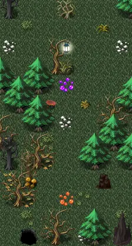

# Haunted forest12

7×13 tiles · outdoors · part of [World1](index.md)

<label class="lg lg-spawn"><input type="checkbox" data-t="spawn" checked> Monsters / NPCs</label><label class="lg lg-mapchange"><input type="checkbox" data-t="mapchange" checked> Exit to another map</label><label class="lg lg-container"><input type="checkbox" data-t="container" checked> Container</label><label class="lg lg-sign"><input type="checkbox" data-t="sign" checked> Sign</label><label class="lg lg-rest"><input type="checkbox" data-t="rest" checked> Resting place</label><label class="lg lg-key"><input type="checkbox" data-t="key" checked> Blocked / needs key or quest</label><label class="lg lg-script"><input type="checkbox" data-t="script"> Scripted event</label><label class="lg lg-replace"><input type="checkbox" data-t="replace"> Changes after a quest</label>

## Exits

- [Haunted cemetery1](haunted_cemetery1.md)
- [Haunted forest13](haunted_forest13.md)
- [Haunted forest7](haunted_forest7.md)
- [Haunted forest coffin2](haunted_forest_coffin2.md)
- [Haunted forest way to house1](haunted_forest_way_to_house1.md)

## Monsters & NPCs here

| Name | HP |
|---|---|
| [Graveyard gatekeeper](../monsters/graveyard_gatekeeper.md) | 169 |
| [Musty prowler](../monsters/musty_prowler.md) | 177 |

<small>Map ID: `haunted_forest12` · Data from v0.8.18</small>
