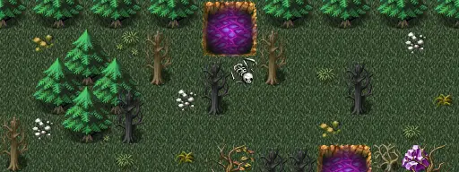

# Haunted forest15

16×6 tiles · outdoors · part of [World1](index.md)

<label class="lg"><input type="checkbox" data-t="spawn" checked><b>Red</b>&nbsp;Monsters / NPCs</label><label class="lg"><input type="checkbox" data-t="mapchange" checked><b>Blue</b>&nbsp;Exit to another map</label><label class="lg"><input type="checkbox" data-t="container" checked><b>Yellow</b>&nbsp;Container (click to see contents)</label><label class="lg"><input type="checkbox" data-t="sign" checked><b>Purple</b>&nbsp;Sign</label><label class="lg"><input type="checkbox" data-t="rest" checked><b>Green</b>&nbsp;Resting place</label><label class="lg"><input type="checkbox" data-t="key" checked><b>Orange dashed</b>&nbsp;Blocked until a quest step / item</label><label class="lg"><input type="checkbox" data-t="script"><b>Grey dotted</b>&nbsp;Scripted event</label><label class="lg"><input type="checkbox" data-t="replace"><b>White dotted</b>&nbsp;Changes during a quest</label>

## Exits

- [Haunted forest14](haunted_forest14.md)
- [Haunted forest16](haunted_forest16.md)
- [Haunted forest19](haunted_forest19.md)

## Monsters & NPCs here

| Name | HP |
|---|---|
| [Forest hunter](../monsters/forest_hunter.md) | 90 |
| [Graveyard gatekeeper](../monsters/graveyard_gatekeeper.md) | 169 |
| [Skeletal raider](../monsters/skeletal_raider.md) | 227 |

<small>Map ID: `haunted_forest15` · Data from v0.8.18</small>
