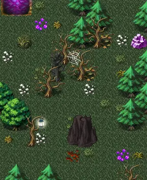

# Haunted forest22

9×11 tiles · outdoors · part of [World1](index.md)

<label class="lg lg-spawn"><input type="checkbox" data-t="spawn" checked> Monsters / NPCs</label><label class="lg lg-mapchange"><input type="checkbox" data-t="mapchange" checked> Exit to another map</label><label class="lg lg-container"><input type="checkbox" data-t="container" checked> Container</label><label class="lg lg-sign"><input type="checkbox" data-t="sign" checked> Sign</label><label class="lg lg-rest"><input type="checkbox" data-t="rest" checked> Resting place</label><label class="lg lg-key"><input type="checkbox" data-t="key" checked> Blocked / needs key or quest</label><label class="lg lg-script"><input type="checkbox" data-t="script"> Scripted event</label><label class="lg lg-replace"><input type="checkbox" data-t="replace"> Changes after a quest</label>

## Exits

- [Haunted forest21](haunted_forest21.md)
- [Haunted forest23](haunted_forest23.md)
- [Haunted forest way to house5](haunted_forest_way_to_house5.md)
- [Vilegard sullengard filler1](vilegard_sullengard_filler1.md)

## Monsters & NPCs here

| Name | HP |
|---|---|
| [Musty prowler](../monsters/musty_prowler.md) | 177 |
| [Grieveless dead](../monsters/grieveless_dead.md) | 189 |
| [Angel of death](../monsters/angel_death.md) | 198 |
| [Skeletal raider](../monsters/skeletal_raider.md) | 227 |

<small>Map ID: `haunted_forest22` · Data from v0.8.18</small>
