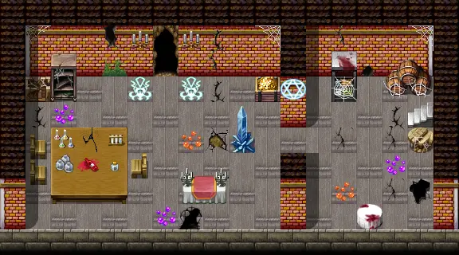
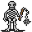

# Haunted house basement

18×10 tiles

<label class="lg"><input type="checkbox" data-t="spawn" checked><b>Red</b>&nbsp;Monsters / NPCs</label><label class="lg"><input type="checkbox" data-t="mapchange" checked><b>Blue</b>&nbsp;Exit to another map</label><label class="lg"><input type="checkbox" data-t="container" checked><b>Yellow</b>&nbsp;Container (click to see contents)</label><label class="lg"><input type="checkbox" data-t="sign" checked><b>Purple</b>&nbsp;Sign</label><label class="lg"><input type="checkbox" data-t="rest" checked><b>Green</b>&nbsp;Resting place</label><label class="lg"><input type="checkbox" data-t="key" checked><b>Orange dashed</b>&nbsp;Blocked until a quest step / item</label><label class="lg"><input type="checkbox" data-t="script"><b>Grey dotted</b>&nbsp;Scripted event</label><label class="lg"><input type="checkbox" data-t="replace"><b>White dotted</b>&nbsp;Changes during a quest</label>

## Containers

<b>Container 1</b><ul><li><a href="../../items/gold/">Gold coins</a> <small>100% · ×1994 to 3452</small></li><li><a href="../../items/axe_black2/">Reinforced black axe</a> <small>100%</small></li></ul>

## Exits

- [Haunted house](haunted_house.md)
- [Haunted underground 1](haunted_underground_1.md)

## Monsters & NPCs here

| Name | HP |
|---|---|
| [Death wrecker](../monsters/death_wrecker.md) | 253 |
| [Mindless disgrace](../monsters/mindless_disgrace.md) | 275 |
| [Benzimos](../monsters/haunted_benzimos.md) | 291 |

<small>Map ID: `haunted_house_basement` · Data from v0.8.18</small>
