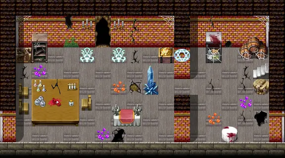

# Haunted house basement

| | |
|---|---|
| **Map ID** | `haunted_house_basement` |
| **Type** | Indoors / underground |
| **Size** | 18×10 tiles |
| **Introduced** | [v0.8.3](../versions/0.8.3.md) |
| **Enemy types** | 3 |
| **Quests** | 1 |
| **Containers** | 1 |

**Haunted house basement** is an indoor map. It has no NPCs and 3 kinds of enemy. Exits lead to Haunted house, Haunted underground 1.

## Map

<label class="lg"><input type="checkbox" data-t="spawn" checked><b>Red</b>&nbsp;Monsters / NPCs</label><label class="lg"><input type="checkbox" data-t="mapchange" checked><b>Blue</b>&nbsp;Exit to another map</label><label class="lg"><input type="checkbox" data-t="container" checked><b>Yellow</b>&nbsp;Container (click to see contents)</label><label class="lg"><input type="checkbox" data-t="sign" checked><b>Purple</b>&nbsp;Sign</label><label class="lg"><input type="checkbox" data-t="rest" checked><b>Green</b>&nbsp;Resting place</label><label class="lg"><input type="checkbox" data-t="key" checked><b>Orange dashed</b>&nbsp;Blocked until a quest step / item</label><label class="lg"><input type="checkbox" data-t="script"><b>Grey dotted</b>&nbsp;Scripted event</label><label class="lg"><input type="checkbox" data-t="replace"><b>White dotted</b>&nbsp;Changes during a quest</label><label class="lg"><input type="checkbox" data-t="pin" checked><b>Numbers</b>&nbsp;Numbered key points (see the key below the map)</label>

<a class="pin pin-exit" href="#key-1" style="left:91.667%;top:45.000%" title="Exit (east): to [Haunted house](haunted_house.md)">1</a><a class="pin pin-exit" href="#key-2" style="left:36.111%;top:25.000%" title="Exit (stairs / passage): to [Haunted underground 1](haunted_underground_1.md)">2</a><a class="pin pin-container" href="#key-3" style="left:58.333%;top:35.000%" title="Container 1: Gold coins, Reinforced black axe">3</a><a class="pin pin-script" href="#key-4" style="left:86.111%;top:50.000%" title="Quest trigger: Scripted event: advances the quest: The Dead are Walking to stage 50 (“In the haunted house&#x27;s basement, I discovered Benzimos (and he discovered me) while chanting some kind of ritual. He must be stopped.”)">4</a><a class="pin pin-script" href="#key-5" style="left:69.444%;top:55.000%" title="Quest trigger: Scripted event: advances the quest: The Dead are Walking to stage 60 (“Now that Benzimos is &quot;dead&quot; again, I should return to Vilegard and speak with Gabriel.”)">5</a>

??? abstract "Key to the numbers on the map"

    | # | What | Details |
    |---|---|---|
    | 1 | Exit (east) | to [Haunted house](haunted_house.md) |
    | 2 | Exit (stairs / passage) | to [Haunted underground 1](haunted_underground_1.md) |
    | 3 | Container 1 | Gold coins, Reinforced black axe |
    | 4 | Quest trigger | Scripted event: advances the quest: The Dead are Walking to stage 50 (“In the haunted house's basement, I discovered Benzimos (and he discovered me) while chanting some kind of ritual. He must be stopped.”) |
    | 5 | Quest trigger | Scripted event: advances the quest: The Dead are Walking to stage 60 (“Now that Benzimos is "dead" again, I should return to Vilegard and speak with Gabriel.”) |

Verified against v0.8.18 map data.

## Connections

| Direction | Leads to | Region there | Map # |
|---|---|---|---|
| East | [Haunted house](haunted_house.md) | – | 1 |
| Stairs / passage | [Haunted underground 1](haunted_underground_1.md) | – | 2 |

## Enemies

| Enemy | HP | Damage | Up to | Notes |
|---|---|---|---|---|
| [Death wrecker](../monsters/death_wrecker.md) | 253 | 21–24 | 3 | – |
| [Mindless disgrace](../monsters/mindless_disgrace.md) | 275 | 13–17 | 5 | – |
| [Benzimos](../monsters/haunted_benzimos.md) | 291 | 19–20 | 1 | – |

<small>“Up to” is the most that can be alive at once from the spawn areas on this map.</small>

## Items & containers

<b>Container 1</b><ul><li><a href="../../items/gold/">Gold coins</a> <small>100% · ×1994 to 3452</small></li><li><a href="../../items/axe_black2/">Reinforced black axe</a> <small>100%</small></li></ul>

## Quests

- [The Dead are Walking](../quests/dead_walking.md): something on this map advances it; stepping on a trigger here sets stage 50; stepping on a trigger here sets stage 60

## Points of interest

- **Quest trigger** (#4): Scripted event: advances the quest: The Dead are Walking to stage 50 (“In the haunted house's basement, I discovered Benzimos (and he discovered me) while chanting some kind of ritual. He must be stopped.”)
- **Quest trigger** (#5): Scripted event: advances the quest: The Dead are Walking to stage 60 (“Now that Benzimos is "dead" again, I should return to Vilegard and speak with Gabriel.”)

## Version history

| Version | Change |
|---|---|
| [v0.8.3](../versions/0.8.3.md) | Added |

Verified against v0.8.18 and every earlier release back to v0.7.0 (game data compared release by release).

## Community notes

<small>Written by players, not generated from game data. **Observations**: what players notice in-game · **Lore**: the in-world story · **Trivia**: real-world facts, references, development history · **Theory / speculation**: unconfirmed ideas; may just be unfinished content</small>

### Observations

*No notes yet. Contributions are welcome: [add a note](https://github.com/asdfghjkl628/Andor-s-Trail-Wikiiii/new/main/notes/maps?filename=haunted_house_basement.md&value=%23%23%20Observations%0A%0A%3C%21--%20what%20players%20notice%20in-game%20--%3E%0A%0A%23%23%20Lore%0A%0A%3C%21--%20the%20in-world%20story%20--%3E%0A%0A%23%23%20Trivia%0A%0A%3C%21--%20real-world%20facts%2C%20references%2C%20development%20history%20--%3E%0A%0A%23%23%20Theory%20/%20speculation%0A%0A%3C%21--%20unconfirmed%20ideas%3B%20may%20just%20be%20unfinished%20content%20--%3E%0A).*

### Lore

*No notes yet. Contributions are welcome: [add a note](https://github.com/asdfghjkl628/Andor-s-Trail-Wikiiii/new/main/notes/maps?filename=haunted_house_basement.md&value=%23%23%20Observations%0A%0A%3C%21--%20what%20players%20notice%20in-game%20--%3E%0A%0A%23%23%20Lore%0A%0A%3C%21--%20the%20in-world%20story%20--%3E%0A%0A%23%23%20Trivia%0A%0A%3C%21--%20real-world%20facts%2C%20references%2C%20development%20history%20--%3E%0A%0A%23%23%20Theory%20/%20speculation%0A%0A%3C%21--%20unconfirmed%20ideas%3B%20may%20just%20be%20unfinished%20content%20--%3E%0A).*

### Trivia

*No notes yet. Contributions are welcome: [add a note](https://github.com/asdfghjkl628/Andor-s-Trail-Wikiiii/new/main/notes/maps?filename=haunted_house_basement.md&value=%23%23%20Observations%0A%0A%3C%21--%20what%20players%20notice%20in-game%20--%3E%0A%0A%23%23%20Lore%0A%0A%3C%21--%20the%20in-world%20story%20--%3E%0A%0A%23%23%20Trivia%0A%0A%3C%21--%20real-world%20facts%2C%20references%2C%20development%20history%20--%3E%0A%0A%23%23%20Theory%20/%20speculation%0A%0A%3C%21--%20unconfirmed%20ideas%3B%20may%20just%20be%20unfinished%20content%20--%3E%0A).*

### Theory / speculation

*No notes yet. Contributions are welcome: [add a note](https://github.com/asdfghjkl628/Andor-s-Trail-Wikiiii/new/main/notes/maps?filename=haunted_house_basement.md&value=%23%23%20Observations%0A%0A%3C%21--%20what%20players%20notice%20in-game%20--%3E%0A%0A%23%23%20Lore%0A%0A%3C%21--%20the%20in-world%20story%20--%3E%0A%0A%23%23%20Trivia%0A%0A%3C%21--%20real-world%20facts%2C%20references%2C%20development%20history%20--%3E%0A%0A%23%23%20Theory%20/%20speculation%0A%0A%3C%21--%20unconfirmed%20ideas%3B%20may%20just%20be%20unfinished%20content%20--%3E%0A).*

??? info "Technical information"

    | | |
    |---|---|
    | Map ID | `haunted_house_basement` |
    | File | `res/xml/haunted_house_basement.tmx` |
    | Size | 18×10 tiles (576×320 px) |
    | outdoors property | – |
    | Layers drawn | ground, objects, above, top |
    | Tilesets | map_bed_1, map_border_1, map_bridge_1, map_bridge_2, map_broken_1, map_cavewall_1, map_cavewall_2, map_cavewall_3, map_cavewall_4, map_chair_table_1, map_chair_table_2, map_crate_1, map_cupboard_1, map_curtain_1, map_entrance_1, map_entrance_2, map_fence_1, map_fence_2, map_fence_3, map_fence_4, map_ground_1, map_ground_2, map_ground_3, map_ground_4, map_ground_5, map_ground_6, map_ground_7, map_ground_8, map_house_1, map_house_2, map_indoor_1, map_indoor_2, map_kitchen_1, map_outdoor_1, map_pillar_1, map_pillar_2, map_plant_1, map_plant_2, map_rock_1, map_rock_2, map_roof_1, map_roof_2, map_roof_3, map_shop_1, map_sign_ladder_1, map_table_1, map_trail_1, map_transition_1, map_transition_2, map_transition_3, map_transition_4, map_transition_5, map_tree_1, map_tree_2, map_wall_1, map_wall_2, map_wall_3, map_wall_4, map_window_1, map_window_2 |
    | Map objects | spawn: 6, mapchange: 2, script: 2, container: 1 |
    | World map position | – |

<small>Data from v0.8.18</small>
