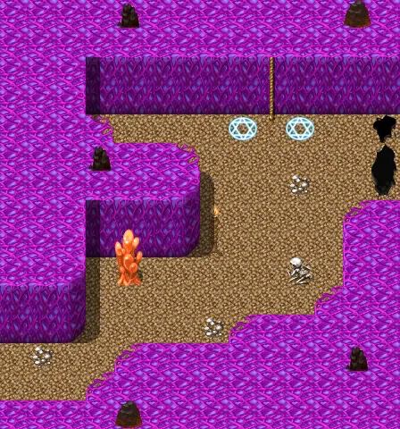

# Haunted underground 5

14×15 tiles · part of [Haunted underground](index.md)

<label class="lg"><input type="checkbox" data-t="spawn" checked><b>Red</b>&nbsp;Monsters / NPCs</label><label class="lg"><input type="checkbox" data-t="mapchange" checked><b>Blue</b>&nbsp;Exit to another map</label><label class="lg"><input type="checkbox" data-t="container" checked><b>Yellow</b>&nbsp;Container (click to see contents)</label><label class="lg"><input type="checkbox" data-t="sign" checked><b>Purple</b>&nbsp;Sign</label><label class="lg"><input type="checkbox" data-t="rest" checked><b>Green</b>&nbsp;Resting place</label><label class="lg"><input type="checkbox" data-t="key" checked><b>Orange dashed</b>&nbsp;Blocked until a quest step / item</label><label class="lg"><input type="checkbox" data-t="script"><b>Grey dotted</b>&nbsp;Scripted event</label><label class="lg"><input type="checkbox" data-t="replace"><b>White dotted</b>&nbsp;Changes during a quest</label>

## Exits

- [Haunted cemetery1](haunted_cemetery1.md)
- [Haunted underground 4](haunted_underground_4.md)

## Monsters & NPCs here

| Name | HP |
|---|---|
| [Three-eyed bat](../monsters/three_eyed_bat.md) | 108 |
| [Sleepless taint](../monsters/sleepless_taint.md) | 180 |
| [Death wrecker](../monsters/death_wrecker.md) | 253 |
| [Sinister wraith](../monsters/sinister_wraith.md) | 255 |

<small>Map ID: `haunted_underground_5` · Data from v0.8.18</small>
