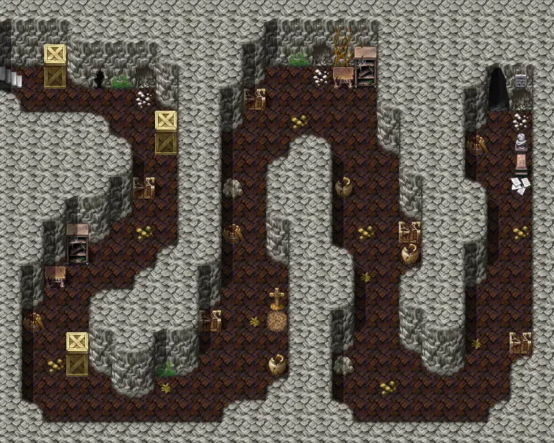

# Hauntedhouse3

25×20 tiles

<label class="lg lg-spawn"><input type="checkbox" data-t="spawn" checked> Monsters / NPCs</label><label class="lg lg-mapchange"><input type="checkbox" data-t="mapchange" checked> Exit to another map</label><label class="lg lg-container"><input type="checkbox" data-t="container" checked> Container</label><label class="lg lg-sign"><input type="checkbox" data-t="sign" checked> Sign</label><label class="lg lg-rest"><input type="checkbox" data-t="rest" checked> Resting place</label><label class="lg lg-key"><input type="checkbox" data-t="key" checked> Blocked / needs key or quest</label><label class="lg lg-script"><input type="checkbox" data-t="script"> Scripted event</label><label class="lg lg-replace"><input type="checkbox" data-t="replace"> Changes after a quest</label>

## Exits

- [Hauntedhouse2](hauntedhouse2.md)
- [Hauntedhouse4](hauntedhouse4.md)

## Monsters & NPCs here

| Name | HP |
|---|---|
| [Spectre](../monsters/spectre.md) | 15 |
| [Lost soul](../monsters/lost_soul.md) | 15 |
| [Shade](../monsters/shade.md) | 16 |
| [Ghostly visage](../monsters/ghostly_visage.md) | 16 |
| [Apparition](../monsters/apparition.md) | 17 |
| [Haunting](../monsters/haunting.md) | 31 |
| [Skeleton](../monsters/skeleton.md) | 35 |
| [Young gargoyle](../monsters/young_gargoyle.md) | 35 |
| [Skeletal warrior](../monsters/skeletal_warrior.md) | 52 |

<small>Map ID: `hauntedhouse3` · Data from v0.8.18</small>
