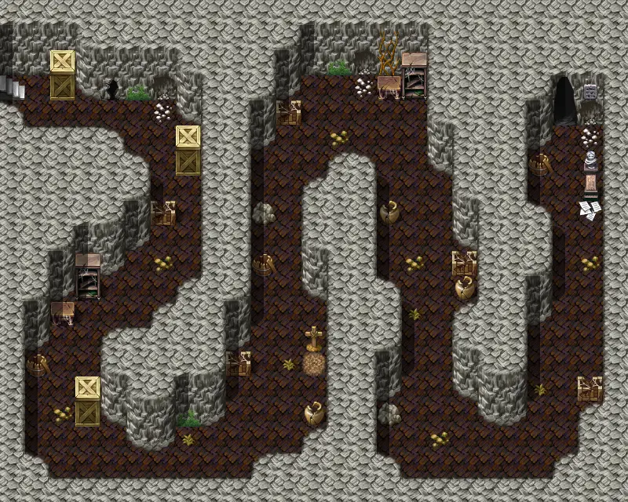

# Hauntedhouse 3

| | |
|---|---|
| **Map ID** | `hauntedhouse3` |
| **Type** | Indoors / underground |
| **Size** | 25×20 tiles |
| **Introduced** | v0.7.0 or earlier |
| **Enemy types** | 9 |
| **Quests** | 0 |

**Hauntedhouse 3** is an indoor map. It has no NPCs and 9 kinds of enemy. Exits lead to Hauntedhouse 2, Hauntedhouse 4.

## Map

<label class="lg"><input type="checkbox" data-t="spawn" checked><b>Red</b>&nbsp;Monsters / NPCs</label><label class="lg"><input type="checkbox" data-t="mapchange" checked><b>Blue</b>&nbsp;Exit to another map</label><label class="lg"><input type="checkbox" data-t="container" checked><b>Yellow</b>&nbsp;Container (click to see contents)</label><label class="lg"><input type="checkbox" data-t="sign" checked><b>Purple</b>&nbsp;Sign</label><label class="lg"><input type="checkbox" data-t="rest" checked><b>Green</b>&nbsp;Resting place</label><label class="lg"><input type="checkbox" data-t="key" checked><b>Orange dashed</b>&nbsp;Blocked until a quest step / item</label><label class="lg"><input type="checkbox" data-t="script"><b>Grey dotted</b>&nbsp;Scripted event</label><label class="lg"><input type="checkbox" data-t="replace"><b>White dotted</b>&nbsp;Changes during a quest</label><label class="lg"><input type="checkbox" data-t="pin" checked><b>Numbers</b>&nbsp;Numbered key points (see the key below the map)</label>

<a class="pin pin-exit" href="#key-1" style="left:2.000%;top:17.500%" title="Exit (west): to [Hauntedhouse 2](hauntedhouse2.md)">1</a><a class="pin pin-exit" href="#key-2" style="left:90.000%;top:22.500%" title="Exit (stairs / passage): to [Hauntedhouse 4](hauntedhouse4.md)">2</a><a class="pin pin-sign" href="#key-3" style="left:94.000%;top:42.500%" title="Sign: “Perched under the statue, you find some papers with drawings of what looks like skeletons. The drawings look like they were made by a child, and you start to wonder how they could have ended up in a place such as this.”">3</a><a class="pin pin-sign" href="#key-4" style="left:50.000%;top:72.500%" title="Sign: “Someone has written the words &#x27;Rest&#x27; and &#x27;Shadow&#x27; on the cross, in what looks like dried blood.”">4</a>

??? abstract "Key to the numbers on the map"

    | # | What | Details |
    |---|---|---|
    | 1 | Exit (west) | to [Hauntedhouse 2](hauntedhouse2.md) |
    | 2 | Exit (stairs / passage) | to [Hauntedhouse 4](hauntedhouse4.md) |
    | 3 | Sign | “Perched under the statue, you find some papers with drawings of what looks like skeletons. The drawings look like they were made by a child, and you start to wonder how they could have ended up in a place such as this.” |
    | 4 | Sign | “Someone has written the words 'Rest' and 'Shadow' on the cross, in what looks like dried blood.” |

Verified against v0.8.18 map data.

## Connections

| Direction | Leads to | Region there | Map # |
|---|---|---|---|
| West | [Hauntedhouse 2](hauntedhouse2.md) | – | 1 |
| Stairs / passage | [Hauntedhouse 4](hauntedhouse4.md) | – | 2 |

## Enemies

| Enemy | HP | Damage | Up to | Notes |
|---|---|---|---|---|
| [Spectre](../monsters/spectre.md) | 15 | 1–5 | 2 | shares spawn with Ghostly visage |
| [Lost soul](../monsters/lost_soul.md) | 15 | 1–2 | 3 | – |
| [Shade](../monsters/shade.md) | 16 | 1–4 | 1 | shares spawn with Apparition, Young gargoyle |
| [Ghostly visage](../monsters/ghostly_visage.md) | 16 | 1–4 | 2 | shares spawn with Spectre |
| [Apparition](../monsters/apparition.md) | 17 | 1–5 | 1 | shares spawn with Shade, Young gargoyle |
| [Haunting](../monsters/haunting.md) | 31 | 1–5 | 4 | – |
| [Young gargoyle](../monsters/young_gargoyle.md) | 35 | 2–5 | 1 | shares spawn with Apparition, Shade |
| [Skeleton](../monsters/skeleton.md) | 35 | 1–4 | 2 | shares spawn with Skeletal warrior |
| [Skeletal warrior](../monsters/skeletal_warrior.md) | 52 | 1–3 | 2 | shares spawn with Skeleton |

<small>“Up to” is the most that can be alive at once from the spawn areas on this map.</small>

## Points of interest

- **Sign** (#3): “Perched under the statue, you find some papers with drawings of what looks like skeletons. The drawings look like they were made by a child, and you start to wonder how they could have ended up in a place such as this.”
- **Sign** (#4): “Someone has written the words 'Rest' and 'Shadow' on the cross, in what looks like dried blood.”

## Version history

| Version | Change |
|---|---|
| [v0.7.0](../versions/0.7.0.md) | Present in v0.7.0 (earliest release tracked) |
| [v0.7.1](../versions/0.7.1.md) | Map layout or objects changed |
| [v0.7.2](../versions/0.7.2.md) | Map layout or objects changed |
| [v0.8.2](../versions/0.8.2.md) | Map layout or objects changed |

Verified against v0.8.18 and every earlier release back to v0.7.0 (game data compared release by release).

## Community notes

<small>Written by players, not generated from game data. **Observations**: what players notice in-game · **Lore**: the in-world story · **Trivia**: real-world facts, references, development history · **Theory / speculation**: unconfirmed ideas; may just be unfinished content</small>

### Observations

*No notes yet. Contributions are welcome: [add a note](https://github.com/asdfghjkl628/Andor-s-Trail-Wikiiii/new/main/notes/maps?filename=hauntedhouse3.md&value=%23%23%20Observations%0A%0A%3C%21--%20what%20players%20notice%20in-game%20--%3E%0A%0A%23%23%20Lore%0A%0A%3C%21--%20the%20in-world%20story%20--%3E%0A%0A%23%23%20Trivia%0A%0A%3C%21--%20real-world%20facts%2C%20references%2C%20development%20history%20--%3E%0A%0A%23%23%20Theory%20/%20speculation%0A%0A%3C%21--%20unconfirmed%20ideas%3B%20may%20just%20be%20unfinished%20content%20--%3E%0A).*

### Lore

*No notes yet. Contributions are welcome: [add a note](https://github.com/asdfghjkl628/Andor-s-Trail-Wikiiii/new/main/notes/maps?filename=hauntedhouse3.md&value=%23%23%20Observations%0A%0A%3C%21--%20what%20players%20notice%20in-game%20--%3E%0A%0A%23%23%20Lore%0A%0A%3C%21--%20the%20in-world%20story%20--%3E%0A%0A%23%23%20Trivia%0A%0A%3C%21--%20real-world%20facts%2C%20references%2C%20development%20history%20--%3E%0A%0A%23%23%20Theory%20/%20speculation%0A%0A%3C%21--%20unconfirmed%20ideas%3B%20may%20just%20be%20unfinished%20content%20--%3E%0A).*

### Trivia

*No notes yet. Contributions are welcome: [add a note](https://github.com/asdfghjkl628/Andor-s-Trail-Wikiiii/new/main/notes/maps?filename=hauntedhouse3.md&value=%23%23%20Observations%0A%0A%3C%21--%20what%20players%20notice%20in-game%20--%3E%0A%0A%23%23%20Lore%0A%0A%3C%21--%20the%20in-world%20story%20--%3E%0A%0A%23%23%20Trivia%0A%0A%3C%21--%20real-world%20facts%2C%20references%2C%20development%20history%20--%3E%0A%0A%23%23%20Theory%20/%20speculation%0A%0A%3C%21--%20unconfirmed%20ideas%3B%20may%20just%20be%20unfinished%20content%20--%3E%0A).*

### Theory / speculation

*No notes yet. Contributions are welcome: [add a note](https://github.com/asdfghjkl628/Andor-s-Trail-Wikiiii/new/main/notes/maps?filename=hauntedhouse3.md&value=%23%23%20Observations%0A%0A%3C%21--%20what%20players%20notice%20in-game%20--%3E%0A%0A%23%23%20Lore%0A%0A%3C%21--%20the%20in-world%20story%20--%3E%0A%0A%23%23%20Trivia%0A%0A%3C%21--%20real-world%20facts%2C%20references%2C%20development%20history%20--%3E%0A%0A%23%23%20Theory%20/%20speculation%0A%0A%3C%21--%20unconfirmed%20ideas%3B%20may%20just%20be%20unfinished%20content%20--%3E%0A).*

??? info "Technical information"

    | | |
    |---|---|
    | Map ID | `hauntedhouse3` |
    | File | `res/xml/hauntedhouse3.tmx` |
    | Size | 25×20 tiles (800×640 px) |
    | outdoors property | – |
    | Layers drawn | ground, objects, above |
    | Tilesets | map_bed_1, map_border_1, map_bridge_1, map_bridge_2, map_broken_1, map_cavewall_1, map_cavewall_2, map_cavewall_3, map_cavewall_4, map_chair_table_1, map_chair_table_2, map_crate_1, map_cupboard_1, map_curtain_1, map_entrance_1, map_entrance_2, map_fence_1, map_fence_2, map_fence_3, map_fence_4, map_ground_1, map_ground_2, map_ground_3, map_ground_4, map_ground_5, map_ground_6, map_ground_7, map_ground_8, map_house_1, map_house_2, map_indoor_1, map_indoor_2, map_kitchen_1, map_outdoor_1, map_pillar_1, map_pillar_2, map_plant_1, map_plant_2, map_rock_1, map_rock_2, map_roof_1, map_roof_2, map_roof_3, map_shop_1, map_sign_ladder_1, map_table_1, map_trail_1, map_transition_1, map_transition_2, map_transition_3, map_transition_4, map_transition_5, map_tree_1, map_tree_2, map_wall_1, map_wall_2, map_wall_3, map_wall_4, map_window_1, map_window_2 |
    | Map objects | spawn: 7, mapchange: 2, sign: 2 |
    | World map position | – |

<small>Data from v0.8.18</small>
