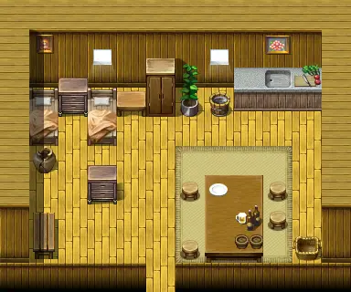
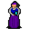
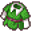

# Home

| | |
|---|---|
| **Map ID** | `home` |
| **Region** | In Crossglen (settlement) |
| **Type** | Indoors / underground |
| **Size** | 12×10 tiles |
| **Introduced** | v0.7.0 or earlier |
| **NPCs** | 4 |
| **Quests** | 8 |
| **Containers** | 2 |

**Home** is an indoor map, in Crossglen (settlement). It has 4 NPCs, and no enemies. Exits lead to Crossglen.

## Map

<label class="lg"><input type="checkbox" data-t="spawn" checked><b>Red</b>&nbsp;Monsters / NPCs</label><label class="lg"><input type="checkbox" data-t="mapchange" checked><b>Blue</b>&nbsp;Exit to another map</label><label class="lg"><input type="checkbox" data-t="container" checked><b>Yellow</b>&nbsp;Container (click to see contents)</label><label class="lg"><input type="checkbox" data-t="sign" checked><b>Purple</b>&nbsp;Sign</label><label class="lg"><input type="checkbox" data-t="rest" checked><b>Green</b>&nbsp;Resting place</label><label class="lg"><input type="checkbox" data-t="key" checked><b>Orange dashed</b>&nbsp;Blocked until a quest step / item</label><label class="lg"><input type="checkbox" data-t="script"><b>Grey dotted</b>&nbsp;Scripted event</label><label class="lg"><input type="checkbox" data-t="replace"><b>White dotted</b>&nbsp;Changes during a quest</label><label class="lg"><input type="checkbox" data-t="pin" checked><b>Numbers</b>&nbsp;Numbered key points (see the key below the map)</label>

<a class="pin pin-exit" href="#key-1" style="left:45.833%;top:95.000%" title="Exit (south): to [Crossglen](crossglen.md)">1</a><a id="pin-npc-ratdom_rat" class="pin pin-npc" href="#key-2" style="left:12.500%;top:45.000%" title="[Clevred](../../monsters/ratdom_rat.md): 1 quest">2</a><a id="pin-npc-ratdom_mikhail" class="pin pin-npc" href="#key-3" style="left:95.833%;top:5.000%" title="[Gruiik](../../monsters/ratdom_mikhail.md): 1 quest">3</a><a id="pin-npc-mikhail" class="pin pin-npc" href="#key-4" style="left:79.167%;top:45.000%" title="[Mikhail](../../monsters/mikhail.md): 7 quests">4</a><a id="pin-npc-crossglen_valentina" class="pin pin-npc" href="#key-5" style="left:79.167%;top:65.000%" title="[Valentina](../../monsters/crossglen_valentina.md): 1 quest">5</a><a class="pin pin-rest" href="#key-6" style="left:13.048%;top:37.501%" title="Resting place: Rest here to heal and set your respawn point">6</a><a class="pin pin-container" href="#key-7" style="left:87.500%;top:85.000%" title="Container 1: Gold coins, Kid&#x27;s shirt, Kid&#x27;s gloves">7</a><a class="pin pin-script" href="#key-8" style="left:37.500%;top:65.000%" title="Quest trigger: Scripted event: advances the quest: hidden story flag “sullengard_hidden” to stage 26 (“The PC listened to the entire argument between Valentina and Mikhail.”)">8</a><a class="pin pin-script" href="#key-9" style="left:20.833%;top:50.000%" title="Quest trigger: Scripted event: advances the quest: hidden story flag “sutdover_hidden” to stage 8 (“xmas”) (+3 more quest(s))">9</a><a class="pin pin-key" href="#key-10" style="left:50.548%;top:87.501%" title="Blocked passage: Unlocked during the quest: Search for Andor (stage 1: “My father Mikhail says that Andor has not been home since yesterday. I should go look for him in the village.”)">10</a><a class="pin pin-key" href="#key-11" style="left:45.833%;top:15.000%" title="Blocked passage: Closed off once you reach this point in the quest: Search for Andor (stage 1: “My father Mikhail says that Andor has not been home since yesterday. I should go look for him in the village.”)">11</a><a class="pin pin-container" href="#key-12" style="left:88.048%;top:77.501%" title="Container 2: Bone">12</a><a class="pin pin-replace" href="#key-13" style="left:50.000%;top:50.000%" title="Changes during a quest: This area changes during the quest: hidden story flag “ratdom_nondisplay” (stage 1: “1=Ratdom active”)">13</a><a class="pin pin-replace" href="#key-14" style="left:50.548%;top:42.501%" title="Changes during a quest: This area changes back during the quest: hidden story flag “ratdom_nondisplay” (stage 1: “1=Ratdom active”)">14</a><a class="pin pin-replace" href="#key-15" style="left:54.205%;top:56.581%" title="Changes during a quest: This area changes during the quest: hidden story flag “sutdover_hidden” (stage 8: “xmas”)">15</a>

??? abstract "Key to the numbers on the map"

    | # | What | Details |
    |---|---|---|
    | 1 | Exit (south) | to [Crossglen](crossglen.md) |
    | 2 | [Clevred](../monsters/ratdom_rat.md) | 1 quest |
    | 3 | [Gruiik](../monsters/ratdom_mikhail.md) | 1 quest |
    | 4 | [Mikhail](../monsters/mikhail.md) | 7 quests |
    | 5 | [Valentina](../monsters/crossglen_valentina.md) | 1 quest |
    | 6 | Resting place | Rest here to heal and set your respawn point |
    | 7 | Container 1 | Gold coins, Kid's shirt, Kid's gloves |
    | 8 | Quest trigger | Scripted event: advances the quest: hidden story flag “sullengard_hidden” to stage 26 (“The PC listened to the entire argument between Valentina and Mikhail.”) |
    | 9 | Quest trigger | Scripted event: advances the quest: hidden story flag “sutdover_hidden” to stage 8 (“xmas”) (+3 more quest(s)) |
    | 10 | Blocked passage | Unlocked during the quest: Search for Andor (stage 1: “My father Mikhail says that Andor has not been home since yesterday. I should go look for him in the village.”) |
    | 11 | Blocked passage | Closed off once you reach this point in the quest: Search for Andor (stage 1: “My father Mikhail says that Andor has not been home since yesterday. I should go look for him in the village.”) |
    | 12 | Container 2 | Bone |
    | 13 | Changes during a quest | This area changes during the quest: hidden story flag “ratdom_nondisplay” (stage 1: “1=Ratdom active”) |
    | 14 | Changes during a quest | This area changes back during the quest: hidden story flag “ratdom_nondisplay” (stage 1: “1=Ratdom active”) |
    | 15 | Changes during a quest | This area changes during the quest: hidden story flag “sutdover_hidden” (stage 8: “xmas”) |

Verified against v0.8.18 map data.

## Connections

| Direction | Leads to | Region there | Map # |
|---|---|---|---|
| South | [Crossglen](crossglen.md) | Crossglen | 1 |

## NPCs

- [Clevred](../monsters/ratdom_rat.md) — quests: [Yellow is it](../quests/ratdom_quest.md) (#2)
- [Gruiik](../monsters/ratdom_mikhail.md) — quests: [More rats!](../quests/ratdom_mikhail.md) (#3)
- [Mikhail](../monsters/mikhail.md) — quests: [A familiar shadow](../quests/familiar_shadow.md), [Breakfast bread](../quests/mikhail_bread.md), [Honor your parents](../quests/brv_present.md), [More rats!](../quests/ratdom_mikhail.md), [Rats!](../quests/mikhail_rats.md), [Search for Andor](../quests/andor.md), [Unusual experiences and achievements](../quests/achievements.md) (#4)
- [Valentina](../monsters/crossglen_valentina.md) — quests: [Search for Andor](../quests/andor.md) (#5)

## Items & containers

<b>Container 1</b><ul><li><a href="../../items/gold/">Gold coins</a> <small>100% · ×12</small></li><li><a href="../../items/kids_shirt/">Kid&#x27;s shirt</a> <small>100%</small></li><li><a href="../../items/kids_gloves/">Kid&#x27;s gloves</a> <small>100%</small></li></ul>

<b>Container 2</b><ul><li><a href="../../items/bone/">Bone</a> <small>100% · ×2 to 10</small></li></ul>

## Quests

- [A familiar shadow](../quests/familiar_shadow.md): [Mikhail](../monsters/mikhail.md) is involved
- [Breakfast bread](../quests/mikhail_bread.md): [Mikhail](../monsters/mikhail.md) is involved
- [Honor your parents](../quests/brv_present.md): [Mikhail](../monsters/mikhail.md) is involved
- [More rats!](../quests/ratdom_mikhail.md): [Gruiik](../monsters/ratdom_mikhail.md) is involved; [Mikhail](../monsters/mikhail.md) is involved; something on this map advances it; stepping on a trigger here sets stage 10; stepping on a trigger here sets stage 20; stepping on a trigger here sets stage 52; stepping on a trigger here sets stage 54; stepping on a trigger here sets stage 70; stepping on a trigger here sets stage 74; stepping on a trigger here sets stage 90
- [Rats!](../quests/mikhail_rats.md): [Mikhail](../monsters/mikhail.md) is involved
- [Search for Andor](../quests/andor.md): [Mikhail](../monsters/mikhail.md) is involved; [Valentina](../monsters/crossglen_valentina.md) is involved; blocked passage closes at stage 1; blocked passage opens at stage 1
- [Unusual experiences and achievements](../quests/achievements.md): [Mikhail](../monsters/mikhail.md) is involved
- [Yellow is it](../quests/ratdom_quest.md): [Clevred](../monsters/ratdom_rat.md) is involved; something on this map advances it; stepping on a trigger here sets stage 10; stepping on a trigger here sets stage 999
- [brv_nondisplay_multipurpose (hidden flag)](../quests/brv_nondisplay_multipurpose.md): [Mikhail](../monsters/mikhail.md) is involved
- [Darkness in the Daylight and Shadows - Non displayed (hidden flag)](../quests/dds_nd.md): [Mikhail](../monsters/mikhail.md) is involved
- [Delivery - nondisplay (hidden flag)](../quests/brv_wh_delivery_nondisplay.md): [Mikhail](../monsters/mikhail.md) is involved
- [Placeholder for hidden quest stages (not displayed) (hidden flag)](../quests/nondisplay.md): [Mikhail](../monsters/mikhail.md) is involved
- [ratdom_nondisplay (hidden flag)](../quests/ratdom_nondisplay.md): [Clevred](../monsters/ratdom_rat.md) is involved; part of the map changes at stage 1; something on this map advances it; stepping on a trigger here sets stage 1; stepping on a trigger here sets stage 10; stepping on a trigger here sets stage 2
- [sullengard_nondisplay (hidden flag)](../quests/sullengard_hidden.md): something on this map advances it; stepping on a trigger here sets stage 26
- [Sutdove_nondisplay (hidden flag)](../quests/sutdover_hidden.md): part of the map changes at stage 8; something on this map advances it; stepping on a trigger here sets stage 7; stepping on a trigger here sets stage 8

## Points of interest

- **Resting place** (#6): Rest here to heal and set your respawn point
- **Quest trigger** (#8): Scripted event: advances the quest: hidden story flag “sullengard_hidden” to stage 26 (“The PC listened to the entire argument between Valentina and Mikhail.”)
- **Quest trigger** (#9): Scripted event: advances the quest: hidden story flag “sutdover_hidden” to stage 8 (“xmas”) (+3 more quest(s))
- **Blocked passage** (#10): Unlocked during the quest: Search for Andor (stage 1: “My father Mikhail says that Andor has not been home since yesterday. I should go look for him in the village.”)
- **Blocked passage** (#11): Closed off once you reach this point in the quest: Search for Andor (stage 1: “My father Mikhail says that Andor has not been home since yesterday. I should go look for him in the village.”)
- **Changes during a quest** (#13): This area changes during the quest: hidden story flag “ratdom_nondisplay” (stage 1: “1=Ratdom active”)
- **Changes during a quest** (#14): This area changes back during the quest: hidden story flag “ratdom_nondisplay” (stage 1: “1=Ratdom active”)
- **Changes during a quest** (#15): This area changes during the quest: hidden story flag “sutdover_hidden” (stage 8: “xmas”)

## Version history

| Version | Change |
|---|---|
| [v0.7.0](../versions/0.7.0.md) | Present in v0.7.0 (earliest release tracked) |
| [v0.7.1](../versions/0.7.1.md) | Map layout or objects changed |
| [v0.7.2](../versions/0.7.2.md) | Map layout or objects changed |
| [v0.7.13](../versions/0.7.13.md) | Map layout or objects changed |
| [v0.8.2](../versions/0.8.2.md) | Map layout or objects changed |
| [v0.8.5](../versions/0.8.5.md) | Map layout or objects changed |
| [v0.8.8](../versions/0.8.8.md) | Map layout or objects changed |
| [v0.8.14](../versions/0.8.14.md) | Map layout or objects changed |

Verified against v0.8.18 and every earlier release back to v0.7.0 (game data compared release by release).

## Community notes

<small>Written by players, not generated from game data. **Observations**: what players notice in-game · **Lore**: the in-world story · **Trivia**: real-world facts, references, development history · **Theory / speculation**: unconfirmed ideas; may just be unfinished content</small>

### Observations

*No notes yet. Contributions are welcome: [add a note](https://github.com/asdfghjkl628/Andor-s-Trail-Wikiiii/new/main/notes/maps?filename=home.md&value=%23%23%20Observations%0A%0A%3C%21--%20what%20players%20notice%20in-game%20--%3E%0A%0A%23%23%20Lore%0A%0A%3C%21--%20the%20in-world%20story%20--%3E%0A%0A%23%23%20Trivia%0A%0A%3C%21--%20real-world%20facts%2C%20references%2C%20development%20history%20--%3E%0A%0A%23%23%20Theory%20/%20speculation%0A%0A%3C%21--%20unconfirmed%20ideas%3B%20may%20just%20be%20unfinished%20content%20--%3E%0A).*

### Lore

*No notes yet. Contributions are welcome: [add a note](https://github.com/asdfghjkl628/Andor-s-Trail-Wikiiii/new/main/notes/maps?filename=home.md&value=%23%23%20Observations%0A%0A%3C%21--%20what%20players%20notice%20in-game%20--%3E%0A%0A%23%23%20Lore%0A%0A%3C%21--%20the%20in-world%20story%20--%3E%0A%0A%23%23%20Trivia%0A%0A%3C%21--%20real-world%20facts%2C%20references%2C%20development%20history%20--%3E%0A%0A%23%23%20Theory%20/%20speculation%0A%0A%3C%21--%20unconfirmed%20ideas%3B%20may%20just%20be%20unfinished%20content%20--%3E%0A).*

### Trivia

*No notes yet. Contributions are welcome: [add a note](https://github.com/asdfghjkl628/Andor-s-Trail-Wikiiii/new/main/notes/maps?filename=home.md&value=%23%23%20Observations%0A%0A%3C%21--%20what%20players%20notice%20in-game%20--%3E%0A%0A%23%23%20Lore%0A%0A%3C%21--%20the%20in-world%20story%20--%3E%0A%0A%23%23%20Trivia%0A%0A%3C%21--%20real-world%20facts%2C%20references%2C%20development%20history%20--%3E%0A%0A%23%23%20Theory%20/%20speculation%0A%0A%3C%21--%20unconfirmed%20ideas%3B%20may%20just%20be%20unfinished%20content%20--%3E%0A).*

### Theory / speculation

*No notes yet. Contributions are welcome: [add a note](https://github.com/asdfghjkl628/Andor-s-Trail-Wikiiii/new/main/notes/maps?filename=home.md&value=%23%23%20Observations%0A%0A%3C%21--%20what%20players%20notice%20in-game%20--%3E%0A%0A%23%23%20Lore%0A%0A%3C%21--%20the%20in-world%20story%20--%3E%0A%0A%23%23%20Trivia%0A%0A%3C%21--%20real-world%20facts%2C%20references%2C%20development%20history%20--%3E%0A%0A%23%23%20Theory%20/%20speculation%0A%0A%3C%21--%20unconfirmed%20ideas%3B%20may%20just%20be%20unfinished%20content%20--%3E%0A).*

??? info "Technical information"

    | | |
    |---|---|
    | Map ID | `home` |
    | File | `res/xml/home.tmx` |
    | Size | 12×10 tiles (384×320 px) |
    | outdoors property | – |
    | Layers drawn | ground, objects, above, top |
    | Tilesets | map_bed_1, map_border_1, map_bridge_1, map_bridge_2, map_broken_1, map_cavewall_1, map_cavewall_2, map_cavewall_3, map_cavewall_4, map_chair_table_1, map_chair_table_2, map_crate_1, map_cupboard_1, map_curtain_1, map_entrance_1, map_entrance_2, map_fence_1, map_fence_2, map_fence_3, map_fence_4, map_ground_1, map_ground_2, map_ground_3, map_ground_4, map_ground_5, map_ground_6, map_ground_7, map_ground_8, map_house_1, map_house_2, map_indoor_1, map_indoor_2, map_kitchen_1, map_outdoor_1, map_pillar_1, map_pillar_2, map_plant_1, map_plant_2, map_ratdom, map_rock_1, map_rock_2, map_roof_1, map_roof_2, map_roof_3, map_shop_1, map_sign_ladder_1, map_table_1, map_trail_1, map_transition_1, map_transition_2, map_transition_3, map_transition_4, map_transition_5, map_tree_1, map_tree_2, map_wall_1, map_wall_2, map_wall_3, map_wall_4, map_window_1, map_window_2 |
    | Map objects | spawn: 4, script: 3, replace: 3, mapchange: 2, container: 2, key: 2, rest: 1 |
    | World map position | – |

<small>Data from v0.8.18</small>
