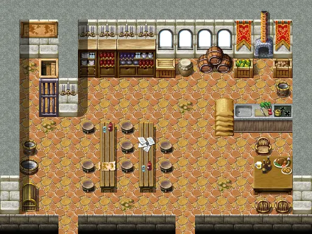

# Houseatcrossroads0

| | |
|---|---|
| **Map ID** | `houseatcrossroads0` |
| **Region** | In Crossroads Guardhouse (other) |
| **Type** | Indoors / underground |
| **Size** | 16×12 tiles |
| **Introduced** | v0.7.0 or earlier |
| **NPCs** | 7 |
| **Quests** | 4 |

**Houseatcrossroads0** is an indoor map, in Crossroads Guardhouse (other). It has 7 NPCs, and no enemies. Exits lead to Crossroads, Houseatcrossroads2, Houseatcrossroads1.

## Map

<label class="lg"><input type="checkbox" data-t="spawn" checked><b>Red</b>&nbsp;Monsters / NPCs</label><label class="lg"><input type="checkbox" data-t="mapchange" checked><b>Blue</b>&nbsp;Exit to another map</label><label class="lg"><input type="checkbox" data-t="container" checked><b>Yellow</b>&nbsp;Container (click to see contents)</label><label class="lg"><input type="checkbox" data-t="sign" checked><b>Purple</b>&nbsp;Sign</label><label class="lg"><input type="checkbox" data-t="rest" checked><b>Green</b>&nbsp;Resting place</label><label class="lg"><input type="checkbox" data-t="key" checked><b>Orange dashed</b>&nbsp;Blocked until a quest step / item</label><label class="lg"><input type="checkbox" data-t="script"><b>Grey dotted</b>&nbsp;Scripted event</label><label class="lg"><input type="checkbox" data-t="replace"><b>White dotted</b>&nbsp;Changes during a quest</label><label class="lg"><input type="checkbox" data-t="pin" checked><b>Numbers</b>&nbsp;Numbered key points (see the key below the map)</label>

<a class="pin pin-exit" href="#key-1" style="left:59.375%;top:95.833%" title="Exit (south): to [Crossroads](../crossroads.md)">1</a><a class="pin pin-exit" href="#key-2" style="left:21.875%;top:95.833%" title="Exit (south): to [Houseatcrossroads2](../houseatcrossroads2.md)">2</a><a class="pin pin-exit" href="#key-3" style="left:15.625%;top:29.167%" title="Exit (stairs / passage): to [Houseatcrossroads1](../houseatcrossroads1.md)">3</a><a class="pin pin-npc" href="#key-4" style="left:28.125%;top:37.500%" title="[Ailshara](../../monsters/ailshara.md): shopkeeper, 1 quest">4</a><a class="pin pin-npc" href="#key-5" style="left:53.125%;top:70.833%" title="[Burhczyd](../../monsters/burhczyd12.md): 1 quest">5</a><a class="pin pin-npc" href="#key-6" style="left:15.625%;top:70.833%" title="[Celdar](../../monsters/celdar.md): 1 quest">6</a><a class="pin pin-npc" href="#key-7" style="left:84.375%;top:37.500%" title="[Gallain](../../monsters/gallain.md): shopkeeper">7</a><a class="pin pin-npc" href="#key-8" style="left:40.625%;top:70.833%" title="[Knight of Elythom](../../monsters/burhczyd12e.md): 1 quest">8</a><a class="pin pin-npc" href="#key-9" style="left:53.125%;top:37.500%" title="[Miri](../../monsters/dds_miri.md): 1 quest">9</a><a class="pin pin-npc" href="#key-10" style="left:28.125%;top:70.833%" title="[Visitor](../../monsters/crossroads_guest.md): NPC">10</a><a class="pin pin-replace" href="#key-11" style="left:46.875%;top:70.833%" title="Changes during a quest: This area changes during the quest: hidden story flag “quest_burhczyd_nd” (stage 512: “512=show oven in Crossroad”)">11</a>

??? abstract "Key to the numbers on the map"

    | # | What | Details |
    |---|---|---|
    | 1 | Exit (south) | to [Crossroads](../crossroads.md) |
    | 2 | Exit (south) | to [Houseatcrossroads2](../houseatcrossroads2.md) |
    | 3 | Exit (stairs / passage) | to [Houseatcrossroads1](../houseatcrossroads1.md) |
    | 4 | [Ailshara](../monsters/ailshara.md) | shopkeeper, 1 quest |
    | 5 | [Burhczyd](../monsters/burhczyd12.md) | 1 quest |
    | 6 | [Celdar](../monsters/celdar.md) | 1 quest |
    | 7 | [Gallain](../monsters/gallain.md) | shopkeeper |
    | 8 | [Knight of Elythom](../monsters/burhczyd12e.md) | 1 quest |
    | 9 | [Miri](../monsters/dds_miri.md) | 1 quest |
    | 10 | [Visitor](../monsters/crossroads_guest.md) | NPC |
    | 11 | Changes during a quest | This area changes during the quest: hidden story flag “quest_burhczyd_nd” (stage 512: “512=show oven in Crossroad”) |

Verified against v0.8.18 map data.

## Connections

| Direction | Leads to | Region there | Map # |
|---|---|---|---|
| South | [Crossroads](crossroads.md) | Crossroads Guardhouse | 1 |
| South | [Houseatcrossroads2](houseatcrossroads2.md) | Crossroads Guardhouse | 2 |
| Stairs / passage | [Houseatcrossroads1](houseatcrossroads1.md) | Crossroads Guardhouse | 3 |

## NPCs

- [Ailshara](../monsters/ailshara.md) — shopkeeper — quests: [Feygard errands](../quests/feygard_shipment.md) (#4)
- [Burhczyd](../monsters/burhczyd12.md) — quests: [Young merchant](../quests/quest_burhczyd.md) (#5)
- [Celdar](../monsters/celdar.md) — quests: [Restless in the grave](../quests/mg_restless_grave.md) (#6)
- [Gallain](../monsters/gallain.md) — shopkeeper (#7)
- [Knight of Elythom](../monsters/burhczyd12e.md) — quests: [Young merchant](../quests/quest_burhczyd.md) (#8)
- [Miri](../monsters/dds_miri.md) — quests: [Darkness in the Daylight](../quests/darkness_in_daylight.md) (#9)
- [Visitor](../monsters/crossroads_guest.md) (#10)

## Items & containers

**Shops:** [Ailshara](../monsters/ailshara.md), [Gallain](../monsters/gallain.md)

## Quests

- [Darkness in the Daylight](../quests/darkness_in_daylight.md): [Miri](../monsters/dds_miri.md) is involved
- [Feygard errands](../quests/feygard_shipment.md): [Ailshara](../monsters/ailshara.md) is involved
- [Restless in the grave](../quests/mg_restless_grave.md): [Celdar](../monsters/celdar.md) is involved
- [Young merchant](../quests/quest_burhczyd.md): [Burhczyd](../monsters/burhczyd12.md) is involved; [Knight of Elythom](../monsters/burhczyd12e.md) is involved
- [Darkness in the Daylight and Shadows - Non displayed (hidden flag)](../quests/dds_nd.md): [Miri](../monsters/dds_miri.md) is involved; a scripted event can trigger here from stage 1; a scripted event can trigger here from stage 2
- [galmore_nondisplayed (hidden flag)](../quests/galmore_nondisplayed.md): [Celdar](../monsters/celdar.md) is involved
- [Young merchant Non-displayed (hidden flag)](../quests/quest_burhczyd_nd.md): [Burhczyd](../monsters/burhczyd12.md) is involved; [Knight of Elythom](../monsters/burhczyd12e.md) is involved; part of the map changes at stage 512

## Points of interest

- **Changes during a quest** (#11): This area changes during the quest: hidden story flag “quest_burhczyd_nd” (stage 512: “512=show oven in Crossroad”)

## Version history

| Version | Change |
|---|---|
| [v0.7.0](../versions/0.7.0.md) | Present in v0.7.0 (earliest release tracked) |
| [v0.7.1](../versions/0.7.1.md) | map layout or objects changed |
| [v0.7.2](../versions/0.7.2.md) | map layout or objects changed |
| [v0.8.2](../versions/0.8.2.md) | map layout or objects changed |
| [v0.8.14](../versions/0.8.14.md) | map layout or objects changed |
| [v0.8.16.1](../versions/0.8.16.1.md) | map layout or objects changed |

Verified against v0.8.18 and every earlier release back to v0.7.0 (game data compared release by release).

## Community notes

<small>Written by players, not generated from game data. **Observations**: what players notice in-game · **Lore**: the in-world story · **Trivia**: real-world facts, references, development history · **Theory / speculation**: unconfirmed ideas; may just be unfinished content</small>

### Observations

*Nothing here yet. Know something? [Add it](https://github.com/asdfghjkl628/Andor-s-Trail-Wikiiii/new/main/notes/maps?filename=houseatcrossroads0.md&value=%23%23%20Observations%0A%0A%3C%21--%20what%20players%20notice%20in-game%20--%3E%0A%0A%23%23%20Lore%0A%0A%3C%21--%20the%20in-world%20story%20--%3E%0A%0A%23%23%20Trivia%0A%0A%3C%21--%20real-world%20facts%2C%20references%2C%20development%20history%20--%3E%0A%0A%23%23%20Theory%20/%20speculation%0A%0A%3C%21--%20unconfirmed%20ideas%3B%20may%20just%20be%20unfinished%20content%20--%3E%0A).*

### Lore

*Nothing here yet. Know something? [Add it](https://github.com/asdfghjkl628/Andor-s-Trail-Wikiiii/new/main/notes/maps?filename=houseatcrossroads0.md&value=%23%23%20Observations%0A%0A%3C%21--%20what%20players%20notice%20in-game%20--%3E%0A%0A%23%23%20Lore%0A%0A%3C%21--%20the%20in-world%20story%20--%3E%0A%0A%23%23%20Trivia%0A%0A%3C%21--%20real-world%20facts%2C%20references%2C%20development%20history%20--%3E%0A%0A%23%23%20Theory%20/%20speculation%0A%0A%3C%21--%20unconfirmed%20ideas%3B%20may%20just%20be%20unfinished%20content%20--%3E%0A).*

### Trivia

*Nothing here yet. Know something? [Add it](https://github.com/asdfghjkl628/Andor-s-Trail-Wikiiii/new/main/notes/maps?filename=houseatcrossroads0.md&value=%23%23%20Observations%0A%0A%3C%21--%20what%20players%20notice%20in-game%20--%3E%0A%0A%23%23%20Lore%0A%0A%3C%21--%20the%20in-world%20story%20--%3E%0A%0A%23%23%20Trivia%0A%0A%3C%21--%20real-world%20facts%2C%20references%2C%20development%20history%20--%3E%0A%0A%23%23%20Theory%20/%20speculation%0A%0A%3C%21--%20unconfirmed%20ideas%3B%20may%20just%20be%20unfinished%20content%20--%3E%0A).*

### Theory / speculation

*Nothing here yet. Know something? [Add it](https://github.com/asdfghjkl628/Andor-s-Trail-Wikiiii/new/main/notes/maps?filename=houseatcrossroads0.md&value=%23%23%20Observations%0A%0A%3C%21--%20what%20players%20notice%20in-game%20--%3E%0A%0A%23%23%20Lore%0A%0A%3C%21--%20the%20in-world%20story%20--%3E%0A%0A%23%23%20Trivia%0A%0A%3C%21--%20real-world%20facts%2C%20references%2C%20development%20history%20--%3E%0A%0A%23%23%20Theory%20/%20speculation%0A%0A%3C%21--%20unconfirmed%20ideas%3B%20may%20just%20be%20unfinished%20content%20--%3E%0A).*

??? info "Technical information"

    | | |
    |---|---|
    | Map ID | `houseatcrossroads0` |
    | File | `res/xml/houseatcrossroads0.tmx` |
    | Size | 16×12 tiles (512×384 px) |
    | outdoors property | – |
    | Layers drawn | ground, objects, above |
    | Tilesets | map_bed_1, map_border_1, map_bridge_1, map_bridge_2, map_broken_1, map_cavewall_1, map_cavewall_2, map_cavewall_3, map_cavewall_4, map_chair_table_1, map_chair_table_2, map_crate_1, map_cupboard_1, map_curtain_1, map_entrance_1, map_entrance_2, map_fence_1, map_fence_2, map_fence_3, map_fence_4, map_ground_1, map_ground_2, map_ground_3, map_ground_4, map_ground_5, map_ground_6, map_ground_7, map_ground_8, map_house_1, map_house_2, map_indoor_1, map_indoor_2, map_kitchen_1, map_outdoor_1, map_pillar_1, map_pillar_2, map_plant_1, map_plant_2, map_rock_1, map_rock_2, map_roof_1, map_roof_2, map_roof_3, map_shop_1, map_sign_ladder_1, map_table_1, map_trail_1, map_transition_1, map_transition_2, map_transition_3, map_transition_4, map_transition_5, map_tree_1, map_tree_2, map_wall_1, map_wall_2, map_wall_3, map_wall_4, map_window_1, map_window_2 |
    | Map objects | spawn: 8, mapchange: 3, script: 1, replace: 1 |
    | World map position | – |

<small>Data from v0.8.18</small>
