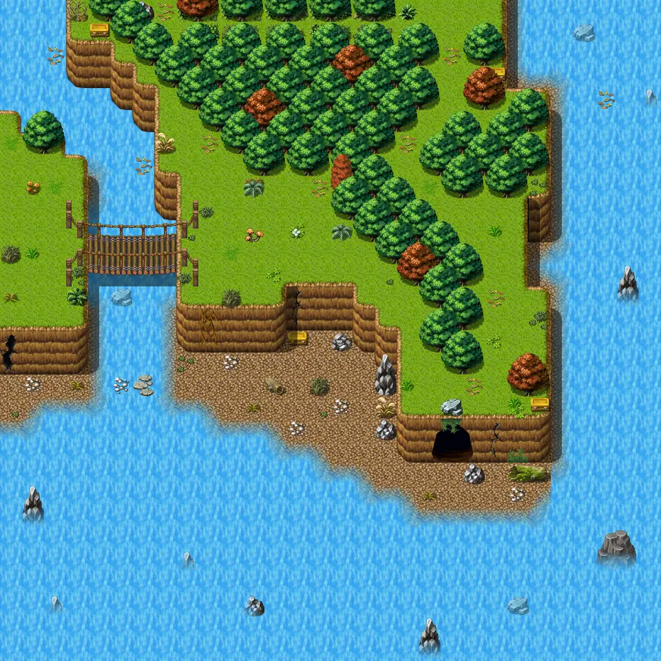

# Island 3

| | |
|---|---|
| **Map ID** | `island3` |
| **Type** | Outdoors |
| **Size** | 30×30 tiles |
| **World map** | [World 1](index.md) |
| **Introduced** | [v0.8.11](../versions/0.8.11.md) |
| **NPCs** | 2 |
| **Enemy types** | 1 |
| **Quests** | 1 |
| **Containers** | 16 |

**Island 3** is an outdoor map. It has 2 NPCs and 1 kind of enemy. Exits lead to Island 2, Island 4, Island underground 5.

## Map

<label class="lg"><input type="checkbox" data-t="spawn" checked><b>Red</b>&nbsp;Monsters / NPCs</label><label class="lg"><input type="checkbox" data-t="mapchange" checked><b>Blue</b>&nbsp;Exit to another map</label><label class="lg"><input type="checkbox" data-t="container" checked><b>Yellow</b>&nbsp;Container (click to see contents)</label><label class="lg"><input type="checkbox" data-t="sign" checked><b>Purple</b>&nbsp;Sign</label><label class="lg"><input type="checkbox" data-t="rest" checked><b>Green</b>&nbsp;Resting place</label><label class="lg"><input type="checkbox" data-t="key" checked><b>Orange dashed</b>&nbsp;Blocked until a quest step / item</label><label class="lg"><input type="checkbox" data-t="script"><b>Grey dotted</b>&nbsp;Scripted event</label><label class="lg"><input type="checkbox" data-t="replace"><b>White dotted</b>&nbsp;Changes during a quest</label><label class="lg"><input type="checkbox" data-t="pin" checked><b>Numbers</b>&nbsp;Numbered key points (see the key below the map)</label>

<a class="pin pin-exit" href="#key-1" style="left:50.000%;top:1.667%" title="Exit (north): to [Island 2](island2.md)">1</a><a class="pin pin-exit" href="#key-2" style="left:1.667%;top:40.000%" title="Exit (west): to [Island 4](island4.md)">2</a><a class="pin pin-exit" href="#key-3" style="left:68.333%;top:68.333%" title="Exit (cave entrance): to [Island underground 5](island_underground5.md)">3</a><a id="pin-npc-lae_centaur" class="pin pin-npc" href="#key-4" style="left:78.333%;top:38.333%" title="[Centaur](../../monsters/lae_centaur.md): NPC">4</a><a id="pin-npc-lae_centaur3" class="pin pin-npc" href="#key-5" style="left:55.000%;top:45.000%" title="[Silvanus, the centaur](../../monsters/lae_centaur3.md): 1 quest">5</a><a class="pin pin-container" href="#key-6" style="left:15.000%;top:5.000%" title="Container 1: Scroll of earth">6</a><a class="pin pin-container" href="#key-7" style="left:45.000%;top:51.667%" title="Container 2: Red globe of the elements">7</a><a class="pin pin-container" href="#key-8" style="left:75.000%;top:11.667%" title="Container 3: Glass gem, Ruby gem">8</a><a class="pin pin-container" href="#key-9" style="left:81.667%;top:61.667%" title="Container 4: Ruby gem, Polished sparkling gem">9</a><a class="pin pin-container" href="#key-10" style="left:15.219%;top:2.500%" title="Container 5: Red globe of the elements">10</a><a class="pin pin-container" href="#key-11" style="left:45.219%;top:49.167%" title="Container 6: Ruby gem, Polished gem">11</a><a class="pin pin-container" href="#key-12" style="left:75.219%;top:9.167%" title="Container 7: Scroll of earth">12</a><a class="pin pin-container" href="#key-13" style="left:81.886%;top:59.167%" title="Container 8: Ruby gem, Polished sparkling gem">13</a><a class="pin pin-container" href="#key-14" style="left:16.682%;top:7.194%" title="Container 9: Polished gem, Sharpened gem">14</a><a class="pin pin-container" href="#key-15" style="left:46.682%;top:53.860%" title="Container 10: Scroll of earth">15</a><a class="pin pin-container" href="#key-16" style="left:76.682%;top:13.860%" title="Container 11: Ruby gem, Polished sparkling gem">16</a><a class="pin pin-container" href="#key-17" style="left:83.349%;top:63.860%" title="Container 12: Red globe of the elements">17</a><a class="pin pin-container" href="#key-18" style="left:12.066%;top:4.481%" title="Container 13: Sharpened gem, Polished sparkling gem">18</a><a class="pin pin-container" href="#key-19" style="left:42.066%;top:51.148%" title="Container 14: Ruby gem, Polished sparkling gem">19</a><a class="pin pin-container" href="#key-20" style="left:72.066%;top:11.148%" title="Container 15: Red globe of the elements">20</a><a class="pin pin-container" href="#key-21" style="left:78.733%;top:61.148%" title="Container 16: Scroll of earth">21</a><a class="pin pin-key" href="#key-22" style="left:77.673%;top:9.966%" title="Blocked passage: Unlocked during the quest: hidden story flag “final_cave” (stage 11: “11: Andor talk”)">22</a><a class="pin pin-key" href="#key-22" style="left:17.673%;top:3.299%" title="Blocked passage: Unlocked during the quest: hidden story flag “final_cave” (stage 11: “11: Andor talk”)">22</a><a class="pin pin-key" href="#key-22" style="left:47.673%;top:49.966%" title="Blocked passage: Unlocked during the quest: hidden story flag “final_cave” (stage 11: “11: Andor talk”)">22</a><a class="pin pin-key" href="#key-22" style="left:84.340%;top:59.966%" title="Blocked passage: Unlocked during the quest: hidden story flag “final_cave” (stage 11: “11: Andor talk”)">22</a>

??? abstract "Key to the numbers on the map"

    | # | What | Details |
    |---|---|---|
    | 1 | Exit (north) | to [Island 2](island2.md) |
    | 2 | Exit (west) | to [Island 4](island4.md) |
    | 3 | Exit (cave entrance) | to [Island underground 5](island_underground5.md) |
    | 4 | [Centaur](../monsters/lae_centaur.md) | NPC |
    | 5 | [Silvanus, the centaur](../monsters/lae_centaur3.md) | 1 quest |
    | 6 | Container 1 | Scroll of earth |
    | 7 | Container 2 | Red globe of the elements |
    | 8 | Container 3 | Glass gem, Ruby gem |
    | 9 | Container 4 | Ruby gem, Polished sparkling gem |
    | 10 | Container 5 | Red globe of the elements |
    | 11 | Container 6 | Ruby gem, Polished gem |
    | 12 | Container 7 | Scroll of earth |
    | 13 | Container 8 | Ruby gem, Polished sparkling gem |
    | 14 | Container 9 | Polished gem, Sharpened gem |
    | 15 | Container 10 | Scroll of earth |
    | 16 | Container 11 | Ruby gem, Polished sparkling gem |
    | 17 | Container 12 | Red globe of the elements |
    | 18 | Container 13 | Sharpened gem, Polished sparkling gem |
    | 19 | Container 14 | Ruby gem, Polished sparkling gem |
    | 20 | Container 15 | Red globe of the elements |
    | 21 | Container 16 | Scroll of earth |
    | 22 | Blocked passage | Unlocked during the quest: hidden story flag “final_cave” (stage 11: “11: Andor talk”) |

Verified against v0.8.18 map data.

## Connections

| Direction | Leads to | Region there | Map # |
|---|---|---|---|
| North | [Island 2](island2.md) | – | 1 |
| West | [Island 4](island4.md) | – | 2 |
| Cave entrance | [Island underground 5](island_underground5.md) | – | 3 |

## NPCs

- [Centaur](../monsters/lae_centaur.md) (#4)
- [Silvanus, the centaur](../monsters/lae_centaur3.md) — quests: [Not Pony Island](../quests/lae_centaurs.md) (#5)

## Enemies

| Enemy | HP | Damage | Up to | Notes |
|---|---|---|---|---|
| [Venomous beach crawler](../monsters/beach_crawler_1.md) | 70 | 2–8 | 3 | – |

<small>“Up to” is the most that can be alive at once from the spawn areas on this map.</small>

## Items & containers

<b>Container 1</b><ul><li><a href="../../items/final_cave_e/">Scroll of earth</a> <small>100%</small></li></ul>

<b>Container 2</b><ul><li><a href="../../items/final_cave_r/">Red globe of the elements</a> <small>100%</small></li></ul>

<b>Container 3</b><ul><li><a href="../../items/gem1/">Glass gem</a> <small>100%</small></li><li><a href="../../items/gem2/">Ruby gem</a> <small>33%</small></li></ul>

<b>Container 4</b><ul><li><a href="../../items/gem2/">Ruby gem</a> <small>100%</small></li><li><a href="../../items/gem5/">Polished sparkling gem</a> <small>33%</small></li></ul>

<b>Container 5</b><ul><li><a href="../../items/final_cave_r/">Red globe of the elements</a> <small>100%</small></li></ul>

<b>Container 6</b><ul><li><a href="../../items/gem2/">Ruby gem</a> <small>100%</small></li><li><a href="../../items/gem3/">Polished gem</a> <small>33%</small></li></ul>

<b>Container 7</b><ul><li><a href="../../items/final_cave_e/">Scroll of earth</a> <small>100%</small></li></ul>

<b>Container 8</b><ul><li><a href="../../items/gem2/">Ruby gem</a> <small>100%</small></li><li><a href="../../items/gem5/">Polished sparkling gem</a> <small>33%</small></li></ul>

<b>Container 9</b><ul><li><a href="../../items/gem3/">Polished gem</a> <small>100%</small></li><li><a href="../../items/gem4/">Sharpened gem</a> <small>33%</small></li></ul>

<b>Container 10</b><ul><li><a href="../../items/final_cave_e/">Scroll of earth</a> <small>100%</small></li></ul>

<b>Container 11</b><ul><li><a href="../../items/gem2/">Ruby gem</a> <small>100%</small></li><li><a href="../../items/gem5/">Polished sparkling gem</a> <small>33%</small></li></ul>

<b>Container 12</b><ul><li><a href="../../items/final_cave_r/">Red globe of the elements</a> <small>100%</small></li></ul>

<b>Container 13</b><ul><li><a href="../../items/gem4/">Sharpened gem</a> <small>100%</small></li><li><a href="../../items/gem5/">Polished sparkling gem</a> <small>33%</small></li></ul>

<b>Container 14</b><ul><li><a href="../../items/gem2/">Ruby gem</a> <small>100%</small></li><li><a href="../../items/gem5/">Polished sparkling gem</a> <small>33%</small></li></ul>

<b>Container 15</b><ul><li><a href="../../items/final_cave_r/">Red globe of the elements</a> <small>100%</small></li></ul>

<b>Container 16</b><ul><li><a href="../../items/final_cave_e/">Scroll of earth</a> <small>100%</small></li></ul>

## Quests

- [Not Pony Island](../quests/lae_centaurs.md): [Silvanus, the centaur](../monsters/lae_centaur3.md) is involved
- [Final cave (hidden flag)](../quests/final_cave.md): blocked passage opens at stage 11
- [Laeroth story flags (hidden flag)](../quests/laeroth_nondisplay.md): [Silvanus, the centaur](../monsters/lae_centaur3.md) is involved

## Points of interest

- **Blocked passage** (#22): Unlocked during the quest: hidden story flag “final_cave” (stage 11: “11: Andor talk”)

## Version history

| Version | Change |
|---|---|
| [v0.8.11](../versions/0.8.11.md) | Added |
| [v0.8.12.1](../versions/0.8.12.1.md) | Map layout or objects changed |
| [v0.8.18](../versions/0.8.18.md) | Map layout or objects changed |

Verified against v0.8.18 and every earlier release back to v0.7.0 (game data compared release by release).

## Community notes

<small>Written by players, not generated from game data. **Observations**: what players notice in-game · **Lore**: the in-world story · **Trivia**: real-world facts, references, development history · **Theory / speculation**: unconfirmed ideas; may just be unfinished content</small>

### Observations

*No notes yet. Contributions are welcome: [add a note](https://github.com/asdfghjkl628/Andor-s-Trail-Wikiiii/new/main/notes/maps?filename=island3.md&value=%23%23%20Observations%0A%0A%3C%21--%20what%20players%20notice%20in-game%20--%3E%0A%0A%23%23%20Lore%0A%0A%3C%21--%20the%20in-world%20story%20--%3E%0A%0A%23%23%20Trivia%0A%0A%3C%21--%20real-world%20facts%2C%20references%2C%20development%20history%20--%3E%0A%0A%23%23%20Theory%20/%20speculation%0A%0A%3C%21--%20unconfirmed%20ideas%3B%20may%20just%20be%20unfinished%20content%20--%3E%0A).*

### Lore

*No notes yet. Contributions are welcome: [add a note](https://github.com/asdfghjkl628/Andor-s-Trail-Wikiiii/new/main/notes/maps?filename=island3.md&value=%23%23%20Observations%0A%0A%3C%21--%20what%20players%20notice%20in-game%20--%3E%0A%0A%23%23%20Lore%0A%0A%3C%21--%20the%20in-world%20story%20--%3E%0A%0A%23%23%20Trivia%0A%0A%3C%21--%20real-world%20facts%2C%20references%2C%20development%20history%20--%3E%0A%0A%23%23%20Theory%20/%20speculation%0A%0A%3C%21--%20unconfirmed%20ideas%3B%20may%20just%20be%20unfinished%20content%20--%3E%0A).*

### Trivia

*No notes yet. Contributions are welcome: [add a note](https://github.com/asdfghjkl628/Andor-s-Trail-Wikiiii/new/main/notes/maps?filename=island3.md&value=%23%23%20Observations%0A%0A%3C%21--%20what%20players%20notice%20in-game%20--%3E%0A%0A%23%23%20Lore%0A%0A%3C%21--%20the%20in-world%20story%20--%3E%0A%0A%23%23%20Trivia%0A%0A%3C%21--%20real-world%20facts%2C%20references%2C%20development%20history%20--%3E%0A%0A%23%23%20Theory%20/%20speculation%0A%0A%3C%21--%20unconfirmed%20ideas%3B%20may%20just%20be%20unfinished%20content%20--%3E%0A).*

### Theory / speculation

*No notes yet. Contributions are welcome: [add a note](https://github.com/asdfghjkl628/Andor-s-Trail-Wikiiii/new/main/notes/maps?filename=island3.md&value=%23%23%20Observations%0A%0A%3C%21--%20what%20players%20notice%20in-game%20--%3E%0A%0A%23%23%20Lore%0A%0A%3C%21--%20the%20in-world%20story%20--%3E%0A%0A%23%23%20Trivia%0A%0A%3C%21--%20real-world%20facts%2C%20references%2C%20development%20history%20--%3E%0A%0A%23%23%20Theory%20/%20speculation%0A%0A%3C%21--%20unconfirmed%20ideas%3B%20may%20just%20be%20unfinished%20content%20--%3E%0A).*

??? info "Technical information"

    | | |
    |---|---|
    | Map ID | `island3` |
    | File | `res/xml/island3.tmx` |
    | Size | 30×30 tiles (960×960 px) |
    | outdoors property | 1 |
    | Layers drawn | base, ground, objects, above |
    | Tilesets | map_bed_1, map_border_1, map_bridge_1, map_bridge_2, map_broken_1, map_cavewall_1, map_cavewall_2, map_cavewall_3, map_cavewall_4, map_chair_table_1, map_chair_table_2, map_crate_1, map_cupboard_1, map_curtain_1, map_entrance_1, map_entrance_2, map_fence_1, map_fence_2, map_fence_3, map_fence_4, map_ground_1, map_ground_2, map_ground_3, map_ground_4, map_ground_5, map_ground_6, map_ground_7, map_ground_8, map_guynmart, map_house_1, map_house_2, map_indoor_1, map_indoor_2, map_kitchen_1, map_outdoor_1, map_pillar_1, map_pillar_2, map_plant_1, map_plant_2, map_rock_1, map_rock_2, map_roof_1, map_roof_2, map_roof_3, map_shop_1, map_sign_ladder_1, map_table_1, map_trail_1, map_transition_1, map_transition_2, map_transition_3, map_transition_4, map_transition_5, map_tree_1, map_tree_2, map_wall_1, map_wall_2, map_wall_3, map_wall_4, map_window_1, map_window_2 |
    | Map objects | container: 16, key: 4, mapchange: 3, spawn: 3 |
    | World map position | segment `world1`, x 555, y 102 |

<small>Data from v0.8.18</small>
