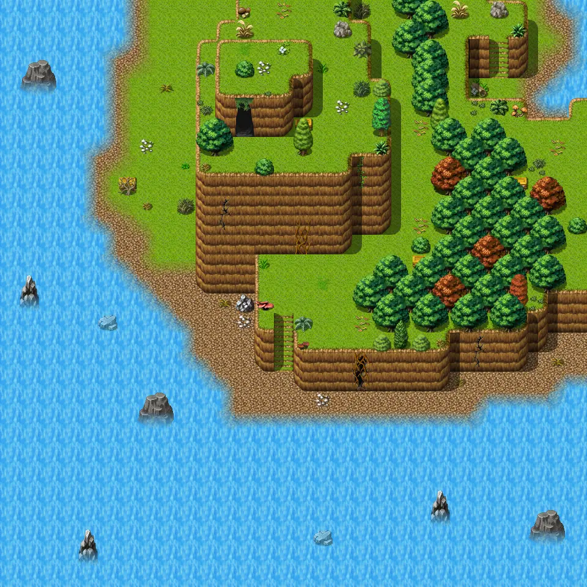
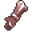

# Island4

30×30 tiles · outdoors · part of [World1](index.md)

<label class="lg"><input type="checkbox" data-t="spawn" checked><b>Red</b>&nbsp;Monsters / NPCs</label><label class="lg"><input type="checkbox" data-t="mapchange" checked><b>Blue</b>&nbsp;Exit to another map</label><label class="lg"><input type="checkbox" data-t="container" checked><b>Yellow</b>&nbsp;Container (click to see contents)</label><label class="lg"><input type="checkbox" data-t="sign" checked><b>Purple</b>&nbsp;Sign</label><label class="lg"><input type="checkbox" data-t="rest" checked><b>Green</b>&nbsp;Resting place</label><label class="lg"><input type="checkbox" data-t="key" checked><b>Orange dashed</b>&nbsp;Blocked until a quest step / item</label><label class="lg"><input type="checkbox" data-t="script"><b>Grey dotted</b>&nbsp;Scripted event</label><label class="lg"><input type="checkbox" data-t="replace"><b>White dotted</b>&nbsp;Changes during a quest</label>

## Containers

<b>Container 1</b><ul><li><a href="../../items/final_cave_a/">Scroll of wind</a> <small>100%</small></li></ul>

<b>Container 2</b><ul><li><a href="../../items/rock/">Small rock</a> <small>100%</small></li></ul>

<b>Container 3</b><ul><li><a href="../../items/gem1/">Glass gem</a> <small>100%</small></li><li><a href="../../items/gem2/">Ruby gem</a> <small>33%</small></li></ul>

<b>Container 4</b><ul><li><a href="../../items/gem2/">Ruby gem</a> <small>100%</small></li><li><a href="../../items/gem5/">Polished sparkling gem</a> <small>33%</small></li></ul>

<b>Container 5</b><ul><li><a href="../../items/rock/">Small rock</a> <small>100%</small></li></ul>

<b>Container 6</b><ul><li><a href="../../items/gem2/">Ruby gem</a> <small>100%</small></li><li><a href="../../items/gem3/">Polished gem</a> <small>33%</small></li></ul>

<b>Container 7</b><ul><li><a href="../../items/final_cave_a/">Scroll of wind</a> <small>100%</small></li></ul>

<b>Container 8</b><ul><li><a href="../../items/gem4/">Sharpened gem</a> <small>100%</small></li><li><a href="../../items/gem3/">Polished gem</a> <small>33%</small></li></ul>

<b>Container 9</b><ul><li><a href="../../items/gem3/">Polished gem</a> <small>100%</small></li><li><a href="../../items/gem4/">Sharpened gem</a> <small>33%</small></li></ul>

<b>Container 10</b><ul><li><a href="../../items/final_cave_a/">Scroll of wind</a> <small>100%</small></li></ul>

<b>Container 11</b><ul><li><a href="../../items/gem4/">Sharpened gem</a> <small>100%</small></li><li><a href="../../items/gem3/">Polished gem</a> <small>33%</small></li></ul>

<b>Container 12</b><ul><li><a href="../../items/rock/">Small rock</a> <small>100%</small></li></ul>

<b>Container 13</b><ul><li><a href="../../items/gem4/">Sharpened gem</a> <small>100%</small></li><li><a href="../../items/gem5/">Polished sparkling gem</a> <small>33%</small></li></ul>

<b>Container 14</b><ul><li><a href="../../items/gem4/">Sharpened gem</a> <small>100%</small></li><li><a href="../../items/gem3/">Polished gem</a> <small>33%</small></li></ul>

<b>Container 15</b><ul><li><a href="../../items/rock/">Small rock</a> <small>100%</small></li></ul>

<b>Container 16</b><ul><li><a href="../../items/final_cave_a/">Scroll of wind</a> <small>100%</small></li></ul>

## Exits

- [Island1](island1.md)
- [Island3](island3.md)
- [Island 4 cave1](island_4_cave1.md)

## Monsters & NPCs here

| Name | HP |
|---|---|
| [Centaur](../monsters/lae_centaur.md) | 0 |
| [Lyra, the centaur](../monsters/lae_centaur8.md) | 0 |
| [Venomous beach crawler](../monsters/beach_crawler_1.md) | 70 |

<small>Map ID: `island4` · Data from v0.8.18</small>
