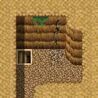

# Island 4 cave 1

| | |
|---|---|
| **Map ID** | `island_4_cave1` |
| **Type** | Indoors / underground |
| **Size** | 6×6 tiles |
| **World map** | [Island cave 2](index.md) |
| **Introduced** | [v0.8.11](../versions/0.8.11.md) |
| **NPCs** | 2 |
| **Quests** | 1 |

**Island 4 cave 1** is an indoor map. It has 2 NPCs, and no enemies. Exits lead to Island 4, Island 4 cave 2.

## Map

<label class="lg"><input type="checkbox" data-t="spawn" checked><b>Red</b>&nbsp;Monsters / NPCs</label><label class="lg"><input type="checkbox" data-t="mapchange" checked><b>Blue</b>&nbsp;Exit to another map</label><label class="lg"><input type="checkbox" data-t="container" checked><b>Yellow</b>&nbsp;Container (click to see contents)</label><label class="lg"><input type="checkbox" data-t="sign" checked><b>Purple</b>&nbsp;Sign</label><label class="lg"><input type="checkbox" data-t="rest" checked><b>Green</b>&nbsp;Resting place</label><label class="lg"><input type="checkbox" data-t="key" checked><b>Orange dashed</b>&nbsp;Blocked until a quest step / item</label><label class="lg"><input type="checkbox" data-t="script"><b>Grey dotted</b>&nbsp;Scripted event</label><label class="lg"><input type="checkbox" data-t="replace"><b>White dotted</b>&nbsp;Changes during a quest</label><label class="lg"><input type="checkbox" data-t="pin" checked><b>Numbers</b>&nbsp;Numbered key points (see the key below the map)</label>

<a class="pin pin-exit" href="#key-1" style="left:25.000%;top:91.667%" title="Exit (southwest): to [Island 4](island4.md)">1</a><a class="pin pin-exit" href="#key-2" style="left:25.000%;top:58.333%" title="Exit (west): to [Island 4 cave 2](island_4_cave2.md)">2</a><a id="pin-npc-lae_algangror1" class="pin pin-npc" href="#key-3" style="left:58.333%;top:75.000%" title="[Algangror](../../monsters/algangror.md#v-lae_algangror1): 1 quest">3</a><a id="pin-npc-lae_jhaeld1" class="pin pin-npc" href="#key-4" style="left:58.333%;top:58.333%" title="[Jhaeld](../../monsters/jhaeld.md#v-lae_jhaeld1): 1 quest">4</a><a class="pin pin-key" href="#key-5" style="left:26.097%;top:45.835%" title="Blocked passage: Unlocked during the quest: hidden story flag “final_cave” (stage 12: “12: Algangror/Jhaeld talk”)">5</a>

??? abstract "Key to the numbers on the map"

    | # | What | Details |
    |---|---|---|
    | 1 | Exit (southwest) | to [Island 4](island4.md) |
    | 2 | Exit (west) | to [Island 4 cave 2](island_4_cave2.md) |
    | 3 | [Algangror](../monsters/algangror.md#v-lae_algangror1) | 1 quest |
    | 4 | [Jhaeld](../monsters/jhaeld.md#v-lae_jhaeld1) | 1 quest |
    | 5 | Blocked passage | Unlocked during the quest: hidden story flag “final_cave” (stage 12: “12: Algangror/Jhaeld talk”) |

Verified against v0.8.18 map data.

## Connections

| Direction | Leads to | Region there | Map # |
|---|---|---|---|
| Southwest | [Island 4](island4.md) | – | 1 |
| West | [Island 4 cave 2](island_4_cave2.md) | – | 2 |

## NPCs

- [Algangror](../monsters/algangror.md#v-lae_algangror1) — quests: [Not Pony Island](../quests/lae_centaurs.md) (#3)
- [Jhaeld](../monsters/jhaeld.md#v-lae_jhaeld1) — quests: [Not Pony Island](../quests/lae_centaurs.md) (#4)

## Quests

- [Not Pony Island](../quests/lae_centaurs.md): [Algangror](../monsters/algangror.md#v-lae_algangror1) is involved; [Jhaeld](../monsters/jhaeld.md#v-lae_jhaeld1) is involved
- [Final cave (hidden flag)](../quests/final_cave.md): [Algangror](../monsters/algangror.md#v-lae_algangror1) is involved; [Jhaeld](../monsters/jhaeld.md#v-lae_jhaeld1) is involved; blocked passage opens at stage 12

## Points of interest

- **Blocked passage** (#5): Unlocked during the quest: hidden story flag “final_cave” (stage 12: “12: Algangror/Jhaeld talk”)

## Version history

| Version | Change |
|---|---|
| [v0.8.11](../versions/0.8.11.md) | Added |

Verified against v0.8.18 and every earlier release back to v0.7.0 (game data compared release by release).

## Community notes

<small>Written by players, not generated from game data. **Observations**: what players notice in-game · **Lore**: the in-world story · **Trivia**: real-world facts, references, development history · **Theory / speculation**: unconfirmed ideas; may just be unfinished content</small>

### Observations

*No notes yet. Contributions are welcome: [add a note](https://github.com/asdfghjkl628/Andor-s-Trail-Wikiiii/new/main/notes/maps?filename=island_4_cave1.md&value=%23%23%20Observations%0A%0A%3C%21--%20what%20players%20notice%20in-game%20--%3E%0A%0A%23%23%20Lore%0A%0A%3C%21--%20the%20in-world%20story%20--%3E%0A%0A%23%23%20Trivia%0A%0A%3C%21--%20real-world%20facts%2C%20references%2C%20development%20history%20--%3E%0A%0A%23%23%20Theory%20/%20speculation%0A%0A%3C%21--%20unconfirmed%20ideas%3B%20may%20just%20be%20unfinished%20content%20--%3E%0A).*

### Lore

*No notes yet. Contributions are welcome: [add a note](https://github.com/asdfghjkl628/Andor-s-Trail-Wikiiii/new/main/notes/maps?filename=island_4_cave1.md&value=%23%23%20Observations%0A%0A%3C%21--%20what%20players%20notice%20in-game%20--%3E%0A%0A%23%23%20Lore%0A%0A%3C%21--%20the%20in-world%20story%20--%3E%0A%0A%23%23%20Trivia%0A%0A%3C%21--%20real-world%20facts%2C%20references%2C%20development%20history%20--%3E%0A%0A%23%23%20Theory%20/%20speculation%0A%0A%3C%21--%20unconfirmed%20ideas%3B%20may%20just%20be%20unfinished%20content%20--%3E%0A).*

### Trivia

*No notes yet. Contributions are welcome: [add a note](https://github.com/asdfghjkl628/Andor-s-Trail-Wikiiii/new/main/notes/maps?filename=island_4_cave1.md&value=%23%23%20Observations%0A%0A%3C%21--%20what%20players%20notice%20in-game%20--%3E%0A%0A%23%23%20Lore%0A%0A%3C%21--%20the%20in-world%20story%20--%3E%0A%0A%23%23%20Trivia%0A%0A%3C%21--%20real-world%20facts%2C%20references%2C%20development%20history%20--%3E%0A%0A%23%23%20Theory%20/%20speculation%0A%0A%3C%21--%20unconfirmed%20ideas%3B%20may%20just%20be%20unfinished%20content%20--%3E%0A).*

### Theory / speculation

*No notes yet. Contributions are welcome: [add a note](https://github.com/asdfghjkl628/Andor-s-Trail-Wikiiii/new/main/notes/maps?filename=island_4_cave1.md&value=%23%23%20Observations%0A%0A%3C%21--%20what%20players%20notice%20in-game%20--%3E%0A%0A%23%23%20Lore%0A%0A%3C%21--%20the%20in-world%20story%20--%3E%0A%0A%23%23%20Trivia%0A%0A%3C%21--%20real-world%20facts%2C%20references%2C%20development%20history%20--%3E%0A%0A%23%23%20Theory%20/%20speculation%0A%0A%3C%21--%20unconfirmed%20ideas%3B%20may%20just%20be%20unfinished%20content%20--%3E%0A).*

??? info "Technical information"

    | | |
    |---|---|
    | Map ID | `island_4_cave1` |
    | File | `res/xml/island_4_cave1.tmx` |
    | Size | 6×6 tiles (192×192 px) |
    | outdoors property | – |
    | Layers drawn | ground, objects, above |
    | Tilesets | map_bed_1, map_border_1, map_bridge_1, map_bridge_2, map_broken_1, map_cavewall_1, map_cavewall_2, map_cavewall_3, map_cavewall_4, map_chair_table_1, map_chair_table_2, map_crate_1, map_cupboard_1, map_curtain_1, map_entrance_1, map_entrance_2, map_fence_1, map_fence_2, map_fence_3, map_fence_4, map_ground_1, map_ground_2, map_ground_3, map_ground_4, map_ground_5, map_ground_6, map_ground_7, map_ground_8, map_house_1, map_house_2, map_indoor_1, map_indoor_2, map_kitchen_1, map_outdoor_1, map_pillar_1, map_pillar_2, map_plant_1, map_plant_2, map_rock_1, map_rock_2, map_roof_1, map_roof_2, map_roof_3, map_shop_1, map_sign_ladder_1, map_table_1, map_trail_1, map_transition_1, map_transition_2, map_transition_3, map_transition_4, map_transition_5, map_tree_1, map_tree_2, map_wall_1, map_wall_2, map_wall_3, map_wall_4, map_window_1, map_window_2 |
    | Map objects | mapchange: 2, spawn: 2, key: 1 |
    | World map position | segment `island_cave_2`, x 11, y 3 |

<small>Data from v0.8.18</small>
