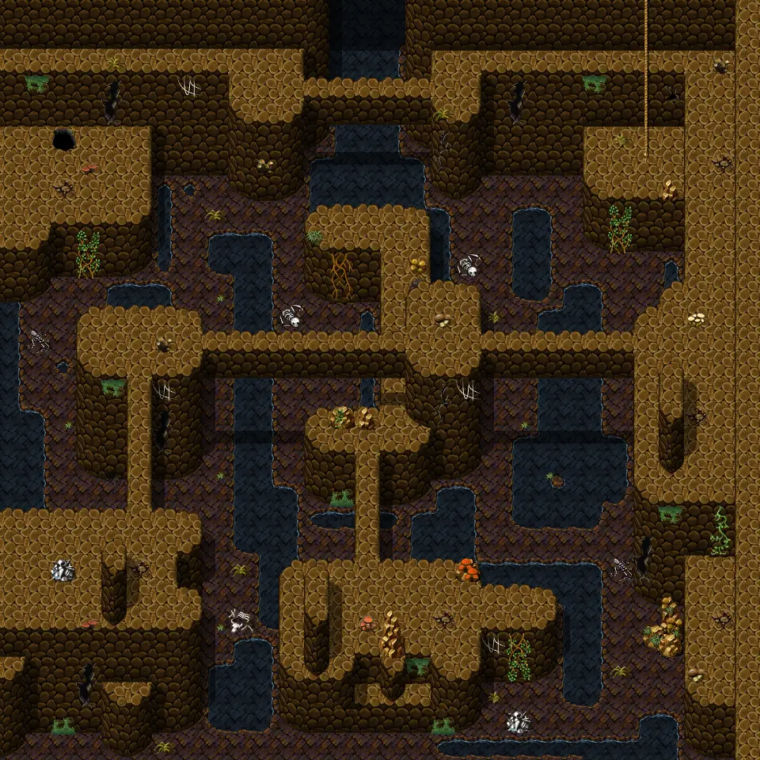

# Island underground2

30×30 tiles · part of [Island caves](index.md)

<label class="lg lg-spawn"><input type="checkbox" data-t="spawn" checked> Monsters / NPCs</label><label class="lg lg-mapchange"><input type="checkbox" data-t="mapchange" checked> Exit to another map</label><label class="lg lg-container"><input type="checkbox" data-t="container" checked> Container</label><label class="lg lg-sign"><input type="checkbox" data-t="sign" checked> Sign</label><label class="lg lg-rest"><input type="checkbox" data-t="rest" checked> Resting place</label><label class="lg lg-key"><input type="checkbox" data-t="key" checked> Blocked / needs key or quest</label><label class="lg lg-script"><input type="checkbox" data-t="script"> Scripted event</label><label class="lg lg-replace"><input type="checkbox" data-t="replace"> Changes after a quest</label>

## Exits

- [Island underground1](island_underground1.md)
- [Island underground3](island_underground3.md)

## Monsters & NPCs here

| Name | HP |
|---|---|
| [Cave bat](../monsters/cavebat4.md) | 39 |
| [Poisonous vine](../monsters/poison_vine_top.md) | 90 |
| [Poisonous vine](../monsters/poison_vine_bottom.md) | 90 |
| [Adult church dweller](../monsters/adult_church_dweller.md) | 102 |
| [Drakthorn](../monsters/drakthorn.md) | 143 |
| [Drakthorn warrior](../monsters/drakthorn_warrior.md) | 146 |

<small>Map ID: `island_underground2` · Data from v0.8.18</small>
