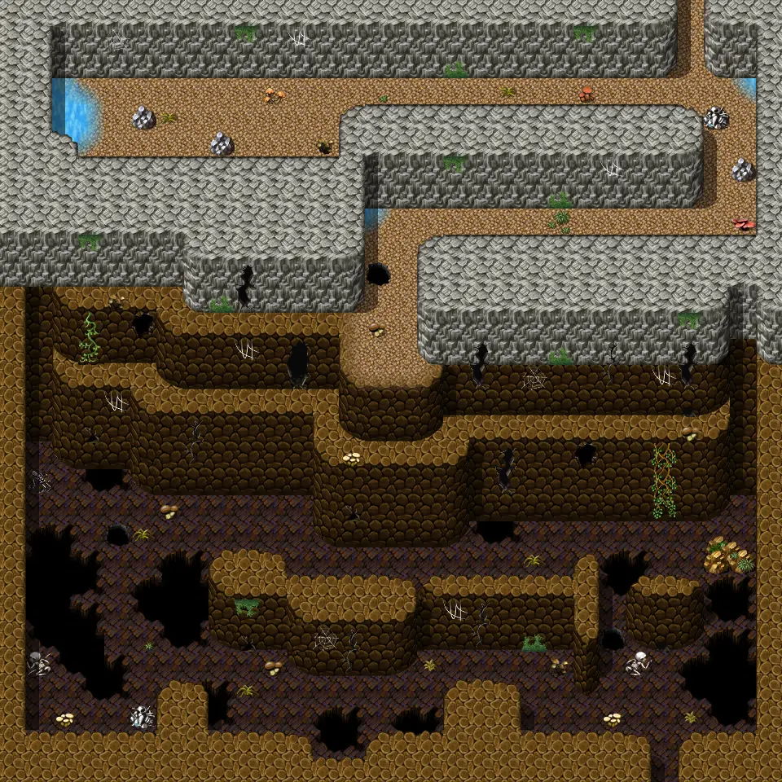

# Island underground4

30×30 tiles · part of [Island caves](index.md)

<label class="lg"><input type="checkbox" data-t="spawn" checked><b>Red</b>&nbsp;Monsters / NPCs</label><label class="lg"><input type="checkbox" data-t="mapchange" checked><b>Blue</b>&nbsp;Exit to another map</label><label class="lg"><input type="checkbox" data-t="container" checked><b>Yellow</b>&nbsp;Container (click to see contents)</label><label class="lg"><input type="checkbox" data-t="sign" checked><b>Purple</b>&nbsp;Sign</label><label class="lg"><input type="checkbox" data-t="rest" checked><b>Green</b>&nbsp;Resting place</label><label class="lg"><input type="checkbox" data-t="key" checked><b>Orange dashed</b>&nbsp;Blocked until a quest step / item</label><label class="lg"><input type="checkbox" data-t="script"><b>Grey dotted</b>&nbsp;Scripted event</label><label class="lg"><input type="checkbox" data-t="replace"><b>White dotted</b>&nbsp;Changes during a quest</label>

## Exits

- [Island underground3](island_underground3.md)
- [Island underground4a](island_underground4a.md)

## Monsters & NPCs here

| Name | HP |
|---|---|
| [Cave bat](../monsters/cavebat4.md) | 39 |
| [Pup rat](../monsters/young_church_rat.md) | 77 |
| [Young church dweller](../monsters/young_church_dweller.md) | 93 |
| [Church dweller](../monsters/church_dweller.md) | 98 |
| [Drakthorn](../monsters/drakthorn.md) | 143 |

<small>Map ID: `island_underground4` · Data from v0.8.18</small>
