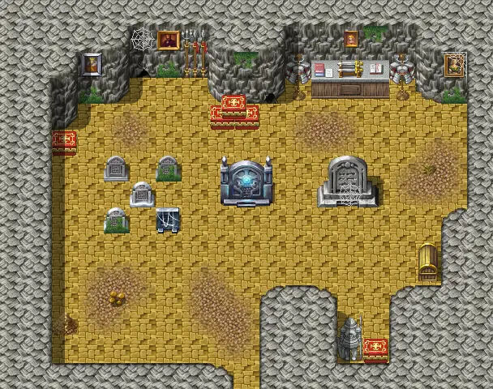
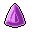

# Korhald cave hidden

19×15 tiles

<label class="lg"><input type="checkbox" data-t="spawn" checked><b>Red</b>&nbsp;Monsters / NPCs</label><label class="lg"><input type="checkbox" data-t="mapchange" checked><b>Blue</b>&nbsp;Exit to another map</label><label class="lg"><input type="checkbox" data-t="container" checked><b>Yellow</b>&nbsp;Container (click to see contents)</label><label class="lg"><input type="checkbox" data-t="sign" checked><b>Purple</b>&nbsp;Sign</label><label class="lg"><input type="checkbox" data-t="rest" checked><b>Green</b>&nbsp;Resting place</label><label class="lg"><input type="checkbox" data-t="key" checked><b>Orange dashed</b>&nbsp;Blocked until a quest step / item</label><label class="lg"><input type="checkbox" data-t="script"><b>Grey dotted</b>&nbsp;Scripted event</label><label class="lg"><input type="checkbox" data-t="replace"><b>White dotted</b>&nbsp;Changes during a quest</label>

## Containers

<b>Container 1</b><ul><li><a href="../../items/gem2/">Ruby gem</a> <small>100% · ×3 to 6</small></li><li><a href="../../items/gem3/">Polished gem</a> <small>100% · ×10 to 12</small></li><li><a href="../../items/gem1/">Glass gem</a> <small>100% · ×5 to 7</small></li><li><a href="../../items/gem4/">Sharpened gem</a> <small>100% · ×5 to 8</small></li></ul>

<b>Container 2</b><ul><li><a href="../../items/shield_of_brave/">Shield of the Brave</a> <small>100%</small></li><li><a href="../../items/hero_coin/">Coin of Prestige</a> <small>100%</small></li></ul>

## Exits

- [Korhald cave2](korhald_cave2.md)

## Monsters & NPCs here

| Name | HP |
|---|---|
| [Rat](../monsters/crossroads_rat.md) | 5 |

<small>Map ID: `korhald_cave_hidden` · Data from v0.8.18</small>
