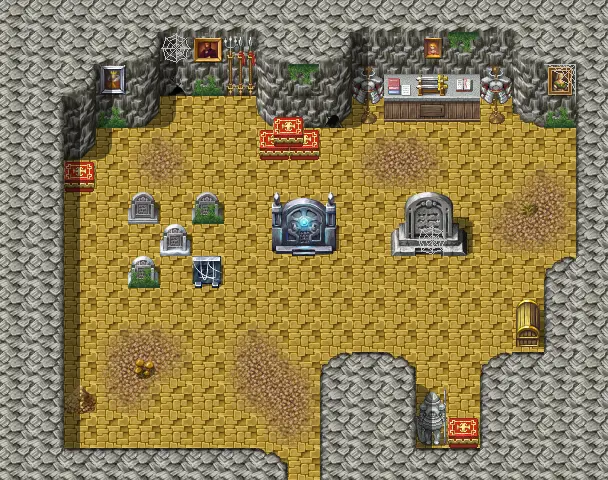

# Korhald cave hidden

| | |
|---|---|
| **Map ID** | `korhald_cave_hidden` |
| **Type** | Indoors / underground |
| **Size** | 19×15 tiles |
| **Introduced** | [v0.8.11](../versions/0.8.11.md) |
| **Enemy types** | 1 |
| **Quests** | 1 |
| **Containers** | 2 |

**Korhald cave hidden** is an indoor map. It has no NPCs and 1 kind of enemy. Exits lead to Korhald cave2.

## Map

<label class="lg"><input type="checkbox" data-t="spawn" checked><b>Red</b>&nbsp;Monsters / NPCs</label><label class="lg"><input type="checkbox" data-t="mapchange" checked><b>Blue</b>&nbsp;Exit to another map</label><label class="lg"><input type="checkbox" data-t="container" checked><b>Yellow</b>&nbsp;Container (click to see contents)</label><label class="lg"><input type="checkbox" data-t="sign" checked><b>Purple</b>&nbsp;Sign</label><label class="lg"><input type="checkbox" data-t="rest" checked><b>Green</b>&nbsp;Resting place</label><label class="lg"><input type="checkbox" data-t="key" checked><b>Orange dashed</b>&nbsp;Blocked until a quest step / item</label><label class="lg"><input type="checkbox" data-t="script"><b>Grey dotted</b>&nbsp;Scripted event</label><label class="lg"><input type="checkbox" data-t="replace"><b>White dotted</b>&nbsp;Changes during a quest</label><label class="lg"><input type="checkbox" data-t="pin" checked><b>Numbers</b>&nbsp;Numbered key points (see the key below the map)</label>

<a class="pin pin-exit" href="#key-1" style="left:50.000%;top:96.667%" title="Exit (south): to [Korhald cave2](korhald_cave2.md)">1</a><a class="pin pin-container" href="#key-2" style="left:13.158%;top:83.333%" title="Container 1: Ruby gem, Polished gem, Glass gem, Sharpened gem">2</a><a class="pin pin-script" href="#key-3" style="left:60.526%;top:76.667%" title="Quest trigger: Scripted event: advances the quest: The odd coin collector to stage 66 (“Inside the Korhald cave, I found the Coin of Prestige and the Shield of the Brave. I should return to Gylew and show him the coin.”) (+1 more quest(s))">3</a><a class="pin pin-script" href="#key-4" style="left:81.579%;top:70.000%" title="Quest trigger: Scripted event: advances the quest: hidden story flag “nondisplay” to stage 49 (“Looted the locked chest in Korhald&#x27;s tomb.”)">4</a><a class="pin pin-sign" href="#key-5" style="left:65.789%;top:30.000%" title="Sign: “At a quick glance, you notice a couple of books on the strategy of war.”">5</a><a class="pin pin-container" href="#key-6" style="left:76.316%;top:90.000%" title="Container 2: Shield of the Brave, Coin of Prestige">6</a>

??? abstract "Key to the numbers on the map"

    | # | What | Details |
    |---|---|---|
    | 1 | Exit (south) | to [Korhald cave2](korhald_cave2.md) |
    | 2 | Container 1 | Ruby gem, Polished gem, Glass gem, Sharpened gem |
    | 3 | Quest trigger | Scripted event: advances the quest: The odd coin collector to stage 66 (“Inside the Korhald cave, I found the Coin of Prestige and the Shield of the Brave. I should return to Gylew and show him the coin.”) (+1 more quest(s)) |
    | 4 | Quest trigger | Scripted event: advances the quest: hidden story flag “nondisplay” to stage 49 (“Looted the locked chest in Korhald's tomb.”) |
    | 5 | Sign | “At a quick glance, you notice a couple of books on the strategy of war.” |
    | 6 | Container 2 | Shield of the Brave, Coin of Prestige |

Verified against v0.8.18 map data.

## Connections

| Direction | Leads to | Region there | Map # |
|---|---|---|---|
| South | [Korhald cave2](korhald_cave2.md) | – | 1 |

## Enemies

| Enemy | HP | Damage | Up to | Notes |
|---|---|---|---|---|
| [Rat](../monsters/vermin0.md#v-crossroads_rat) | 5 | 1–1 | 4 | – |

<small>“Up to” is the most that can be alive at once from the spawn areas on this map.</small>

## Items & containers

<b>Container 1</b><ul><li><a href="../../items/gem2/">Ruby gem</a> <small>100% · ×3 to 6</small></li><li><a href="../../items/gem3/">Polished gem</a> <small>100% · ×10 to 12</small></li><li><a href="../../items/gem1/">Glass gem</a> <small>100% · ×5 to 7</small></li><li><a href="../../items/gem4/">Sharpened gem</a> <small>100% · ×5 to 8</small></li></ul>

<b>Container 2</b><ul><li><a href="../../items/shield_of_brave/">Shield of the Brave</a> <small>100%</small></li><li><a href="../../items/hero_coin/">Coin of Prestige</a> <small>100%</small></li></ul>

## Quests

- [The odd coin collector](../quests/odd_coin_collector.md): something on this map advances it; stepping on a trigger here sets stage 65; stepping on a trigger here sets stage 66
- [laeroth_nondisplay (hidden flag)](../quests/laeroth_nondisplay.md): something on this map advances it; stepping on a trigger here sets stage 103
- [Placeholder for hidden quest stages (not displayed) (hidden flag)](../quests/nondisplay.md): something on this map advances it; stepping on a trigger here sets stage 49; stepping on a trigger here sets stage 50

## Points of interest

- **Quest trigger** (#3): Scripted event: advances the quest: The odd coin collector to stage 66 (“Inside the Korhald cave, I found the Coin of Prestige and the Shield of the Brave. I should return to Gylew and show him the coin.”) (+1 more quest(s))
- **Quest trigger** (#4): Scripted event: advances the quest: hidden story flag “nondisplay” to stage 49 (“Looted the locked chest in Korhald's tomb.”)
- **Sign** (#5): “At a quick glance, you notice a couple of books on the strategy of war.”

## Version history

| Version | Change |
|---|---|
| [v0.8.11](../versions/0.8.11.md) | Added |

Verified against v0.8.18 and every earlier release back to v0.7.0 (game data compared release by release).

## Community notes

<small>Written by players, not generated from game data. **Observations**: what players notice in-game · **Lore**: the in-world story · **Trivia**: real-world facts, references, development history · **Theory / speculation**: unconfirmed ideas; may just be unfinished content</small>

### Observations

*No notes yet. Contributions are welcome: [add a note](https://github.com/asdfghjkl628/Andor-s-Trail-Wikiiii/new/main/notes/maps?filename=korhald_cave_hidden.md&value=%23%23%20Observations%0A%0A%3C%21--%20what%20players%20notice%20in-game%20--%3E%0A%0A%23%23%20Lore%0A%0A%3C%21--%20the%20in-world%20story%20--%3E%0A%0A%23%23%20Trivia%0A%0A%3C%21--%20real-world%20facts%2C%20references%2C%20development%20history%20--%3E%0A%0A%23%23%20Theory%20/%20speculation%0A%0A%3C%21--%20unconfirmed%20ideas%3B%20may%20just%20be%20unfinished%20content%20--%3E%0A).*

### Lore

*No notes yet. Contributions are welcome: [add a note](https://github.com/asdfghjkl628/Andor-s-Trail-Wikiiii/new/main/notes/maps?filename=korhald_cave_hidden.md&value=%23%23%20Observations%0A%0A%3C%21--%20what%20players%20notice%20in-game%20--%3E%0A%0A%23%23%20Lore%0A%0A%3C%21--%20the%20in-world%20story%20--%3E%0A%0A%23%23%20Trivia%0A%0A%3C%21--%20real-world%20facts%2C%20references%2C%20development%20history%20--%3E%0A%0A%23%23%20Theory%20/%20speculation%0A%0A%3C%21--%20unconfirmed%20ideas%3B%20may%20just%20be%20unfinished%20content%20--%3E%0A).*

### Trivia

*No notes yet. Contributions are welcome: [add a note](https://github.com/asdfghjkl628/Andor-s-Trail-Wikiiii/new/main/notes/maps?filename=korhald_cave_hidden.md&value=%23%23%20Observations%0A%0A%3C%21--%20what%20players%20notice%20in-game%20--%3E%0A%0A%23%23%20Lore%0A%0A%3C%21--%20the%20in-world%20story%20--%3E%0A%0A%23%23%20Trivia%0A%0A%3C%21--%20real-world%20facts%2C%20references%2C%20development%20history%20--%3E%0A%0A%23%23%20Theory%20/%20speculation%0A%0A%3C%21--%20unconfirmed%20ideas%3B%20may%20just%20be%20unfinished%20content%20--%3E%0A).*

### Theory / speculation

*No notes yet. Contributions are welcome: [add a note](https://github.com/asdfghjkl628/Andor-s-Trail-Wikiiii/new/main/notes/maps?filename=korhald_cave_hidden.md&value=%23%23%20Observations%0A%0A%3C%21--%20what%20players%20notice%20in-game%20--%3E%0A%0A%23%23%20Lore%0A%0A%3C%21--%20the%20in-world%20story%20--%3E%0A%0A%23%23%20Trivia%0A%0A%3C%21--%20real-world%20facts%2C%20references%2C%20development%20history%20--%3E%0A%0A%23%23%20Theory%20/%20speculation%0A%0A%3C%21--%20unconfirmed%20ideas%3B%20may%20just%20be%20unfinished%20content%20--%3E%0A).*

??? info "Technical information"

    | | |
    |---|---|
    | Map ID | `korhald_cave_hidden` |
    | File | `res/xml/korhald_cave_hidden.tmx` |
    | Size | 19×15 tiles (608×480 px) |
    | outdoors property | – |
    | Layers drawn | base, ground, objects, above, top |
    | Tilesets | map_bed_1, map_border_1, map_bridge_1, map_bridge_2, map_broken_1, map_cavewall_1, map_cavewall_2, map_cavewall_3, map_cavewall_4, map_chair_table_1, map_chair_table_2, map_crate_1, map_cupboard_1, map_curtain_1, map_entrance_1, map_entrance_2, map_fence_1, map_fence_2, map_fence_3, map_fence_4, map_ground_1, map_ground_2, map_ground_3, map_ground_4, map_ground_5, map_ground_6, map_ground_7, map_ground_8, map_house_1, map_house_2, map_indoor_1, map_indoor_2, map_kitchen_1, map_outdoor_1, map_pillar_1, map_pillar_2, map_plant_1, map_plant_2, map_rock_1, map_rock_2, map_roof_1, map_roof_2, map_roof_3, map_shop_1, map_sign_ladder_1, map_table_1, map_trail_1, map_transition_1, map_transition_2, map_transition_3, map_transition_4, map_transition_5, map_tree_1, map_tree_2, map_wall_1, map_wall_2, map_wall_3, map_wall_4, map_window_1, map_window_2 |
    | Map objects | container: 2, script: 2, mapchange: 1, sign: 1, spawn: 1 |
    | World map position | – |

<small>Data from v0.8.18</small>
