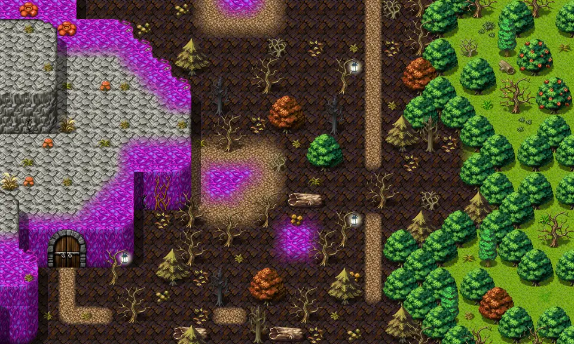

# Korhald cave outdoor1

30×18 tiles · outdoors · part of [World1](index.md)

<label class="lg lg-spawn"><input type="checkbox" data-t="spawn" checked> Monsters / NPCs</label><label class="lg lg-mapchange"><input type="checkbox" data-t="mapchange" checked> Exit to another map</label><label class="lg lg-container"><input type="checkbox" data-t="container" checked> Container</label><label class="lg lg-sign"><input type="checkbox" data-t="sign" checked> Sign</label><label class="lg lg-rest"><input type="checkbox" data-t="rest" checked> Resting place</label><label class="lg lg-key"><input type="checkbox" data-t="key" checked> Blocked / needs key or quest</label><label class="lg lg-script"><input type="checkbox" data-t="script"> Scripted event</label><label class="lg lg-replace"><input type="checkbox" data-t="replace"> Changes after a quest</label>

## Exits

- [Korhald cave1](korhald_cave1.md)
- [Waterway10](waterway10.md)
- [Waterway forest2](waterway_forest2.md)
- [Waytobrightport21](waytobrightport21.md)

## Monsters & NPCs here

| Name | HP |
|---|---|
| [Young izthiel](../monsters/izthiel_1.md) | 40 |
| [Izthiel](../monsters/izthiel_2.md) | 45 |
| [Vile erumen lizard](../monsters/erumen_5.md) | 89 |
| [Tough erumen lizard](../monsters/erumen_6.md) | 91 |

<small>Map ID: `korhald_cave_outdoor1` · Data from v0.8.18</small>
