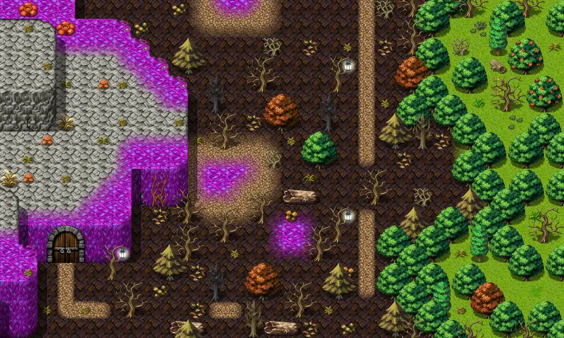

# Korhald cave outdoor1

| | |
|---|---|
| **Map ID** | `korhald_cave_outdoor1` |
| **Type** | Outdoors |
| **Size** | 30×18 tiles |
| **World map** | [World1](index.md) |
| **Introduced** | [v0.8.11](../versions/0.8.11.md) |
| **Enemy types** | 4 |
| **Quests** | 0 |

**Korhald cave outdoor1** is an outdoor map. It has no NPCs and 4 kinds of enemy. Exits lead to Waterway10, Waterway forest2, Waytobrightport21, Korhald cave1.

## Map

<label class="lg"><input type="checkbox" data-t="spawn" checked><b>Red</b>&nbsp;Monsters / NPCs</label><label class="lg"><input type="checkbox" data-t="mapchange" checked><b>Blue</b>&nbsp;Exit to another map</label><label class="lg"><input type="checkbox" data-t="container" checked><b>Yellow</b>&nbsp;Container (click to see contents)</label><label class="lg"><input type="checkbox" data-t="sign" checked><b>Purple</b>&nbsp;Sign</label><label class="lg"><input type="checkbox" data-t="rest" checked><b>Green</b>&nbsp;Resting place</label><label class="lg"><input type="checkbox" data-t="key" checked><b>Orange dashed</b>&nbsp;Blocked until a quest step / item</label><label class="lg"><input type="checkbox" data-t="script"><b>Grey dotted</b>&nbsp;Scripted event</label><label class="lg"><input type="checkbox" data-t="replace"><b>White dotted</b>&nbsp;Changes during a quest</label><label class="lg"><input type="checkbox" data-t="pin" checked><b>Numbers</b>&nbsp;Numbered key points (see the key below the map)</label>

<a class="pin pin-exit" href="#key-1" style="left:25.000%;top:2.778%" title="Exit (north): to [Waterway10](waterway10.md)">1</a><a class="pin pin-exit" href="#key-1" style="left:56.667%;top:2.778%" title="Exit (north): to [Waterway10](waterway10.md)">1</a><a class="pin pin-exit" href="#key-2" style="left:98.333%;top:25.000%" title="Exit (east): to [Waterway forest2](waterway_forest2.md)">2</a><a class="pin pin-exit" href="#key-3" style="left:98.333%;top:88.889%" title="Exit (southeast): to [Waterway forest2](waterway_forest2.md)">3</a><a class="pin pin-exit" href="#key-4" style="left:36.667%;top:97.222%" title="Exit (south): to [Waytobrightport21](waytobrightport21.md)">4</a><a class="pin pin-exit" href="#key-5" style="left:11.667%;top:75.000%" title="Exit (cave entrance): to [Korhald cave1](korhald_cave1.md)">5</a><a class="pin pin-replace" href="#key-6" style="left:11.886%;top:68.056%" title="Changes during a quest: This area changes during the quest: hidden story flag “nondisplay” (stage 40: “Opened cave door in korhald_cave_outdoor1”)">6</a><a class="pin pin-replace" href="#key-7" style="left:8.733%;top:71.357%" title="Changes during a quest: This area changes back during the quest: hidden story flag “nondisplay” (stage 40: “Opened cave door in korhald_cave_outdoor1”)">7</a><a class="pin pin-script" href="#key-8" style="left:13.333%;top:86.111%" title="Quest trigger: Scripted event: advances the quest: hidden story flag “nondisplay” to stage 41 (“Korhald cave door slams shut, scaring the PC.”)">8</a><a class="pin pin-script" href="#key-9" style="left:11.667%;top:80.556%" title="Quest trigger: Scripted event: advances the quest: hidden story flag “nondisplay” to stage 40 (“Opened cave door in korhald_cave_outdoor1”)">9</a><a class="pin pin-script" href="#key-10" style="left:51.667%;top:25.000%" title="Quest trigger: Scripted event: advances the quest: hidden story flag “nondisplay” to stage 48 (“Mysterious Korhald map head west in korhald_cave_outdoor1”)">10</a><a class="pin pin-script" href="#key-10" style="left:63.333%;top:91.667%" title="Quest trigger: Scripted event: advances the quest: hidden story flag “nondisplay” to stage 48 (“Mysterious Korhald map head west in korhald_cave_outdoor1”)">10</a><a class="pin pin-key" href="#key-11" style="left:58.333%;top:58.333%" title="Blocked passage: Closed off once you reach this point in the quest: hidden story flag “nondisplay” (stage 48: “Mysterious Korhald map head west in korhald_cave_outdoor1”)">11</a>

??? abstract "Key to the numbers on the map"

    | # | What | Details |
    |---|---|---|
    | 1 | Exit (north) | to [Waterway10](waterway10.md) |
    | 2 | Exit (east) | to [Waterway forest2](waterway_forest2.md) |
    | 3 | Exit (southeast) | to [Waterway forest2](waterway_forest2.md) |
    | 4 | Exit (south) | to [Waytobrightport21](waytobrightport21.md) |
    | 5 | Exit (cave entrance) | to [Korhald cave1](korhald_cave1.md) |
    | 6 | Changes during a quest | This area changes during the quest: hidden story flag “nondisplay” (stage 40: “Opened cave door in korhald_cave_outdoor1”) |
    | 7 | Changes during a quest | This area changes back during the quest: hidden story flag “nondisplay” (stage 40: “Opened cave door in korhald_cave_outdoor1”) |
    | 8 | Quest trigger | Scripted event: advances the quest: hidden story flag “nondisplay” to stage 41 (“Korhald cave door slams shut, scaring the PC.”) |
    | 9 | Quest trigger | Scripted event: advances the quest: hidden story flag “nondisplay” to stage 40 (“Opened cave door in korhald_cave_outdoor1”) |
    | 10 | Quest trigger | Scripted event: advances the quest: hidden story flag “nondisplay” to stage 48 (“Mysterious Korhald map head west in korhald_cave_outdoor1”) |
    | 11 | Blocked passage | Closed off once you reach this point in the quest: hidden story flag “nondisplay” (stage 48: “Mysterious Korhald map head west in korhald_cave_outdoor1”) |

Verified against v0.8.18 map data.

## Connections

| Direction | Leads to | Region there | Map # |
|---|---|---|---|
| North | [Waterway10](waterway10.md) | – | 1 |
| East | [Waterway forest2](waterway_forest2.md) | Brightport | 2 |
| Southeast | [Waterway forest2](waterway_forest2.md) | Brightport | 3 |
| South | [Waytobrightport21](waytobrightport21.md) | Brightport | 4 |
| Cave entrance | [Korhald cave1](korhald_cave1.md) | – | 5 |

## Enemies

| Enemy | HP | Damage | Up to | Notes |
|---|---|---|---|---|
| [Young izthiel](../monsters/izthiel_1.md) | 40 | 2–7 | 1 | – |
| [Izthiel](../monsters/izthiel_2.md) | 45 | 2–7 | 3 | – |
| [Vile erumen lizard](../monsters/erumen_5.md) | 89 | 2–9 | 6 | shares spawn with Tough erumen lizard |
| [Tough erumen lizard](../monsters/erumen_6.md) | 91 | 2–9 | 6 | shares spawn with Vile erumen lizard |

<small>“Up to” is the most that can be alive at once from the spawn areas on this map.</small>

## Quests

- [Placeholder for hidden quest stages (not displayed) (hidden flag)](../quests/nondisplay.md): blocked passage closes at stage 48; part of the map changes at stage 40; something on this map advances it; stepping on a trigger here sets stage 40; stepping on a trigger here sets stage 41; stepping on a trigger here sets stage 48

## Points of interest

- **Changes during a quest** (#6): This area changes during the quest: hidden story flag “nondisplay” (stage 40: “Opened cave door in korhald_cave_outdoor1”)
- **Changes during a quest** (#7): This area changes back during the quest: hidden story flag “nondisplay” (stage 40: “Opened cave door in korhald_cave_outdoor1”)
- **Quest trigger** (#8): Scripted event: advances the quest: hidden story flag “nondisplay” to stage 41 (“Korhald cave door slams shut, scaring the PC.”)
- **Quest trigger** (#9): Scripted event: advances the quest: hidden story flag “nondisplay” to stage 40 (“Opened cave door in korhald_cave_outdoor1”)
- **Quest trigger** (#10): Scripted event: advances the quest: hidden story flag “nondisplay” to stage 48 (“Mysterious Korhald map head west in korhald_cave_outdoor1”)
- **Blocked passage** (#11): Closed off once you reach this point in the quest: hidden story flag “nondisplay” (stage 48: “Mysterious Korhald map head west in korhald_cave_outdoor1”)

## Version history

| Version | Change |
|---|---|
| [v0.8.11](../versions/0.8.11.md) | Added |
| [v0.8.16.1](../versions/0.8.16.1.md) | map layout or objects changed |

Verified against v0.8.18 and every earlier release back to v0.7.0 (game data compared release by release).

## Community notes

<small>Written by players, not generated from game data. **Observations**: what players notice in-game · **Lore**: the in-world story · **Trivia**: real-world facts, references, development history · **Theory / speculation**: unconfirmed ideas; may just be unfinished content</small>

### Observations

*No notes yet. Contributions are welcome: [add a note](https://github.com/asdfghjkl628/Andor-s-Trail-Wikiiii/new/main/notes/maps?filename=korhald_cave_outdoor1.md&value=%23%23%20Observations%0A%0A%3C%21--%20what%20players%20notice%20in-game%20--%3E%0A%0A%23%23%20Lore%0A%0A%3C%21--%20the%20in-world%20story%20--%3E%0A%0A%23%23%20Trivia%0A%0A%3C%21--%20real-world%20facts%2C%20references%2C%20development%20history%20--%3E%0A%0A%23%23%20Theory%20/%20speculation%0A%0A%3C%21--%20unconfirmed%20ideas%3B%20may%20just%20be%20unfinished%20content%20--%3E%0A).*

### Lore

*No notes yet. Contributions are welcome: [add a note](https://github.com/asdfghjkl628/Andor-s-Trail-Wikiiii/new/main/notes/maps?filename=korhald_cave_outdoor1.md&value=%23%23%20Observations%0A%0A%3C%21--%20what%20players%20notice%20in-game%20--%3E%0A%0A%23%23%20Lore%0A%0A%3C%21--%20the%20in-world%20story%20--%3E%0A%0A%23%23%20Trivia%0A%0A%3C%21--%20real-world%20facts%2C%20references%2C%20development%20history%20--%3E%0A%0A%23%23%20Theory%20/%20speculation%0A%0A%3C%21--%20unconfirmed%20ideas%3B%20may%20just%20be%20unfinished%20content%20--%3E%0A).*

### Trivia

*No notes yet. Contributions are welcome: [add a note](https://github.com/asdfghjkl628/Andor-s-Trail-Wikiiii/new/main/notes/maps?filename=korhald_cave_outdoor1.md&value=%23%23%20Observations%0A%0A%3C%21--%20what%20players%20notice%20in-game%20--%3E%0A%0A%23%23%20Lore%0A%0A%3C%21--%20the%20in-world%20story%20--%3E%0A%0A%23%23%20Trivia%0A%0A%3C%21--%20real-world%20facts%2C%20references%2C%20development%20history%20--%3E%0A%0A%23%23%20Theory%20/%20speculation%0A%0A%3C%21--%20unconfirmed%20ideas%3B%20may%20just%20be%20unfinished%20content%20--%3E%0A).*

### Theory / speculation

*No notes yet. Contributions are welcome: [add a note](https://github.com/asdfghjkl628/Andor-s-Trail-Wikiiii/new/main/notes/maps?filename=korhald_cave_outdoor1.md&value=%23%23%20Observations%0A%0A%3C%21--%20what%20players%20notice%20in-game%20--%3E%0A%0A%23%23%20Lore%0A%0A%3C%21--%20the%20in-world%20story%20--%3E%0A%0A%23%23%20Trivia%0A%0A%3C%21--%20real-world%20facts%2C%20references%2C%20development%20history%20--%3E%0A%0A%23%23%20Theory%20/%20speculation%0A%0A%3C%21--%20unconfirmed%20ideas%3B%20may%20just%20be%20unfinished%20content%20--%3E%0A).*

??? info "Technical information"

    | | |
    |---|---|
    | Map ID | `korhald_cave_outdoor1` |
    | File | `res/xml/korhald_cave_outdoor1.tmx` |
    | Size | 30×18 tiles (960×576 px) |
    | outdoors property | 1 |
    | Layers drawn | base, ground, objects, above, top |
    | Tilesets | map_bed_1, map_border_1, map_bridge_1, map_bridge_2, map_broken_1, map_cavewall_1, map_cavewall_2, map_cavewall_3, map_cavewall_4, map_chair_table_1, map_chair_table_2, map_crate_1, map_cupboard_1, map_curtain_1, map_entrance_1, map_entrance_2, map_fence_1, map_fence_2, map_fence_3, map_fence_4, map_ground_1, map_ground_2, map_ground_3, map_ground_4, map_ground_5, map_ground_6, map_ground_7, map_ground_8, map_house_1, map_house_2, map_indoor_1, map_indoor_2, map_kitchen_1, map_outdoor_1, map_pillar_1, map_pillar_2, map_plant_1, map_plant_2, map_rock_1, map_rock_2, map_roof_1, map_roof_2, map_roof_3, map_shop_1, map_sign_ladder_1, map_table_1, map_trail_1, map_transition_1, map_transition_2, map_transition_3, map_transition_4, map_transition_5, map_tree_1, map_tree_2, map_wall_1, map_wall_2, map_wall_3, map_wall_4, map_window_1, map_window_2 |
    | Map objects | mapchange: 6, script: 6, spawn: 6, replace: 2, key: 1 |
    | World map position | segment `world1`, x 550, y 278 |

<small>Data from v0.8.18</small>
