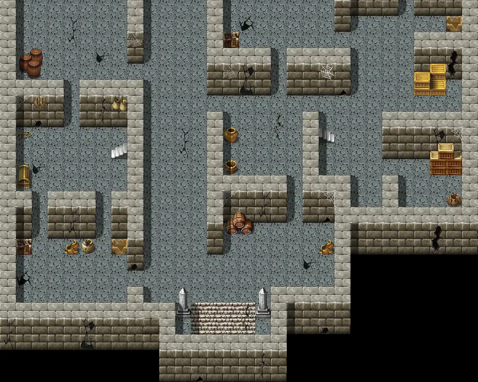

# Laerothbasement 0

| | |
|---|---|
| **Map ID** | `laerothbasement0` |
| **Region** | In Lake Laeroth (other) |
| **Type** | Indoors / underground |
| **Size** | 30×24 tiles |
| **Introduced** | [v0.8.11](../versions/0.8.11.md) |
| **Enemy types** | 5 |
| **Quests** | 1 |

**Laerothbasement 0** is an indoor map, in Lake Laeroth (other). It has no NPCs and 5 kinds of enemy. Exits lead to Laerothbasement 1, Laerothbasement 2, Laerothmanor 0.

## Map

<label class="lg"><input type="checkbox" data-t="spawn" checked><b>Red</b>&nbsp;Monsters / NPCs</label><label class="lg"><input type="checkbox" data-t="mapchange" checked><b>Blue</b>&nbsp;Exit to another map</label><label class="lg"><input type="checkbox" data-t="container" checked><b>Yellow</b>&nbsp;Container (click to see contents)</label><label class="lg"><input type="checkbox" data-t="sign" checked><b>Purple</b>&nbsp;Sign</label><label class="lg"><input type="checkbox" data-t="rest" checked><b>Green</b>&nbsp;Resting place</label><label class="lg"><input type="checkbox" data-t="key" checked><b>Orange dashed</b>&nbsp;Blocked until a quest step / item</label><label class="lg"><input type="checkbox" data-t="script"><b>Grey dotted</b>&nbsp;Scripted event</label><label class="lg"><input type="checkbox" data-t="replace"><b>White dotted</b>&nbsp;Changes during a quest</label><label class="lg"><input type="checkbox" data-t="pin" checked><b>Numbers</b>&nbsp;Numbered key points (see the key below the map)</label>

<a class="pin pin-exit" href="#key-1" style="left:15.000%;top:2.083%" title="Exit (north): to [Laerothbasement 1](laerothbasement1.md)">1</a><a class="pin pin-exit" href="#key-1" style="left:36.667%;top:2.083%" title="Exit (north): to [Laerothbasement 1](laerothbasement1.md)">1</a><a class="pin pin-exit" href="#key-1" style="left:58.333%;top:2.083%" title="Exit (north): to [Laerothbasement 1](laerothbasement1.md)">1</a><a class="pin pin-exit" href="#key-1" style="left:85.000%;top:2.083%" title="Exit (north): to [Laerothbasement 1](laerothbasement1.md)">1</a><a class="pin pin-exit" href="#key-2" style="left:46.667%;top:85.417%" title="Exit (stairs / passage): to [Laerothbasement 2](laerothbasement2.md)">2</a><a class="pin pin-exit" href="#key-3" style="left:25.000%;top:39.583%" title="Exit (stairs / passage): to [Laerothmanor 0](laerothmanor0.md)">3</a><a class="pin pin-exit" href="#key-3" style="left:68.333%;top:35.417%" title="Exit (stairs / passage): to [Laerothmanor 0](laerothmanor0.md)">3</a><a class="pin pin-script" href="#key-4" style="left:6.667%;top:45.833%" title="Quest trigger: Scripted event: advances the quest: The last lord of Laeroth to stage 50 (“I have opened Adakin&#x27;s chest. There are some useful items in here, as well as his diary. The diary has a lock though, so it seems I must find a small key that fits this lock.”) (+1 more quest(s))">4</a>

??? abstract "Key to the numbers on the map"

    | # | What | Details |
    |---|---|---|
    | 1 | Exit (north) | to [Laerothbasement 1](laerothbasement1.md) |
    | 2 | Exit (stairs / passage) | to [Laerothbasement 2](laerothbasement2.md) |
    | 3 | Exit (stairs / passage) | to [Laerothmanor 0](laerothmanor0.md) |
    | 4 | Quest trigger | Scripted event: advances the quest: The last lord of Laeroth to stage 50 (“I have opened Adakin's chest. There are some useful items in here, as well as his diary. The diary has a lock though, so it seems I must find a small key that fits this lock.”) (+1 more quest(s)) |

Verified against v0.8.18 map data.

## Connections

| Direction | Leads to | Region there | Map # |
|---|---|---|---|
| North | [Laerothbasement 1](laerothbasement1.md) | Lake Laeroth | 1 |
| Stairs / passage | [Laerothbasement 2](laerothbasement2.md) | Lake Laeroth | 2 |
| Stairs / passage | [Laerothmanor 0](laerothmanor0.md) | Lake Laeroth | 3 |

## Enemies

| Enemy | HP | Damage | Up to | Notes |
|---|---|---|---|---|
| [Gray cave bat](../monsters/cavebat1.md) | 28 | 3–5 | 3 | shares spawn with Black cave bat, Brown cave bat |
| [Black cave bat](../monsters/cavebat2.md) | 32 | 2–6 | 3 | shares spawn with Brown cave bat, Gray cave bat |
| [Brown cave bat](../monsters/cavebat3.md) | 36 | 1–7 | 3 | shares spawn with Black cave bat, Gray cave bat |
| [Basement spider](../monsters/laerothbasement_spider.md) | 90 | 6–14 | 9 | – |
| [Giant spider](../monsters/spider_massive.md) | 104 | 8–15 | 4 | – |

<small>“Up to” is the most that can be alive at once from the spawn areas on this map.</small>

## Quests

- [The last lord of Laeroth](../quests/last_lord.md): something on this map advances it; stepping on a trigger here sets stage 30; stepping on a trigger here sets stage 50
- [Laeroth story flags (hidden flag)](../quests/laeroth_nondisplay.md): something on this map advances it; stepping on a trigger here sets stage 140

## Points of interest

- **Quest trigger** (#4): Scripted event: advances the quest: The last lord of Laeroth to stage 50 (“I have opened Adakin's chest. There are some useful items in here, as well as his diary. The diary has a lock though, so it seems I must find a small key that fits this lock.”) (+1 more quest(s))

## Version history

| Version | Change |
|---|---|
| [v0.8.11](../versions/0.8.11.md) | Added |

Verified against v0.8.18 and every earlier release back to v0.7.0 (game data compared release by release).

## Community notes

<small>Written by players, not generated from game data. **Observations**: what players notice in-game · **Lore**: the in-world story · **Trivia**: real-world facts, references, development history · **Theory / speculation**: unconfirmed ideas; may just be unfinished content</small>

### Observations

*No notes yet. Contributions are welcome: [add a note](https://github.com/asdfghjkl628/Andor-s-Trail-Wikiiii/new/main/notes/maps?filename=laerothbasement0.md&value=%23%23%20Observations%0A%0A%3C%21--%20what%20players%20notice%20in-game%20--%3E%0A%0A%23%23%20Lore%0A%0A%3C%21--%20the%20in-world%20story%20--%3E%0A%0A%23%23%20Trivia%0A%0A%3C%21--%20real-world%20facts%2C%20references%2C%20development%20history%20--%3E%0A%0A%23%23%20Theory%20/%20speculation%0A%0A%3C%21--%20unconfirmed%20ideas%3B%20may%20just%20be%20unfinished%20content%20--%3E%0A).*

### Lore

*No notes yet. Contributions are welcome: [add a note](https://github.com/asdfghjkl628/Andor-s-Trail-Wikiiii/new/main/notes/maps?filename=laerothbasement0.md&value=%23%23%20Observations%0A%0A%3C%21--%20what%20players%20notice%20in-game%20--%3E%0A%0A%23%23%20Lore%0A%0A%3C%21--%20the%20in-world%20story%20--%3E%0A%0A%23%23%20Trivia%0A%0A%3C%21--%20real-world%20facts%2C%20references%2C%20development%20history%20--%3E%0A%0A%23%23%20Theory%20/%20speculation%0A%0A%3C%21--%20unconfirmed%20ideas%3B%20may%20just%20be%20unfinished%20content%20--%3E%0A).*

### Trivia

*No notes yet. Contributions are welcome: [add a note](https://github.com/asdfghjkl628/Andor-s-Trail-Wikiiii/new/main/notes/maps?filename=laerothbasement0.md&value=%23%23%20Observations%0A%0A%3C%21--%20what%20players%20notice%20in-game%20--%3E%0A%0A%23%23%20Lore%0A%0A%3C%21--%20the%20in-world%20story%20--%3E%0A%0A%23%23%20Trivia%0A%0A%3C%21--%20real-world%20facts%2C%20references%2C%20development%20history%20--%3E%0A%0A%23%23%20Theory%20/%20speculation%0A%0A%3C%21--%20unconfirmed%20ideas%3B%20may%20just%20be%20unfinished%20content%20--%3E%0A).*

### Theory / speculation

*No notes yet. Contributions are welcome: [add a note](https://github.com/asdfghjkl628/Andor-s-Trail-Wikiiii/new/main/notes/maps?filename=laerothbasement0.md&value=%23%23%20Observations%0A%0A%3C%21--%20what%20players%20notice%20in-game%20--%3E%0A%0A%23%23%20Lore%0A%0A%3C%21--%20the%20in-world%20story%20--%3E%0A%0A%23%23%20Trivia%0A%0A%3C%21--%20real-world%20facts%2C%20references%2C%20development%20history%20--%3E%0A%0A%23%23%20Theory%20/%20speculation%0A%0A%3C%21--%20unconfirmed%20ideas%3B%20may%20just%20be%20unfinished%20content%20--%3E%0A).*

??? info "Technical information"

    | | |
    |---|---|
    | Map ID | `laerothbasement0` |
    | File | `res/xml/laerothbasement0.tmx` |
    | Size | 30×24 tiles (960×768 px) |
    | outdoors property | – |
    | Layers drawn | ground, objects, above |
    | Tilesets | map_bed_1, map_border_1, map_bridge_1, map_broken_1, map_cavewall_1, map_cavewall_2, map_cavewall_3, map_chair_table_1, map_crate_1, map_cupboard_1, map_curtain_1, map_entrance_1, map_fence_1, map_fence_2, map_ground_1, map_ground_2, map_ground_3, map_ground_4, map_ground_5, map_ground_6, map_ground_7, map_ground_8, map_indoor_1, map_kitchen_1, map_outdoor_1, map_pillar_1, map_plant_1, map_rock_1, map_roof_1, map_roof_2, map_shop_1, map_sign_ladder_1, map_table_1, map_trail_1, map_tree_1, map_wall_1, map_wall_2, map_wall_3, map_window_1, map_window_2 |
    | Map objects | mapchange: 7, spawn: 5, script: 1 |
    | World map position | – |

<small>Data from v0.8.18</small>
