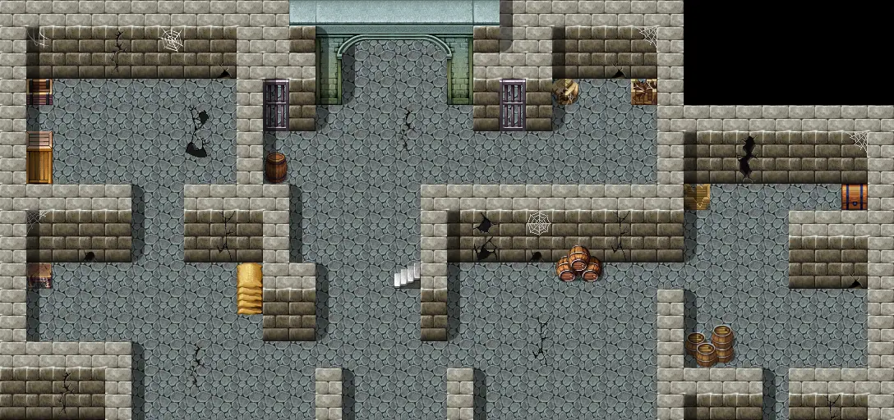

# Laerothbasement 1

| | |
|---|---|
| **Map ID** | `laerothbasement1` |
| **Region** | In Lake Laeroth (other) |
| **Type** | Indoors / underground |
| **Size** | 34×16 tiles |
| **Introduced** | [v0.8.11](../versions/0.8.11.md) |
| **Enemy types** | 4 |
| **Quests** | 3 |
| **Containers** | 1 |

**Laerothbasement 1** is an indoor map, in Lake Laeroth (other). It has no NPCs and 4 kinds of enemy. Exits lead to Laerothbasement 0, Laerothisland 2, Laerothmanor 0.

## Map

<label class="lg"><input type="checkbox" data-t="spawn" checked><b>Red</b>&nbsp;Monsters / NPCs</label><label class="lg"><input type="checkbox" data-t="mapchange" checked><b>Blue</b>&nbsp;Exit to another map</label><label class="lg"><input type="checkbox" data-t="container" checked><b>Yellow</b>&nbsp;Container (click to see contents)</label><label class="lg"><input type="checkbox" data-t="sign" checked><b>Purple</b>&nbsp;Sign</label><label class="lg"><input type="checkbox" data-t="rest" checked><b>Green</b>&nbsp;Resting place</label><label class="lg"><input type="checkbox" data-t="key" checked><b>Orange dashed</b>&nbsp;Blocked until a quest step / item</label><label class="lg"><input type="checkbox" data-t="script"><b>Grey dotted</b>&nbsp;Scripted event</label><label class="lg"><input type="checkbox" data-t="replace"><b>White dotted</b>&nbsp;Changes during a quest</label><label class="lg"><input type="checkbox" data-t="pin" checked><b>Numbers</b>&nbsp;Numbered key points (see the key below the map)</label>

<a class="pin pin-exit" href="#key-1" style="left:86.765%;top:96.875%" title="Exit (south): to [Laerothbasement 0](laerothbasement0.md)">1</a><a class="pin pin-exit" href="#key-1" style="left:63.235%;top:96.875%" title="Exit (south): to [Laerothbasement 0](laerothbasement0.md)">1</a><a class="pin pin-exit" href="#key-1" style="left:44.118%;top:96.875%" title="Exit (south): to [Laerothbasement 0](laerothbasement0.md)">1</a><a class="pin pin-exit" href="#key-1" style="left:25.000%;top:96.875%" title="Exit (south): to [Laerothbasement 0](laerothbasement0.md)">1</a><a class="pin pin-exit" href="#key-2" style="left:44.118%;top:21.875%" title="Exit (exit outside): to [Laerothisland 2](laerothisland2.md)">2</a><a class="pin pin-exit" href="#key-3" style="left:45.588%;top:65.625%" title="Exit (stairs / passage): to [Laerothmanor 0](laerothmanor0.md)">3</a><a class="pin pin-container" href="#key-4" style="left:72.059%;top:21.875%" title="Container 1: Gold coins">4</a><a class="pin pin-script" href="#key-5" style="left:44.118%;top:28.125%" title="Quest trigger: Scripted event: advances the quest: The last lord of Laeroth to stage 15 (“I didn&#x27;t really care about where the last lord went. I left this place, and whatever happened to him didn&#x27;t make any difference to me.”)">5</a><a class="pin pin-script" href="#key-6" style="left:94.118%;top:46.875%" title="Quest trigger: Scripted event: advances the quest: Take care of the caretaker to stage 100 (“After much searching I found a seal for Jerelin in an old chest. I must go back to the tomb again.”) (+1 more quest(s))">6</a>

??? abstract "Key to the numbers on the map"

    | # | What | Details |
    |---|---|---|
    | 1 | Exit (south) | to [Laerothbasement 0](laerothbasement0.md) |
    | 2 | Exit (exit outside) | to [Laerothisland 2](laerothisland2.md) |
    | 3 | Exit (stairs / passage) | to [Laerothmanor 0](laerothmanor0.md) |
    | 4 | Container 1 | Gold coins |
    | 5 | Quest trigger | Scripted event: advances the quest: The last lord of Laeroth to stage 15 (“I didn't really care about where the last lord went. I left this place, and whatever happened to him didn't make any difference to me.”) |
    | 6 | Quest trigger | Scripted event: advances the quest: Take care of the caretaker to stage 100 (“After much searching I found a seal for Jerelin in an old chest. I must go back to the tomb again.”) (+1 more quest(s)) |

Verified against v0.8.18 map data.

## Connections

| Direction | Leads to | Region there | Map # |
|---|---|---|---|
| South | [Laerothbasement 0](laerothbasement0.md) | Lake Laeroth | 1 |
| Exit outside | [Laerothisland 2](laerothisland2.md) | Lake Laeroth | 2 |
| Stairs / passage | [Laerothmanor 0](laerothmanor0.md) | Lake Laeroth | 3 |

## Enemies

| Enemy | HP | Damage | Up to | Notes |
|---|---|---|---|---|
| [Cave bat](../monsters/cavebat4.md) | 39 | 1–7 | 4 | shares spawn with Aggressive cave bat |
| [Aggressive cave bat](../monsters/cavebat5.md) | 41 | 1–7 | 4 | shares spawn with Cave bat |
| [Basement spider](../monsters/laerothbasement_spider.md) | 90 | 6–14 | 7 | – |
| [Giant spider](../monsters/spider_massive.md) | 104 | 8–15 | 3 | – |

<small>“Up to” is the most that can be alive at once from the spawn areas on this map.</small>

## Items & containers

<b>Container 1</b><ul><li><a href="../../items/gold/">Gold coins</a> <small>100% · ×100</small></li></ul>

## Quests

- [Take care of the caretaker](../quests/laeroth_caretaker.md): something on this map advances it; stepping on a trigger here sets stage 100
- [The last lord of Laeroth](../quests/last_lord.md): something on this map advances it; stepping on a trigger here sets stage 10; stepping on a trigger here sets stage 15
- [The odd coin collector](../quests/odd_coin_collector.md): a scripted event can trigger here from stage 20
- [Laeroth story flags (hidden flag)](../quests/laeroth_nondisplay.md): something on this map advances it; stepping on a trigger here sets stage 9

## Points of interest

- **Quest trigger** (#5): Scripted event: advances the quest: The last lord of Laeroth to stage 15 (“I didn't really care about where the last lord went. I left this place, and whatever happened to him didn't make any difference to me.”)
- **Quest trigger** (#6): Scripted event: advances the quest: Take care of the caretaker to stage 100 (“After much searching I found a seal for Jerelin in an old chest. I must go back to the tomb again.”) (+1 more quest(s))

## Version history

| Version | Change |
|---|---|
| [v0.8.11](../versions/0.8.11.md) | Added |

Verified against v0.8.18 and every earlier release back to v0.7.0 (game data compared release by release).

## Community notes

<small>Written by players, not generated from game data. **Observations**: what players notice in-game · **Lore**: the in-world story · **Trivia**: real-world facts, references, development history · **Theory / speculation**: unconfirmed ideas; may just be unfinished content</small>

### Observations

*No notes yet. Contributions are welcome: [add a note](https://github.com/asdfghjkl628/Andor-s-Trail-Wikiiii/new/main/notes/maps?filename=laerothbasement1.md&value=%23%23%20Observations%0A%0A%3C%21--%20what%20players%20notice%20in-game%20--%3E%0A%0A%23%23%20Lore%0A%0A%3C%21--%20the%20in-world%20story%20--%3E%0A%0A%23%23%20Trivia%0A%0A%3C%21--%20real-world%20facts%2C%20references%2C%20development%20history%20--%3E%0A%0A%23%23%20Theory%20/%20speculation%0A%0A%3C%21--%20unconfirmed%20ideas%3B%20may%20just%20be%20unfinished%20content%20--%3E%0A).*

### Lore

*No notes yet. Contributions are welcome: [add a note](https://github.com/asdfghjkl628/Andor-s-Trail-Wikiiii/new/main/notes/maps?filename=laerothbasement1.md&value=%23%23%20Observations%0A%0A%3C%21--%20what%20players%20notice%20in-game%20--%3E%0A%0A%23%23%20Lore%0A%0A%3C%21--%20the%20in-world%20story%20--%3E%0A%0A%23%23%20Trivia%0A%0A%3C%21--%20real-world%20facts%2C%20references%2C%20development%20history%20--%3E%0A%0A%23%23%20Theory%20/%20speculation%0A%0A%3C%21--%20unconfirmed%20ideas%3B%20may%20just%20be%20unfinished%20content%20--%3E%0A).*

### Trivia

*No notes yet. Contributions are welcome: [add a note](https://github.com/asdfghjkl628/Andor-s-Trail-Wikiiii/new/main/notes/maps?filename=laerothbasement1.md&value=%23%23%20Observations%0A%0A%3C%21--%20what%20players%20notice%20in-game%20--%3E%0A%0A%23%23%20Lore%0A%0A%3C%21--%20the%20in-world%20story%20--%3E%0A%0A%23%23%20Trivia%0A%0A%3C%21--%20real-world%20facts%2C%20references%2C%20development%20history%20--%3E%0A%0A%23%23%20Theory%20/%20speculation%0A%0A%3C%21--%20unconfirmed%20ideas%3B%20may%20just%20be%20unfinished%20content%20--%3E%0A).*

### Theory / speculation

*No notes yet. Contributions are welcome: [add a note](https://github.com/asdfghjkl628/Andor-s-Trail-Wikiiii/new/main/notes/maps?filename=laerothbasement1.md&value=%23%23%20Observations%0A%0A%3C%21--%20what%20players%20notice%20in-game%20--%3E%0A%0A%23%23%20Lore%0A%0A%3C%21--%20the%20in-world%20story%20--%3E%0A%0A%23%23%20Trivia%0A%0A%3C%21--%20real-world%20facts%2C%20references%2C%20development%20history%20--%3E%0A%0A%23%23%20Theory%20/%20speculation%0A%0A%3C%21--%20unconfirmed%20ideas%3B%20may%20just%20be%20unfinished%20content%20--%3E%0A).*

??? info "Technical information"

    | | |
    |---|---|
    | Map ID | `laerothbasement1` |
    | File | `res/xml/laerothbasement1.tmx` |
    | Size | 34×16 tiles (1088×512 px) |
    | outdoors property | – |
    | Layers drawn | ground, objects, above |
    | Tilesets | map_bed_1, map_border_1, map_bridge_1, map_broken_1, map_cavewall_1, map_cavewall_2, map_cavewall_3, map_chair_table_1, map_crate_1, map_cupboard_1, map_curtain_1, map_entrance_1, map_fence_1, map_fence_2, map_ground_1, map_ground_2, map_ground_3, map_ground_4, map_ground_5, map_ground_6, map_ground_7, map_ground_8, map_indoor_1, map_kitchen_1, map_outdoor_1, map_pillar_1, map_plant_1, map_rock_1, map_roof_1, map_roof_2, map_shop_1, map_sign_ladder_1, map_table_1, map_trail_1, map_tree_1, map_wall_1, map_wall_2, map_wall_3, map_window_1, map_window_2 |
    | Map objects | mapchange: 6, spawn: 5, script: 3, container: 1 |
    | World map position | – |

<small>Data from v0.8.18</small>
