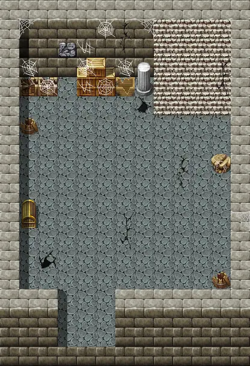

# Laerothbasement2

| | |
|---|---|
| **Map ID** | `laerothbasement2` |
| **Region** | In Lake Laeroth (other) |
| **Type** | Indoors / underground |
| **Size** | 13×19 tiles |
| **Introduced** | [v0.8.11](../versions/0.8.11.md) |
| **NPCs** | 1 |
| **Enemy types** | 1 |
| **Quests** | 1 |

**Laerothbasement2** is an indoor map, in Lake Laeroth (other). It has 1 NPC and 1 kind of enemy. Exits lead to Laerothbasement0, Laerothisland3.

## Map

<label class="lg"><input type="checkbox" data-t="spawn" checked><b>Red</b>&nbsp;Monsters / NPCs</label><label class="lg"><input type="checkbox" data-t="mapchange" checked><b>Blue</b>&nbsp;Exit to another map</label><label class="lg"><input type="checkbox" data-t="container" checked><b>Yellow</b>&nbsp;Container (click to see contents)</label><label class="lg"><input type="checkbox" data-t="sign" checked><b>Purple</b>&nbsp;Sign</label><label class="lg"><input type="checkbox" data-t="rest" checked><b>Green</b>&nbsp;Resting place</label><label class="lg"><input type="checkbox" data-t="key" checked><b>Orange dashed</b>&nbsp;Blocked until a quest step / item</label><label class="lg"><input type="checkbox" data-t="script"><b>Grey dotted</b>&nbsp;Scripted event</label><label class="lg"><input type="checkbox" data-t="replace"><b>White dotted</b>&nbsp;Changes during a quest</label><label class="lg"><input type="checkbox" data-t="pin" checked><b>Numbers</b>&nbsp;Numbered key points (see the key below the map)</label>

<a class="pin pin-exit" href="#key-1" style="left:76.923%;top:7.895%" title="Exit (north): to [Laerothbasement0](laerothbasement0.md)">1</a><a class="pin pin-exit" href="#key-2" style="left:34.615%;top:92.105%" title="Exit (south): to [Laerothisland3](laerothisland3.md)">2</a><a class="pin pin-exit" href="#key-2" style="left:26.923%;top:92.105%" title="Exit (south): to [Laerothisland3](laerothisland3.md)">2</a><a class="pin pin-exit" href="#key-2" style="left:42.308%;top:92.105%" title="Exit (south): to [Laerothisland3](laerothisland3.md)">2</a><a id="pin-npc-forenza" class="pin pin-npc" href="#key-3" style="left:73.077%;top:13.158%" title="[Forenza](../../monsters/forenza.md): 1 quest">3</a><a class="pin pin-replace" href="#key-4" style="left:19.231%;top:23.684%" title="Changes during a quest: This area changes during the quest: The odd coin collector (stage 40: “In the Laeroth basement, I discovered and looted the chest containing the &#x27;Korhald coins&#x27;.”)">4</a><a class="pin pin-script" href="#key-5" style="left:26.923%;top:26.316%" title="Quest trigger: Scripted event: advances the quest: The odd coin collector to stage 30 (“In the Laeroth basement, I noticed a sign on the wall that i could not read in its entirety, but I was able make out the name &#x27;Korhald&#x27;. This makes me wonder if this is a clue?”)">5</a><a class="pin pin-script" href="#key-6" style="left:19.231%;top:28.947%" title="Quest trigger: Scripted event: advances the quest: The odd coin collector to stage 40 (“In the Laeroth basement, I discovered and looted the chest containing the &#x27;Korhald coins&#x27;.”)">6</a>

??? abstract "Key to the numbers on the map"

    | # | What | Details |
    |---|---|---|
    | 1 | Exit (north) | to [Laerothbasement0](laerothbasement0.md) |
    | 2 | Exit (south) | to [Laerothisland3](laerothisland3.md) |
    | 3 | [Forenza](../monsters/forenza.md) | 1 quest |
    | 4 | Changes during a quest | This area changes during the quest: The odd coin collector (stage 40: “In the Laeroth basement, I discovered and looted the chest containing the 'Korhald coins'.”) |
    | 5 | Quest trigger | Scripted event: advances the quest: The odd coin collector to stage 30 (“In the Laeroth basement, I noticed a sign on the wall that i could not read in its entirety, but I was able make out the name 'Korhald'. This makes me wonder if this is a clue?”) |
    | 6 | Quest trigger | Scripted event: advances the quest: The odd coin collector to stage 40 (“In the Laeroth basement, I discovered and looted the chest containing the 'Korhald coins'.”) |

Verified against v0.8.18 map data.

## Connections

| Direction | Leads to | Region there | Map # |
|---|---|---|---|
| North | [Laerothbasement0](laerothbasement0.md) | Lake Laeroth | 1 |
| South | [Laerothisland3](laerothisland3.md) | Lake Laeroth | 2 |

## NPCs

- [Forenza](../monsters/forenza.md) — can be fought — quests: [The odd coin collector](../quests/odd_coin_collector.md) (#3)

## Enemies

| Enemy | HP | Damage | Up to | Notes |
|---|---|---|---|---|
| [Basement spider](../monsters/laerothbasement_spider.md) | 90 | 6–14 | 4 | – |

<small>“Up to” is the most that can be alive at once from the spawn areas on this map.</small>

## Quests

- [The odd coin collector](../quests/odd_coin_collector.md): [Forenza](../monsters/forenza.md) is involved; part of the map changes at stage 40; something on this map advances it; stepping on a trigger here sets stage 30; stepping on a trigger here sets stage 40
- [laeroth_nondisplay (hidden flag)](../quests/laeroth_nondisplay.md): [Forenza](../monsters/forenza.md) is involved

## Points of interest

- **Changes during a quest** (#4): This area changes during the quest: The odd coin collector (stage 40: “In the Laeroth basement, I discovered and looted the chest containing the 'Korhald coins'.”)
- **Quest trigger** (#5): Scripted event: advances the quest: The odd coin collector to stage 30 (“In the Laeroth basement, I noticed a sign on the wall that i could not read in its entirety, but I was able make out the name 'Korhald'. This makes me wonder if this is a clue?”)
- **Quest trigger** (#6): Scripted event: advances the quest: The odd coin collector to stage 40 (“In the Laeroth basement, I discovered and looted the chest containing the 'Korhald coins'.”)

## Version history

| Version | Change |
|---|---|
| [v0.8.11](../versions/0.8.11.md) | Added |

Verified against v0.8.18 and every earlier release back to v0.7.0 (game data compared release by release).

## Community notes

<small>Written by players, not generated from game data. **Observations**: what players notice in-game · **Lore**: the in-world story · **Trivia**: real-world facts, references, development history · **Theory / speculation**: unconfirmed ideas; may just be unfinished content</small>

### Observations

*No notes yet. Contributions are welcome: [add a note](https://github.com/asdfghjkl628/Andor-s-Trail-Wikiiii/new/main/notes/maps?filename=laerothbasement2.md&value=%23%23%20Observations%0A%0A%3C%21--%20what%20players%20notice%20in-game%20--%3E%0A%0A%23%23%20Lore%0A%0A%3C%21--%20the%20in-world%20story%20--%3E%0A%0A%23%23%20Trivia%0A%0A%3C%21--%20real-world%20facts%2C%20references%2C%20development%20history%20--%3E%0A%0A%23%23%20Theory%20/%20speculation%0A%0A%3C%21--%20unconfirmed%20ideas%3B%20may%20just%20be%20unfinished%20content%20--%3E%0A).*

### Lore

*No notes yet. Contributions are welcome: [add a note](https://github.com/asdfghjkl628/Andor-s-Trail-Wikiiii/new/main/notes/maps?filename=laerothbasement2.md&value=%23%23%20Observations%0A%0A%3C%21--%20what%20players%20notice%20in-game%20--%3E%0A%0A%23%23%20Lore%0A%0A%3C%21--%20the%20in-world%20story%20--%3E%0A%0A%23%23%20Trivia%0A%0A%3C%21--%20real-world%20facts%2C%20references%2C%20development%20history%20--%3E%0A%0A%23%23%20Theory%20/%20speculation%0A%0A%3C%21--%20unconfirmed%20ideas%3B%20may%20just%20be%20unfinished%20content%20--%3E%0A).*

### Trivia

*No notes yet. Contributions are welcome: [add a note](https://github.com/asdfghjkl628/Andor-s-Trail-Wikiiii/new/main/notes/maps?filename=laerothbasement2.md&value=%23%23%20Observations%0A%0A%3C%21--%20what%20players%20notice%20in-game%20--%3E%0A%0A%23%23%20Lore%0A%0A%3C%21--%20the%20in-world%20story%20--%3E%0A%0A%23%23%20Trivia%0A%0A%3C%21--%20real-world%20facts%2C%20references%2C%20development%20history%20--%3E%0A%0A%23%23%20Theory%20/%20speculation%0A%0A%3C%21--%20unconfirmed%20ideas%3B%20may%20just%20be%20unfinished%20content%20--%3E%0A).*

### Theory / speculation

*No notes yet. Contributions are welcome: [add a note](https://github.com/asdfghjkl628/Andor-s-Trail-Wikiiii/new/main/notes/maps?filename=laerothbasement2.md&value=%23%23%20Observations%0A%0A%3C%21--%20what%20players%20notice%20in-game%20--%3E%0A%0A%23%23%20Lore%0A%0A%3C%21--%20the%20in-world%20story%20--%3E%0A%0A%23%23%20Trivia%0A%0A%3C%21--%20real-world%20facts%2C%20references%2C%20development%20history%20--%3E%0A%0A%23%23%20Theory%20/%20speculation%0A%0A%3C%21--%20unconfirmed%20ideas%3B%20may%20just%20be%20unfinished%20content%20--%3E%0A).*

??? info "Technical information"

    | | |
    |---|---|
    | Map ID | `laerothbasement2` |
    | File | `res/xml/laerothbasement2.tmx` |
    | Size | 13×19 tiles (416×608 px) |
    | outdoors property | – |
    | Layers drawn | ground, objects, above |
    | Tilesets | map_bed_1, map_border_1, map_bridge_1, map_broken_1, map_cavewall_1, map_cavewall_2, map_cavewall_3, map_chair_table_1, map_crate_1, map_cupboard_1, map_curtain_1, map_entrance_1, map_fence_1, map_fence_2, map_ground_1, map_ground_2, map_ground_3, map_ground_4, map_ground_5, map_ground_6, map_ground_7, map_ground_8, map_indoor_1, map_kitchen_1, map_outdoor_1, map_pillar_1, map_plant_1, map_rock_1, map_roof_1, map_roof_2, map_shop_1, map_sign_ladder_1, map_table_1, map_trail_1, map_tree_1, map_wall_1, map_wall_2, map_wall_3, map_window_1, map_window_2 |
    | Map objects | mapchange: 4, spawn: 2, script: 2, replace: 1 |
    | World map position | – |

<small>Data from v0.8.18</small>
