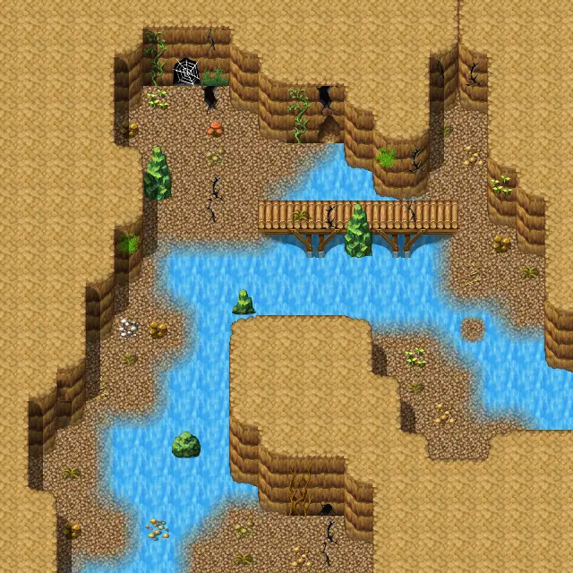
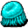
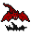
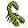

# Laerothcave2

20×20 tiles · part of [Laeroth caves](index.md)

<label class="lg"><input type="checkbox" data-t="spawn" checked><b>Red</b>&nbsp;Monsters / NPCs</label><label class="lg"><input type="checkbox" data-t="mapchange" checked><b>Blue</b>&nbsp;Exit to another map</label><label class="lg"><input type="checkbox" data-t="container" checked><b>Yellow</b>&nbsp;Container (click to see contents)</label><label class="lg"><input type="checkbox" data-t="sign" checked><b>Purple</b>&nbsp;Sign</label><label class="lg"><input type="checkbox" data-t="rest" checked><b>Green</b>&nbsp;Resting place</label><label class="lg"><input type="checkbox" data-t="key" checked><b>Orange dashed</b>&nbsp;Blocked until a quest step / item</label><label class="lg"><input type="checkbox" data-t="script"><b>Grey dotted</b>&nbsp;Scripted event</label><label class="lg"><input type="checkbox" data-t="replace"><b>White dotted</b>&nbsp;Changes during a quest</label>

## Containers

<b>Container 1</b><ul><li><a href="../../items/gem2/">Ruby gem</a> <small>100%</small></li></ul>

## Exits

- [Laerothcave1](laerothcave1.md)
- [Laerothcave3](laerothcave3.md)

## Monsters & NPCs here

| Name | HP |
|---|---|
| [Cave jelly](../monsters/cave_jelly.md) | 30 |
| [Tough cave scorpion](../monsters/cave_scorpion_3.md) | 30 |
| [Armored cave scorpion](../monsters/cave_scorpion_4.md) | 35 |
| [Aggressive cave scorpion](../monsters/cave_scorpion_1.md) | 35 |
| [Fierce cave scorpion](../monsters/cave_scorpion_5.md) | 35 |
| [Cave bat](../monsters/cavebat4.md) | 39 |
| [Aggressive cave bat](../monsters/cavebat5.md) | 41 |
| [Basement spider](../monsters/laerothbasement_spider.md) | 90 |
| [Queen spider](../monsters/spider_queen.md) | 135 |

<small>Map ID: `laerothcave2` · Data from v0.8.18</small>
