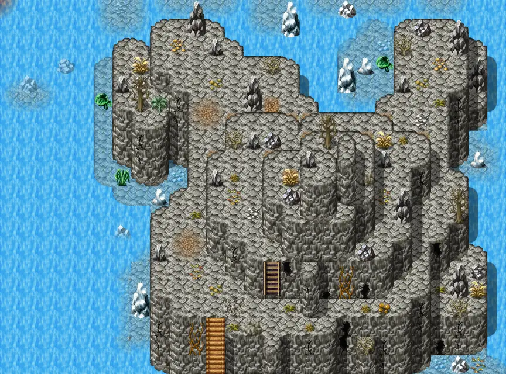

# Laerothisland0

27×20 tiles · outdoors · part of [World1](index.md)

<label class="lg lg-spawn"><input type="checkbox" data-t="spawn" checked> Monsters / NPCs</label><label class="lg lg-mapchange"><input type="checkbox" data-t="mapchange" checked> Exit to another map</label><label class="lg lg-container"><input type="checkbox" data-t="container" checked> Container</label><label class="lg lg-sign"><input type="checkbox" data-t="sign" checked> Sign</label><label class="lg lg-rest"><input type="checkbox" data-t="rest" checked> Resting place</label><label class="lg lg-key"><input type="checkbox" data-t="key" checked> Blocked / needs key or quest</label><label class="lg lg-script"><input type="checkbox" data-t="script"> Scripted event</label><label class="lg lg-replace"><input type="checkbox" data-t="replace"> Changes after a quest</label>

## Exits

- [Laerothisland1](laerothisland1.md)
- [Laerothtomb1](laerothtomb1.md)
- [Mountainlake10a](mountainlake10a.md)
- [Mountainlake21](mountainlake21.md)

## Monsters & NPCs here

| Name | HP |
|---|---|
| [Pond fish](../monsters/pond_fish.md) | 0 |
| [Fish](../monsters/guynmart_fish2.md) | 0 |
| [Young spitting serpent](../monsters/spit_serpent_2.md) | 50 |
| [Spitting serpent](../monsters/spit_serpent_1.md) | 60 |
| [Aggressive spitting serpent](../monsters/spit_serpent_3.md) | 65 |
| [Island lizard](../monsters/island_lizard.md) | 70 |

<small>Map ID: `laerothisland0` · Data from v0.8.18</small>
