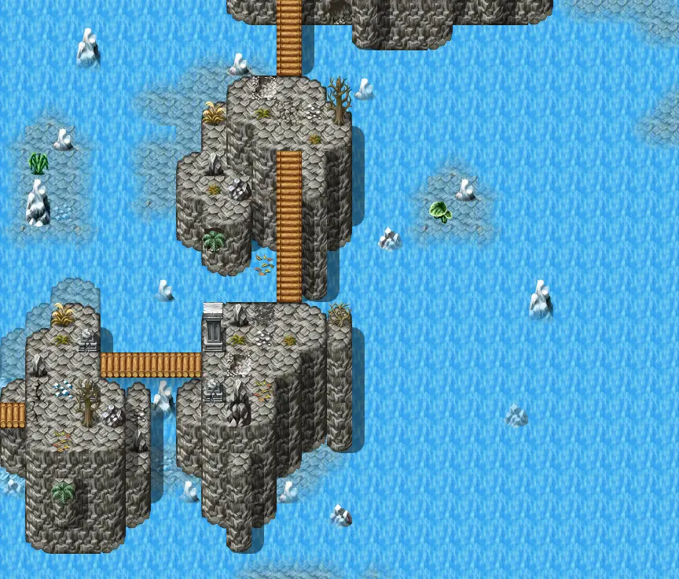
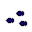

# Laerothisland 1

| | |
|---|---|
| **Map ID** | `laerothisland1` |
| **Region** | Near Lake Laeroth (other) |
| **Type** | Outdoors |
| **Size** | 27×23 tiles |
| **World map** | [World 1](index.md) |
| **Introduced** | [v0.8.11](../versions/0.8.11.md) |
| **Enemy types** | 6 |
| **Quests** | 1 |

**Laerothisland 1** is an outdoor map, near Lake Laeroth (other). It has no NPCs and 6 kinds of enemy. Exits lead to Laerothisland 0, Laerothisland 2.

## Map

<label class="lg"><input type="checkbox" data-t="spawn" checked><b>Red</b>&nbsp;Monsters / NPCs</label><label class="lg"><input type="checkbox" data-t="mapchange" checked><b>Blue</b>&nbsp;Exit to another map</label><label class="lg"><input type="checkbox" data-t="container" checked><b>Yellow</b>&nbsp;Container (click to see contents)</label><label class="lg"><input type="checkbox" data-t="sign" checked><b>Purple</b>&nbsp;Sign</label><label class="lg"><input type="checkbox" data-t="rest" checked><b>Green</b>&nbsp;Resting place</label><label class="lg"><input type="checkbox" data-t="key" checked><b>Orange dashed</b>&nbsp;Blocked until a quest step / item</label><label class="lg"><input type="checkbox" data-t="script"><b>Grey dotted</b>&nbsp;Scripted event</label><label class="lg"><input type="checkbox" data-t="replace"><b>White dotted</b>&nbsp;Changes during a quest</label><label class="lg"><input type="checkbox" data-t="pin" checked><b>Numbers</b>&nbsp;Numbered key points (see the key below the map)</label>

<a class="pin pin-exit" href="#key-1" style="left:42.593%;top:2.174%" title="Exit (north): to [Laerothisland 0](laerothisland0.md)">1</a><a class="pin pin-exit" href="#key-2" style="left:1.852%;top:71.739%" title="Exit (west): to [Laerothisland 2](laerothisland2.md)">2</a><a class="pin pin-script" href="#key-3" style="left:42.593%;top:10.870%" title="Quest trigger: Scripted event: advances the quest: The last lord of Laeroth to stage 15 (“I didn&#x27;t really care about where the last lord went. I left this place, and whatever happened to him didn&#x27;t make any difference to me.”)">3</a>

??? abstract "Key to the numbers on the map"

    | # | What | Details |
    |---|---|---|
    | 1 | Exit (north) | to [Laerothisland 0](laerothisland0.md) |
    | 2 | Exit (west) | to [Laerothisland 2](laerothisland2.md) |
    | 3 | Quest trigger | Scripted event: advances the quest: The last lord of Laeroth to stage 15 (“I didn't really care about where the last lord went. I left this place, and whatever happened to him didn't make any difference to me.”) |

Verified against v0.8.18 map data.

## Connections

| Direction | Leads to | Region there | Map # |
|---|---|---|---|
| North | [Laerothisland 0](laerothisland0.md) | Lake Laeroth | 1 |
| West | [Laerothisland 2](laerothisland2.md) | Lake Laeroth | 2 |

## Enemies

| Enemy | HP | Damage | Up to | Notes |
|---|---|---|---|---|
| [Pond fish](../monsters/pond_fish.md) | 0 | 0–0 | 10 | – |
| [Fish](../monsters/brv_fish1.md#v-guynmart_fish2) | 0 | 0–0 | 3 | – |
| [Young spitting serpent](../monsters/spit_serpent_2.md) | 50 | 1–7 | 8 | shares spawn with Aggressive spitting serpent, Spitting serpent |
| [Spitting serpent](../monsters/spit_serpent_1.md) | 60 | 2–7 | 8 | shares spawn with Aggressive spitting serpent, Young spitting serpent |
| [Aggressive spitting serpent](../monsters/spit_serpent_3.md) | 65 | 3–9 | 8 | shares spawn with Spitting serpent, Young spitting serpent |
| [Island lizard](../monsters/island_lizard.md) | 70 | 5–9 | 2 | – |

<small>“Up to” is the most that can be alive at once from the spawn areas on this map.</small>

## Quests

- [The last lord of Laeroth](../quests/last_lord.md): something on this map advances it; stepping on a trigger here sets stage 10; stepping on a trigger here sets stage 15

## Points of interest

- **Quest trigger** (#3): Scripted event: advances the quest: The last lord of Laeroth to stage 15 (“I didn't really care about where the last lord went. I left this place, and whatever happened to him didn't make any difference to me.”)

## Version history

| Version | Change |
|---|---|
| [v0.8.11](../versions/0.8.11.md) | Added |
| [v0.8.12.1](../versions/0.8.12.1.md) | Map layout or objects changed |
| [v0.8.18](../versions/0.8.18.md) | Map layout or objects changed |

Verified against v0.8.18 and every earlier release back to v0.7.0 (game data compared release by release).

## Community notes

<small>Written by players, not generated from game data. **Observations**: what players notice in-game · **Lore**: the in-world story · **Trivia**: real-world facts, references, development history · **Theory / speculation**: unconfirmed ideas; may just be unfinished content</small>

### Observations

*No notes yet. Contributions are welcome: [add a note](https://github.com/asdfghjkl628/Andor-s-Trail-Wikiiii/new/main/notes/maps?filename=laerothisland1.md&value=%23%23%20Observations%0A%0A%3C%21--%20what%20players%20notice%20in-game%20--%3E%0A%0A%23%23%20Lore%0A%0A%3C%21--%20the%20in-world%20story%20--%3E%0A%0A%23%23%20Trivia%0A%0A%3C%21--%20real-world%20facts%2C%20references%2C%20development%20history%20--%3E%0A%0A%23%23%20Theory%20/%20speculation%0A%0A%3C%21--%20unconfirmed%20ideas%3B%20may%20just%20be%20unfinished%20content%20--%3E%0A).*

### Lore

*No notes yet. Contributions are welcome: [add a note](https://github.com/asdfghjkl628/Andor-s-Trail-Wikiiii/new/main/notes/maps?filename=laerothisland1.md&value=%23%23%20Observations%0A%0A%3C%21--%20what%20players%20notice%20in-game%20--%3E%0A%0A%23%23%20Lore%0A%0A%3C%21--%20the%20in-world%20story%20--%3E%0A%0A%23%23%20Trivia%0A%0A%3C%21--%20real-world%20facts%2C%20references%2C%20development%20history%20--%3E%0A%0A%23%23%20Theory%20/%20speculation%0A%0A%3C%21--%20unconfirmed%20ideas%3B%20may%20just%20be%20unfinished%20content%20--%3E%0A).*

### Trivia

*No notes yet. Contributions are welcome: [add a note](https://github.com/asdfghjkl628/Andor-s-Trail-Wikiiii/new/main/notes/maps?filename=laerothisland1.md&value=%23%23%20Observations%0A%0A%3C%21--%20what%20players%20notice%20in-game%20--%3E%0A%0A%23%23%20Lore%0A%0A%3C%21--%20the%20in-world%20story%20--%3E%0A%0A%23%23%20Trivia%0A%0A%3C%21--%20real-world%20facts%2C%20references%2C%20development%20history%20--%3E%0A%0A%23%23%20Theory%20/%20speculation%0A%0A%3C%21--%20unconfirmed%20ideas%3B%20may%20just%20be%20unfinished%20content%20--%3E%0A).*

### Theory / speculation

*No notes yet. Contributions are welcome: [add a note](https://github.com/asdfghjkl628/Andor-s-Trail-Wikiiii/new/main/notes/maps?filename=laerothisland1.md&value=%23%23%20Observations%0A%0A%3C%21--%20what%20players%20notice%20in-game%20--%3E%0A%0A%23%23%20Lore%0A%0A%3C%21--%20the%20in-world%20story%20--%3E%0A%0A%23%23%20Trivia%0A%0A%3C%21--%20real-world%20facts%2C%20references%2C%20development%20history%20--%3E%0A%0A%23%23%20Theory%20/%20speculation%0A%0A%3C%21--%20unconfirmed%20ideas%3B%20may%20just%20be%20unfinished%20content%20--%3E%0A).*

??? info "Technical information"

    | | |
    |---|---|
    | Map ID | `laerothisland1` |
    | File | `res/xml/laerothisland1.tmx` |
    | Size | 27×23 tiles (864×736 px) |
    | outdoors property | 1 |
    | Layers drawn | base, ground, objects, above, top |
    | Tilesets | map_bed_1, map_border_1, map_bridge_1, map_broken_1, map_cavewall_1, map_cavewall_2, map_cavewall_3, map_chair_table_1, map_crate_1, map_cupboard_1, map_curtain_1, map_entrance_1, map_fence_1, map_fence_2, map_ground_1, map_ground_2, map_ground_3, map_ground_4, map_ground_5, map_ground_6, map_ground_7, map_ground_8, map_guynmart, map_indoor_1, map_kitchen_1, map_outdoor_1, map_pillar_1, map_plant_1, map_plant_3, map_rock_1, map_roof_1, map_roof_2, map_shop_1, map_sign_ladder_1, map_table_1, map_trail_1, map_transition_1, map_tree_1, map_wall_1, map_wall_2, map_wall_3, map_window_1, map_window_2 |
    | Map objects | spawn: 5, mapchange: 2, script: 1 |
    | World map position | segment `world1`, x 743, y 73 |

<small>Data from v0.8.18</small>
