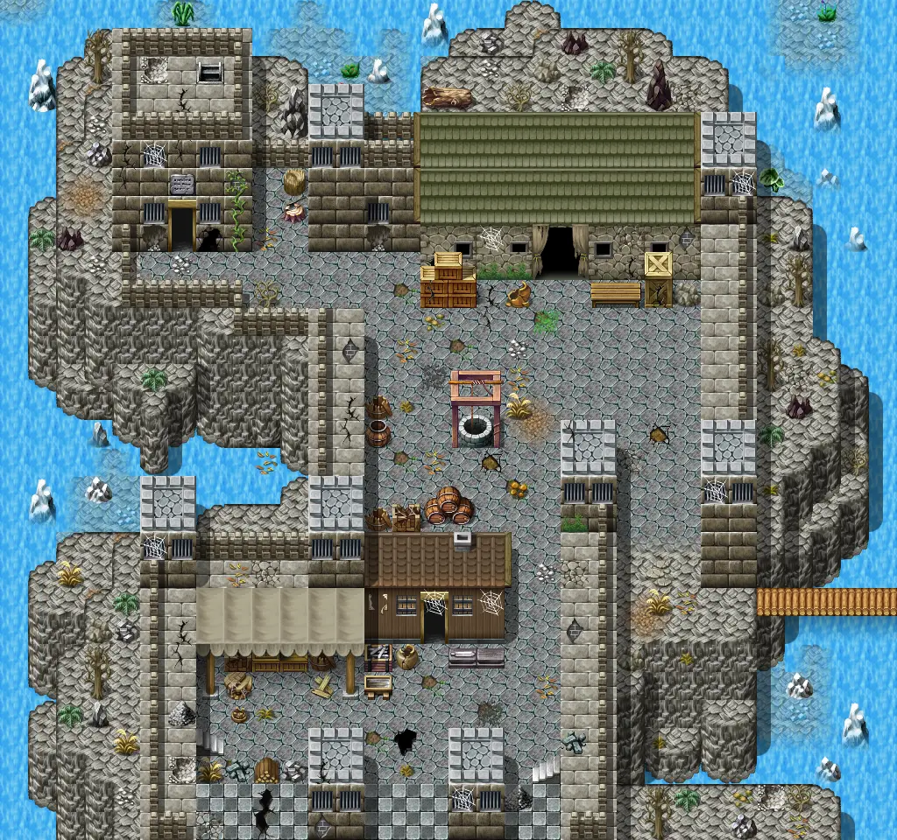

# Laerothisland2

32×30 tiles · outdoors · part of [World1](index.md)

<label class="lg"><input type="checkbox" data-t="spawn" checked><b>Red</b>&nbsp;Monsters / NPCs</label><label class="lg"><input type="checkbox" data-t="mapchange" checked><b>Blue</b>&nbsp;Exit to another map</label><label class="lg"><input type="checkbox" data-t="container" checked><b>Yellow</b>&nbsp;Container (click to see contents)</label><label class="lg"><input type="checkbox" data-t="sign" checked><b>Purple</b>&nbsp;Sign</label><label class="lg"><input type="checkbox" data-t="rest" checked><b>Green</b>&nbsp;Resting place</label><label class="lg"><input type="checkbox" data-t="key" checked><b>Orange dashed</b>&nbsp;Blocked until a quest step / item</label><label class="lg"><input type="checkbox" data-t="script"><b>Grey dotted</b>&nbsp;Scripted event</label><label class="lg"><input type="checkbox" data-t="replace"><b>White dotted</b>&nbsp;Changes during a quest</label>

## Exits

- [Laerothbarn0](laerothbarn0.md)
- [Laerothbasement1](laerothbasement1.md)
- [Laerothisland1](laerothisland1.md)
- [Laerothisland3](laerothisland3.md)
- [Laerothprison0](laerothprison0.md)
- [Laerothprison1](laerothprison1.md)
- [Laerothsmith0](laerothsmith0.md)

## Monsters & NPCs here

| Name | HP |
|---|---|
| [Young spitting serpent](../monsters/spit_serpent_2.md) | 50 |
| [Spitting serpent](../monsters/spit_serpent_1.md) | 60 |
| [Aggressive spitting serpent](../monsters/spit_serpent_3.md) | 65 |
| [Island lizard](../monsters/island_lizard.md) | 70 |

<small>Map ID: `laerothisland2` · Data from v0.8.18</small>
