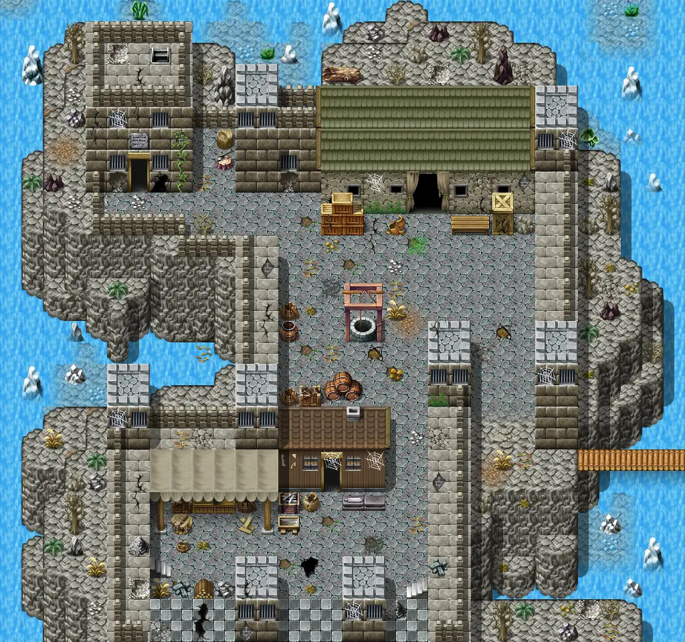

# Laerothisland2

| | |
|---|---|
| **Map ID** | `laerothisland2` |
| **Region** | In Lake Laeroth (other) |
| **Type** | Outdoors |
| **Size** | 32×30 tiles |
| **World map** | [World1](index.md) |
| **Introduced** | [v0.8.11](../versions/0.8.11.md) |
| **Enemy types** | 4 |
| **Quests** | 0 |

**Laerothisland2** is an outdoor map, in Lake Laeroth (other). It has no NPCs and 4 kinds of enemy. Exits lead to Laerothisland1, Laerothisland3, Laerothbarn0, Laerothbasement1 and 3 more.

## Map

<label class="lg"><input type="checkbox" data-t="spawn" checked><b>Red</b>&nbsp;Monsters / NPCs</label><label class="lg"><input type="checkbox" data-t="mapchange" checked><b>Blue</b>&nbsp;Exit to another map</label><label class="lg"><input type="checkbox" data-t="container" checked><b>Yellow</b>&nbsp;Container (click to see contents)</label><label class="lg"><input type="checkbox" data-t="sign" checked><b>Purple</b>&nbsp;Sign</label><label class="lg"><input type="checkbox" data-t="rest" checked><b>Green</b>&nbsp;Resting place</label><label class="lg"><input type="checkbox" data-t="key" checked><b>Orange dashed</b>&nbsp;Blocked until a quest step / item</label><label class="lg"><input type="checkbox" data-t="script"><b>Grey dotted</b>&nbsp;Scripted event</label><label class="lg"><input type="checkbox" data-t="replace"><b>White dotted</b>&nbsp;Changes during a quest</label><label class="lg"><input type="checkbox" data-t="pin" checked><b>Numbers</b>&nbsp;Numbered key points (see the key below the map)</label>

<a class="pin pin-exit" href="#key-1" style="left:98.438%;top:71.667%" title="Exit (east): to [Laerothisland1](laerothisland1.md)">1</a><a class="pin pin-exit" href="#key-2" style="left:28.125%;top:98.333%" title="Exit (south): to [Laerothisland3](laerothisland3.md)">2</a><a class="pin pin-exit" href="#key-2" style="left:59.375%;top:98.333%" title="Exit (south): to [Laerothisland3](laerothisland3.md)">2</a><a class="pin pin-exit" href="#key-3" style="left:62.500%;top:31.667%" title="Exit (door): to [Laerothbarn0](laerothbarn0.md)">3</a><a class="pin pin-exit" href="#key-4" style="left:45.312%;top:91.667%" title="Exit (cave entrance): to [Laerothbasement1](laerothbasement1.md)">4</a><a class="pin pin-exit" href="#key-5" style="left:20.312%;top:28.333%" title="Exit (door): to [Laerothprison0](laerothprison0.md)">5</a><a class="pin pin-exit" href="#key-6" style="left:23.438%;top:8.333%" title="Exit (door): to [Laerothprison1](laerothprison1.md)">6</a><a class="pin pin-exit" href="#key-7" style="left:48.438%;top:75.000%" title="Exit (door): to [Laerothsmith0](laerothsmith0.md)">7</a>

??? abstract "Key to the numbers on the map"

    | # | What | Details |
    |---|---|---|
    | 1 | Exit (east) | to [Laerothisland1](laerothisland1.md) |
    | 2 | Exit (south) | to [Laerothisland3](laerothisland3.md) |
    | 3 | Exit (door) | to [Laerothbarn0](laerothbarn0.md) |
    | 4 | Exit (cave entrance) | to [Laerothbasement1](laerothbasement1.md) |
    | 5 | Exit (door) | to [Laerothprison0](laerothprison0.md) |
    | 6 | Exit (door) | to [Laerothprison1](laerothprison1.md) |
    | 7 | Exit (door) | to [Laerothsmith0](laerothsmith0.md) |

Verified against v0.8.18 map data.

## Connections

| Direction | Leads to | Region there | Map # |
|---|---|---|---|
| East | [Laerothisland1](laerothisland1.md) | Lake Laeroth | 1 |
| South | [Laerothisland3](laerothisland3.md) | Lake Laeroth | 2 |
| Door | [Laerothbarn0](laerothbarn0.md) | Lake Laeroth | 3 |
| Cave entrance | [Laerothbasement1](laerothbasement1.md) | Lake Laeroth | 4 |
| Door | [Laerothprison0](laerothprison0.md) | Lake Laeroth | 5 |
| Door | [Laerothprison1](laerothprison1.md) | Lake Laeroth | 6 |
| Door | [Laerothsmith0](laerothsmith0.md) | Lake Laeroth | 7 |

## Enemies

| Enemy | HP | Damage | Up to | Notes |
|---|---|---|---|---|
| [Young spitting serpent](../monsters/spit_serpent_2.md) | 50 | 1–7 | 10 | shares spawn with Aggressive spitting serpent, Spitting serpent |
| [Spitting serpent](../monsters/spit_serpent_1.md) | 60 | 2–7 | 10 | shares spawn with Aggressive spitting serpent, Young spitting serpent |
| [Aggressive spitting serpent](../monsters/spit_serpent_3.md) | 65 | 3–9 | 10 | shares spawn with Spitting serpent, Young spitting serpent |
| [Island lizard](../monsters/island_lizard.md) | 70 | 5–9 | 3 | – |

<small>“Up to” is the most that can be alive at once from the spawn areas on this map.</small>

## Version history

| Version | Change |
|---|---|
| [v0.8.11](../versions/0.8.11.md) | Added |
| [v0.8.12.1](../versions/0.8.12.1.md) | Map layout or objects changed |
| [v0.8.18](../versions/0.8.18.md) | Map layout or objects changed |

Verified against v0.8.18 and every earlier release back to v0.7.0 (game data compared release by release).

## Community notes

<small>Written by players, not generated from game data. **Observations**: what players notice in-game · **Lore**: the in-world story · **Trivia**: real-world facts, references, development history · **Theory / speculation**: unconfirmed ideas; may just be unfinished content</small>

### Observations

*No notes yet. Contributions are welcome: [add a note](https://github.com/asdfghjkl628/Andor-s-Trail-Wikiiii/new/main/notes/maps?filename=laerothisland2.md&value=%23%23%20Observations%0A%0A%3C%21--%20what%20players%20notice%20in-game%20--%3E%0A%0A%23%23%20Lore%0A%0A%3C%21--%20the%20in-world%20story%20--%3E%0A%0A%23%23%20Trivia%0A%0A%3C%21--%20real-world%20facts%2C%20references%2C%20development%20history%20--%3E%0A%0A%23%23%20Theory%20/%20speculation%0A%0A%3C%21--%20unconfirmed%20ideas%3B%20may%20just%20be%20unfinished%20content%20--%3E%0A).*

### Lore

*No notes yet. Contributions are welcome: [add a note](https://github.com/asdfghjkl628/Andor-s-Trail-Wikiiii/new/main/notes/maps?filename=laerothisland2.md&value=%23%23%20Observations%0A%0A%3C%21--%20what%20players%20notice%20in-game%20--%3E%0A%0A%23%23%20Lore%0A%0A%3C%21--%20the%20in-world%20story%20--%3E%0A%0A%23%23%20Trivia%0A%0A%3C%21--%20real-world%20facts%2C%20references%2C%20development%20history%20--%3E%0A%0A%23%23%20Theory%20/%20speculation%0A%0A%3C%21--%20unconfirmed%20ideas%3B%20may%20just%20be%20unfinished%20content%20--%3E%0A).*

### Trivia

*No notes yet. Contributions are welcome: [add a note](https://github.com/asdfghjkl628/Andor-s-Trail-Wikiiii/new/main/notes/maps?filename=laerothisland2.md&value=%23%23%20Observations%0A%0A%3C%21--%20what%20players%20notice%20in-game%20--%3E%0A%0A%23%23%20Lore%0A%0A%3C%21--%20the%20in-world%20story%20--%3E%0A%0A%23%23%20Trivia%0A%0A%3C%21--%20real-world%20facts%2C%20references%2C%20development%20history%20--%3E%0A%0A%23%23%20Theory%20/%20speculation%0A%0A%3C%21--%20unconfirmed%20ideas%3B%20may%20just%20be%20unfinished%20content%20--%3E%0A).*

### Theory / speculation

*No notes yet. Contributions are welcome: [add a note](https://github.com/asdfghjkl628/Andor-s-Trail-Wikiiii/new/main/notes/maps?filename=laerothisland2.md&value=%23%23%20Observations%0A%0A%3C%21--%20what%20players%20notice%20in-game%20--%3E%0A%0A%23%23%20Lore%0A%0A%3C%21--%20the%20in-world%20story%20--%3E%0A%0A%23%23%20Trivia%0A%0A%3C%21--%20real-world%20facts%2C%20references%2C%20development%20history%20--%3E%0A%0A%23%23%20Theory%20/%20speculation%0A%0A%3C%21--%20unconfirmed%20ideas%3B%20may%20just%20be%20unfinished%20content%20--%3E%0A).*

??? info "Technical information"

    | | |
    |---|---|
    | Map ID | `laerothisland2` |
    | File | `res/xml/laerothisland2.tmx` |
    | Size | 32×30 tiles (1024×960 px) |
    | outdoors property | 1 |
    | Layers drawn | base, ground, objects, above, top |
    | Tilesets | map_bed_1, map_border_1, map_bridge_1, map_broken_1, map_cavewall_1, map_cavewall_2, map_cavewall_3, map_chair_table_1, map_crate_1, map_cupboard_1, map_curtain_1, map_entrance_1, map_fence_1, map_fence_2, map_ground_1, map_ground_2, map_ground_3, map_ground_4, map_ground_5, map_ground_6, map_ground_7, map_ground_8, map_guynmart, map_indoor_1, map_kitchen_1, map_outdoor_1, map_pillar_1, map_plant_1, map_plant_3, map_rock_1, map_roof_1, map_roof_2, map_shop_1, map_sign_ladder_1, map_table_1, map_trail_1, map_transition_1, map_tree_1, map_wall_1, map_wall_2, map_wall_3, map_window_1, map_window_2 |
    | Map objects | mapchange: 8, spawn: 4 |
    | World map position | segment `world1`, x 710, y 68 |

<small>Data from v0.8.18</small>
