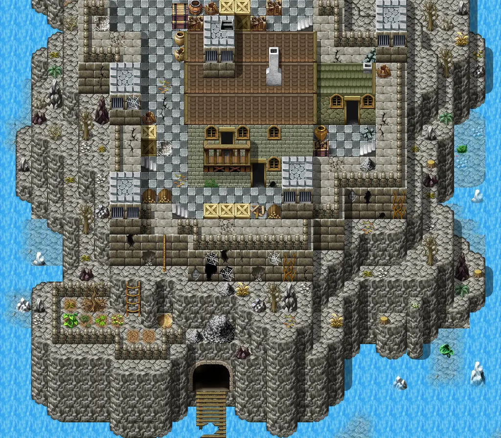

# Laerothisland3

32×28 tiles · outdoors · part of [World1](index.md)

<label class="lg lg-spawn"><input type="checkbox" data-t="spawn" checked> Monsters / NPCs</label><label class="lg lg-mapchange"><input type="checkbox" data-t="mapchange" checked> Exit to another map</label><label class="lg lg-container"><input type="checkbox" data-t="container" checked> Container</label><label class="lg lg-sign"><input type="checkbox" data-t="sign" checked> Sign</label><label class="lg lg-rest"><input type="checkbox" data-t="rest" checked> Resting place</label><label class="lg lg-key"><input type="checkbox" data-t="key" checked> Blocked / needs key or quest</label><label class="lg lg-script"><input type="checkbox" data-t="script"> Scripted event</label><label class="lg lg-replace"><input type="checkbox" data-t="replace"> Changes after a quest</label>

## Exits

- [Laerothbasement2](laerothbasement2.md)
- [Laerothisland2](laerothisland2.md)
- [Laerothmanor0](laerothmanor0.md)
- [Laerothmanor2](laerothmanor2.md)
- [Laerothmanor3](laerothmanor3.md)
- [Mountainlake2](mountainlake2.md)
- [Mountainlake37](mountainlake37.md)

## Monsters & NPCs here

| Name | HP |
|---|---|
| [Young spitting serpent](../monsters/spit_serpent_2.md) | 50 |
| [Spitting serpent](../monsters/spit_serpent_1.md) | 60 |
| [Aggressive spitting serpent](../monsters/spit_serpent_3.md) | 65 |
| [Island lizard](../monsters/island_lizard.md) | 70 |

<small>Map ID: `laerothisland3` · Data from v0.8.18</small>
