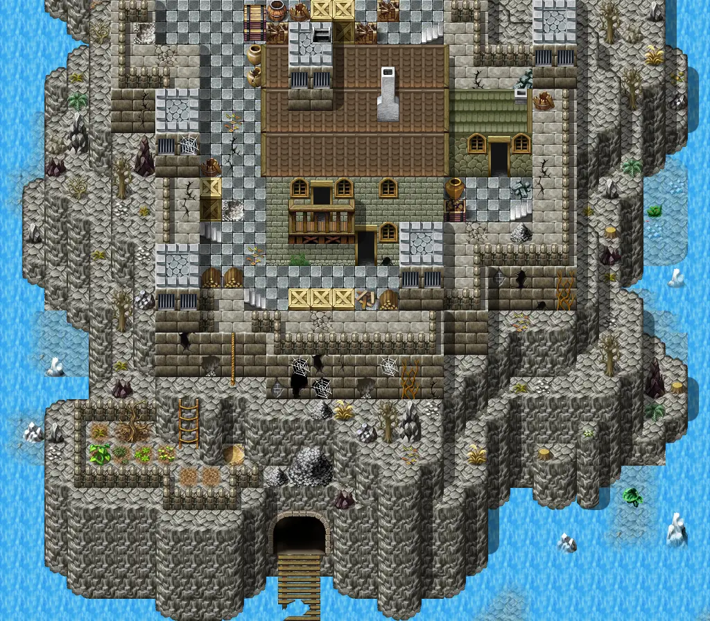

# Laerothisland3

| | |
|---|---|
| **Map ID** | `laerothisland3` |
| **Region** | Near Lake Laeroth (other) |
| **Type** | Outdoors |
| **Size** | 32×28 tiles |
| **World map** | [World1](index.md) |
| **Introduced** | [v0.8.11](../versions/0.8.11.md) |
| **Enemy types** | 4 |
| **Quests** | 0 |
| **Containers** | 2 |

**Laerothisland3** is an outdoor map, near Lake Laeroth (other). It has no NPCs and 4 kinds of enemy. Exits lead to Laerothisland2, Laerothmanor2, Mountainlake37, Mountainlake2 and 3 more.

## Map

<label class="lg"><input type="checkbox" data-t="spawn" checked><b>Red</b>&nbsp;Monsters / NPCs</label><label class="lg"><input type="checkbox" data-t="mapchange" checked><b>Blue</b>&nbsp;Exit to another map</label><label class="lg"><input type="checkbox" data-t="container" checked><b>Yellow</b>&nbsp;Container (click to see contents)</label><label class="lg"><input type="checkbox" data-t="sign" checked><b>Purple</b>&nbsp;Sign</label><label class="lg"><input type="checkbox" data-t="rest" checked><b>Green</b>&nbsp;Resting place</label><label class="lg"><input type="checkbox" data-t="key" checked><b>Orange dashed</b>&nbsp;Blocked until a quest step / item</label><label class="lg"><input type="checkbox" data-t="script"><b>Grey dotted</b>&nbsp;Scripted event</label><label class="lg"><input type="checkbox" data-t="replace"><b>White dotted</b>&nbsp;Changes during a quest</label><label class="lg"><input type="checkbox" data-t="pin" checked><b>Numbers</b>&nbsp;Numbered key points (see the key below the map)</label>

<a class="pin pin-exit" href="#key-1" style="left:28.125%;top:1.786%" title="Exit (north): to [Laerothisland2](../laerothisland2.md)">1</a><a class="pin pin-exit" href="#key-1" style="left:59.375%;top:1.786%" title="Exit (north): to [Laerothisland2](../laerothisland2.md)">1</a><a class="pin pin-exit" href="#key-2" style="left:45.312%;top:5.357%" title="Exit (north): to [Laerothmanor2](../laerothmanor2.md)">2</a><a class="pin pin-exit" href="#key-3" style="left:98.438%;top:91.071%" title="Exit (east): to [Mountainlake37](../mountainlake37.md)">3</a><a class="pin pin-exit" href="#key-4" style="left:85.938%;top:98.214%" title="Exit (south): to [Mountainlake2](../mountainlake2.md)">4</a><a class="pin pin-exit" href="#key-5" style="left:42.188%;top:87.500%" title="Exit (cave entrance): to [Laerothbasement2](../laerothbasement2.md)">5</a><a class="pin pin-exit" href="#key-6" style="left:51.562%;top:41.071%" title="Exit (door): to [Laerothmanor0](../laerothmanor0.md)">6</a><a class="pin pin-exit" href="#key-7" style="left:70.312%;top:26.786%" title="Exit (door): to [Laerothmanor3](../laerothmanor3.md)">7</a><a class="pin pin-container" href="#key-8" style="left:42.188%;top:66.071%" title="Container 1: Polished sparkling gem, Gold coins">8</a><a class="pin pin-container" href="#key-9" style="left:76.562%;top:16.071%" title="Container 2: Mead">9</a><a class="pin pin-key" href="#key-10" style="left:42.188%;top:98.214%" title="Blocked passage: Unlocked during the quest: hidden story flag “nondisplay_2” (stage 220: “You will never get this quest stage (used for lookout)”)">10</a><a class="pin pin-key" href="#key-10" style="left:42.188%;top:1.786%" title="Blocked passage: Unlocked during the quest: hidden story flag “nondisplay_2” (stage 220: “You will never get this quest stage (used for lookout)”)">10</a><a class="pin pin-key" href="#key-10" style="left:48.438%;top:8.929%" title="Blocked passage: Unlocked during the quest: hidden story flag “nondisplay_2” (stage 220: “You will never get this quest stage (used for lookout)”)">10</a><a class="pin pin-key" href="#key-10" style="left:43.750%;top:12.500%" title="Blocked passage: Unlocked during the quest: hidden story flag “nondisplay_2” (stage 220: “You will never get this quest stage (used for lookout)”)">10</a><a class="pin pin-key" href="#key-10" style="left:39.062%;top:7.143%" title="Blocked passage: Unlocked during the quest: hidden story flag “nondisplay_2” (stage 220: “You will never get this quest stage (used for lookout)”)">10</a>

??? abstract "Key to the numbers on the map"

    | # | What | Details |
    |---|---|---|
    | 1 | Exit (north) | to [Laerothisland2](../laerothisland2.md) |
    | 2 | Exit (north) | to [Laerothmanor2](../laerothmanor2.md) |
    | 3 | Exit (east) | to [Mountainlake37](../mountainlake37.md) |
    | 4 | Exit (south) | to [Mountainlake2](../mountainlake2.md) |
    | 5 | Exit (cave entrance) | to [Laerothbasement2](../laerothbasement2.md) |
    | 6 | Exit (door) | to [Laerothmanor0](../laerothmanor0.md) |
    | 7 | Exit (door) | to [Laerothmanor3](../laerothmanor3.md) |
    | 8 | Container 1 | Polished sparkling gem, Gold coins |
    | 9 | Container 2 | Mead |
    | 10 | Blocked passage | Unlocked during the quest: hidden story flag “nondisplay_2” (stage 220: “You will never get this quest stage (used for lookout)”) |

Verified against v0.8.18 map data.

## Connections

| Direction | Leads to | Region there | Map # |
|---|---|---|---|
| North | [Laerothisland2](laerothisland2.md) | Lake Laeroth | 1 |
| North | [Laerothmanor2](laerothmanor2.md) | Lake Laeroth | 2 |
| East | [Mountainlake37](mountainlake37.md) | Lake Laeroth | 3 |
| South | [Mountainlake2](mountainlake2.md) | Lake Laeroth | 4 |
| Cave entrance | [Laerothbasement2](laerothbasement2.md) | Lake Laeroth | 5 |
| Door | [Laerothmanor0](laerothmanor0.md) | Lake Laeroth | 6 |
| Door | [Laerothmanor3](laerothmanor3.md) | Lake Laeroth | 7 |

## Enemies

| Enemy | HP | Damage | Up to | Notes |
|---|---|---|---|---|
| [Young spitting serpent](../monsters/spit_serpent_2.md) | 50 | 1–7 | 5 | shares spawn with Aggressive spitting serpent, Spitting serpent |
| [Spitting serpent](../monsters/spit_serpent_1.md) | 60 | 2–7 | 6 | shares spawn with Aggressive spitting serpent, Young spitting serpent |
| [Aggressive spitting serpent](../monsters/spit_serpent_3.md) | 65 | 3–9 | 6 | shares spawn with Spitting serpent, Young spitting serpent |
| [Island lizard](../monsters/island_lizard.md) | 70 | 5–9 | 2 | – |

<small>“Up to” is the most that can be alive at once from the spawn areas on this map.</small>

## Items & containers

<b>Container 1</b><ul><li><a href="../../items/gem5/">Polished sparkling gem</a> <small>100%</small></li><li><a href="../../items/gold/">Gold coins</a> <small>100% · ×50 to 90</small></li></ul>

<b>Container 2</b><ul><li><a href="../../items/mead/">Mead</a> <small>100% · ×1 to 2</small></li></ul>

## Quests

- [Placeholder for hidden quest stages 2 (not displayed) (hidden flag)](../quests/nondisplay_2.md): blocked passage opens at stage 220

## Points of interest

- **Blocked passage** (#10): Unlocked during the quest: hidden story flag “nondisplay_2” (stage 220: “You will never get this quest stage (used for lookout)”)

## Version history

| Version | Change |
|---|---|
| [v0.8.11](../versions/0.8.11.md) | Added |
| [v0.8.18](../versions/0.8.18.md) | map layout or objects changed |

Verified against v0.8.18 and every earlier release back to v0.7.0 (game data compared release by release).

## Community notes

<small>Written by players, not generated from game data. **Observations**: what players notice in-game · **Lore**: the in-world story · **Trivia**: real-world facts, references, development history · **Theory / speculation**: unconfirmed ideas; may just be unfinished content</small>

### Observations

*Nothing here yet. Know something? [Add it](https://github.com/asdfghjkl628/Andor-s-Trail-Wikiiii/new/main/notes/maps?filename=laerothisland3.md&value=%23%23%20Observations%0A%0A%3C%21--%20what%20players%20notice%20in-game%20--%3E%0A%0A%23%23%20Lore%0A%0A%3C%21--%20the%20in-world%20story%20--%3E%0A%0A%23%23%20Trivia%0A%0A%3C%21--%20real-world%20facts%2C%20references%2C%20development%20history%20--%3E%0A%0A%23%23%20Theory%20/%20speculation%0A%0A%3C%21--%20unconfirmed%20ideas%3B%20may%20just%20be%20unfinished%20content%20--%3E%0A).*

### Lore

*Nothing here yet. Know something? [Add it](https://github.com/asdfghjkl628/Andor-s-Trail-Wikiiii/new/main/notes/maps?filename=laerothisland3.md&value=%23%23%20Observations%0A%0A%3C%21--%20what%20players%20notice%20in-game%20--%3E%0A%0A%23%23%20Lore%0A%0A%3C%21--%20the%20in-world%20story%20--%3E%0A%0A%23%23%20Trivia%0A%0A%3C%21--%20real-world%20facts%2C%20references%2C%20development%20history%20--%3E%0A%0A%23%23%20Theory%20/%20speculation%0A%0A%3C%21--%20unconfirmed%20ideas%3B%20may%20just%20be%20unfinished%20content%20--%3E%0A).*

### Trivia

*Nothing here yet. Know something? [Add it](https://github.com/asdfghjkl628/Andor-s-Trail-Wikiiii/new/main/notes/maps?filename=laerothisland3.md&value=%23%23%20Observations%0A%0A%3C%21--%20what%20players%20notice%20in-game%20--%3E%0A%0A%23%23%20Lore%0A%0A%3C%21--%20the%20in-world%20story%20--%3E%0A%0A%23%23%20Trivia%0A%0A%3C%21--%20real-world%20facts%2C%20references%2C%20development%20history%20--%3E%0A%0A%23%23%20Theory%20/%20speculation%0A%0A%3C%21--%20unconfirmed%20ideas%3B%20may%20just%20be%20unfinished%20content%20--%3E%0A).*

### Theory / speculation

*Nothing here yet. Know something? [Add it](https://github.com/asdfghjkl628/Andor-s-Trail-Wikiiii/new/main/notes/maps?filename=laerothisland3.md&value=%23%23%20Observations%0A%0A%3C%21--%20what%20players%20notice%20in-game%20--%3E%0A%0A%23%23%20Lore%0A%0A%3C%21--%20the%20in-world%20story%20--%3E%0A%0A%23%23%20Trivia%0A%0A%3C%21--%20real-world%20facts%2C%20references%2C%20development%20history%20--%3E%0A%0A%23%23%20Theory%20/%20speculation%0A%0A%3C%21--%20unconfirmed%20ideas%3B%20may%20just%20be%20unfinished%20content%20--%3E%0A).*

??? info "Technical information"

    | | |
    |---|---|
    | Map ID | `laerothisland3` |
    | File | `res/xml/laerothisland3.tmx` |
    | Size | 32×28 tiles (1024×896 px) |
    | outdoors property | 1 |
    | Layers drawn | base, ground, objects, above, top |
    | Tilesets | map_bed_1, map_border_1, map_bridge_1, map_broken_1, map_cavewall_1, map_cavewall_2, map_cavewall_3, map_chair_table_1, map_crate_1, map_cupboard_1, map_curtain_1, map_entrance_1, map_fence_1, map_fence_2, map_ground_1, map_ground_2, map_ground_3, map_ground_4, map_ground_5, map_ground_6, map_ground_7, map_ground_8, map_guynmart, map_indoor_1, map_kitchen_1, map_outdoor_1, map_pillar_1, map_plant_1, map_plant_3, map_rock_1, map_roof_1, map_roof_2, map_shop_1, map_sign_ladder_1, map_table_1, map_trail_1, map_transition_1, map_tree_1, map_wall_1, map_wall_2, map_wall_3, map_window_1, map_window_2 |
    | Map objects | mapchange: 8, spawn: 6, key: 5, container: 2 |
    | World map position | segment `world1`, x 710, y 99 |

<small>Data from v0.8.18</small>
