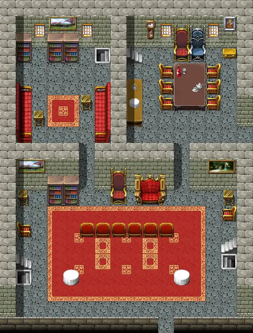

# Laerothmanor0

| | |
|---|---|
| **Map ID** | `laerothmanor0` |
| **Region** | In Lake Laeroth (other) |
| **Type** | Indoors / underground |
| **Size** | 16×21 tiles |
| **Introduced** | [v0.8.11](../versions/0.8.11.md) |
| **Quests** | 2 |

**Laerothmanor0** is an indoor map, in Lake Laeroth (other). It has no NPCs, and no enemies. Exits lead to Laerothbasement0, Laerothmanor1, Laerothmanor3, Laerothisland3 and 1 more.

## Map

<label class="lg"><input type="checkbox" data-t="spawn" checked><b>Red</b>&nbsp;Monsters / NPCs</label><label class="lg"><input type="checkbox" data-t="mapchange" checked><b>Blue</b>&nbsp;Exit to another map</label><label class="lg"><input type="checkbox" data-t="container" checked><b>Yellow</b>&nbsp;Container (click to see contents)</label><label class="lg"><input type="checkbox" data-t="sign" checked><b>Purple</b>&nbsp;Sign</label><label class="lg"><input type="checkbox" data-t="rest" checked><b>Green</b>&nbsp;Resting place</label><label class="lg"><input type="checkbox" data-t="key" checked><b>Orange dashed</b>&nbsp;Blocked until a quest step / item</label><label class="lg"><input type="checkbox" data-t="script"><b>Grey dotted</b>&nbsp;Scripted event</label><label class="lg"><input type="checkbox" data-t="replace"><b>White dotted</b>&nbsp;Changes during a quest</label><label class="lg"><input type="checkbox" data-t="pin" checked><b>Numbers</b>&nbsp;Numbered key points (see the key below the map)</label>

<a class="pin pin-exit" href="#key-1" style="left:90.625%;top:78.571%" title="Exit (east): to [Laerothbasement0](../laerothbasement0.md)">1</a><a class="pin pin-exit" href="#key-2" style="left:90.625%;top:73.810%" title="Exit (east): to [Laerothmanor1](../laerothmanor1.md)">2</a><a class="pin pin-exit" href="#key-3" style="left:96.875%;top:40.476%" title="Exit (east): to [Laerothmanor3](../laerothmanor3.md)">3</a><a class="pin pin-exit" href="#key-4" style="left:65.625%;top:97.619%" title="Exit (south): to [Laerothisland3](../laerothisland3.md)">4</a><a class="pin pin-exit" href="#key-5" style="left:9.375%;top:83.333%" title="Exit (west): to [Laerothbasement0](../laerothbasement0.md)">5</a><a class="pin pin-exit" href="#key-6" style="left:9.375%;top:78.571%" title="Exit (west): to [Laerothmanor1](../laerothmanor1.md)">6</a><a class="pin pin-exit" href="#key-7" style="left:40.625%;top:16.667%" title="Exit (stairs / passage): to [Laerothbasement1](../laerothbasement1.md)">7</a><a class="pin pin-exit" href="#key-8" style="left:53.125%;top:16.667%" title="Exit (stairs / passage): to [Laerothmanor1](../laerothmanor1.md)">8</a><a class="pin pin-script" href="#key-9" style="left:9.375%;top:21.429%" title="Quest trigger: Scripted event: advances the quest: Take care of the caretaker to stage 20 (“I have learned the chant needed to send spirits back to their rest on the other side.”)">9</a><a class="pin pin-script" href="#key-10" style="left:65.625%;top:92.857%" title="Quest trigger: Scripted event: advances the quest: The last lord of Laeroth to stage 15 (“I didn&#x27;t really care about where the last lord went. I left this place, and whatever happened to him didn&#x27;t make any difference to me.”)">10</a><a class="pin pin-script" href="#key-11" style="left:90.625%;top:21.429%" title="Quest trigger: Scripted event: advances the quest: The last lord of Laeroth to stage 40 (“I have found a key that looks like it should fit Adakin&#x27;s chest.”)">11</a>

??? abstract "Key to the numbers on the map"

    | # | What | Details |
    |---|---|---|
    | 1 | Exit (east) | to [Laerothbasement0](../laerothbasement0.md) |
    | 2 | Exit (east) | to [Laerothmanor1](../laerothmanor1.md) |
    | 3 | Exit (east) | to [Laerothmanor3](../laerothmanor3.md) |
    | 4 | Exit (south) | to [Laerothisland3](../laerothisland3.md) |
    | 5 | Exit (west) | to [Laerothbasement0](../laerothbasement0.md) |
    | 6 | Exit (west) | to [Laerothmanor1](../laerothmanor1.md) |
    | 7 | Exit (stairs / passage) | to [Laerothbasement1](../laerothbasement1.md) |
    | 8 | Exit (stairs / passage) | to [Laerothmanor1](../laerothmanor1.md) |
    | 9 | Quest trigger | Scripted event: advances the quest: Take care of the caretaker to stage 20 (“I have learned the chant needed to send spirits back to their rest on the other side.”) |
    | 10 | Quest trigger | Scripted event: advances the quest: The last lord of Laeroth to stage 15 (“I didn't really care about where the last lord went. I left this place, and whatever happened to him didn't make any difference to me.”) |
    | 11 | Quest trigger | Scripted event: advances the quest: The last lord of Laeroth to stage 40 (“I have found a key that looks like it should fit Adakin's chest.”) |

Verified against v0.8.18 map data.

## Connections

| Direction | Leads to | Region there | Map # |
|---|---|---|---|
| East | [Laerothbasement0](laerothbasement0.md) | Lake Laeroth | 1 |
| East | [Laerothmanor1](laerothmanor1.md) | Lake Laeroth | 2 |
| East | [Laerothmanor3](laerothmanor3.md) | Lake Laeroth | 3 |
| South | [Laerothisland3](laerothisland3.md) | Lake Laeroth | 4 |
| West | [Laerothbasement0](laerothbasement0.md) | Lake Laeroth | 5 |
| West | [Laerothmanor1](laerothmanor1.md) | Lake Laeroth | 6 |
| Stairs / passage | [Laerothbasement1](laerothbasement1.md) | Lake Laeroth | 7 |
| Stairs / passage | [Laerothmanor1](laerothmanor1.md) | Lake Laeroth | 8 |

## Quests

- [Take care of the caretaker](../quests/laeroth_caretaker.md): a scripted event can trigger here from stage 17; something on this map advances it; stepping on a trigger here sets stage 20; stepping on a trigger here sets stage 30
- [The last lord of Laeroth](../quests/last_lord.md): something on this map advances it; stepping on a trigger here sets stage 10; stepping on a trigger here sets stage 15; stepping on a trigger here sets stage 40

## Points of interest

- **Quest trigger** (#9): Scripted event: advances the quest: Take care of the caretaker to stage 20 (“I have learned the chant needed to send spirits back to their rest on the other side.”)
- **Quest trigger** (#10): Scripted event: advances the quest: The last lord of Laeroth to stage 15 (“I didn't really care about where the last lord went. I left this place, and whatever happened to him didn't make any difference to me.”)
- **Quest trigger** (#11): Scripted event: advances the quest: The last lord of Laeroth to stage 40 (“I have found a key that looks like it should fit Adakin's chest.”)

## Version history

| Version | Change |
|---|---|
| [v0.8.11](../versions/0.8.11.md) | Added |

Verified against v0.8.18 and every earlier release back to v0.7.0 (game data compared release by release).

## Community notes

<small>Written by players, not generated from game data. **Observations**: what players notice in-game · **Lore**: the in-world story · **Trivia**: real-world facts, references, development history · **Theory / speculation**: unconfirmed ideas; may just be unfinished content</small>

### Observations

*Nothing here yet. Know something? [Add it](https://github.com/asdfghjkl628/Andor-s-Trail-Wikiiii/new/main/notes/maps?filename=laerothmanor0.md&value=%23%23%20Observations%0A%0A%3C%21--%20what%20players%20notice%20in-game%20--%3E%0A%0A%23%23%20Lore%0A%0A%3C%21--%20the%20in-world%20story%20--%3E%0A%0A%23%23%20Trivia%0A%0A%3C%21--%20real-world%20facts%2C%20references%2C%20development%20history%20--%3E%0A%0A%23%23%20Theory%20/%20speculation%0A%0A%3C%21--%20unconfirmed%20ideas%3B%20may%20just%20be%20unfinished%20content%20--%3E%0A).*

### Lore

*Nothing here yet. Know something? [Add it](https://github.com/asdfghjkl628/Andor-s-Trail-Wikiiii/new/main/notes/maps?filename=laerothmanor0.md&value=%23%23%20Observations%0A%0A%3C%21--%20what%20players%20notice%20in-game%20--%3E%0A%0A%23%23%20Lore%0A%0A%3C%21--%20the%20in-world%20story%20--%3E%0A%0A%23%23%20Trivia%0A%0A%3C%21--%20real-world%20facts%2C%20references%2C%20development%20history%20--%3E%0A%0A%23%23%20Theory%20/%20speculation%0A%0A%3C%21--%20unconfirmed%20ideas%3B%20may%20just%20be%20unfinished%20content%20--%3E%0A).*

### Trivia

*Nothing here yet. Know something? [Add it](https://github.com/asdfghjkl628/Andor-s-Trail-Wikiiii/new/main/notes/maps?filename=laerothmanor0.md&value=%23%23%20Observations%0A%0A%3C%21--%20what%20players%20notice%20in-game%20--%3E%0A%0A%23%23%20Lore%0A%0A%3C%21--%20the%20in-world%20story%20--%3E%0A%0A%23%23%20Trivia%0A%0A%3C%21--%20real-world%20facts%2C%20references%2C%20development%20history%20--%3E%0A%0A%23%23%20Theory%20/%20speculation%0A%0A%3C%21--%20unconfirmed%20ideas%3B%20may%20just%20be%20unfinished%20content%20--%3E%0A).*

### Theory / speculation

*Nothing here yet. Know something? [Add it](https://github.com/asdfghjkl628/Andor-s-Trail-Wikiiii/new/main/notes/maps?filename=laerothmanor0.md&value=%23%23%20Observations%0A%0A%3C%21--%20what%20players%20notice%20in-game%20--%3E%0A%0A%23%23%20Lore%0A%0A%3C%21--%20the%20in-world%20story%20--%3E%0A%0A%23%23%20Trivia%0A%0A%3C%21--%20real-world%20facts%2C%20references%2C%20development%20history%20--%3E%0A%0A%23%23%20Theory%20/%20speculation%0A%0A%3C%21--%20unconfirmed%20ideas%3B%20may%20just%20be%20unfinished%20content%20--%3E%0A).*

??? info "Technical information"

    | | |
    |---|---|
    | Map ID | `laerothmanor0` |
    | File | `res/xml/laerothmanor0.tmx` |
    | Size | 16×21 tiles (512×672 px) |
    | outdoors property | – |
    | Layers drawn | ground, objects, above, top |
    | Tilesets | map_bed_1, map_border_1, map_bridge_1, map_broken_1, map_cavewall_1, map_cavewall_2, map_cavewall_3, map_chair_table_1, map_crate_1, map_cupboard_1, map_curtain_1, map_entrance_1, map_fence_1, map_fence_2, map_ground_1, map_ground_2, map_ground_3, map_ground_4, map_ground_5, map_ground_6, map_ground_7, map_ground_8, map_indoor_1, map_kitchen_1, map_outdoor_1, map_pillar_1, map_plant_1, map_rock_1, map_roof_1, map_roof_2, map_shop_1, map_sign_ladder_1, map_table_1, map_trail_1, map_tree_1, map_wall_1, map_wall_2, map_wall_3, map_window_1, map_window_2 |
    | Map objects | mapchange: 8, script: 7 |
    | World map position | – |

<small>Data from v0.8.18</small>
