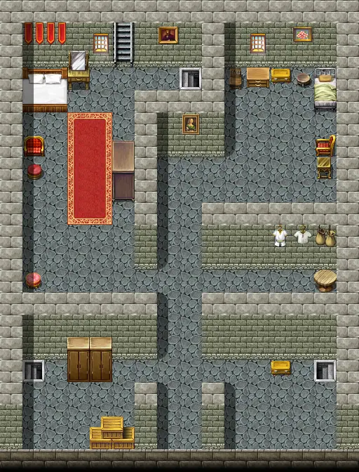

# Laerothmanor1

| | |
|---|---|
| **Map ID** | `laerothmanor1` |
| **Region** | In Lake Laeroth (other) |
| **Type** | Indoors / underground |
| **Size** | 16×21 tiles |
| **Introduced** | [v0.8.11](../versions/0.8.11.md) |
| **NPCs** | 1 |
| **Quests** | 2 |

**Laerothmanor1** is an indoor map, in Lake Laeroth (other). It has 1 NPC, and no enemies. Exits lead to Laerothmanor2, Laerothmanor0.

## Map

<label class="lg"><input type="checkbox" data-t="spawn" checked><b>Red</b>&nbsp;Monsters / NPCs</label><label class="lg"><input type="checkbox" data-t="mapchange" checked><b>Blue</b>&nbsp;Exit to another map</label><label class="lg"><input type="checkbox" data-t="container" checked><b>Yellow</b>&nbsp;Container (click to see contents)</label><label class="lg"><input type="checkbox" data-t="sign" checked><b>Purple</b>&nbsp;Sign</label><label class="lg"><input type="checkbox" data-t="rest" checked><b>Green</b>&nbsp;Resting place</label><label class="lg"><input type="checkbox" data-t="key" checked><b>Orange dashed</b>&nbsp;Blocked until a quest step / item</label><label class="lg"><input type="checkbox" data-t="script"><b>Grey dotted</b>&nbsp;Scripted event</label><label class="lg"><input type="checkbox" data-t="replace"><b>White dotted</b>&nbsp;Changes during a quest</label><label class="lg"><input type="checkbox" data-t="pin" checked><b>Numbers</b>&nbsp;Numbered key points (see the key below the map)</label>

<a class="pin pin-exit" href="#key-1" style="left:34.375%;top:7.143%" title="Exit (north): to [Laerothmanor2](../laerothmanor2.md)">1</a><a class="pin pin-exit" href="#key-2" style="left:90.625%;top:78.571%" title="Exit (east): to [Laerothmanor0](../laerothmanor0.md)">2</a><a class="pin pin-exit" href="#key-3" style="left:9.375%;top:78.571%" title="Exit (west): to [Laerothmanor0](../laerothmanor0.md)">3</a><a class="pin pin-exit" href="#key-4" style="left:53.125%;top:16.667%" title="Exit (stairs / passage): to [Laerothmanor0](../laerothmanor0.md)">4</a><a class="pin pin-npc" href="#key-5" style="left:71.875%;top:35.714%" title="[Moriath](../../monsters/moriath.md): 1 quest">5</a><a class="pin pin-script" href="#key-6" style="left:21.875%;top:21.429%" title="Quest trigger: Scripted event: advances the quest: The last lord of Laeroth to stage 60 (“I have found a jeweled key that looks like it might be for the diary. Time to try it.”) (+1 more quest(s))">6</a><a class="pin pin-script" href="#key-7" style="left:25.000%;top:83.333%" title="Quest trigger: Scripted event: advances the quest: Take care of the caretaker to stage 80 (“I found a diary that must have belonged to Cuned.”)">7</a><a class="pin pin-script" href="#key-8" style="left:28.125%;top:35.714%" title="Quest trigger: Scripted event: advances the quest: Take care of the caretaker to stage 140 (“I have found a key in the bedroom.”)">8</a><a class="pin pin-script" href="#key-9" style="left:78.125%;top:83.333%" title="Quest trigger: Scripted event: advances the quest: Take care of the caretaker to stage 150 (“The key fitted the jewelry box! Inside I found a necklace &quot;With love to Audela&quot; written on the back.”)">9</a><a class="pin pin-script" href="#key-10" style="left:78.125%;top:21.429%" title="Quest trigger: Scripted event: advances the quest: The last lord of Laeroth to stage 20 (“I searched the caretakers room, and found a letter from &quot;Adakin&quot;. It says he is leaving to explore his future, but little more than that except that it mentions a chest that contains a diary and other things he could not take with him. I should look for this chest.”)">10</a><a class="pin pin-script" href="#key-11" style="left:21.875%;top:50.000%" title="Quest trigger: Scripted event: advances the quest: The last lord of Laeroth to stage 70 (“The key unlocked the diary. The final entry did not really give an answer, except that he intended to go to either Nor City or Feygard, but had yet to decide which. Perhaps I will meet him some day.”)">11</a><a class="pin pin-script" href="#key-11" style="left:46.875%;top:16.667%" title="Quest trigger: Scripted event: advances the quest: The last lord of Laeroth to stage 70 (“The key unlocked the diary. The final entry did not really give an answer, except that he intended to go to either Nor City or Feygard, but had yet to decide which. Perhaps I will meet him some day.”)">11</a><a class="pin pin-replace" href="#key-12" style="left:78.125%;top:78.571%" title="Changes during a quest: This area changes during the quest: Take care of the caretaker (stage 150: “The key fitted the jewelry box! Inside I found a necklace &quot;With love to Audela&quot; written on the back.”)">12</a>

??? abstract "Key to the numbers on the map"

    | # | What | Details |
    |---|---|---|
    | 1 | Exit (north) | to [Laerothmanor2](../laerothmanor2.md) |
    | 2 | Exit (east) | to [Laerothmanor0](../laerothmanor0.md) |
    | 3 | Exit (west) | to [Laerothmanor0](../laerothmanor0.md) |
    | 4 | Exit (stairs / passage) | to [Laerothmanor0](../laerothmanor0.md) |
    | 5 | [Moriath](../monsters/moriath.md) | 1 quest |
    | 6 | Quest trigger | Scripted event: advances the quest: The last lord of Laeroth to stage 60 (“I have found a jeweled key that looks like it might be for the diary. Time to try it.”) (+1 more quest(s)) |
    | 7 | Quest trigger | Scripted event: advances the quest: Take care of the caretaker to stage 80 (“I found a diary that must have belonged to Cuned.”) |
    | 8 | Quest trigger | Scripted event: advances the quest: Take care of the caretaker to stage 140 (“I have found a key in the bedroom.”) |
    | 9 | Quest trigger | Scripted event: advances the quest: Take care of the caretaker to stage 150 (“The key fitted the jewelry box! Inside I found a necklace "With love to Audela" written on the back.”) |
    | 10 | Quest trigger | Scripted event: advances the quest: The last lord of Laeroth to stage 20 (“I searched the caretakers room, and found a letter from "Adakin". It says he is leaving to explore his future, but little more than that except that it mentions a chest that contains a diary and other things he could not take with him. I should look for this chest.”) |
    | 11 | Quest trigger | Scripted event: advances the quest: The last lord of Laeroth to stage 70 (“The key unlocked the diary. The final entry did not really give an answer, except that he intended to go to either Nor City or Feygard, but had yet to decide which. Perhaps I will meet him some day.”) |
    | 12 | Changes during a quest | This area changes during the quest: Take care of the caretaker (stage 150: “The key fitted the jewelry box! Inside I found a necklace "With love to Audela" written on the back.”) |

Verified against v0.8.18 map data.

## Connections

| Direction | Leads to | Region there | Map # |
|---|---|---|---|
| North | [Laerothmanor2](laerothmanor2.md) | Lake Laeroth | 1 |
| East | [Laerothmanor0](laerothmanor0.md) | Lake Laeroth | 2 |
| West | [Laerothmanor0](laerothmanor0.md) | Lake Laeroth | 3 |
| Stairs / passage | [Laerothmanor0](laerothmanor0.md) | Lake Laeroth | 4 |

## NPCs

- [Moriath](../monsters/moriath.md) — quests: [Take care of the caretaker](../quests/laeroth_caretaker.md) (#5)

## Quests

- [Take care of the caretaker](../quests/laeroth_caretaker.md): [Moriath](../monsters/moriath.md) is involved; part of the map changes at stage 150; something on this map advances it; stepping on a trigger here sets stage 130; stepping on a trigger here sets stage 140; stepping on a trigger here sets stage 150; stepping on a trigger here sets stage 80
- [The last lord of Laeroth](../quests/last_lord.md): something on this map advances it; stepping on a trigger here sets stage 20; stepping on a trigger here sets stage 60; stepping on a trigger here sets stage 70
- [laeroth_nondisplay (hidden flag)](../quests/laeroth_nondisplay.md): [Moriath](../monsters/moriath.md) is involved; something on this map advances it; stepping on a trigger here sets stage 3

## Points of interest

- **Quest trigger** (#6): Scripted event: advances the quest: The last lord of Laeroth to stage 60 (“I have found a jeweled key that looks like it might be for the diary. Time to try it.”) (+1 more quest(s))
- **Quest trigger** (#7): Scripted event: advances the quest: Take care of the caretaker to stage 80 (“I found a diary that must have belonged to Cuned.”)
- **Quest trigger** (#8): Scripted event: advances the quest: Take care of the caretaker to stage 140 (“I have found a key in the bedroom.”)
- **Quest trigger** (#9): Scripted event: advances the quest: Take care of the caretaker to stage 150 (“The key fitted the jewelry box! Inside I found a necklace "With love to Audela" written on the back.”)
- **Quest trigger** (#10): Scripted event: advances the quest: The last lord of Laeroth to stage 20 (“I searched the caretakers room, and found a letter from "Adakin". It says he is leaving to explore his future, but little more than that except that it mentions a chest that contains a diary and other things he could not take with him. I should look for this chest.”)
- **Quest trigger** (#11): Scripted event: advances the quest: The last lord of Laeroth to stage 70 (“The key unlocked the diary. The final entry did not really give an answer, except that he intended to go to either Nor City or Feygard, but had yet to decide which. Perhaps I will meet him some day.”)
- **Changes during a quest** (#12): This area changes during the quest: Take care of the caretaker (stage 150: “The key fitted the jewelry box! Inside I found a necklace "With love to Audela" written on the back.”)

## Version history

| Version | Change |
|---|---|
| [v0.8.11](../versions/0.8.11.md) | Added |

Verified against v0.8.18 and every earlier release back to v0.7.0 (game data compared release by release).

## Community notes

<small>Written by players, not generated from game data. **Observations**: what players notice in-game · **Lore**: the in-world story · **Trivia**: real-world facts, references, development history · **Theory / speculation**: unconfirmed ideas; may just be unfinished content</small>

### Observations

*Nothing here yet. Know something? [Add it](https://github.com/asdfghjkl628/Andor-s-Trail-Wikiiii/new/main/notes/maps?filename=laerothmanor1.md&value=%23%23%20Observations%0A%0A%3C%21--%20what%20players%20notice%20in-game%20--%3E%0A%0A%23%23%20Lore%0A%0A%3C%21--%20the%20in-world%20story%20--%3E%0A%0A%23%23%20Trivia%0A%0A%3C%21--%20real-world%20facts%2C%20references%2C%20development%20history%20--%3E%0A%0A%23%23%20Theory%20/%20speculation%0A%0A%3C%21--%20unconfirmed%20ideas%3B%20may%20just%20be%20unfinished%20content%20--%3E%0A).*

### Lore

*Nothing here yet. Know something? [Add it](https://github.com/asdfghjkl628/Andor-s-Trail-Wikiiii/new/main/notes/maps?filename=laerothmanor1.md&value=%23%23%20Observations%0A%0A%3C%21--%20what%20players%20notice%20in-game%20--%3E%0A%0A%23%23%20Lore%0A%0A%3C%21--%20the%20in-world%20story%20--%3E%0A%0A%23%23%20Trivia%0A%0A%3C%21--%20real-world%20facts%2C%20references%2C%20development%20history%20--%3E%0A%0A%23%23%20Theory%20/%20speculation%0A%0A%3C%21--%20unconfirmed%20ideas%3B%20may%20just%20be%20unfinished%20content%20--%3E%0A).*

### Trivia

*Nothing here yet. Know something? [Add it](https://github.com/asdfghjkl628/Andor-s-Trail-Wikiiii/new/main/notes/maps?filename=laerothmanor1.md&value=%23%23%20Observations%0A%0A%3C%21--%20what%20players%20notice%20in-game%20--%3E%0A%0A%23%23%20Lore%0A%0A%3C%21--%20the%20in-world%20story%20--%3E%0A%0A%23%23%20Trivia%0A%0A%3C%21--%20real-world%20facts%2C%20references%2C%20development%20history%20--%3E%0A%0A%23%23%20Theory%20/%20speculation%0A%0A%3C%21--%20unconfirmed%20ideas%3B%20may%20just%20be%20unfinished%20content%20--%3E%0A).*

### Theory / speculation

*Nothing here yet. Know something? [Add it](https://github.com/asdfghjkl628/Andor-s-Trail-Wikiiii/new/main/notes/maps?filename=laerothmanor1.md&value=%23%23%20Observations%0A%0A%3C%21--%20what%20players%20notice%20in-game%20--%3E%0A%0A%23%23%20Lore%0A%0A%3C%21--%20the%20in-world%20story%20--%3E%0A%0A%23%23%20Trivia%0A%0A%3C%21--%20real-world%20facts%2C%20references%2C%20development%20history%20--%3E%0A%0A%23%23%20Theory%20/%20speculation%0A%0A%3C%21--%20unconfirmed%20ideas%3B%20may%20just%20be%20unfinished%20content%20--%3E%0A).*

??? info "Technical information"

    | | |
    |---|---|
    | Map ID | `laerothmanor1` |
    | File | `res/xml/laerothmanor1.tmx` |
    | Size | 16×21 tiles (512×672 px) |
    | outdoors property | – |
    | Layers drawn | ground, objects, above |
    | Tilesets | map_bed_1, map_border_1, map_bridge_1, map_broken_1, map_cavewall_1, map_cavewall_2, map_cavewall_3, map_chair_table_1, map_crate_1, map_cupboard_1, map_curtain_1, map_entrance_1, map_fence_1, map_fence_2, map_ground_1, map_ground_2, map_ground_3, map_ground_4, map_ground_5, map_ground_6, map_ground_7, map_ground_8, map_indoor_1, map_kitchen_1, map_outdoor_1, map_pillar_1, map_plant_1, map_rock_1, map_roof_1, map_roof_2, map_shop_1, map_sign_ladder_1, map_table_1, map_trail_1, map_tree_1, map_wall_1, map_wall_2, map_wall_3, map_window_1, map_window_2 |
    | Map objects | script: 7, mapchange: 4, spawn: 1, replace: 1 |
    | World map position | – |

<small>Data from v0.8.18</small>
