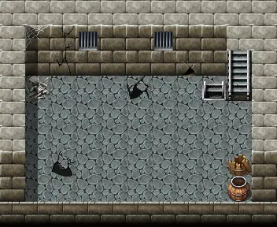

# Laerothprison1

11×9 tiles

<label class="lg"><input type="checkbox" data-t="spawn" checked><b>Red</b>&nbsp;Monsters / NPCs</label><label class="lg"><input type="checkbox" data-t="mapchange" checked><b>Blue</b>&nbsp;Exit to another map</label><label class="lg"><input type="checkbox" data-t="container" checked><b>Yellow</b>&nbsp;Container (click to see contents)</label><label class="lg"><input type="checkbox" data-t="sign" checked><b>Purple</b>&nbsp;Sign</label><label class="lg"><input type="checkbox" data-t="rest" checked><b>Green</b>&nbsp;Resting place</label><label class="lg"><input type="checkbox" data-t="key" checked><b>Orange dashed</b>&nbsp;Blocked until a quest step / item</label><label class="lg"><input type="checkbox" data-t="script"><b>Grey dotted</b>&nbsp;Scripted event</label><label class="lg"><input type="checkbox" data-t="replace"><b>White dotted</b>&nbsp;Changes during a quest</label>

## Containers

<b>Container 1</b><ul><li><a href="../../items/gold/">Gold coins</a> <small>100% · ×50 to 200</small></li><li><a href="../../items/gem5/">Polished sparkling gem</a> <small>70%</small></li><li><a href="../../items/pot_bleeding_ointment/">Ointment of bleeding wounds</a> <small>80% · ×1 to 2</small></li></ul>

## Exits

- [Laerothisland2](laerothisland2.md)
- [Laerothprison0](laerothprison0.md)

## Monsters & NPCs here

| Name | HP |
|---|---|
| [Giant spider](../monsters/spider_massive.md) | 104 |

<small>Map ID: `laerothprison1` · Data from v0.8.18</small>
