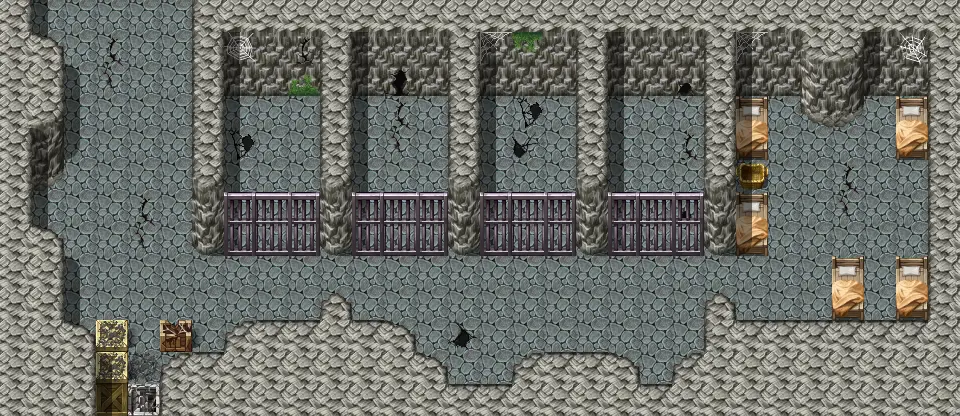
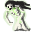
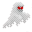

# Laerothprison4

30×13 tiles · part of [Laeroth prison](index.md)

<label class="lg"><input type="checkbox" data-t="spawn" checked><b>Red</b>&nbsp;Monsters / NPCs</label><label class="lg"><input type="checkbox" data-t="mapchange" checked><b>Blue</b>&nbsp;Exit to another map</label><label class="lg"><input type="checkbox" data-t="container" checked><b>Yellow</b>&nbsp;Container (click to see contents)</label><label class="lg"><input type="checkbox" data-t="sign" checked><b>Purple</b>&nbsp;Sign</label><label class="lg"><input type="checkbox" data-t="rest" checked><b>Green</b>&nbsp;Resting place</label><label class="lg"><input type="checkbox" data-t="key" checked><b>Orange dashed</b>&nbsp;Blocked until a quest step / item</label><label class="lg"><input type="checkbox" data-t="script"><b>Grey dotted</b>&nbsp;Scripted event</label><label class="lg"><input type="checkbox" data-t="replace"><b>White dotted</b>&nbsp;Changes during a quest</label>

## Containers

<b>Container 1</b><ul><li><a href="../../items/lae_prison_key/">Laeroth prison key</a> <small>100%</small></li></ul>

## Exits

- [Laerothprison3](laerothprison3.md)
- [Laerothprison5](laerothprison5.md)

## Monsters & NPCs here

| Name | HP |
|---|---|
| [Laeroth prisoner](../monsters/lae_prisoner2a.md) | 0 |
| [Laeroth prisoner](../monsters/lae_prisoner4i.md) | 0 |
| [Laeroth prisoner](../monsters/lae_prisoner3a.md) | 0 |
| [Laeroth prisoner](../monsters/lae_prisoner3.md) | 0 |
| [Laeroth prisoner](../monsters/lae_prisoner3i.md) | 0 |
| [Laeroth prisoner](../monsters/lae_prisoner.md) | 0 |
| [Dark watch](../monsters/lae_demon4b_safe.md) | 0 |
| [Laeroth prisoner](../monsters/lae_prisoner4.md) | 0 |
| [Laeroth prisoner](../monsters/lae_prisoner2.md) | 0 |
| [Laeroth prisoner](../monsters/lae_prisoner1.md) | 0 |
| [Dark watch](../monsters/lae_demon4_safe.md) | 0 |
| [Laeroth prisoner](../monsters/lae_prisoner2i.md) | 0 |

<small>Map ID: `laerothprison4` · Data from v0.8.18</small>
