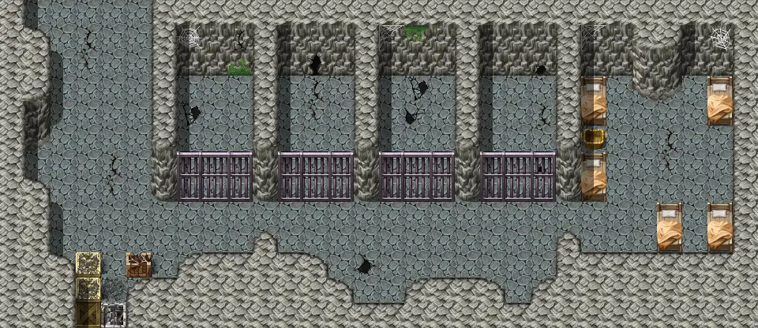
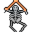
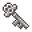

# Laerothprison4

| | |
|---|---|
| **Map ID** | `laerothprison4` |
| **Type** | Indoors / underground |
| **Size** | 30×13 tiles |
| **World map** | [Laeroth prison](index.md) |
| **Introduced** | [v0.8.11](../versions/0.8.11.md) |
| **NPCs** | 12 |
| **Quests** | 2 |
| **Containers** | 1 |

**Laerothprison4** is an indoor map. It has 12 NPCs, and no enemies. Exits lead to Laerothprison3, Laerothprison5.

## Map

<label class="lg"><input type="checkbox" data-t="spawn" checked><b>Red</b>&nbsp;Monsters / NPCs</label><label class="lg"><input type="checkbox" data-t="mapchange" checked><b>Blue</b>&nbsp;Exit to another map</label><label class="lg"><input type="checkbox" data-t="container" checked><b>Yellow</b>&nbsp;Container (click to see contents)</label><label class="lg"><input type="checkbox" data-t="sign" checked><b>Purple</b>&nbsp;Sign</label><label class="lg"><input type="checkbox" data-t="rest" checked><b>Green</b>&nbsp;Resting place</label><label class="lg"><input type="checkbox" data-t="key" checked><b>Orange dashed</b>&nbsp;Blocked until a quest step / item</label><label class="lg"><input type="checkbox" data-t="script"><b>Grey dotted</b>&nbsp;Scripted event</label><label class="lg"><input type="checkbox" data-t="replace"><b>White dotted</b>&nbsp;Changes during a quest</label><label class="lg"><input type="checkbox" data-t="pin" checked><b>Numbers</b>&nbsp;Numbered key points (see the key below the map)</label>

<a class="pin pin-exit" href="#key-1" style="left:11.667%;top:3.846%" title="Exit (north): to [Laerothprison3](../laerothprison3.md)">1</a><a class="pin pin-exit" href="#key-2" style="left:15.000%;top:96.154%" title="Exit (south): to [Laerothprison5](../laerothprison5.md)">2</a><a class="pin pin-npc" href="#key-3" style="left:18.333%;top:42.308%" title="[Dark watch](../../monsters/lae_demon4b_safe.md): NPC">3</a><a class="pin pin-npc" href="#key-4" style="left:81.667%;top:57.692%" title="[Dark watch](../../monsters/lae_demon4_safe.md): NPC">4</a><a class="pin pin-npc" href="#key-5" style="left:35.000%;top:3.846%" title="[Laeroth prisoner](../../monsters/lae_prisoner.md): NPC">5</a><a class="pin pin-npc" href="#key-6" style="left:38.333%;top:34.615%" title="[Laeroth prisoner](../../monsters/lae_prisoner4i.md): 1 quest">6</a><a class="pin pin-npc" href="#key-7" style="left:88.333%;top:57.692%" title="[Laeroth prisoner](../../monsters/lae_prisoner2a.md): NPC">7</a><a class="pin pin-npc" href="#key-8" style="left:51.667%;top:26.923%" title="[Laeroth prisoner](../../monsters/lae_prisoner3i.md): NPC">8</a><a class="pin pin-npc" href="#key-9" style="left:41.667%;top:42.308%" title="[Laeroth prisoner](../../monsters/lae_prisoner4.md): 1 quest">9</a><a class="pin pin-npc" href="#key-10" style="left:81.667%;top:19.231%" title="[Laeroth prisoner](../../monsters/lae_prisoner1.md): NPC">10</a><a class="pin pin-npc" href="#key-11" style="left:68.333%;top:26.923%" title="[Laeroth prisoner](../../monsters/lae_prisoner2i.md): NPC">11</a><a class="pin pin-npc" href="#key-12" style="left:65.000%;top:26.923%" title="[Laeroth prisoner](../../monsters/lae_prisoner2.md): NPC">12</a><a class="pin pin-npc" href="#key-13" style="left:58.333%;top:80.769%" title="[Laeroth prisoner](../../monsters/lae_prisoner3.md): NPC">13</a><a class="pin pin-npc" href="#key-14" style="left:28.333%;top:73.077%" title="[Laeroth prisoner](../../monsters/lae_prisoner3a.md): NPC">14</a><a class="pin pin-script" href="#key-15" style="left:13.333%;top:73.077%" title="Quest trigger: Scripted event: advances the quest: Shadow of the torturer to stage 20 (“I didn&#x27;t want to help the spirits in the prison be free of the prison torturer.”)">15</a><a class="pin pin-container" href="#key-16" style="left:78.333%;top:42.308%" title="Container 1: Laeroth prison key">16</a><a class="pin pin-key" href="#key-17" style="left:15.219%;top:90.385%" title="Blocked passage: Unlocked during the quest: Shadow of the torturer (stage 5: “In the dungeon of the mansion I found some ghosts of prisoners. One of them told me their story.”)">17</a><a class="pin pin-key" href="#key-18" style="left:51.667%;top:73.077%" title="Blocked passage: Unlocked during the quest: Search for Andor (stage 1: “My father Mikhail says that Andor has not been home since yesterday. I should go look for him in the village.”)">18</a><a class="pin pin-key" href="#key-19" style="left:28.333%;top:57.692%" title="Blocked passage: Unlocked during the quest: hidden story flag “laeroth_nondisplay” (stage 31: “Opened cell 1”)">19</a><a class="pin pin-key" href="#key-20" style="left:41.667%;top:57.692%" title="Blocked passage: Unlocked during the quest: hidden story flag “laeroth_nondisplay” (stage 32: “Opened cell 2”)">20</a><a class="pin pin-key" href="#key-21" style="left:55.000%;top:57.692%" title="Blocked passage: Unlocked during the quest: hidden story flag “laeroth_nondisplay” (stage 33: “Opened cell 3”)">21</a><a class="pin pin-key" href="#key-22" style="left:68.333%;top:57.692%" title="Blocked passage: Unlocked during the quest: hidden story flag “laeroth_nondisplay” (stage 34: “Opened cell 4”)">22</a><a class="pin pin-replace" href="#key-23" style="left:28.553%;top:48.078%" title="Changes during a quest: This area changes during the quest: hidden story flag “laeroth_nondisplay” (stage 31: “Opened cell 1”)">23</a><a class="pin pin-replace" href="#key-24" style="left:41.886%;top:48.078%" title="Changes during a quest: This area changes during the quest: hidden story flag “laeroth_nondisplay” (stage 32: “Opened cell 2”)">24</a><a class="pin pin-replace" href="#key-25" style="left:55.219%;top:48.078%" title="Changes during a quest: This area changes during the quest: hidden story flag “laeroth_nondisplay” (stage 33: “Opened cell 3”)">25</a><a class="pin pin-replace" href="#key-26" style="left:68.553%;top:48.078%" title="Changes during a quest: This area changes during the quest: hidden story flag “laeroth_nondisplay” (stage 34: “Opened cell 4”)">26</a>

??? abstract "Key to the numbers on the map"

    | # | What | Details |
    |---|---|---|
    | 1 | Exit (north) | to [Laerothprison3](../laerothprison3.md) |
    | 2 | Exit (south) | to [Laerothprison5](../laerothprison5.md) |
    | 3 | [Dark watch](../monsters/lae_demon4b_safe.md) | NPC |
    | 4 | [Dark watch](../monsters/lae_demon4_safe.md) | NPC |
    | 5 | [Laeroth prisoner](../monsters/lae_prisoner.md) | NPC |
    | 6 | [Laeroth prisoner](../monsters/lae_prisoner4i.md) | 1 quest |
    | 7 | [Laeroth prisoner](../monsters/lae_prisoner2a.md) | NPC |
    | 8 | [Laeroth prisoner](../monsters/lae_prisoner3i.md) | NPC |
    | 9 | [Laeroth prisoner](../monsters/lae_prisoner4.md) | 1 quest |
    | 10 | [Laeroth prisoner](../monsters/lae_prisoner1.md) | NPC |
    | 11 | [Laeroth prisoner](../monsters/lae_prisoner2i.md) | NPC |
    | 12 | [Laeroth prisoner](../monsters/lae_prisoner2.md) | NPC |
    | 13 | [Laeroth prisoner](../monsters/lae_prisoner3.md) | NPC |
    | 14 | [Laeroth prisoner](../monsters/lae_prisoner3a.md) | NPC |
    | 15 | Quest trigger | Scripted event: advances the quest: Shadow of the torturer to stage 20 (“I didn't want to help the spirits in the prison be free of the prison torturer.”) |
    | 16 | Container 1 | Laeroth prison key |
    | 17 | Blocked passage | Unlocked during the quest: Shadow of the torturer (stage 5: “In the dungeon of the mansion I found some ghosts of prisoners. One of them told me their story.”) |
    | 18 | Blocked passage | Unlocked during the quest: Search for Andor (stage 1: “My father Mikhail says that Andor has not been home since yesterday. I should go look for him in the village.”) |
    | 19 | Blocked passage | Unlocked during the quest: hidden story flag “laeroth_nondisplay” (stage 31: “Opened cell 1”) |
    | 20 | Blocked passage | Unlocked during the quest: hidden story flag “laeroth_nondisplay” (stage 32: “Opened cell 2”) |
    | 21 | Blocked passage | Unlocked during the quest: hidden story flag “laeroth_nondisplay” (stage 33: “Opened cell 3”) |
    | 22 | Blocked passage | Unlocked during the quest: hidden story flag “laeroth_nondisplay” (stage 34: “Opened cell 4”) |
    | 23 | Changes during a quest | This area changes during the quest: hidden story flag “laeroth_nondisplay” (stage 31: “Opened cell 1”) |
    | 24 | Changes during a quest | This area changes during the quest: hidden story flag “laeroth_nondisplay” (stage 32: “Opened cell 2”) |
    | 25 | Changes during a quest | This area changes during the quest: hidden story flag “laeroth_nondisplay” (stage 33: “Opened cell 3”) |
    | 26 | Changes during a quest | This area changes during the quest: hidden story flag “laeroth_nondisplay” (stage 34: “Opened cell 4”) |

Verified against v0.8.18 map data.

## Connections

| Direction | Leads to | Region there | Map # |
|---|---|---|---|
| North | [Laerothprison3](laerothprison3.md) | Lake Laeroth | 1 |
| South | [Laerothprison5](laerothprison5.md) | – | 2 |

## NPCs

- [Dark watch](../monsters/lae_demon4b_safe.md) (#3)
- [Dark watch](../monsters/lae_demon4_safe.md) (#4)
- [Laeroth prisoner](../monsters/lae_prisoner.md) (#5)
- [Laeroth prisoner](../monsters/lae_prisoner4i.md) — quests: [Shadow of the torturer](../quests/lae_torturer.md) (#6)
- [Laeroth prisoner](../monsters/lae_prisoner2a.md) (#7)
- [Laeroth prisoner](../monsters/lae_prisoner3i.md) (#8)
- [Laeroth prisoner](../monsters/lae_prisoner4.md) — quests: [Shadow of the torturer](../quests/lae_torturer.md) (#9)
- [Laeroth prisoner](../monsters/lae_prisoner1.md) (#10)
- [Laeroth prisoner](../monsters/lae_prisoner2i.md) (#11)
- [Laeroth prisoner](../monsters/lae_prisoner2.md) (#12)
- [Laeroth prisoner](../monsters/lae_prisoner3.md) (#13)
- [Laeroth prisoner](../monsters/lae_prisoner3a.md) (#14)

## Items & containers

<b>Container 1</b><ul><li><a href="../../items/lae_prison_key/">Laeroth prison key</a> <small>100%</small></li></ul>

## Quests

- [Search for Andor](../quests/andor.md): blocked passage opens at stage 1
- [Shadow of the torturer](../quests/lae_torturer.md): [Laeroth prisoner](../monsters/lae_prisoner4.md) is involved; [Laeroth prisoner](../monsters/lae_prisoner4i.md) is involved; blocked passage opens at stage 5; something on this map advances it; stepping on a trigger here sets stage 130; stepping on a trigger here sets stage 20; stepping on a trigger here sets stage 80
- [laeroth_nondisplay (hidden flag)](../quests/laeroth_nondisplay.md): blocked passage opens at stage 31; blocked passage opens at stage 32; blocked passage opens at stage 33; blocked passage opens at stage 34; part of the map changes at stage 31; part of the map changes at stage 32; part of the map changes at stage 33; part of the map changes at stage 34; something on this map advances it

## Points of interest

- **Quest trigger** (#15): Scripted event: advances the quest: Shadow of the torturer to stage 20 (“I didn't want to help the spirits in the prison be free of the prison torturer.”)
- **Blocked passage** (#17): Unlocked during the quest: Shadow of the torturer (stage 5: “In the dungeon of the mansion I found some ghosts of prisoners. One of them told me their story.”)
- **Blocked passage** (#18): Unlocked during the quest: Search for Andor (stage 1: “My father Mikhail says that Andor has not been home since yesterday. I should go look for him in the village.”)
- **Blocked passage** (#19): Unlocked during the quest: hidden story flag “laeroth_nondisplay” (stage 31: “Opened cell 1”)
- **Blocked passage** (#20): Unlocked during the quest: hidden story flag “laeroth_nondisplay” (stage 32: “Opened cell 2”)
- **Blocked passage** (#21): Unlocked during the quest: hidden story flag “laeroth_nondisplay” (stage 33: “Opened cell 3”)
- **Blocked passage** (#22): Unlocked during the quest: hidden story flag “laeroth_nondisplay” (stage 34: “Opened cell 4”)
- **Changes during a quest** (#23): This area changes during the quest: hidden story flag “laeroth_nondisplay” (stage 31: “Opened cell 1”)
- **Changes during a quest** (#24): This area changes during the quest: hidden story flag “laeroth_nondisplay” (stage 32: “Opened cell 2”)
- **Changes during a quest** (#25): This area changes during the quest: hidden story flag “laeroth_nondisplay” (stage 33: “Opened cell 3”)
- **Changes during a quest** (#26): This area changes during the quest: hidden story flag “laeroth_nondisplay” (stage 34: “Opened cell 4”)

## Version history

| Version | Change |
|---|---|
| [v0.8.11](../versions/0.8.11.md) | Added |

Verified against v0.8.18 and every earlier release back to v0.7.0 (game data compared release by release).

## Community notes

<small>Written by players, not generated from game data. **Observations**: what players notice in-game · **Lore**: the in-world story · **Trivia**: real-world facts, references, development history · **Theory / speculation**: unconfirmed ideas; may just be unfinished content</small>

### Observations

*Nothing here yet. Know something? [Add it](https://github.com/asdfghjkl628/Andor-s-Trail-Wikiiii/new/main/notes/maps?filename=laerothprison4.md&value=%23%23%20Observations%0A%0A%3C%21--%20what%20players%20notice%20in-game%20--%3E%0A%0A%23%23%20Lore%0A%0A%3C%21--%20the%20in-world%20story%20--%3E%0A%0A%23%23%20Trivia%0A%0A%3C%21--%20real-world%20facts%2C%20references%2C%20development%20history%20--%3E%0A%0A%23%23%20Theory%20/%20speculation%0A%0A%3C%21--%20unconfirmed%20ideas%3B%20may%20just%20be%20unfinished%20content%20--%3E%0A).*

### Lore

*Nothing here yet. Know something? [Add it](https://github.com/asdfghjkl628/Andor-s-Trail-Wikiiii/new/main/notes/maps?filename=laerothprison4.md&value=%23%23%20Observations%0A%0A%3C%21--%20what%20players%20notice%20in-game%20--%3E%0A%0A%23%23%20Lore%0A%0A%3C%21--%20the%20in-world%20story%20--%3E%0A%0A%23%23%20Trivia%0A%0A%3C%21--%20real-world%20facts%2C%20references%2C%20development%20history%20--%3E%0A%0A%23%23%20Theory%20/%20speculation%0A%0A%3C%21--%20unconfirmed%20ideas%3B%20may%20just%20be%20unfinished%20content%20--%3E%0A).*

### Trivia

*Nothing here yet. Know something? [Add it](https://github.com/asdfghjkl628/Andor-s-Trail-Wikiiii/new/main/notes/maps?filename=laerothprison4.md&value=%23%23%20Observations%0A%0A%3C%21--%20what%20players%20notice%20in-game%20--%3E%0A%0A%23%23%20Lore%0A%0A%3C%21--%20the%20in-world%20story%20--%3E%0A%0A%23%23%20Trivia%0A%0A%3C%21--%20real-world%20facts%2C%20references%2C%20development%20history%20--%3E%0A%0A%23%23%20Theory%20/%20speculation%0A%0A%3C%21--%20unconfirmed%20ideas%3B%20may%20just%20be%20unfinished%20content%20--%3E%0A).*

### Theory / speculation

*Nothing here yet. Know something? [Add it](https://github.com/asdfghjkl628/Andor-s-Trail-Wikiiii/new/main/notes/maps?filename=laerothprison4.md&value=%23%23%20Observations%0A%0A%3C%21--%20what%20players%20notice%20in-game%20--%3E%0A%0A%23%23%20Lore%0A%0A%3C%21--%20the%20in-world%20story%20--%3E%0A%0A%23%23%20Trivia%0A%0A%3C%21--%20real-world%20facts%2C%20references%2C%20development%20history%20--%3E%0A%0A%23%23%20Theory%20/%20speculation%0A%0A%3C%21--%20unconfirmed%20ideas%3B%20may%20just%20be%20unfinished%20content%20--%3E%0A).*

??? info "Technical information"

    | | |
    |---|---|
    | Map ID | `laerothprison4` |
    | File | `res/xml/laerothprison4.tmx` |
    | Size | 30×13 tiles (960×416 px) |
    | outdoors property | – |
    | Layers drawn | ground, objects, above, top |
    | Tilesets | map_bed_1, map_border_1, map_bridge_1, map_broken_1, map_cavewall_1, map_cavewall_2, map_cavewall_3, map_chair_table_1, map_crate_1, map_cupboard_1, map_curtain_1, map_entrance_1, map_fence_1, map_fence_2, map_ground_1, map_ground_2, map_ground_3, map_ground_4, map_ground_5, map_ground_6, map_ground_7, map_ground_8, map_indoor_1, map_kitchen_1, map_outdoor_1, map_pillar_1, map_plant_1, map_rock_1, map_roof_1, map_roof_2, map_shop_1, map_sign_ladder_1, map_table_1, map_trail_1, map_tree_1, map_wall_1, map_wall_2, map_wall_3, map_window_1, map_window_2 |
    | Map objects | spawn: 18, key: 6, replace: 4, mapchange: 2, script: 1, container: 1 |
    | World map position | segment `laeroth_prison`, x 65, y 63 |

<small>Data from v0.8.18</small>
