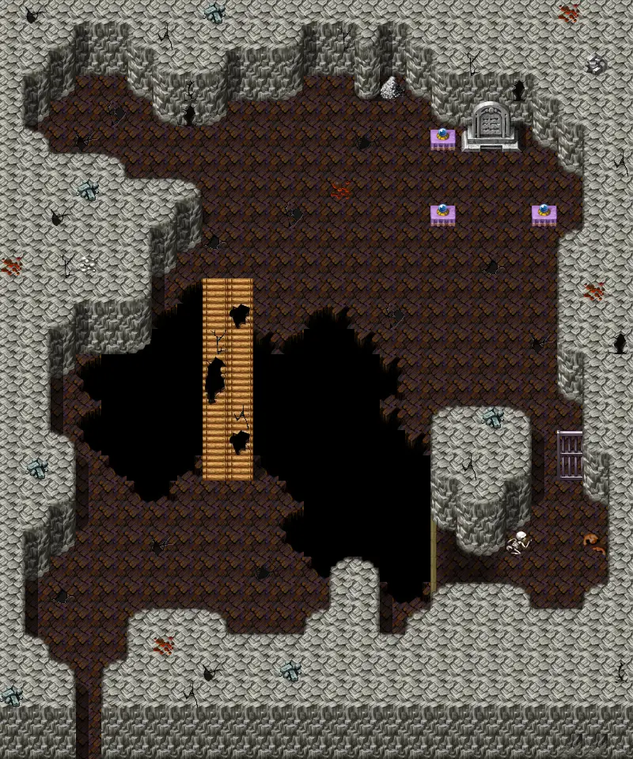
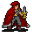
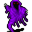

# Laerothprison7

25×30 tiles · part of [Laeroth prison](index.md)

<label class="lg"><input type="checkbox" data-t="spawn" checked><b>Red</b>&nbsp;Monsters / NPCs</label><label class="lg"><input type="checkbox" data-t="mapchange" checked><b>Blue</b>&nbsp;Exit to another map</label><label class="lg"><input type="checkbox" data-t="container" checked><b>Yellow</b>&nbsp;Container (click to see contents)</label><label class="lg"><input type="checkbox" data-t="sign" checked><b>Purple</b>&nbsp;Sign</label><label class="lg"><input type="checkbox" data-t="rest" checked><b>Green</b>&nbsp;Resting place</label><label class="lg"><input type="checkbox" data-t="key" checked><b>Orange dashed</b>&nbsp;Blocked until a quest step / item</label><label class="lg"><input type="checkbox" data-t="script"><b>Grey dotted</b>&nbsp;Scripted event</label><label class="lg"><input type="checkbox" data-t="replace"><b>White dotted</b>&nbsp;Changes during a quest</label>

## Exits

- [Laerothprison6](laerothprison6.md)

## Monsters & NPCs here

| Name | HP |
|---|---|
| [Dark watch](../monsters/lae_demon9_safe.md) | 0 |
| [Dark watch](../monsters/lae_demon7_safe.md) | 0 |
| [Greater wight](../monsters/wight_greater.md) | 150 |
| [Dark watch](../monsters/lae_demon7.md) | 180 |
| [Dark watch](../monsters/lae_demon5.md) | 180 |
| [Kotheses](../monsters/kotheses.md) | 180 |
| [Dark watch](../monsters/lae_demon9.md) | 180 |
| [Dark watch](../monsters/lae_demon4b.md) | 180 |
| [Dark watch](../monsters/lae_demon4.md) | 180 |

<small>Map ID: `laerothprison7` · Data from v0.8.18</small>
